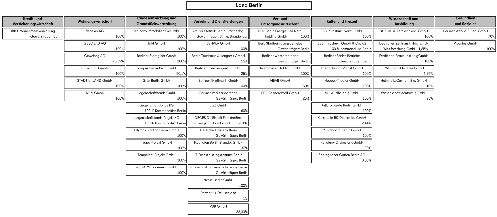

\pagenumbering{arabic}

# Introduction

\ChapFrame[Introduction][bhtgray]

Information has always been generated, processed, and shared by humans. Initially, this sharing occurred synchronously through spoken language. Over time, humans developed ways to store information - first on clay tablets, then on paper, and most recently in digital files [@bentleyKnowingYouKnow2025]. As a result, the human knowledge base has grown steadily, document by document. The field of library and information science emerged to organize this expanding body of information and enable efficient access. Since information was initially exchanged exclusively between humans, storage formats were designed to suit human perception and understanding.

However, several fundamental changes have occurred. First, the rate of information generation is increasing rapidly, and the volume of relevant knowledge now grows faster than humans can absorb [@chamberlainKnowledgeNotEverything2020]. In science alone, each year brings forth more new information than any individual could possibly read [@hongChallengesAdvancesInformation2021]. Fortunately, recent advances in \acrfull{LLM}s provide tools to compress and summarize this information before it reaches the reader.

At the same time, generative \acrfull{AI} is accelerating the creation of new information. Today, a single sentence in natural language can initiate the generation of an entire website or book. Recently, \acr{AI} agents have been developed that can autonomously react to digital or real-world triggers and generate content automatically. Combined with data produced by Internet of Things devices, the prediction that information could double every eleven hours [@ibmglobaltechnologyservicesToxicTerabyte2006] may already be a reality. This marks a second major shift: algorithms now generate, process, and share information as well.

Despite these changes, much published information remains optimized for human consumption, such as in \acr{PDF} documents. Algorithms can process information efficiently, but only if it is machine-readable. Since manual encoding by humans is inefficient and error-prone, the field of information retrieval has emerged to address this challenge. \acr{LLM}s can assist in retrieving information - even in structured formats - that can be used by other algorithms in downstream tasks.

For older sources, this approach is often the only alternative. For future information sharing, however, a more direct solution exists: providing data in a machine-readable format from the outset. Otherwise, we continue to face the "Last Mile Problem" [@liAddressingLastMile2023]. Since the format of received data can only be changed for information one owns, users must cope with the formats provided until the need for machine-readable data is recognized and addressed by data owners.

Employees at \acr{RHvB} typically work with data supplied by other administrations and companies, which is rarely delivered in a machine-readable format. Therefore, we explore strategies to address the "Last Mile Problem" until all stakeholders in this process transition to modern data practices.

Section \@ref(motivation) describes how the volume and format of information provided to the \acr{RHvB} present challenges for the audit process. Section \@ref(objectives) specifies these challenges as concrete real-world problems, from which we derive our research questions. Section \@ref(introduction-methodology) provides an overview of our methodology, and the thesis outline is presented in section \@ref(thesis-outline).

## Motivation {#motivation}

In recent decades, the pace of digital transformation has accelerated, and "electronic documents have increasingly supplanted paper documents as the primary medium for information exchange across various industries" [@zhangDocumentParsingUnveiled2024, p. 1]. In the finance industry as well, large volumes of information are stored in unstructured digital formats, such as \acr{PDF} files [@liExtractingFinancialData2023]. This reliance on unstructured data not only impedes investment decisions [@el-hajRetrievingClassifyingAnalysing2020] and academic research [@jrHowBigData2015], but also regulatory processes [@liAddressingLastMile2023].

Regulatory processes may be initiated or informed by audit reports produced by the \acr{RHvB}. The \acr{RHvB} contributes to the transparent use of public funds in Berlin by auditing public administrations and companies in which the state of Berlin is a shareholder or which receive public funding. These audits help prevent corruption and ensure efficient allocation of resources.

During the audit process, employees at the \acr{RHvB} must handle large amounts of information embedded in \acr{PDF} documents. Some of these are born-digital files, while others are simply scanned paper pages. For example, in the audit of the UEFA football championship, gigabytes of data are received. Extracting the information necessary for the audit is a significant challenge and would require substantial human resources. Algorithmic assistance is therefore highly desirable.

Because the focus of each audit changes frequently, traditional rule-based approaches offer limited benefits when considering the time required to program such systems versus their actual usage. Leveraging the flexible automation capabilities of "programming by example" with \acr{LLM}s [@liProgrammingExampleSolved2024] appears promising. The need for automation is further heightened by the impending shortage of experienced staff due to a wave of retirements.

## Objectives {#objectives}

The sixth division of the \acr{RHvB} is responsible for auditing companies in which Berlin is a shareholder (see Figure \@ref(fig:beteiligungsunternehmen). As part of this process, they must analyze balance sheets and profit and loss statements, which are fundamental sources of information. This information is provided through the companies’ annual reports, typically in the form of \acr{PDF} files. Automating the extraction of this information would be an excellent starting point for \acr{AI}-assisted information retrieval from \acr{PDF}s at the \acr{RHvB}. This task is particularly well-suited for a thesis, as exporting financial data from the 59 companies is a recurring requirement.

```{r beteiligungsunternehmen, echo=FALSE, out.width="100%", fig.cap="Overview of the 59 companies in which Berlin is a shareholder, including the percentage ownership for each company."}

```

The annual reports provided often differ from publicly available versions in terms of information granularity and design, and are treated as non-public information. For this thesis we use the publicly available versions to allow a comparison of open-weight models with OpenAIs \acr{GPT} models. We focus on open-weight models because the information in the non-public reports may be confidential. The "Berliner IKT-Richtlinie" prohibits processing such information in public clouds and encourages the use of open-source solutions.

For this thesis, we narrow the broad field of information retrieval to the extraction of the assets table, which is part of the balance sheet. To achieve a high degree of automation, we also investigate the possibility of detecting the table without requiring the user to specify the page number or area. We formulate our two main research questions:

```{r, include=knitr::is_html_output(), results='asis', echo=FALSE}
cat("<ol class='rs-questions'><li>How can we use LLMs effectively to locate specific information in a financial report?</li><li>How can we use LLMs effectively to extract this information from the document?</li></ol>")
```

\begin{enumerate}[label={\textbf{Q\theenumi}}]
  \item How can we use LLMs effectively to locate specific information in a financial report?
  \item How can we use LLMs effectively to extract this information from the document?
\end{enumerate}

Since the results of this thesis will be used to create an application with a \acrfull{HITL} approach, we also investigate an additional research question. The concept for the planned application can be seen in the Appendix \@ref(hitl). The user should review the information extraction results and resolve issues that the system alone cannot handle. However, redundant double work should be minimized. Therefore, we formulate our third research question:

```{r, include=knitr::is_html_output(), results='asis', echo=FALSE}
cat("<ol class='rs-questions' style='--counter: 3;'><li>Can we use additional information from the extraction process to guide the user on which values need to be checked and which can be trusted as they are?</li></ol>")
```

\begin{enumerate}[label={\textbf{Q\theenumi}}]
  \setcounter{enumi}{3}
  \item Can we use additional information from the extraction process to guide the user on which values need to be checked and which can be trusted as they are?
\end{enumerate}

The following section briefly describes our methodology for investigating these research questions. The corresponding hypotheses are formulated in section \@ref(research-questions).

## Methodology {#introduction-methodology}

This thesis aims to provide recommendations on how to best solve the described extraction task. Accordingly, it is situated within the field of applied research. We benchmark a broad variety of approaches and conduct experiments to identify general predictors of task performance. Our investigation begins by implementing the framework described by @liExtractingFinancialData2023. Figure \@ref(fig:extraction-framework-flow-chart) illustrates the two stages they propose, which align with our main research questions.

(ref:flow-chart-caption) Flowchart of the extraction framework of @liExtractingFinancialData2023

```{r extraction-framework-flow-chart, out.width="100%", out.height="95%", out.extra='keepaspectratio', echo=echo_flag, warning=warning_flag, message=message_flag, fig.cap="(ref:flow-chart-caption)"}
knitr::include_graphics("./images/extraction_framework_flow_chart.png")
```

First, we examine different approaches to identifying the page that contains the target information and how to combine these methods efficiently. In addition to a \acr{regex}-based and a \acr{LLM}-driven \acr{TOC} approach, we test a \acr{LLM}-driven classification method as well as a term-frequency-based ranking approach.

Second, we evaluate whether \acr{LLM}s can effectively extract the target information using the appropriate prompting strategy. We extend @liExtractingFinancialData2023 work by testing how well \acr{LLM}s can extract multiple values in a single prompt and by designing experiments to measure the effects of various influencing factors. Beyond evaluating model- and prompt-specific predictors, we also systematically examine how features of the tabular structure influence information extraction performance.

Furthermore, we test the upper limits of extraction performance using a synthetic dataset that is free of unknown target row identifiers. This allows us to determine whether a simple text extract is sufficient as input, or if additional effort - such as document layout analysis or specialized table extraction techniques - is required to accurately extract the structure of the assets table.

Our work also addresses whether the presented framework is effective for more heterogeneous documents, how open-weight models perform, and whether the German language of the annual reports presents unique challenges.

## Thesis Outline {#thesis-outline}

Chapter \@ref(literature-review) provides an overview of the theoretical background and references key literature relevant to the concepts used in this thesis.

Chapter \@ref(methodology) outlines the research design, research questions, and hypotheses. For each of the three main research questions, it details the evaluation and data strategies, and provides an overview of the experimental setup, including the evaluation methods and expected error types.

Chapter \@ref(implementation) describes the hardware and software used for the experiments. It also presents a flow chart and a detailed description of the data processing workflow.

Chapter \@ref(results) summarizes the findings for the three main research questions. Detailed explanations of how the results were obtained are provided in the appendix.

Chapter \@ref(discussion) interprets the results in relation to the research questions and hypotheses. It includes an error analysis, discusses the limitations of the study, and outlines areas not covered. The chapter also provides an outlook on how the results can be applied to address real-world problems.

Chapter \@ref(conclusion) summarizes the answers to the research questions.

## Summary

This chapter outlined the challenges posed by the ever-increasing volume of information and the obstacles that non-machine-readable data present for algorithmic processing. It described the specific problem addressed in this thesis: extracting financial information from annual reports to support the audit processes at \acr{RHvB}. We formulated our research questions, outlined our methodology for investigating them, and provided an overview of the subsequent chapters.
