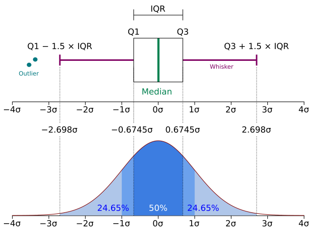
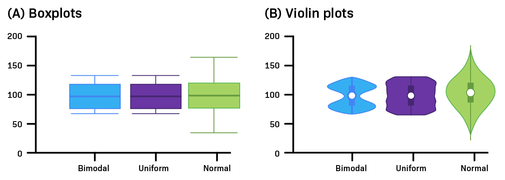
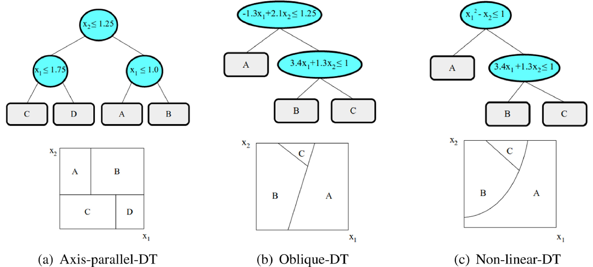

# Literature review {#literature-review}

(less than 10 p)

\ChapFrame[Literature review][bhtred]

The introduction described, that the problem, we want to solve with thesis, is part of the field of information retrieval. Thus, section \@ref(information-retrieval) describes methods, used to retrieve information from documents. It gives a brief overview on \acrfull{regex}, before subsection \@ref(llm-theory) describes the mechanisms and architecture of recent \acrfull{LLM}s, including \acr{MoE} architecture.

Afterwards, subsection \@ref(llm-methods) describes the method of few-shot prompting, that leverages the programming by example paradigm, and how \acr{RAG} fits in this picture. We show how guided decoding can be used to generated structured responses for usage in down stream tasks.

Section \@ref(other-concepts) presents the \acr{SHAP} framework. It is a unified explanation model for machine learning models and can be applied to complex models like deep neutral networks or random forests. The latter are briefly introduced as well. We use random forests and \acr{SHAP} to check our hypotheses on possible predictors for the information extraction task (see \@ref(research-questions)).

## Information extraction / retrieval {#information-retrieval}

closed-domain vs open-domain

### Term frequency

Term frequency $\mathrm{tf}_{t,d}$ is a very simple measure. It just counts the number of occurrences of a term in a document. Document is an abstraction in this case. It can be a sentence, a page or a file. Since longer documents might have higher term frequency for each term, it is useful to normalize the value by the document length $|d|$. This measure could be called term rate:

\begin{equation} 
\mathrm{tr}_t = \frac{\mathrm{tf}_{t,d}}{|d|}
(\#eq:term-rate)
\end{equation}

It is part of well established measures as \acr{TF-IDF} and Okapi \acr{BM25}. Both are used for ranking, how relevant a document is for a given search query and are widely used in information retrieval systems [@robertsonUnderstandingInverseDocument2004; @robertsonProbabilisticRelevanceFramework2009] and thus can be part of a \acr{RAG} architecture too. \acr{BM25} is one of the "most successful Web-search and corporate-search algorithms" [@robertsonProbabilisticRelevanceFramework2009, p. 1].

The \acr{IDF} is often used as a weighting function. If the ranking of possible results of a search query is simply calculated as sum of all term frequencies in a document, that are present in the query as well less informative terms get equal weight.

Looking at the search query: "Is the positron blue?", helps to illustrate the problem. The terms *is*, *the* and *blue* might be present often in a document for children that is talking about the sky or sea. Such a document could get high score, even though *positron* is never mentioned. It would be good, if it is most important if the term *positron* is in the document. We can achieve this by multiplying all term frequencies with the \acr{IDF} score [@manningIntroductionInformationRetrieval2008, pp. 118]:

\begin{equation} 
\mathrm{idf}_t = \log \frac{N}{\mathrm{df}_t}
(\#eq:idf)
\end{equation}

$N$ is the number of documents in the collection of documents and $\mathrm{df}_t$ the number of documents, that contain term $t$. While the term frequencies $\mathrm{tf}_{t,d}$ are calculated separate for each document, the \acr{IDF} score is computed once for the whole collection. The \acr{TF-IDF} score is then defined by:

\begin{equation} 
\mathrm{tf\text{-}idf}_t = \mathrm{idf}_t \cdot \mathrm{tf}_{t,d}
(\#eq:tf-idf)
\end{equation}

The more advanced measure \acr{BM25} is derived in @manningIntroductionInformationRetrieval2008.

Measures as \acr{TF-IDF} are also used for classification tasks, i.e. in the context of sentiment analysis [@carvalhoTFIDFCRFNovelSupervised2020] and semantic understanding [@rathiImportanceTermWeighting2023].

### Text processing

document layout analysis?

### Regular expressions

### Large Language Models {#llm-theory}

Wichtig

#### Transformers

Wichtig

hauptsächlich decoder (generieren)

seit 2017

#### Encoder

Wichtig

#### Decoder

Wichtig

Token sampling, temperature 0

#### GPT (Generative Pretrained Transformers)

Wichtig

#### Mixture of Experts

Recent \acrfull{LLM}s often use a \acr{MoE} architecture. The models of Llama 4, Qwen3 and GPT-4.1 are prominent examples for this kind of \acr{LLM}s. @zhangMixtureExpertsLarge2025 and @caiSurveyMixtureExperts2025a give an exhaustive overview of different types of \acr{MoE} architectures. While @zhangMixtureExpertsLarge2025 lists also models released this year and shows some applications of \acr{MoE}, is @caiSurveyMixtureExperts2025a discussing different architecture types in more detail. @grootendorstVisualGuideMixture2024 gives a guid to \acr{MoE} with many helpful illustrations.

The basic idea of \acr{MoE} models is to combine multiple smaller, specialized \acr{FFN}s to achieve better predictions overall. The \acr{MoE} "paradigm offers a compelling method to significantly expand model capacity while avoiding a corresponding surge in computational demands during training and inference phases" [@caiSurveyMixtureExperts2025a, p. 21].

Figure \@ref(fig:moe-architecture) shows two main differences in the architecture. One one hand there is the dense (a) architecture. Here, each token is fed into every \acr{FFN} and all results are pooled. On the other hand, there is the sparse architecture. Here, each token is just fed into a subset of \acr{FFN}s. Dense \acr{MoE} models often yield higher prediction accuracy, but also significantly increase the computational overhead [@caiSurveyMixtureExperts2025a].

The gate (also router) takes care of the distribution of tokens to the \acr{FFN}s. There is a high diversity of the routing algorithms and its goals are to "ensure expert diversity while minimizing redundant computation" [@zhangMixtureExpertsLarge2025]. There are algorithms that focus on load-balancing, domain specific routing and many more. Traditional \acr{MoE} assumes homogeneous experts, where load balancing might be the paramount goal. Recent advances explore more heterogeneous sets of experts and flexible routing strategies, that promise more efficiency [@zhangMixtureExpertsLarge2025].

```{r moe-architecture, fig.cap="Showing schemas of the dense and sparse mixture of experts architecture.", echo=FALSE, out.width="100%"}
knitr::include_graphics("images/moe_architecture.png")
```

Most of the Qwen3 models have a dense \acr{MoE} architecture. Only the two models released in July 2025 have a sparse architecture. These models have two parameter specifications. For example Qwen3-235B-A22B is specifying that the model has 235B token in total. But per token processed it uses (activates) just 22B parameters. In their mixture of experts architecture this means that 8 of 128 experts are participating in processing each token.

The Llama 4 models have a shared expert \acr{MoE} architecture. It combines a shared, fixed expert that processes every token and combines those results with results from a sparse \acr{MoE} layer.

Googles gemma-3n-E4B uses a selective parameter activation as well. They use the prefix E for effective instead of A for active [@googleGemma3nModel]. In gemma-3n there are parameters to handle input of different types - text, vision and audio - and they get loaded and activated as necessary. This allows a multi modal functionality. It additionally caches the \acr{PLE} in fast storage (RAM) instead of keeping it in the model memory space (VRAM), allowing to run models in low resource environments.

Raus oder woanders hin: The Qwen3 models support two operating modes: A thining mode and a non-thinking mode. The thinking mode should yield better answers in complex tasks and the additional amount of processing can be controlled by setting a thinking budget [@qwenteamQwen3ThinkDeeper2025]. This thinking budget can be seen as the amount of tokens used for a step wise solution.

#### Mixed modal

[@teamChameleonMixedModalEarlyFusion2024]

### Methods for LLM application {#llm-methods}

#### Few-shot Learning

Wichtig

#### RAG

Wichtig

#### Guided and restricted decoding

generation template strict (closed) vs open

always selecting the most probable response (temp = 0), so numeric values are correct and classification as well

## Other concepts {#other-concepts}

### Sample distribution visualization methods

##### Boxplots

@wickham40YearsBoxplots2011 describe boxplots as "a compact distributional summary, displaying less detail than a histogram or kernel density, but also taking up less space. Boxplots use robust summary statistics that are always located at actual data points, are quickly computable (originally by hand), and have no tuning parameters. They are particularly useful for comparing distributions across groups."

Figure \@ref(fig:boxplot-gauss) shows a box and whiskers plot and its components and compares it to a gaussian probability distribution. Half of all observations fall within the box and the median is marked by a thick line. Outliers are defined as observations that are outside the area marked with the (horizontal) lines -called whiskers - that potentially have small bars at their ends. Outliers can be shown by circles or dots.

(ref:boxplot-gauss-caption) Showing a box and whiskers plot with its components - median, quartiles, whiskers and outliers - and compare it with a gaussian probability distribution. Graphic adjusted from @jhguchBoxPlot2025.

```{r boxplot-gauss, echo=FALSE, fig.cap="(ref:boxplot-gauss-caption)", out.width="80%", fig.align = 'center'}

```

The median and quartiles are less sensitive to outliers, than the mean and standard deviation of a sample. Thus, they are more suitable for distributions that are asymmetric or irregularly shaped and for samples with extreme outliers [@krzywinskiVisualizingSamplesBox2014]. They can be used with five observations and more. But even for large samples $(n \geq 50)$, whisker positions can vary greatly.

##### Violin plots

There are variations, that try to communicate the sample size of a box plot, either by adjusting the width of the whole box or by introducing notches, that indicate the confidence interval for the median [@wickham40YearsBoxplots2011]. Violin plots [@hintzeViolinPlotsBox1998] additionally indicate an density estimate, dropping the strict rectangular shape of the box. Figure \@ref(fig:violinplot) shows, that the shapes can be necessary to identify multi-modal distributions, that are invisible with regular boxplots [@wickham40YearsBoxplots2011]. One can tackle this problem by adding a jitter plot layer to the boxplots. Violin plots can also be used for large datasets, preventing to plot a lot of outliers.

(ref:violinplot-caption) Comparing boxplots and violinplots, showing that boxplots can not identify multi-modal distributions on their own. Graphic adjusted from @amgenscholarsprogramHowInterpretViolin.

```{r violinplot, echo=FALSE, fig.cap="(ref:violinplot-caption)", out.width="100%"}

```

### Tree based machine learning algorithms

Random forests are a ensemble supervised machine learning technique, composed of multiple decision trees [@kulkarniRandomForestClassifiers2013]. @mienyeSurveyDecisionTrees2024 give a detailed insight into decision trees and their high-performing ensemble algorithms. Tree based machine learning algorithms have gained significant popularity, due to their simplicity and good interpretability [@mienyeSurveyDecisionTrees2024].

##### Decision tree

"The basic idea behind decision tree-based algorithms is that they recursively partition the data into subsets based on the values of different attributes until a stopping criterion is met" [@mienyeSurveyDecisionTrees2024]. Figure \@ref(fig:decision-tree) shows this for artificial data of two continuous features. Popular measures to determine how to split a set of observations are the Gini index, information gain or information gain criteria [@mienyeSurveyDecisionTrees2024].

The tree shown is used for a regression task and will predict the average of all values of the corresponding terminal node (leaf). To find out, which leaf will be the target terminal node for a given set of features one just follows the path from the top node (root) downwards, checking the splitting criteria. Thus, the interpretation of decisions made by a decision tree is very easy.

(ref:decision-tree-caption) Visualizing the of partitioning of a two-dimensional continuous feature space based on multiple splitting criteria for decision tree inducing. Graphic adjusted from @molnarInterpretableMachineLearning2025.

```{r decision-tree, echo=FALSE, fig.cap="(ref:decision-tree-caption)", out.width="80%", fig.align = 'center'}
knitr::include_graphics("images/tree_simple.png")
```

Further benefits of decision trees - besides the good interpretability and computational efficiency - are the native capturing of interactions between features [@molnarInterpretableMachineLearning2025], without modeling this explicitly, as it would for example be necessary in a linear regression. Decision trees can be used for classification and regression. They even can incorporate linear functions as leafs, enabling them to better capture linear relationships [@raymaekersFastLinearModel2024].

Problems of decision trees are, that they lack resilience against data changes and a tendency to overfitting. A method against overfitting is pruning [@mienyeSurveyDecisionTrees2024]. Building an ensemble of decision trees is another possibility, that results in the random forest algorithm, described in the next paragraph .

@rivera-lopezInductionDecisionTrees2022 are focusing on decision trees, describing multiple decision tree types, e.g. based on the splitting procedure (see Figure \@ref(fig:advanced-tree-splitting)). In addition to axis-parallel splitting, they show oblique and non-linear splitting criteria. They present a state-of-the-art review and a summary analysis of metaheuristics based approaches for decision tree induction.

(ref:advanced-tree-splitting-caption) Visualizing the of partitioning of a two-dimensional continuous feature space based on multiple splitting criteria for decision tree inducing. Graphic adjusted from @rivera-lopezInductionDecisionTrees2022.

```{r advanced-tree-splitting, echo=FALSE, fig.cap="(ref:advanced-tree-splitting-caption)", out.width="100%", fig.align = 'center'}

```

##### Random forest

A random forest is using the principle of bagging and applies it on the level of features and observations. This means, it starts, creating basic decision trees with differing subsets of features and uses bootstrapping to select a randomized set of observations to train the tree with. The final prediction is then determined by voting (for classification) or averaging (for regression) the predictions of all trees in the ensemble.

The induction of the trees can be be parallelized, making it efficient on modern hardware. Random forests can cope with thousands of features and can be applied to large datasets [@breimanRandomForests2001]. There are methods that address the problems of imbalanced datasets too. As there are methods to prune a decision tree to fight overfitting, there are methods to prune a random forest by removing whole trees, to improve the learning and classification performance, too [@kulkarniPruningRandomForest2012].

Random forests are "powerful learning ensemble[s] given its predictive performance, flexibility, and ease of use [@haddouchiSurveyTaxonomyMethods2024]. While it is based on decision trees, that are considered to be *white boxes*, because of their easy interpretability, random forests are seen as *black boxes*. The decision could be tracked without complicated math, but is tedious, because it would require propagating through many decision trees, noting their predictions and then averaging those.

The fact that the RF model is categorized as a black-box model restricts its deployment in many fields of application [@haddouchiSurveyTaxonomyMethods2024]. One feature oriented tool for explainability is the \acr{SHAP} framework, presented in section \@ref(shap). It allows local explanation, a global overview and pattern discovery for random forests [@haddouchiSurveyTaxonomyMethods2024].

##### Gradient boosted decision trees

Another highly effective and widely used advancement to decision trees are gradient boosted decision trees [@chenXGBoostScalableTree2016]. Instead of the principle of bagging it applies the principle of boosting. it is sequentially building decision trees, where the later ones correct the errors in predictions made by the former trees. It uses gradient descent to minimize those errors [@mienyeSurveyDecisionTrees2024].

The \acr{XGBoost} algorithm is a famous member of this family, with "an outstanding performance record" [@burnwalComprehensiveSurveyPrediction2023]. "Among the 29 challenge winning solutions published at Kaggle's blog during 2015, 17 solutions used XGBoost" [@chenXGBoostScalableTree2016].

In the following we will emphasize some of its benefits as described by @burnwalComprehensiveSurveyPrediction2023:

-   \acr{XGBoost} employs both L1 (Lasso) and L2 (Ridge) regularization in its objective function to penalize model complexity, mitigating overfitting. However, overfitting can occur, especially if hyperparameters are not adjusted properly.

-   \acr{XGBoost} provides feature importance metrics to facilitate model interpretation, facilitating feature selection and improving the understanding of the model's decision-making process.

-   \acr{XGBoost} "runs more than ten times faster than existing popular solutions on a single machine and scales to billions of examples in distributed or memory-limited settings" [@chenXGBoostScalableTree2016] using parallelization techniques.

But there are some challenges, that are to investigate in future research. E.g. finding methods to handle imbalanced data and automate the hyperparameter tuning process.

### Model agnostic explanation models {#shap}

##### Shapley values

Shapley values are introduced by @shapley17ValueNPerson2016 originally in 1952 in the field of game theory. He defined three axioms that a fair allocation of value must fulfill:

1.  Symmetry: If two players contribute the same amount, they are interchangeable and should gain equal reward.

2.  Efficiency: The whole value of the game is distributed among the players.

3.  Law of aggregation: If a player contributes to multiple independent games, his contribution in total should be the sum of contributions in each game.

From the third axiom a fourth property derives, that is sometimes named independently. If a player is not contributing to a game, he gets no share. @osullivanMathematicsShapleyValues2023 calls this the *null player* property.

The formula for a single shapley values is given by [@lundbergUnifiedApproachInterpreting2017][^02_literature_review-1]:

[^02_literature_review-1]: We replaced $F$ by $P$ to speak in the terms of players instead of features. We also replcaed $f$ by $val$, because it better fits the story, that this is the value gain in a game, as explained by @osullivanMathematicsShapleyValues2023.

\begin{equation} 
\phi_{i} = \sum_{S \subseteq P \setminus \{i\}}{\frac{|S|! \left( |P|-|S|-1 \right) !}{|P|!} \left[ val \left( S \cup \{i\} \right) - val\left(S\right) \right]}
(\#eq:shapley)
\end{equation}

@molnarInterpretableMachineLearning2025 bridges the game theory terms to the field of machine learning as follows: "The *game* is the prediction task for a single instance of the dataset. The *gain* is the actual prediction for this instance minus the average prediction for all instances. The *players* are the feature values of the instance that collaborate to receive the gain (= predict a certain value)."

##### SHAP framework

@lundbergUnifiedApproachInterpreting2017 are presenting "A Unified Approach to Interpreting Model Predictions" based on shapley values, called \acrfull{SHAP}. It assigns each feature an importance value for every observation. This allows to inspect, why a specific prediction is made and might explain, why a model makes a mistake for specific observations. Inspecting the predictions for all observations can show generalized effects of features.

@lundbergUnifiedApproachInterpreting2017 show that their approach is the only possible explanation model for the class of additive feature attribution methods, that has three desirable characteristics: local accuracy, missingness and consistency. Shapely values can be computed for any machine learning model, but its exact calculation is computationally extremely expensive [@huComputingSHAPEfficiently2023], since it is of exponential complexity $\mathcal{O}(2^p)$ regarding the number of features (or predictors) $p = |P|$.

Even with the approximation of the shapley values, introduced in @lundbergUnifiedApproachInterpreting2017 as Kernel SHAP, the complexity for tree based algorithms is $\mathcal{O}(MTL2^p)$, with the number of samples $M$, number of trees $T$ and the number of leaves $L$. The tree based optimization of the algorithm, TreeSHAP, allows an approximation in $\mathcal{O}(MTLD^2)$ [@lundbergExplainableAITrees2019], with the maximum tree depth $D$. Depending on the number of observations to calculate shapley values for ($M$), the Fast TreeSHAP algorithm has a even lower time complexity of $\mathcal{O}(TLD2^D+MTLD)$ [@yangFastTreeSHAPAccelerating2022].

Calculating the effect a feature has for the whole model, we calculate the mean of the absolute for single shapley values. Adjusting @molnarInterpretableMachineLearning2025 so it follows the notation of Equation \@ref(eq:shapley) yields:

\begin{equation} 
 mean\left(|SHAP|\right) = \frac{1}{n} \sum_{k=1}^n | \phi_{i}^{\left( k \right)} |
(\#eq:meanSHAP)
\end{equation}

This value is called \acr{SHAP} feature importance. It can be interpreted similar to standardized beta values for a linear regression. In some cases it would be possible to calculate an effect direction for the feature importance. But it is not common practice. Instead visual representations presented in section \@ref() are used for such interpretations.

@lundbergUnifiedApproachInterpreting2017 also showed that SHAP values are more consistent with human intuition than preceding local explainable models. @liBuildingTrustMachine2024 mention, that explainability of machine learning models is not only important for researches but also for practitioners, to demonstrate their reliability to potential users and build trust. Regardless of the popularity of \acr{SHAP} scores, there are claims that they can be inadequate as a measure of feature importance [@huangFailingsShapleyValues2024]. The approximated as well as exact \acr{SHAP} scores can assign higher value to unimportant features than to important ones.

However, the need for a high explainability of machine learning algorithms is more urgent than ever, since the EU's regulatory ecosystem is emphasizing the importance of \acr{XAI} [@nanniniOperationalizingExplainableArtificial2024].

## Summary (0.5 p)

-   lessons learned
-   link to goal thesis
-   link to next chapter

## To place in chapters above

## Table extraction tasks

### Difficulties

-   Beispielbilder

## Document Extraction Process

### Document Layout Analysis

An important step in the process of extracting information from documents is to recognize the layout of a document [@zhongPubLayNetLargestDataset2019].

Getting the order of texts correct align captions to tables and figure identify headings, tables and figures

One of the most popular datasets used for training and benchmarking is PubLayNet (see [PubLayNet on paperswithcode.com](https://paperswithcode.com/sota/document-layout-analysis-on-publaynet-val)). It contains over 360_000 document automatically annotated images from scientific articles publicly available on PubMed Central [@zhongPubLayNetLargestDataset2019, p. 1]. This was possible, because the articles have been provided in PDF and XML format. For the annotations most text categories (e.g. text, caption, footnote) have been aggregated into one category. \<-- is this a problem for later approaches where a visual and textual model work hand in hand to identify e.g. table captions?

Manual annotated datasets often were limited to several hundred pages. Deep learning methods need a much larger training dataset. Previously optical character recognition (OCR) methods were used.

Identify potentially interesting pages with text / regex search. Check if there is a table present on this page.

Object detection

## Tools

Vlt egal oder outlook

#### Vision Grid Transformer

#### TableFormer

SynthTabNet \<-- has it: - nested / hierarchical tables, where rows add up to another row? - identifying units and unit cols/rows
