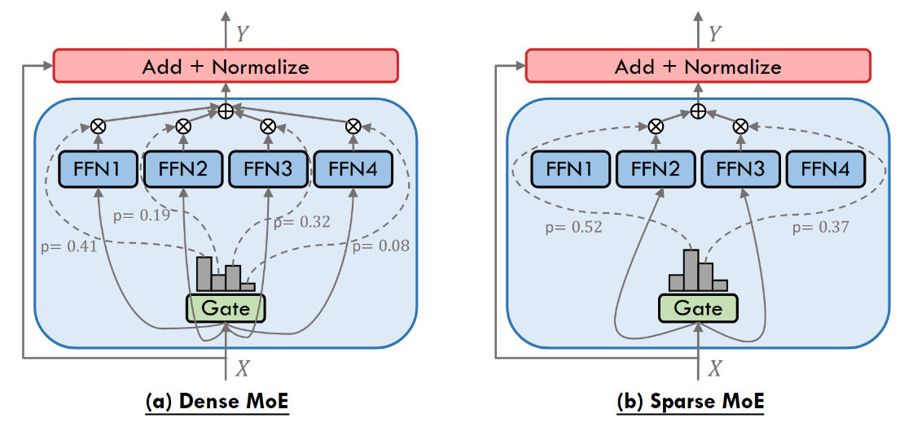

# Literature review {#literature-review}

(less than 10 p)

\ChapFrame[Literature review][bhtblue]

The introduction described, that the problem, we want to solve with thesis, is part of the field of information retrieval. Thus, we describe basic methods used to retrieve information from documents. We give a brief overview on \acrfull{regex}, before we describe the architecture of recent \acrfull{LLM}s. Afterwards, we describe the method of few-shot prompting, that leverages the programming by example paradigm, and how \acr{RAG} fits in this picture. We show how guided decoding can be used to generated structured responses for usage in down stream tasks.

Other concepts (here or in methodology?)

(5 to 10 lines)

-   overview of subchapters
-   relevance for reader (Gutachter)
-   link to previous chapter
-   relevant basic tasks
-   parameter vs active parameter

### Information extraction / retrieval

closed-domain vs open-domain

## Text processing

### Regular expressions

### Large Language Models

Wichtig

#### Transformers

Wichtig

hauptsächlich decoder (generieren)

seit 2017

#### Encoder

Wichtig

#### Decoder

Wichtig

#### GPT (Generative Pretrained Transformers)

Wichtig

#### Mixture of Experts

Recent \acr{LLM}s often use a \acr{MoE} architecture. The models of Llama 4, Qwen3 and GPT-4.1 are prominent examples for this kind of \acr{LLM}s. @zhangMixtureExpertsLarge2025 and @caiSurveyMixtureExperts2025a give an exhaustive overview of different types of \acr{MoE} architectures. While @zhangMixtureExpertsLarge2025 lists also models released this year and shows some applications of \acr{MoE}, is @caiSurveyMixtureExperts2025a discussing different architecture types in more detail. @grootendorstVisualGuideMixture2024 gives a guid to \acr{MoE} with many helpful illustrations.

The basic idea of \acr{MoE} models is to combine multiple smaller, specialized \acr{FFN}s to achieve better predictions overall. The \acr{MoE} "paradigm offers a compelling method to significantly expand model capacity while avoiding a corresponding surge in computational demands during training and inference phases" [@caiSurveyMixtureExperts2025a, p. 21].

Figure \@ref(fig:moe-architecture) shows two main differences in the architecture. One one hand there is the dense (a) architecture. Here, each token is fed into every \acr{FFN} and all results are pooled. On the other hand, there is the sparse architecture. Here, each token is just fed into a subset of \acr{FFN}s. Dense \acr{MoE} models often yield higher prediction accuracy, but also significantly increase the computational overhead [@caiSurveyMixtureExperts2025a].

The gate (also router) takes care of the distribution of tokens to the \acr{FFN}s. There is a high diversity of the routing algorithms and its goals are to "ensure expert diversity while minimizing redundant computation" [@zhangMixtureExpertsLarge2025]. There are algorithms that focus on load-balancing, domain specific routing and many more. Traditional \acr{MoE} assumes homogeneous experts, where load balancing might be the paramount goal. Recent advances explore more heterogeneous sets of experts and flexible routing strategies, that promise more efficiency [@zhangMixtureExpertsLarge2025].

```{r moe-architecture, fig.cap="Showing schemas of the dense and sparse mixture of experts architecture.", echo=FALSE, out.width="100%"}

```

Most of the Qwen3 models have a dense \acr{MoE} architecture. Only the two models released in July 2025 have a sparse architecture. These models have two parameter specifications. For example Qwen3-235B-A22B is specifying that the model has 235B token in total. But per token processed it uses (activates) just 22B parameters. In their mixture of experts architecture this means that 8 of 128 experts are participating in processing each token.

The Llama 4 models have a shared expert \acr{MoE} architecture. It combines a shared, fixed expert that processes every token and combines those results with results from a sparse \acr{MoE} layer.

Googles gemma-3n-E4B uses a selective parameter activation as well. They use the prefix E for effective instead of A for active [@googleGemma3nModel]. In gemma-3n there are parameters to handle input of different types - text, vision and audio - and they get loaded and activated as necessary. This allows a multi modal functionality. It additionally caches the \acr{PLE} in fast storage (RAM) instead of keeping it in the model memory space (VRAM), allowing to run models in low resource environments.

Raus oder woanders hin: The Qwen3 models support two operating modes: A thining mode and a non-thinking mode. The thinking mode should yield better answers in complex tasks and the additional amount of processing can be controlled by setting a thinking budget [@qwenteamQwen3ThinkDeeper2025]. This thinking budget can be seen as the amount of tokens used for a step wise solution.

#### Mixed modal

[@teamChameleonMixedModalEarlyFusion2024]

#### Few-shot Learning

Wichtig

#### RAG

Wichtig

#### Guided and restricted decoding

generation template strict (closed) vs open

always selecting the most probable response (temp = 0), so numeric values are correct and classification as well

### Extraction of numeric values

99.5 % or 96 % accuracy for extracting financial data from Annual Comprehensive Financial Reports [@liExtractingFinancialData2023] In the untabulated test, GPT-4 achieved an average accuracy rate of 96.8%, and Claude 2 achieved 93.7%. Gemini had the lowest accuracy rate at 69%. (ebd.)

Too many hallucinated values when it was NA instead [@grandiniMetricsMultiClassClassification2020]

## Other concepts

### Random Forest

XGBoost not used finally, because calculation \acr{SHAP} values for XGBoost model took to long for just a first glimpse on what might influence the extraction.

### Methodik: Term frequency

### SHAP

@lundbergUnifiedApproachInterpreting2017 are presenting "A Unified Approach to Interpreting Model Predictions" based on shapley values.

## Summary (0.5 p)

-   lessons learned
-   link to goal thesis
-   link to next chapter

## To place in chapters above

## Table extraction tasks

### Difficulties

-   Beispielbilder

## Document Extraction Process

### Document Layout Analysis

An important step in the process of extracting information from documents is to recognize the layout of a document [@zhongPubLayNetLargestDataset2019].

Getting the order of texts correct align captions to tables and figure identify headings, tables and figures

One of the most popular datasets used for training and benchmarking is PubLayNet (see [PubLayNet on paperswithcode.com](https://paperswithcode.com/sota/document-layout-analysis-on-publaynet-val)). It contains over 360_000 document automatically annotated images from scientific articles publicly available on PubMed Central [@zhongPubLayNetLargestDataset2019, p. 1]. This was possible, because the articles have been provided in PDF and XML format. For the annotations most text categories (e.g. text, caption, footnote) have been aggregated into one category. \<-- is this a problem for later approaches where a visual and textual model work hand in hand to identify e.g. table captions?

Manual annotated datasets often were limited to several hundred pages. Deep learning methods need a much larger training dataset. Previously optical character recognition (OCR) methods were used.

Identify potentially interesting pages with text / regex search. Check if there is a table present on this page.

Object detection

#### Vlt egal oder outlook: Vision Grid Transformer

### 

## Tools

### TableFormer

SynthTabNet \<-- has it: - nested / hierarchical tables, where rows add up to another row? - identifying units and unit cols/rows
