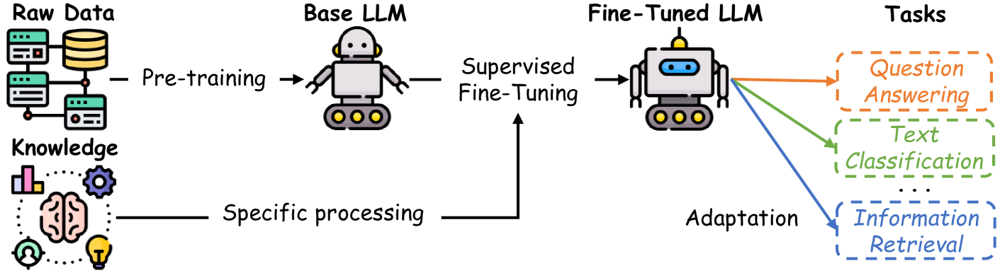
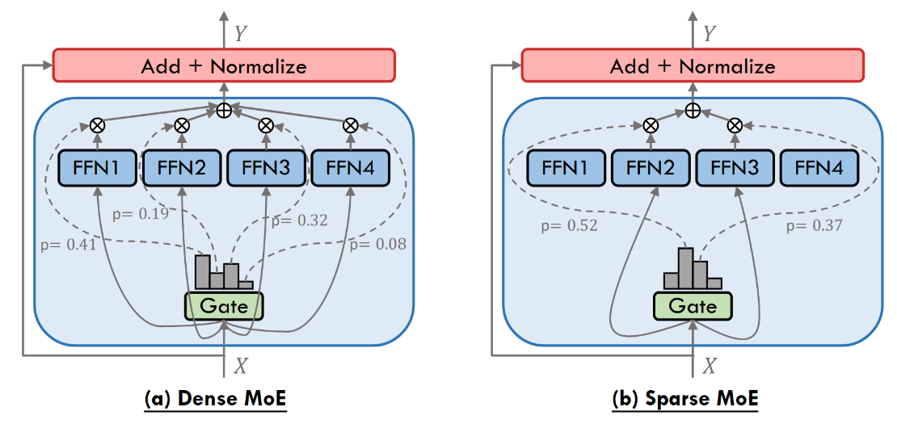
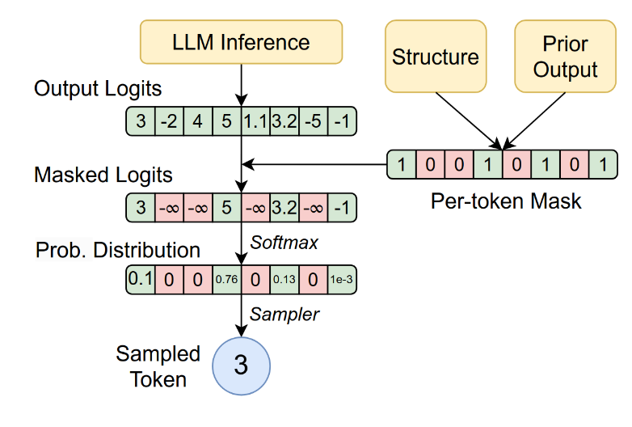
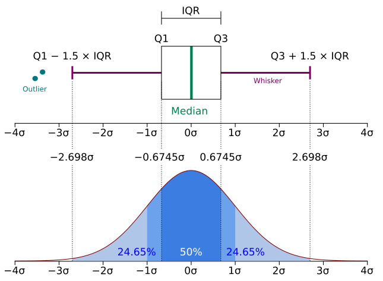
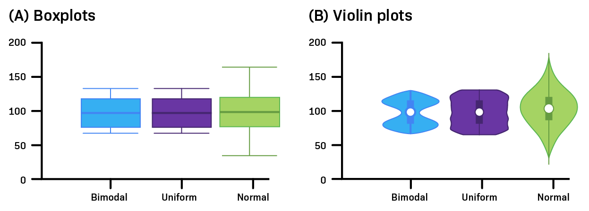
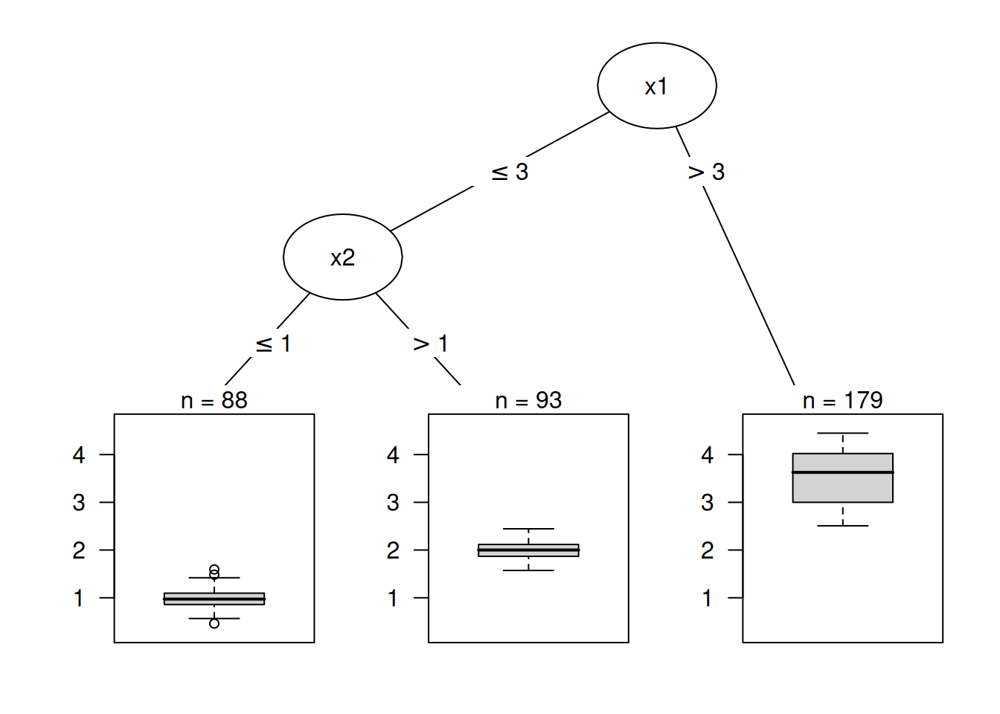
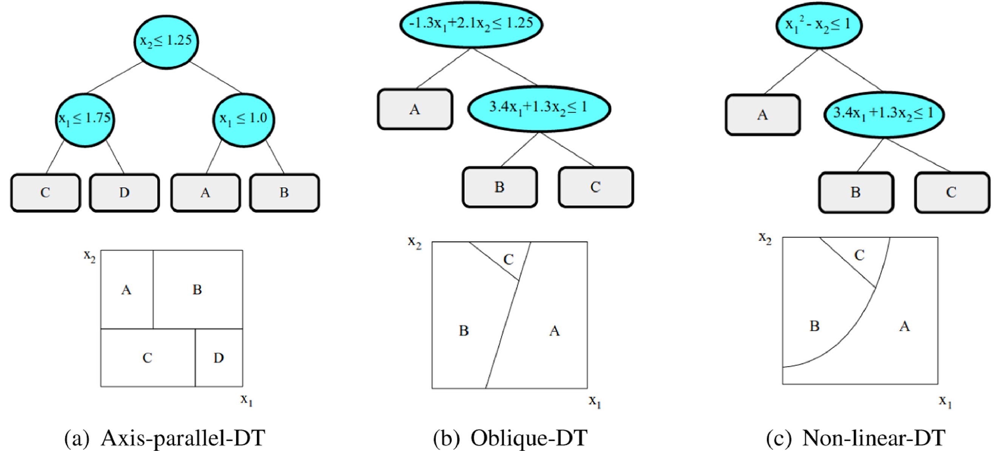

# Literature review {#literature-review}

\ChapFrame[Literature review][bhtred]

This chapter presents all literature relevant to our research questions and provides essential background on the concepts and methods employed in this thesis. As outlined in Chapter \@ref(introduction), the problem addressed here lies within the field of information retrieval and is approached using \acr{NLP} techniques. Accordingly, Section \@ref(computer-science) reviews techniques for locating information within and extracting it from documents. Subsection \@ref(llm-theory) then explains the mechanisms and architectures of modern \acrfull{LLM}s, with particular attention to the \acr{MoE} architecture.

Subsequently, Subsection \@ref(llm-methods) discusses the prompting strategy *in-context learning*, which leverages the "programming by example" paradigm, and explores how \acr{RAG} integrates into this framework. We also demonstrate how guided decoding can be used to generate structured responses suitable for downstream tasks.

Section \@ref(other-concepts) introduces the \acr{SHAP} framework, a unified model for explaining machine learning predictions, applicable to complex models such as deep neural networks and random forests. The latter are briefly described as well. We employ random forests and \acr{SHAP} to test our hypotheses regarding potential predictors for the information extraction task. Our hypotheses are stated in Section \@ref(research-questions).

## Computer science {#computer-science}

Information retrieval and \acr{NLP} are important areas in computer science, enabling the efficient extraction and utilization of information from vast datasets [@rajExploringNewApproaches2025]. We will describe both in the following subsections.

### Information retrieval {#sparse-retrieval}

Information retrieval deals with finding relevant information within large collections of unstructured text. It is used in search engines, of dialogue, question-answering, and recommender systems [@zhuLargeLanguageModels2024].

The term frequency $\mathrm{tf}_{t,d}$ is one of the oldest measures used in retrieval algorithms. It just counts the number of occurrences of a term in a document. Document is an abstraction in this case. It can be a sentence, a page or a file. Since longer documents might have higher term frequency for each term, it is useful to normalize the value by the document length $|d|$. This measure could be called term rate:

\begin{equation} 
\mathrm{tr}_t = \frac{\mathrm{tf}_{t,d}}{|d|}
(\#eq:term-rate)
\end{equation}

It is part of well established measures as \acr{TF-IDF} and Okapi \acr{BM25}. Both are used for ranking, how relevant a document is for a given search query and are widely used in information retrieval systems [@robertsonUnderstandingInverseDocument2004; @robertsonProbabilisticRelevanceFramework2009] and thus can be part of a \acr{RAG} architecture too. \acr{BM25} is one of the "most successful Web-search and corporate-search algorithms" [@robertsonProbabilisticRelevanceFramework2009, p. 1].

The \acr{IDF} is often used as a weighting function. If the ranking of possible results of a search query is simply calculated as sum of all term frequencies in a document, that are present in the query as well less informative terms get equal weight.

Looking at the search query: "Is the positron blue?", helps to illustrate the problem. The terms *is*, *the* and *blue* might be present often in a document for children that is talking about the sky or sea. Such a document could get high score, even though *positron* is never mentioned. It would be good, if it is most important if the term *positron* is in the document. We can achieve this by multiplying all term frequencies with the \acr{IDF} score [@manningIntroductionInformationRetrieval2008, pp. 118]:

\begin{equation} 
\mathrm{idf}_t = \log \frac{N}{\mathrm{df}_t}
(\#eq:idf)
\end{equation}

$N$ is the number of documents in the collection of documents and $\mathrm{df}_t$ the number of documents, that contain term $t$. While the term frequencies $\mathrm{tf}_{t,d}$ are calculated separate for each document, the \acr{IDF} score is computed once for the whole collection. The \acr{TF-IDF} score is then defined by:

\begin{equation} 
\mathrm{tf\text{-}idf}_t = \mathrm{idf}_t \cdot \mathrm{tf}_{t,d}
(\#eq:tf-idf)
\end{equation}

The more advanced measure \acr{BM25} is derived in @manningIntroductionInformationRetrieval2008. It introduce a saturation term, that prevents a term occurring very often in a document will increasing the score linearly. The 25 in \acr{BM25} simply refers to the fact, that it is the 25th version of the Okapi system, that was developed at City University London [@robertsonProbabilisticRelevanceFramework2009; @robertsonSimpleEffectiveApproximations1994a].

Measures as \acr{TF-IDF} or \acr{BM25} are also used for classification tasks, i.e. in the context of sentiment analysis [@carvalhoTFIDFCRFNovelSupervised2020] and semantic understanding [@rathiImportanceTermWeighting2023]. They can be used for \acr{RAG} and are called sparse retrievers in this context.

### Natural language processing {#nlp}

\acrfull{NLP} is a field of artificial intelligence that focuses on enabling computers to understand, interpret, and generate human language [@mahmudiNaturalLanguageProcessing2024]. \acr{NLP} encompasses a wide range of tasks, including sentiment analysis, information extraction, table and dialog understanding, as well as summarization, code generation and machine translation [@qinLargeLanguageModels2025].

Methods of \acr{NLP} can enhance the process of information retrieval. Vector embedding based techniques emerged recently and are called dense retrievers [@zhuLargeLanguageModels2024].

In the context of this thesis, information retrieval techniques are applied to locate financial information from annual reports. Techniques for information extraction are used to generate responses formatted for downstream tasks.

### Text extraction

Many information extraction tasks target information that is found in natural texts or tables. In order to use \acr{NLP} techniques it is a prerequisite to extract those texts. @adhikariComparativeStudyPDF2024 show in a benchmark study that *pypdfium* and *PyMuPDF* perform best among rule-based systems. But the transformer-based vision and document understanding tool *Nougat* [@blecherNougatNeuralOptical2023] performs even better.

@adhikariComparativeStudyPDF2024 also benchmark different table extraction tools. They find, that the transformer-based *Table Transformer* [@smockPubTables1MComprehensiveTable2022] extracts tables most accurate in most cases. Rule-based tools are more accurate for table extraction tasks from tenders and manuals.

Sometimes there is only a visual representation of texts, resulting from scanned pages. In this case \acr{OCR} techniques can be used, to transform the visual information back into a text representation. A comparison study for recent \acr{OCR} solutions can be found at @francisComparisonStudyOptical2025.

#### Document Layout Analysis

An important step in the process of extracting information from complex documents is to recognize the layout of a document [@zhongPubLayNetLargestDataset2019]. Common tasks are determining the correct order of texts, correctly align captions to tables and figures, identifying headings, tables and figures. This can be used to separate the contents of smaller tables, that contain the information of interest, from surrounding text and thus strip potentially distracting content. @paulStateoftheArtModelArchitectures2025 gives a broad overview for state-of-the-art document layout analysis architectures and presents a comparison of different models performance.

## Large Language Models {#llm-theory}

@wangHistoryDevelopmentPrinciples2024 open their introductory survey on \acr{LLM}s history, development and principles with: "Language models serve as a cornerstone in [\acr{NLP}], utilizing mathematical methods to generalize language laws and knowledge for prediction and generation" [@wangHistoryDevelopmentPrinciples2024]. They clearly explain foundational concepts and simultaneously provide mathematical notation.

Modern \acr{LLM} are generally build on the transformer architecture [@razaIndustrialApplicationsLarge2025], that is described in Section \@ref(transformers). They are the recent endpoint of an evolution from statistical language models, as n-grams, over neural language models and pre-trained language models [@wangHistoryDevelopmentPrinciples2024] and demonstrate high flexibility and capabilities that can be applied on a wide range of tasks and in various domains [@zhaoSurveyLargeLanguage2025].

This becomes possible, because they are trained on vast, diverse datasets, providing the knowledge [@wangKnowledgeMechanismsLarge2024] and the abilities to become a general-purpose task solver [@zhaoSurveyLargeLanguage2025]. Figure \@ref(fig:fine-tuning-image) visualizes, that supervised fine-tuning can be used to imporve the performance of pre-trained \acr{LLM}s in specific tasks by leveraging task-specific labeled datasets [@tieSurveyPosttrainingLarge2025].

(ref:fine-tuning-image-caption) Visualizing, how \acr{LLM}s are pre-trained on vast text corpora and fine-tuned on specific knowledge or tasks to adapt them for specific tasks. Source: @tieSurveyPosttrainingLarge2025

```{r fine-tuning-image, fig.cap="(ref:fine-tuning-image-caption)", echo=FALSE, out.width="100%"}

```

@tieSurveyPosttrainingLarge2025 discuss, that fine-tuning a model on instruction tasks makes it easier to elicit learned abilities for a variety of tasks and domains. This increases the applicability in every-day interaction, turning them into "zero-shot learners" [@weiFinetunedLanguageModels2022]. This means, that instruction fine-tuned models are able, to solve many tasks without the need of advanced prompting techniques as chain-of-thought [@zhaoSurveyLargeLanguage2025] or in-context learning [@brownLanguageModelsAre2020]. Nevertheless, we show in Section \@ref(in-context-learning), that these techniques stay still valuable to enable a model to perform new tasks.

For readers, who want to build understanding for modern \acr{LLM}s we recommend to work through the book "Dive into Deep Learning" [@zhangDiveDeepLearning2023]. This book is starting with neural language models and guides the reader through the key stages of generative \acr{AI}, covering computer vision models, too. It comes with ready to execute code examples and helps building deep insight through accompanying exercises.

### Architectural Foundations

#### Transformers

The transformer architecture is introduced 2017 by @vaswaniAttentionAllYou2023 as a novel architecture that relies entirely on self-attention mechanisms to draw global dependencies between input and output. This allows for much more parallelization than previous architectures as recurrent neural networks or convolutional neural networks. This leads to significantly reduced training times, while achieving better performance.

::: paragraph-start
##### Attention

@vaswaniAttentionAllYou2023 introduced the scaled dot-product attention and the self-attention mechanism. The self-attention mechanism allows each token in a sequence to attend to all other tokens, enabling the model to capture dependencies regardless of their distance in the sequence. This is particularly important for understanding context and relationships in language.
:::

The most obvious challenge for the attention mechanisms is the computational cost. The amount of processing power required scales quadratically with the length of the input [@tahirUnderstandingLLMContext2025]. This limits the context window size of many \acr{LLM}s. A sliding window attention can be used to improve computational performance [@raschkaInstructionPretrainingLLMs2025], e.g. as popularized by Mistral or Gemma 2. Thus, newer models support larger context windows.

::: paragraph-start
##### Processing Input

Before a transformer can process any input the text gets tokenized and embedded with a basic embedder. These embeddings then are combined with positional information using sinusoidal positional encoding [@wangHistoryDevelopmentPrinciples2024]. This happens in all transformers. Also in decoder only models.
:::

::: paragraph-start
###### Encoder

The role of the encoder is to understand the input text deeply by attending to all parts of it simultaneously and transforming it into a feature-rich embedding space. This means, it is using an unmasked attention mechanism [@vaswaniAttentionAllYou2023]. The output of the encoder is a set of context-aware embeddings.
:::

::: paragraph-start
###### Decoder

The decoder's role is to generate output tokens one-by-one autoregressively, attending both to previously generated tokens — via masked self-attention [@wangHistoryDevelopmentPrinciples2024] — and to the encoder's output — via cross-attention [@phdUnderstandingEncoderDecoder2025] — combining these to produce coherent, contextually relevant sequences.
:::

#### Generative Pretrained Transformers

The term \acrfull{GPT} is introduced in @radfordImprovingLanguageUnderstanding2018 as the first transformer model, that combined unsupervised pre-training with subsequent supervised fine-tuning. Their general task-agnostic model outperformed discriminatively trained models that use architectures specifically crafted for each task [@radfordImprovingLanguageUnderstanding2018]. It only uses decoder components, and thus is designed for generating new tokens based on the input and the patterns learned during training. It has 117 million parameters.

One year later @radfordLanguageModelsAre2019 showed with GPT-2, that scaling up the model and training dataset size significantly improves performance. They show, that the language model learns tasks without any explicit supervised fine-tuning. It has 1.5 billion parameters.

GPT-3 is released 2020 by @brownLanguageModelsAre2020 and introduces the technique of *in-context learning* as described in Section \@ref(in-context-learning), demonstrating, that large decoder-only transformers can generalize to new tasks even without extensive fine-tuning. It has 175 billion parameters.

The next section describes an architectural component, that is introduced in the early 1990s by @jacobsAdaptiveMixturesLocal1991 and emerged within the field of language models in 2017 [@zhangMixtureExpertsLarge2025], gaining more popularity in the last years.

#### Mixture of Experts

Recent \acrfull{LLM}s often use a \acr{MoE} architecture. The models of Llama 4, Qwen3 and GPT-4.1 are prominent examples for this kind of \acr{LLM}s. @zhangMixtureExpertsLarge2025 and @caiSurveyMixtureExperts2025a give an exhaustive overview of different types of \acr{MoE} architectures. While @zhangMixtureExpertsLarge2025 lists also models released this year and shows some applications of \acr{MoE}, is @caiSurveyMixtureExperts2025a discussing different architecture types in more detail. @grootendorstVisualGuideMixture2024 gives a guid to \acr{MoE} with many helpful illustrations.

The basic idea of \acr{MoE} models is to combine multiple smaller, specialized \acr{FFN}s to achieve better predictions overall. The \acr{MoE} "paradigm offers a compelling method to significantly expand model capacity while avoiding a corresponding surge in computational demands during training and inference phases" [@caiSurveyMixtureExperts2025a, p. 21].

Figure \@ref(fig:moe-architecture) shows two main differences in the architecture. One one hand there is the dense (a) architecture. Here, each token is fed into every \acr{FFN} and all results are pooled. On the other hand, there is the sparse architecture. Here, each token is just fed into a subset of \acr{FFN}s. Dense \acr{MoE} models often yield higher prediction accuracy, but also significantly increase the computational overhead [@caiSurveyMixtureExperts2025a].

The gate (also router) takes care of the distribution of tokens to the \acr{FFN}s. There is a high diversity of the routing algorithms and its goals are to "ensure expert diversity while minimizing redundant computation" [@zhangMixtureExpertsLarge2025]. There are algorithms that focus on load-balancing, domain specific routing and many more. Traditional \acr{MoE} assumes homogeneous experts, where load balancing might be the paramount goal. Recent advances explore more heterogeneous sets of experts and flexible routing strategies, that promise more efficiency [@zhangMixtureExpertsLarge2025].

```{r moe-architecture, fig.cap="Showing schemas of the dense and sparse mixture of experts architecture.", echo=FALSE, out.width="800%"}

```

Most of the Qwen3 models have a dense \acr{MoE} architecture. Only the two models released in July 2025 have a sparse architecture. These models have two parameter specifications. For example Qwen3-235B-A22B is specifying that the model has 235B token in total. But per token processed it uses (activates) just 22B parameters. In their mixture of experts architecture this means that 8 of 128 experts are participating in processing each token.

The Llama 4 models have a shared expert \acr{MoE} architecture. It combines a shared, fixed expert that processes every token and combines those results with results from a sparse \acr{MoE} layer.

Googles gemma-3n-E4B uses a selective parameter activation as well. They use the prefix E for effective instead of A for active [@googleGemma3nModel]. In gemma-3n there are parameters to handle input of different types — text, vision and audio — and they get loaded and activated as necessary. This allows a multi modal functionality. It additionally caches the \acr{PLE} in fast storage (RAM) instead of keeping it in the model memory space (VRAM), allowing to run models in low resource environments.

### Token Generation

\acr{LLM}s generate text by predicting the next token based on the input and the context provided. This is done using a decoding strategy, that determines how the next token is selected from the probability distribution over the vocabulary. A basic approach is greedy decoding, where the token with the highest probability is always selected. @willardEfficientGuidedGeneration2023 present an algorithm for greedy sampling procedure. This can lead to repetitive and less diverse text. But it is useful, if the goal is to get the most probable answer, e.g. for classification tasks, or to exactly copy numeric values.

Other strategies include beam search, which keeps track of multiple candidate sequences and selects the best one based on overall probability, and sampling methods like top-k and nucleus (top-p) sampling [@nasehStealingDecodingAlgorithms2023], which introduce randomness to generate more diverse and creative text. @jadhavArtSamplingControlling2021 is presenting multiple sampling strategies and presents the formulas for token probabilities with greedy sampling, with an without temperature parameter.

### Confidence Scores

A \acr{LLM} can return a log probability score together with each token it predicts. In fact, it can return the top k candidates for the next token with the corresponding log probabilities. The sum of individual log probabilities indicates how likely a sequence of tokens is, according to the \acr{LLM}. This sum can be interpreted as a kind of *confidence* the model has in a prediction [@berkovUnderstandingLLMLogprobs2025].

@boseakEvaluatingLogLikelihoodConfidence2025 investigate the usage of log probabilities to score multiple choice answers. They show that the sum of log probabilities carries valuable information about model confidence, but its proper use is nuanced. The choice to use the raw sum or a length normalized sum of log probabilities can have a noticeable effect on accuracy and they give no recommandation which approach to use in general. @maEstimatingLLMUncertainty2025 argue that normalizing the probability scores is a reason why probability-based methods fail to identify reliability.

@kangScalableBestofNSelection2025 compare different potential measures for a \acr{LLM}s' confidence for Best-of-N Selection tasks. The most simplest of these approaches uses the normalized log probabilities of the returned tokens. The negative exponent of this normalized sum is also called perplexity. It is widely used in LLM evaluations, even though it has been shown to fail in capturing a model's ability to understand long context. Nevertheless, @kangScalableBestofNSelection2025 show that perplexity can perform equally good as more sophisticated measures of confidence up to 16 choices.

@kaufLogProbabilitiesAre2024 investigated, if log probabilities can be used to measure semantic plausibility of sentences. They compare pairs of sentences that are similar, but where one is describing a plausible scenario, whereas the other describes a unlikely one. They show, that comparing the sum of returned log probabilities of two sentences yields better results for a semantic plausibility comparison than prompting the model to make this decision explicitly.

### Generation enhancing methods with LLMs {#llm-methods}

#### In-context Learning

Few-shot learning is a prompting strategy that enables \acr{LLM}s to solve a wide range of tasks, just by presenting task related examples including the solutions. @brownLanguageModelsAre2020 calls the rapid adaption to the provided task and examples as *in-context learning*. They show that already GPT-3, as general purpose transformer, surpasses the performance of fine-tuned state-of-the-art models in some tasks.

If the performance gain by *in-context learning* is investigated, the terms *zero-shot*, *one-shot* and *few-shot* learning are often used. In zero-shot learning we only state the task without providing any examples. In one-shot learning a single example is provided. In few-shot learning multiple examples are provided.

The classical alternative to in-context learning is model fine-tuning, in which a model's weights are updated via gradient descent, based on a large corpus of examples [@brownLanguageModelsAre2020]. Through fine-tuning, the resulting model can perform the target task independently, without requiring additional context or descriptive tokens at inference time.

In-context learning reduces the need to create large datasets to fine-tune a model on specific tasks. This brings great flexibility and can be resource efficient by sparing the computational costs for adapting the model to new tasks [@dongSurveyIncontextLearning2024]. On the other hand, it can pay off to fine-tune a model, if a specific task has to be solved regularly, because for *in-context learning* additional tokens have to be processed every time. This can become energy costly and slows down the task processing.

Text classification and information extraction are two tasks that can be solved with few shot-learning [@zhaoCalibrateUseImproving2021]. Hereby, the order in which the examples are presented is important — at least for GPT-3 [@zhaoCalibrateUseImproving2021].

Although tutorials and blogs sometimes suggest that using more examples leads to better results [@kukaShotBasedPromptingZeroShot], @brownLanguageModelsAre2020 demonstrate that performance may not improve significantly when adding more than a second example.

Furthermore, there is the threat of *context rot* [@kellyhongContextRotHow2025]. This means, the performance can decrease noticeably, when the context gets to long. Thus, the number of examples one should provide is not just constrained by the context width. Additionally, there is a threat of over-fitting on patterns that are not present in the actual task but in the examples if they are to homogeneous.

#### Retireval Augmented Generation

\acrfull{RAG} is introduced by @lewisRetrievalAugmentedGenerationKnowledgeIntensive2021 to enhance \acr{LLM}s capabilities in knowledge-intensive tasks and providing a solution to provide information on knowledge provenance. It can be used, to provide domain or company specific information and overcome the knowledge cutoff of the pre-training dataset [@gaoRetrievalAugmentedGenerationLarge2024]. And it can be used to decrease the chance that hallucinated data remains unnoticed.

@lewisRetrievalAugmentedGenerationKnowledgeIntensive2021 fine-tune a sequence-to-sequence model with a fixed retriever component, training only the query encoder and generator. Recent \acr{RAG} systems often use a retriever component and a general purpose \acr{LLM} [@gaoRetrievalAugmentedGenerationLarge2024]. @gaoRetrievalAugmentedGenerationLarge2024 describes different system \acr{RAG} architectures, namely naive, advanced and modular \acr{RAG}s.

It combines techniques from information retrieval, to identify information, that is relevant to a query and includes this information by adding it to the prompt. Thus, it is similar to an automated form *in-context learning* that is focusing to provide information instead of demonstrating new patterns. For the retrieval dense and sparse techniques can be used, as already mentioned in Section \@ref(sparse-retrieval) and Section \@ref(nlp). @guptaComprehensiveSurveyRetrievalAugmented2024 give an overview of potential retriever mechanisms.

The sources for information retrieval can be a local (vector) database, a knowledge graph or the internet. Recently, @anthropicIntroducingModelContext2024 introduced the \acr{MCP}, too. While \acr{RAG}s retrieves information mostly from unstructured, static sources, does \acr{MCP} provide real-time information from structured sources. The \acr{MCP} can also be used to execute other operations than retrieving information [@houModelContextProtocol2025], e.g. using external tools or sending e-mails via the appropriate \acr{API}.

#### Guided and restricted decoding

Guided decoding is a prompting technique, where a \acr{LLM} is instructed to respond in a specific format, e.g. as \acr{json} formatted string. It often is combined with *in-context* learning, to improve the probability, to get the format requested. One can provide examples of pre-structured templates, too. For \acr{json} one can request certain keys and properties for the corresponding values.

Restricted decoding, on the other hand, is manipulating the decoding process itself. This can be done by biasing the score values used to determine the probabilities of the tokens in an \acr{LLM}s vocabulary [@willardEfficientGuidedGeneration2023]. Figure \@ref(fig:restricted-decoding-image) shows, how this bias changes the probabilities for possible tokens to zero. This procedure is also called masking, because the tokens get invisible for the token sampler.

(ref:restricted-decoding-caption) Visualizing, how \acr{LLM}s are pre-trained on vast text corpora and fine-tuned on specific knowledge or tasks to adapt them for specific tasks. Source: @dongXGrammarFlexibleEfficient2025

```{r restricted-decoding-image, fig.cap="(ref:restricted-decoding-caption)", echo=FALSE, out.width="70%"}

```

Masking tokens often is achieved by iterating over the whole vocabulary for each token generation, which has a cumpotational complexity of $\mathcal{O}(N)$ They show, that this can be done more efficiently with a finite state machine approach. Using an index, the complexity can be reduced to $\mathcal{O}(1)$.

@willardEfficientGuidedGeneration2023 implemented their approach in the library *outlines*. The \acr{LLM} framework \acr{vllm} supports only the two libraries *guidance* [@GuidanceaiGuidance2025] and *xgrammar* [@dongXGrammarFlexibleEfficient2025], which implements an efficient pushdown automata approach to realize token sampling according to context free grammars.

@dochertyControllingYourLLM2025 demonstrates how the masking of tokens influences the probabilities for the next tokens and explains it with easy to grasp examples, helpful visualizations and is providing corresponding code snippets.

## General machine learning and statistics {#other-concepts}

### Sample distribution visualization methods

##### Boxplots

@wickham40YearsBoxplots2011 describe boxplots as "a compact distributional summary, displaying less detail than a histogram or kernel density, but also taking up less space. Boxplots use robust summary statistics that are always located at actual data points, are quickly computable (originally by hand), and have no tuning parameters. They are particularly useful for comparing distributions across groups."

Figure \@ref(fig:boxplot-gauss) shows a box and whiskers plot and its components and compares it to a gaussian probability distribution. Half of all observations fall within the box and the median is marked by a thick line. Outliers are defined as observations that are outside the area marked with the (horizontal) lines, called whiskers, that potentially have small bars at their ends. Outliers can be shown by circles or dots.

(ref:boxplot-gauss-caption) Showing a box and whiskers plot with its components — median, quartiles, whiskers and outliers — and compare it with a gaussian probability distribution. Graphic adjusted from @jhguchBoxPlot2025.

```{r boxplot-gauss, echo=FALSE, fig.cap="(ref:boxplot-gauss-caption)", out.width="80%", fig.align = 'center'}

```

The median and quartiles are less sensitive to outliers, than the mean and standard deviation of a sample. Thus, they are more suitable for distributions that are asymmetric or irregularly shaped and for samples with extreme outliers [@krzywinskiVisualizingSamplesBox2014]. They can be used with five observations and more. But even for large samples $(n \geq 50)$, whisker positions can vary greatly.

##### Violin plots

There are variations, that try to communicate the sample size of a box plot, either by adjusting the width of the whole box or by introducing notches, that indicate the confidence interval for the median [@wickham40YearsBoxplots2011]. Violin plots [@hintzeViolinPlotsBox1998] additionally indicate an density estimate, dropping the strict rectangular shape of the box. Figure \@ref(fig:violinplot) shows, that the shapes can be necessary to identify multi-modal distributions, that are invisible with regular boxplots [@wickham40YearsBoxplots2011]. One can tackle this problem by adding a jitter plot layer to the boxplots. Violin plots can also be used for large datasets, preventing to plot a lot of outliers.

(ref:violinplot-caption) Comparing boxplots and violinplots, showing that boxplots can not identify multi-modal distributions on their own. Graphic adjusted from @amgenscholarsprogramHowInterpretViolin.

```{r violinplot, echo=FALSE, fig.cap="(ref:violinplot-caption)", out.width="100%"}

```

### Tree based machine learning algorithms

Random forests are an ensemble supervised machine learning technique, composed of multiple decision trees [@kulkarniRandomForestClassifiers2013]. @mienyeSurveyDecisionTrees2024 give a detailed insight into decision trees and their high-performing ensemble algorithms. Tree based machine learning algorithms have gained significant popularity, due to their simplicity and good interpretability [@mienyeSurveyDecisionTrees2024].

##### Decision tree

"The basic idea behind decision tree-based algorithms is that they recursively partition the data into subsets based on the values of different attributes until a stopping criterion is met" [@mienyeSurveyDecisionTrees2024]. Figure \@ref(fig:decision-tree) shows this for artificial data of two continuous features. Popular measures to determine how to split a set of observations are the Gini index, information gain or information gain criteria [@mienyeSurveyDecisionTrees2024].

The tree shown is used for a regression task and will predict the average of all values of the corresponding terminal node (leaf). To find out which leaf will be the target terminal node for a given set of features, one simply follows the path from the top node (root) downwards, checking the splitting criteria. Thus, the interpretation of decisions made by a decision tree is straightforward and highly transparent.

(ref:decision-tree-caption) Visualizing the of partitioning of a two-dimensional continuous feature space based on multiple splitting criteria for decision tree inducing. Graphic adjusted from @molnarInterpretableMachineLearning2025.

```{r decision-tree, echo=FALSE, fig.cap="(ref:decision-tree-caption)", out.width="80%", fig.align = 'center'}

```

Further benefits of decision trees — besides the good interpretability and computational efficiency — are the native capturing of interactions between features [@molnarInterpretableMachineLearning2025], without modeling this explicitly, as it would for example be necessary in a linear regression. Decision trees can be used for classification and regression. They even can incorporate linear functions as leafs, enabling them to better capture linear relationships [@raymaekersFastLinearModel2024].

Problems of decision trees are, that they lack resilience against data changes and have a tendency to overfitting. A method against overfitting is pruning [@mienyeSurveyDecisionTrees2024]. Building an ensemble of decision trees is another possibility, that results in the random forest algorithm, described in the next paragraph .

@rivera-lopezInductionDecisionTrees2022 focus on decision trees and describe several types, including distinctions based on the splitting procedure (see Figure \@ref(fig:advanced-tree-splitting)). In addition to axis-parallel splitting, they present oblique and non-linear splitting criteria, and provide a state-of-the-art review along with a summary analysis of metaheuristics-based approaches for decision tree induction.

(ref:advanced-tree-splitting-caption) Visualizing the of partitioning of a two-dimensional continuous feature space based on multiple splitting criteria for decision tree inducing. Graphic adjusted from @rivera-lopezInductionDecisionTrees2022.

```{r advanced-tree-splitting, echo=FALSE, fig.cap="(ref:advanced-tree-splitting-caption)", out.width="100%", fig.align = 'center'}

```

##### Random forest

A random forest is using the principle of bagging and applies it on the level of features and observations. This means, it starts, creating basic decision trees with differing subsets of features and uses bootstrapping to select a randomized set of observations to train the tree with. The final prediction is then determined by voting (for classification) or averaging (for regression) the predictions of all trees in the ensemble.

The induction of the trees can be be parallelized, making it efficient on modern hardware. Random forests can cope with thousands of features and can be applied to large datasets [@breimanRandomForests2001]. There are methods that address the problems of imbalanced datasets too. As there are methods to prune a decision tree to fight overfitting, there are methods to prune a random forest by removing whole trees, to improve the learning and classification performance, too [@kulkarniPruningRandomForest2012].

Random forests are "powerful learning ensemble[s] given [their] predictive performance, flexibility, and ease of use" [@haddouchiSurveyTaxonomyMethods2024]. While it is based on decision trees, that are considered to be *white boxes*, because of their easy interpretability, random forests are seen as *black boxes*. The decision could be tracked without complicated math, but is tedious, because it would require propagating through many decision trees, noting their predictions and then averaging those.

The fact that the random forest model is categorized as a black-box model restricts its deployment in many fields of application [@haddouchiSurveyTaxonomyMethods2024]. One feature oriented tool for explainability is the \acr{SHAP} framework, presented in section \@ref(shap). It allows local explanation, a global overview and pattern discovery for random forests [@haddouchiSurveyTaxonomyMethods2024].

##### Gradient boosted decision trees

Another highly effective and widely used advancement to decision trees are gradient boosted decision trees [@chenXGBoostScalableTree2016]. Instead of the principle of bagging it applies the principle of boosting. It is sequentially building decision trees, where the later ones correct the errors in predictions made by the former trees. It uses gradient descent to minimize those errors [@mienyeSurveyDecisionTrees2024].

The \acr{XGBoost} algorithm is a famous member of this family, with "an outstanding performance record" [@burnwalComprehensiveSurveyPrediction2023]. "Among the 29 challenge winning solutions published at Kaggle's blog during 2015, 17 solutions used XGBoost" [@chenXGBoostScalableTree2016].

In the following we will emphasize some of its benefits as described by @burnwalComprehensiveSurveyPrediction2023:

-   \acr{XGBoost} employs both L1 (Lasso) and L2 (Ridge) regularization in its objective function to penalize model complexity, mitigating overfitting. However, overfitting can occur, especially if hyperparameters are not adjusted properly.

-   \acr{XGBoost} provides feature importance metrics to facilitate model interpretation, facilitating feature selection and improving the understanding of the model's decision-making process.

-   \acr{XGBoost} "runs more than ten times faster than existing popular solutions on a single machine and scales to billions of examples in distributed or memory-limited settings" [@chenXGBoostScalableTree2016] using parallelization techniques.

But there are some challenges, that are to investigate in future research. E.g. finding methods to handle imbalanced data and automate the hyperparameter tuning process.

### Model agnostic explanation models {#shap}

##### Shapley values

Shapley values are introduced by @shapley17ValueNPerson2016 originally in 1952 in the field of game theory. He defined three axioms that a fair allocation of rewards must fulfill:

1.  Symmetry: If two players contribute the same amount, they are interchangeable and should gain equal reward.

2.  Efficiency: The whole value of the game is distributed among the players.

3.  Law of aggregation: If a player contributes to multiple independent games, his contribution in total should be the sum of contributions in each game.

From the third axiom a fourth property derives, that is sometimes named independently. If a player is not contributing to a game, he gets no share. @osullivanMathematicsShapleyValues2023 calls this the *null player* property.

The formula for a single shapley values is given by [@lundbergUnifiedApproachInterpreting2017][^02_literature_review-1]:

[^02_literature_review-1]: We replaced $F$ by $P$ to speak in the terms of players instead of features. We also replcaed $f$ by $val$, because it better fits the story, that this is the value gain in a game, as explained by @osullivanMathematicsShapleyValues2023.

\begin{equation} 
\phi_{i} = \sum_{S \subseteq P \setminus \{i\}}{\frac{|S|! \left( |P|-|S|-1 \right) !}{|P|!} \left[ val \left( S \cup \{i\} \right) - val\left(S\right) \right]}
(\#eq:shapley)
\end{equation}

@molnarInterpretableMachineLearning2025 bridges the game theory terms to the field of machine learning as follows: "The *game* is the prediction task for a single instance of the dataset. The *gain* is the actual prediction for this instance minus the average prediction for all instances. The *players* are the feature values of the instance that collaborate to receive the gain (= predict a certain value)."

##### SHAP framework

In @lundbergUnifiedApproachInterpreting2017 they present "A Unified Approach to Interpreting Model Predictions" based on shapley values, called \acrfull{SHAP}. It assigns each feature an importance value for every observation. This allows to inspect, why a specific prediction is made and might explain, why a model makes a mistake for specific observations. Inspecting the predictions for all observations can show generalized effects of features.

@lundbergUnifiedApproachInterpreting2017 show that their approach is the only possible explanation model for the class of additive feature attribution methods, that has three desirable characteristics: local accuracy, missingness and consistency. Shapely values can be computed for any machine learning model, but its exact calculation is computationally extremely expensive [@huComputingSHAPEfficiently2023], since it is of exponential complexity $\mathcal{O}(2^p)$ regarding the number of features (or predictors) $p = |P|$.

Even with the approximation of the shapley values, introduced in @lundbergUnifiedApproachInterpreting2017 as Kernel SHAP, the complexity for tree based algorithms is $\mathcal{O}(MTL2^p)$, with the number of samples $M$, number of trees $T$ and the number of leaves $L$. The tree based optimization of the algorithm, TreeSHAP, allows an approximation in $\mathcal{O}(MTLD^2)$ [@lundbergExplainableAITrees2019], with the maximum tree depth $D$. Depending on the number of observations to calculate shapley values for ($M$), the Fast TreeSHAP algorithm has a even lower time complexity of $\mathcal{O}(TLD2^D+MTLD)$ [@yangFastTreeSHAPAccelerating2022].

To quantify the overall effect of a feature on the model, we compute the mean of the absolute Shapley values for that feature across all observations. Here is the formula, which we adapted from @molnarInterpretableMachineLearning2025 by adjusting the notation and variable names to match Equation \@ref(eq:shapley):

\begin{equation} 
 mean\left(|SHAP|\right) = \frac{1}{n} \sum_{k=1}^n | \phi_{i}^{\left( k \right)} |
(\#eq:meanSHAP)
\end{equation}

This value is called \acr{SHAP} feature importance. It can be interpreted similar to standardized beta values for a linear regression. In some cases it would be possible to calculate an effect direction for the feature importance. But it is not common practice. Instead visual representations presented in section \@ref() are used for such interpretations.

@lundbergUnifiedApproachInterpreting2017 also showed that SHAP values are more consistent with human intuition than preceding local explainable models. @liBuildingTrustMachine2024 mention, that explainability of machine learning models is not only important for researches but also for practitioners, to demonstrate their reliability to potential users and build trust. Regardless of the popularity of \acr{SHAP} scores, there are claims that they can be inadequate as a measure of feature importance [@huangFailingsShapleyValues2024]. The approximated as well as exact \acr{SHAP} scores can assign higher value to unimportant features than to important ones.

However, the need for a high explainability of machine learning algorithms is more urgent than ever, since the EU's regulatory ecosystem is emphasizing the importance of \acr{XAI} [@nanniniOperationalizingExplainableArtificial2024].

## Summary

This chapter highlighted recent architectures for \acr{LLM}s, such as Mixture-of-Experts, and provided references for readers to explore foundational concepts and the history of \acr{NLP} in greater detail. it presented *in-context learning* and retriever augmentation as advanced prompting strategies benchmarked in our experiments.

The review underscored the importance of explainability in machine learning, particularly through frameworks like SHAP, and discussed visualization techniques such as boxplots and violin plots for understanding data distributions.

The discussed methods and concepts directly inform the thesis's approach to extracting financial information from unstructured documents. By presenting advanced LLM architectures and explainability tools, the chapter establishes a foundation for the experimental strategies and evaluation criteria used throughout the thesis.

Building on these insights, the following chapter details the methodology adopted for applying and evaluating these techniques in the context of financial report analysis, setting the stage for the experimental investigations and results.
