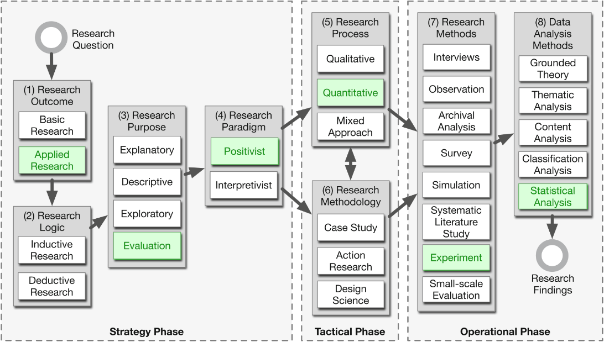

# Methodology

\ChapFrame

This chapter describes the research design of this thesis. In the subsequent sections it elaborates

## Problem Definition

This thesis aims to evaluate a framework for information extraction from financial reports using advanced computing algorithms as \acr{LLM}s, presented by @liExtractingFinancialData2023. We apply this framework on German annual reports of multiple companies and focus on using open source \acr{LLM}s. This task requires two problems to be solved:

1.  The information to extract has to be located in the document.
2.  The information has to be extracted correct and in form that allows further processing in down stream tasks.

We limit the information of interest on the data found in the balance sheet and profit and loss statement. Both are found on separate pages and have a table-like structure. The information of interest is ordered by a hierarchy defined in @hgbHandelsgesetzbuchImBundesgesetzblatt2025. The information to extract are numeric values.

Since the information of interest is placed on separated pages, the first problem is to find the pages that contain the balance sheet and profit and loss statement. We do not attempt to select a specific part of the page, where the data can be found. Thus, this becomes a classification task, if a page contains the information of interest. Spatial information is not processed.

The second problem is an information extraction task. Potential information has to be identified, its entity has to recognized and finally its numeric value has to be extracted. In this thesis no special techniques for the table extraction sub field are used.

## Research Design & Philosophy

The research design for this thesis is set up, following the guideline found in @wohlinExperimentationSoftwareEngineering2024 and Figure \@ref(fig:reasearch-design-image) shows the decisions made. According to @collisBusinessResearchPractical2014 research classification the outcome of this thesis is applied research, focusing on solving a practical problem. Its purpose is evaluation research, comparing different approaches with each other. The data collected in our experiments is of quantitative nature and its evaluation uses (semi-)quantitative methods.

Research logic? Methods fit deductive. But I start with a very specific problem. Literature describing basic approaches?

(ref:reasearch-design-caption) Showing the decisions made regarding the research design. (The figure is adapted from @wohlinDecisionmakingStructureSelecting2015. The copyright for the original figure is held by Springer Science+Business Media New York 2014.)

```{r reasearch-design-image, fig.cap="(ref:reasearch-design-caption)", echo=FALSE, out.width="100%"}

```

### Research questions

For this thesis we formulate two main research questions:

1.  How can we use \acr{LLM}s effectively to locate specific information in a financial report?
2.  How can we use \acr{LLM}s effectively to extract these information from the document?

Each of this questions is investigated with its own methods and experiments. In the following we will use the term *page identification* to refer to the first research question and *information extraction* to refer to the second.

### Evaluation framework

::: paragraph-start
##### Page identification

The page identification task is successful, if a page is correctly classified to contain the information of interest. The balance sheet is composed of the assets (*Aktiva*) and liabilities (*Passiva*) table. Together with the profit an loss statement (*Gewinn- und Verlustrechnung, GuV*) they form the three target classes. The fourth class is called *other*. Subsequently will will use the German terms for the target classes (or table types): **Aktiva**, **Passiva** and **GuV**.
:::

::: paragraph-start
##### Information extraction

The information extraction task if successful, if the correct numeric value is extracted with the correct entity identifier in the correct \acr{json} format. If a values defined by the legal text is not present *null* should be returned with the corresponding entity identifier. The entity identifier can be composed of up to three labels, representing the hierarchy defined in the legal text.
:::

### Evaluation research

We compare different approaches to solve the two tasks, searching for the most effective setup, to solve the problems. A task is considered effective if it achieves good results while being as computationally efficient as possible. As a baseline for each task a \acrfull{regex} based approach is set up. Regular expressions are chosen as baseline because they are computationally efficient. The results are compared with the authors performance as well.

The results should be used to implement an application that is used by the employees of \acr{RHvB} in future.

## Evaluation Strategy

### Metrics

::: paragraph-start
##### Page identification

The distribution of target classes and pages of type *other* is highly imbalanced. At most two pages per target class are found in documents with up to 152 pages. Thus, following @saitoPrecisionRecallPlotMore2015 suggestion, we report measures as precision, recall and F1 score instead of accuracy, to describe the approaches performances.
:::

In a \acr{HITL} application the recall value might be of higher interest than the F1 score. More precisely, in those cases the number of pages to check until the correct page is found is of interest. Thus, the top k recall is reported additionally, if the approach permits to rank the classified pages according to a score.

Precision-recall curve

::: paragraph-start
##### Information extraction

We use two measures to describe the approaches performances for the information extraction task. First, we check how many of the predicted numeric value are matching the numeric values in the ground truth. The only permitted differences are based on the number of trailing zeros. We do not check for partial correctness, since the real life application requires totally correct extracted numbers.
:::

Second, we report the F1 score for correctly predicting values as missing and thus returning *null*. The distribution of missing values and given numeric values is not very imbalanced. Nevertheless, we report the F1 score to establish a comparability with the results od the page identification task.

### Benchmarking

Comparing the performance of different approaches benchmarked in this thesis is possible, because the approaches within a task are performed on a common document base. The task to solve is the same for each approach. The prompts for the different prompting strategies are build systematically and derive from the base prompt formulated for the *zero shot* strategy. Comparing the runtime or energy consumption gets possible with the \acr{GPU} benchmark data (see section \@ref(gpu-benchmark))

## Data Strategy

The population of annual reports of interest for the work at the \acr{RHvB} is composed of all annual reports of companies, where the state of Berlin holds a share. There are often multiple versions of those annual reports: one that is publicly available and targeting share- and stakeholders. The structure and layout of there reports is quite heterogeneous. Often there is a second version that is used internally or for communications with public administrations. They often consist of plain text and tables and shows neither diagrams nor photos.

Since the evaluations are run on the \acr{BHT} cluster and partially in the Azure cloud, we work with the publicly available reports, while at \acr{RHvB} the internal documents are more common. The annual reports mostly are downloaded from the companies websites. Some documents are accessed via [Bundesanzeiger](https://www.bundesanzeiger.de) or the [digitale Landesbibliothek Berlin](https://digital.zlb.de).

For the page identification task all kinds of pages from the annual reports are used. For the information extraction only pages with **Aktiva** tables are used. In addition, a set of self-generated synthetic **Aktiva** tables is used for the information extraction task. It is created to systematically investigate potential effects of characteristics financial tables could have.

### Sampling methodology

::: paragraph-start
##### Page identification

For the page identification task companies (mainly) from the first row of Figure \@ref(fig:beteiligungsunternehmen) have been selected, to build the ground truth from. The idea is that the documents of a companies within a category are more similar to each other, than to documents of companies of other categories. For the chosen companies all available annual reports are selected. Since one of the companies mainly published documents that require \acr{OCR} preprocessing, we include the documents of a second company for this category.
:::

::: paragraph-start
##### Information extraction

For the information extraction task two sampling iterations are gone through. In the first iteration a single report is selected for each company. In addition, all available reports from the first listed company are chosen, to test an in-company learning approach. In the second iteration more reports of the other companies are added, to increase the ground truth size and allow to test the in-company approach for all companies.
:::

### Ground truth creation process

The ground truth for both tasks is created by by manual labor of the authors. The results of early experiments are used to check the ground truth for mistakes or missed items.

::: paragraph-start
##### Page identification

For the page identification task the chosen documents are searched for the target pages either by using the search functionality, \acr{TOC} or scrolling through all pages. For each target page the filepath, page and type is listed in a csv file. For some reports there are multiple pages present for a single target type. In this case, both pages are added to the ground truth. Sometimes the **Aktiva** and **Passiva** page are on a single page. In this case a single entry is made and its type is *Aktiva&Passiva*. If a table spans two pages, both pages are recorded. Excluding pages that need \acr{OCR} processing we created 252 entries.
:::

For double checking all identified pages are extracted from their original PDF files and combined in a single file. Thus, problems with the numbers shown in the PDF viewer and the actual page number in the file are identified and resolved. After the first experiments pages, that have been classified as a target by multiple models, are checked. Thus, some additional target tables, that span two pages, are identified.

::: paragraph-start
##### Information extraction

For the information extraction task we copy the numeric values from the annual reports into csv files, replace the thousands separators and floating point delimiters and multiply those values by 1_000, if a currency unit is given for the column the value comes from. The csv files are already prefilled with all entities defined in the legal text, identified by their full hierarchy. Thus, we choose which line to put the value in, if the description in the annual report is different.
:::

There are cases, where a single line defined in the legal text is split up into multiple lines in the annual reports. In those cases we enter the sum into the according row in the csv file. If entities are found, that do not fit any entity given in the legal text, this entry is dropped. For the first iteration the csv files just contained the entities and column names but no values.

In the second iteration we use the predictions of Qwen3-235B, check the values and mark mistakes, correct the values and log all mistakes found. In this iteration we check the ground truth created in the first iteration as well and correct mistakes made earlier.

### Preprocessing

We use plain text extracted from the annual reports for all tasks. We do not extract geometric coordinates for the text. @auerDoclingTechnicalReport2024 describes, that available open-source PDF parsing libraries may show issues as poor extraction speed or randomly merged text cells. We tested five PDF extraction libraries, because the results of all subsequent experiments will depend on the text extracts. Section \@ref(text-extraction-benchmark) shows the results.

We perform no manual data cleaning, because this will not be done from the employees of \acr{RHvB} either.

### Data splitting

When we train a machine learning model, we split the data into train and a test set. We do not use a validation set, because we do not compare models using an extended hyper-parameter variation strategy. Instead we just report the performance found for the models build with default settings. We build two random forests for the term frequency approach in the page identification task and more random forests for evaluating the hypotheses for the information extraction task.

Building the term frequency random forest, we face a highly imbalanced dataset. We apply undersampling for the training and evaluate the model on the imbalanced test set.

## Experimental Framework

### Hardware normalization {#gpu-benchmark}

To make the runtime of different \acr{LLM}s running on different amounts and types of \acr{GPU}s comparable, we conducted a benchmark running the models Qwen2.5-7B and Qwen2.5-32B with different hardware compositions on the Datexis cluster. Figure \@ref(fig:gpu-benchmark-plot) shows the runtime for classifying 100 pages with the multi-class approach, providing three random examples for the in-context learning.

The classification time with Qwen2.5-32B on \acr{GPU}s of type B200 is a little faster than running Qwen2.5-7B on the same amount of A100 \acr{GPU}s. We calculate normalized runtimes for our experiments, based on these runtime measures for small and larger \acr{LLM}s on different types and numbers of \acr{GPU}s. A minute of computation on a single B200 is comparable to 4:30 minutes of computation on a single A100.

```{r gpu-benchmark-plot, echo=echo_flag, warning=warning_flag, message=message_flag, dev=std_dev, fig.cap="Showing the runtime to classify 100 pages with the multi-class approach, providing three random examples for the in-context learning."}
df_gpu_benchmark <- read_csv("../benchmark_jobs/page_identification/gpu_benchmark/gpu_factors.csv")

df_gpu_benchmark %>% ggplot(aes(x = gpu_number, y = runtime_in_s, color = gpu_type)) + geom_line(aes(linetype = model_name)) + geom_point()
```

### Error analysis

The ultimate goal is to fully automate the information extraction task at hand. Thus, it is important to analyse potential errors, to identify obstacles that hinder performance and find ways to further improve the system.

We expect to find issues with wrong extracted or halluzinated numbers, wrong entity recognition and false positive *null* values.

Quantitative / stratified: We will compare the error rates based on the different variables of the experiments. For the approaches using \acr{LLM}s to solve the problem there are model specific, prompting strategy specific and example specific variables.

Qualitative: Finally, we investigate some of the erroneous extracted examples manually, and try to identify the underlying issues.

Tools and criteria

Reporting

Example:

To better understand the limitations of the evaluated models, we will conduct a detailed error analysis. We will first quantify the types of errors (e.g., false positives, false negatives, misclassifications) using confusion matrices and error rate statistics. Additionally, we will manually inspect a sample of erroneous predictions to identify common causes, such as ambiguous table layouts, OCR errors, or model misinterpretations. Errors will be categorized by document type and extraction task to reveal systematic weaknesses. Representative error cases will be documented to illustrate typical failure modes and to inform potential improvements for future work.

### Baseline selection rationale

see section Evaluation research

### Evaluation methods

-   box plots

-   PR-curve

-   random forest + SHAP

## Ethical & Practical Considerations

### PDF extraction limitations

Pdfminer informs that the text of some annual reports from *IBB* and *Berlinovo* should not be extracted. This information is given in a meta data field of the PDF. We use the text extract from these documents for our study anyway.

### Computational constraints

The extraction with \acr{LLM}s is computationally demanding and should be run on \acr{GPU}s. To run model that yields the best results four H200 \acr{GPU}s are needed.

### Generalizability scope

The approach tested here is probably using on other companies annual reports as well. To extract information that is only filling a small part of a page the framework may has to be adjusted. The page identification could be trickier with some approaches if only a single key word is searched.
