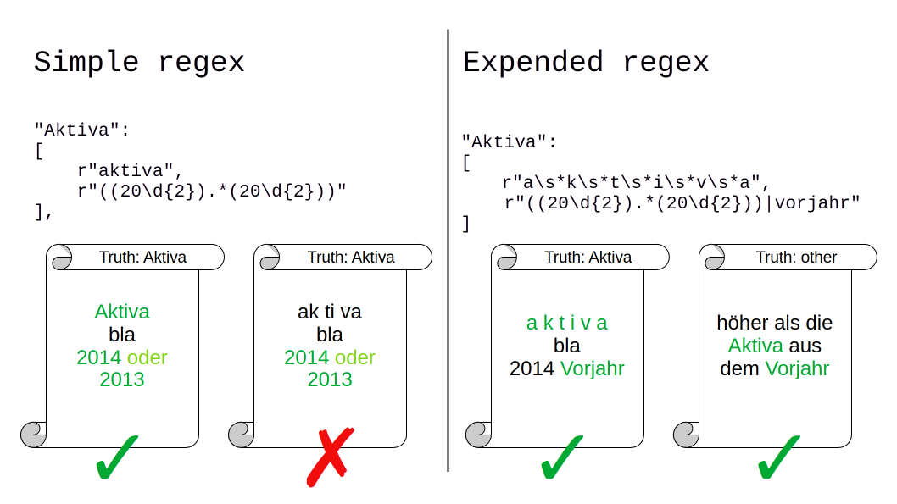
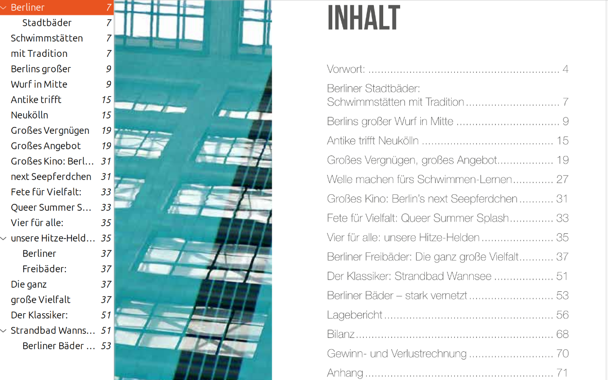
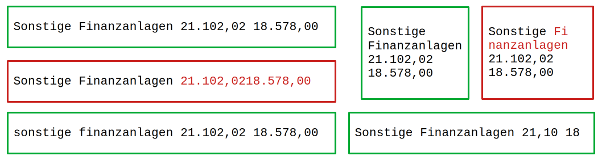
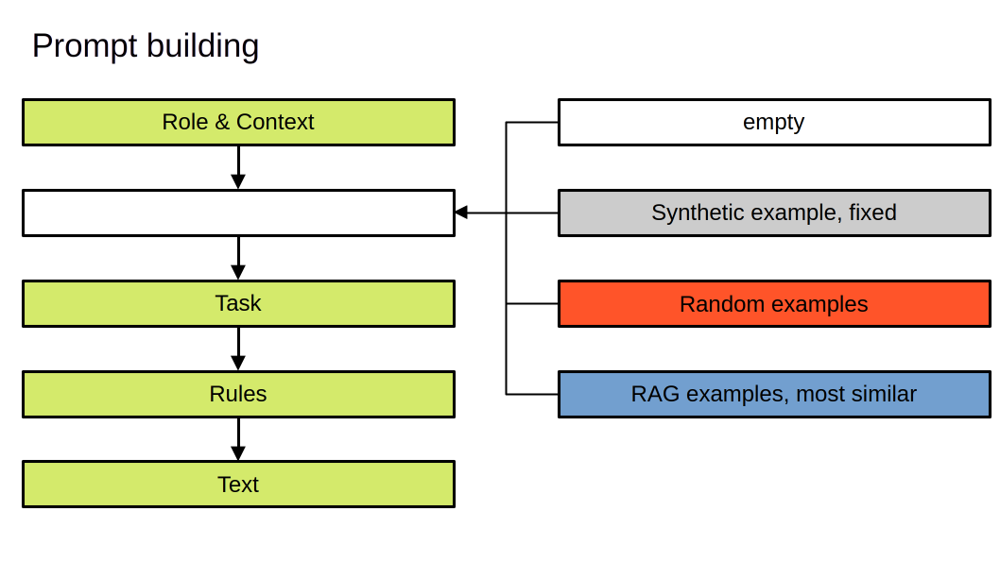

# Methodology {#methodology}

\ChapFrame[Methodology][bhtblue]

This chapter describes the research design of this thesis. In the subsequent sections it elaborates

## Problem Definition

This thesis aims to evaluate a framework for information extraction from financial reports using advanced computing algorithms as \acr{LLM}s, presented by @liExtractingFinancialData2023. We apply this framework on German annual reports of multiple companies and focus on using open source \acr{LLM}s. This task requires two problems to be solved:

1.  The information to extract has to be located in the document.
2.  The information has to be extracted correct and in form that allows further processing in down stream tasks.

We limit the information of interest on the data found in the balance sheet and profit and loss statement. Both are found on separate pages and have a table-like structure. The information of interest is ordered by a hierarchy defined in @hgbHandelsgesetzbuchImBundesgesetzblatt2025. The information to extract are numeric values.

Since the information of interest is placed on separated pages, the first problem is to find the pages that contain the balance sheet and profit and loss statement. We do not attempt to select a specific part of the page, where the data can be found. Thus, this becomes a classification task, if a page contains the information of interest. Spatial information is not processed.

The second problem is an information extraction task. Potential information has to be identified, its entity has to recognized and finally its numeric value has to be extracted. In this thesis no special techniques for the table extraction sub field are used.

## Research Design & Philosophy

The research design for this thesis is set up, following the guideline found in @wohlinExperimentationSoftwareEngineering2024 and Figure \@ref(fig:reasearch-design-image) shows the decisions made. According to @collisBusinessResearchPractical2014 research classification the outcome of this thesis is applied research, focusing on solving a practical problem. Its purpose is evaluation research, comparing different approaches with each other. The data collected in our experiments is of quantitative nature and its evaluation uses (semi-)quantitative methods.

Research logic? Methods fit deductive. But I start with a very specific problem. Literature describing basic approaches?

(ref:reasearch-design-caption) Showing the decisions made regarding the research design. (The figure is adapted from @wohlinDecisionmakingStructureSelecting2015. The copyright for the original figure is held by Springer Science+Business Media New York 2014.)

```{r reasearch-design-image, fig.cap="(ref:reasearch-design-caption)", echo=FALSE, out.width="100%"}
knitr::include_graphics("images/research_design.png")
```

### Research questions {#research-questions}

For this thesis we formulate two main research questions:

```{r, include=knitr::is_html_output(), results='asis', echo=FALSE}
cat("<ol class='rs-questions' style='--counter: 1;'><li>How can we use LLMs effectively to locate specific information in a financial report?</li><li>How can we use LLMs effectively to extract this information from the document?</li></ol>")
```

\begin{enumerate}[label={\textbf{Q\theenumi}}]
  \item How can we use LLMs effectively to locate specific information in a financial report?
  \item How can we use LLMs effectively to extract this information from the document?
\end{enumerate}

Each of this questions is investigated with its own methods and experiments. In the following we will use the term *page identification* to refer to the first research question and *information extraction* to refer to the second.

Additionally, we formulate a \acr{UX} motivated side research question:

```{r, include=knitr::is_html_output(), results='asis', echo=FALSE}
cat("<ol class='rs-questions' style='--counter: 3;'><li>Can we use additional information from the extraction process to guide the user on which values need to be checked and which can be trusted as they are?</li></ol>")
```

\begin{enumerate}[label={\textbf{Q\theenumi}}]
  \setcounter{enumi}{3}
  \item Can we use additional information from the extraction process to guide the user on which values need to be checked and which can be trusted as they are?
\end{enumerate}

The third question is refereed to, using the term *error rate guidance*.

### Hypotheses

Subsequent we formulate our hypotheses for the research questions:

H1.1: \acr{LLM}s can be used to locate specific information in a financial report, achieving a high F1 score.

H1.2: \acr{LLM}s can be combined with other approaches to reduce the energy consumption, without lowering the systems recall.

H2.1a: \acr{LLM}s can be used to correctly extract multiple numeric values from the assets table.

H2.1b: \acr{LLM}s can match row identifiers and place the numeric values in the correct target row.

H2.1c: \acr{LLM}s can identify unmatched row identifiers and report, that the value is missing.

H2.2a: Model specific features have an effect on the extraction performance.

H2.2.b: Prompt strategy specific features have an effect on the extraction performance.

-   context from same company

H2.2c: Table specific features have an effect on the extraction performance.

-   What are characteristics of financial tables that make it hard for LLMs to identify / extract them? (How does the length and complexity of financial documents (e.g., multi-column layouts, nested tables) affect table extraction performance?)

H3.1: The confidence score can be used to guide the user on which of the identified pages need to be checked and which can be trusted as they are.

H3.2: The confidence score can be used to guide the user on which of the predicted values in the information extraction task need to be checked and which can be trusted as they are.

### Evaluation framework

::: paragraph-start
##### Page identification

The page identification task is successful, if a page is correctly classified to contain the information of interest. The balance sheet is composed of the assets (*Aktiva*) and liabilities (*Passiva*) table. Together with the profit an loss statement (*Gewinn- und Verlustrechnung, GuV*) they form the three target classes. The fourth class is called *other*. Subsequently will will use the German terms for the target classes (or table types): **Aktiva**, **Passiva** and **GuV**.
:::

::: paragraph-start
##### Information extraction

The information extraction task if successful, if the correct numeric value is extracted with the correct entity identifier in the correct \acr{json} format. If a value, defined by the legal text, is not present *null* should be returned with the corresponding entity identifier. The entity identifier can be composed of up to three labels, representing the hierarchy defined in the legal text.
:::

::: paragraph-start
##### Error rate guidance

A error rate guided result checking process can be implemented, if we can use extraction task related information, to identify thrust worthy. This means, we could white list these values and red flag the remaining ones. Thus, we could guide the users attention in the error checking process on those values, that empirically tend to have a high chance to be faulty.
:::

### Evaluation research

We compare different approaches to solve the two tasks, searching for the most effective setup, to solve the problems. A task is considered effective if it achieves good results while being as computationally efficient as possible. As a baseline for each task a \acrfull{regex} based approach is set up. Regular expressions are chosen as baseline because they are computationally efficient. The results are compared with the authors performance as well.

The results should be used to implement an application that is used by the employees of \acr{RHvB} in future.

## Evaluation Strategy

### Metrics

::: paragraph-start
##### Page identification

The distribution of target classes and pages of type *other* is highly imbalanced. At most two pages per target class are found in documents with up to 152 pages. Thus, following @saitoPrecisionRecallPlotMore2015 suggestion, we report measures as precision, recall and F1 score instead of accuracy, to describe the approaches performances.
:::

In a \acr{HITL} application the recall value might be of higher interest than the F1 score. More precisely, in those cases the number of pages to check until the correct page is found is of interest. Thus, the top k recall is reported additionally, if the approach permits to rank the classified pages according to a score.

Precision-recall curve

::: paragraph-start
##### Information extraction

We use two measures to describe the approaches performances for the information extraction task. First, we check how many of the predicted numeric value are matching the numeric values in the ground truth. The only permitted differences are based on the number of trailing zeros. We do not check for partial correctness, since the real life application requires totally correct extracted numbers.
:::

Second, we report the F1 score for correctly predicting values as missing and thus returning *null*. The distribution of missing values and given numeric values is not very imbalanced. Nevertheless, we report the F1 score to establish a comparability with the results od the page identification task.

::: paragraph-start
##### Error rate guidiance

In this thesis we focus our attention on a criteria, which we name *confidence*. We calculate the *confidence* score for answers received from \acr{LLM} based on the non-normalized sum of token log probabilities [@boseakEvaluatingLogLikelihoodConfidence2025]:
:::

\begin{equation} 
confidence = \exp \left( \sum logprob(token_i) \right)
(\#eq:confidence)
\end{equation}

For the classification tasks this is equal to the normalized sum, since the answer is either containing just one token or the subsequent tokens have a log probability of 0, because the fully answer is determined by the first token.

We are using the non-normalized sum of token log probabilities as well, because we want a single uncertain digit to flag the whole numeric value as as unreliable. This means, that shorter answers tend to have higher *confidence* scores. This is especially true for predicting *null*. Thus, we investigate the prediction of numeric values and *null* separated.

### Benchmarking

Comparing the performance of different approaches benchmarked in this thesis is possible, because the approaches within a task are performed on a common document base. The task to solve is the same for each approach. The prompts for the different prompting strategies are build systematically and derive from the base prompt formulated for the *zero shot* strategy. Comparing the runtime or energy consumption gets possible with the \acr{GPU} benchmark data (see section \@ref(gpu-benchmark))

## Data Strategy

The population of annual reports of interest for the work at the \acr{RHvB} is composed of all annual reports of companies, where the state of Berlin holds a share. There are often multiple versions of those annual reports: one that is publicly available and targeting share- and stakeholders. The structure and layout of there reports is quite heterogeneous. Often there is a second version that is used internally or for communications with public administrations. They often consist of plain text and tables and shows neither diagrams nor photos.

Since the evaluations are run on the \acr{BHT} cluster and partially in the Azure cloud, we work with the publicly available reports, while at \acr{RHvB} the internal documents are more common. The annual reports mostly are downloaded from the companies websites. Some documents are accessed via [Bundesanzeiger](https://www.bundesanzeiger.de) or the [digitale Landesbibliothek Berlin](https://digital.zlb.de).

For the page identification task all kinds of pages from the annual reports are used. For the information extraction only pages with **Aktiva** tables are used. In addition, a set of self-generated synthetic **Aktiva** tables is used for the information extraction task. It is created to systematically investigate potential effects of characteristics financial tables could have.

### Sampling methodology

```{r count-benchmark-documents, echo=echo_flag, warning=warning_flag, message=message_flag, cache=TRUE, cache.extra = tools::md5sum(c("../benchmark_truth/aktiva_passiva_guv_table_pages_no_ocr.csv", "./scripts/page_identification_preparations.R"))}
source("./scripts/page_identification_preparations.R")

num_multiple_tables_per_document <- df_targets_no_ocr %>%
  anti_join(consecutive_pages, by = c("filepath", "page", "type")) %>% 
  arrange(filepath, page) %>%
  group_by(filepath, type) %>% 
  summarise(count = n()) %>% 
  filter(count > 1) %>%
  group_by(filepath) %>% 
  summarise(count = n()) %>% 
  nrow()

multiple_tables_per_type_and_document <- data_unnested %>%
  anti_join(consecutive_pages, by = c("filepath", "page", "type")) %>% 
  arrange(filepath, page) %>%
  group_by(filepath, type) %>% 
  summarise(count = n()) %>% 
  filter(count > 1) %>% 
  group_by(type) %>% 
  summarise("multiple targets in document" = n())

df_special_targets <- multiple_tables_per_type_and_document %>% left_join(consecutive_pages %>% group_by(type) %>% summarise("target two pages long" = n())) %>% mutate_if(is.numeric,coalesce,0)
```

::: paragraph-start
##### Page identification

Figure \@ref(fig:document-base-page-identification) shows how the document base for the tasks in this section is composed[^03_methodology-1]. Overall `r num_documents` annual reports from `r num_companies` companies are used. For this thesis the tables of interest are those that show **Aktiva**, **Passiva** and **GuV**. Among the `r total_pages_no_ocr` pages `r num_tables` tables have to be identified on `r num_target_pages` pages. Figure \@ref(fig:document-base-page-identification) also gives an impression on how many pages the documents have. The documents of *IBB* tend to be longer. The documents of *Amt für Statistik Berlin-Brandenburg* tend to be shorter.
:::

[^03_methodology-1]: I downloaded all publicly available annual reports for some of the companies shown in the first row of Figure \@ref(fig:beteiligungsunternehmen). I assumed that this will give a representative sample of document structures for the other companies of the same type. Realizing that the degewo AG reports would require ocr preprocessing I additionally downloaded reports for GESOBAU AG. This approach could have been more systematic. For the second task I downloaded reports for all companies available and tried to use a balanced amount of reports per company.

```{r, eval = knitr::is_html_output(), echo=FALSE, warning=warning_flag, message=message_flag, results='asis', class.chunk='pre-detail'}
cat("<p>You can have a look at the ground truth data unfolding the following details element.</p>")
```

```{r ground-truth-tables-of-interest, eval = knitr::is_html_output(), echo=FALSE, warning=warning_flag, message=message_flag, class.chunk='hideme', results='asis'}
df_targets_no_ocr %>% render_table(
  caption = "Showing all pages of interest with the target table type and filepath.",
  ref = opts_current$get("label")
  )
```

```{r document-base-page-identification, echo=echo_flag, warning=warning_flag, message=message_flag, dev=std_dev, fig.cap="Showing the number of pages (bar height) and number of documents (number above the bar) per company for the data used for the page identification task. Some documents would require ocr before being processed and were not used."}
df_pages %>% group_by(company) %>% mutate(
  docs_per_company = n(), pages_per_company = sum(pages)
  ) %>% 
  ggplot() +
  geom_col(aes(x = company, y = pages, fill = needs_ocr), color = "#00000033") +
  geom_text(
    data = . %>% group_by(company) %>% slice_head(n = 1),
    aes(x = company, y = pages_per_company, label = docs_per_company, group = company),
    stat = "identity",
    vjust = -0.5,
    size = 3
  ) +
  scale_x_discrete(
    guide = guide_axis(angle = 45),
    labels = scales::label_wrap(30)
    )
```

Table \@ref(tab:display-multiple-tables-per-type-and-document) shows how many documents have multiple target tables per type and how many target tables span two pages. In total `r num_consecutive_pages` tables are distributed on two pages. In `r num_multiple_tables_per_document` documents there are multiple tables per type of interest. There are `r num_two_tables_on_one_page` pages with two target tables (**Aktiva** and **Passiva**) on it.

```{r display-multiple-tables-per-type-and-document, echo=FALSE, warning=warning_flag, message=message_flag, results='asis'}
df_special_targets %>% render_table(
  caption = "Showing the number of documents with multiple target tables per type and the number of target tables that span two pages.",
  ref = opts_current$get("label")
  )
```

```{r table-extraction-preps, echo=FALSE, warning=warning_flag, message=message_flag, cache=TRUE, cache.extra = tools::md5sum('data_storage/real_table_extraction_llm.rds')}
old_doc_base <- readRDS("data_storage/real_table_extraction_llm.rds") %>% select(filepath) %>% unique()
new_doc_base <- readRDS("data_storage/real_table_extraction_extended_llm.rds") %>% select(filepath) %>% unique() %>% mutate(filepath = str_replace(filepath, "a__f", "af")) %>% filter(!str_detect(filepath, "MEAB GmbH"))
```

::: paragraph-start
##### Information extraction {#information-extraction-data-sampling}

For the manual information extraction we need up to 12 minutes per table. The maximum amount of values to copy and format (or type manually) among the tables used is 40. In addition to this manual process conceptional process can be necessary, because the values have to matched to the strict grammar. Sometimes we have to decide that there is no row a value fits in or there are multiple values that have to get summed up in order to calculate the value that fits in the predefined schema.
:::

This manual work was done for `r old_doc_base %>% nrow()` documents. For every company that published the detailed form of balance sheets a single document was included. Additionally documents were included for *Amt für Statistik und Brandenburg* to check, if a context learning approach is benefiting from documents from the same company.

Later, the predictions of the \acr{LLM}s were used, to create additional `r new_doc_base %>% nrow()` ground truth tables. The old ground truth tables were checked in this this iteration and an error rate of 2.4 % was detected. Thus, the human reference score for percentage of correct predictions is 0.976. Figure \@ref(fig:table-extraction-doc-base) shows how many **Aktiva** tables are used for all tasks in this subsection, that use real data instead of synthetic data.

```{r table-extraction-doc-base, echo=echo_flag, warning=warning_flag, message=message_flag, out.width="100%", dev=std_dev, fig.cap="Showing the number of documents used for the table extraction task. The number of Aktiva tables is equal to the number documents.", fig.width=9}
new_doc_base %>% rowwise() %>% 
  mutate(
    .before = 1, 
    company = str_match(filepath, "/pvc/benchmark_truth/real_tables_extended/(.*)__")[2],
    initial_doc_base = str_remove(filepath, "_extended") %in% old_doc_base$filepath
    ) %>% ggplot() +
  geom_bar(aes(x = company, fill = initial_doc_base)) +
  scale_x_discrete(
    guide = guide_axis(angle = 60),
    labels = scales::label_wrap(30)
    ) +
  theme(
    axis.title.x = element_blank(),
    legend.position = "top",
    plot.margin = margin(l = 0)
  )
```

To overcome the limited amount of real data and to allow the systematic investigation of potential predictors for the extraction performance, even if their occurrence is very unbalanced within the real data, synthetic **Aktiva** tables were created. Subsection \@ref(synthetic-table-extraction) gives a detailed description, which table features are varied systematically, resulting in 16_504 tables in three formats each.

::: paragraph-start
##### Error rate guidiance

We investigate the third research question on the two datasets described above, instead of creating a separate dataset.
:::

### Ground truth creation process

The ground truth for both tasks is created by by manual labor of the authors. The results of early experiments are used to check the ground truth for mistakes or missed items.

::: paragraph-start
##### Page identification

For the page identification task the chosen documents are searched for the target pages either by using the search functionality, \acr{TOC} or scrolling through all pages. For each target page the filepath, page and type is listed in a csv file. For some reports there are multiple pages present for a single target type. In this case, both pages are added to the ground truth. Sometimes the **Aktiva** and **Passiva** page are on a single page. In this case a single entry is made and its type is *Aktiva&Passiva*. If a table spans two pages, both pages are recorded. Excluding pages that need \acr{OCR} processing we created 252 entries.
:::

For double checking all identified pages are extracted from their original PDF files and combined in a single file. Thus, problems with the numbers shown in the PDF viewer and the actual page number in the file are identified and resolved. After the first experiments pages, that have been classified as a target by multiple models, are checked. Thus, some additional target tables, that span two pages, are identified.

::: paragraph-start
##### Information extraction

For the information extraction task we copy the numeric values from the annual reports into csv files, replace the thousands separators and floating point delimiters and multiply those values by 1_000, if a currency unit is given for the column the value comes from. The csv files are already prefilled with all entities defined in the legal text, identified by their full hierarchy. Thus, we choose which line to put the value in, if the description in the annual report is different.
:::

There are cases, where a single line defined in the legal text is split up into multiple lines in the annual reports. In those cases we enter the sum into the according row in the csv file. If entities are found, that do not fit any entity given in the legal text, this entry is dropped. For the first iteration the csv files just contained the entities and column names but no values.

In the second iteration we use the predictions of Qwen3-235B, check the values and mark mistakes, correct the values and log all mistakes found. In this iteration we check the ground truth created in the first iteration as well and correct mistakes made earlier.

::: paragraph-start
##### Error rate guidiance

There is not ground truth for the calculated *confidence* scores. We will simply check, if the true and false predictions can be separated based on the returned *confidence scores*.
:::

### Preprocessing

We use plain text extracted from the annual reports for all tasks. We do not extract geometric coordinates for the text. @auerDoclingTechnicalReport2024 describes, that available open-source PDF parsing libraries may show issues as poor extraction speed or randomly merged text cells. We tested five PDF extraction libraries, because the results of all subsequent experiments will depend on the text extracts. Section \@ref(text-extraction-benchmark) shows the results.

We perform no manual data cleaning, because this will not be done from the employees of \acr{RHvB} either.

### Data splitting

When we train a machine learning model, we split the data into train and a test set. We do not use a validation set, because we do not compare models using an extended hyper-parameter variation strategy. Instead we just report the performance found for the models build with default settings. We build two random forests for the term frequency approach in the page identification task and more random forests for evaluating the hypotheses for the information extraction task.

Building the term frequency random forest, we face a highly imbalanced dataset. We apply undersampling for the training and evaluate the model on the imbalanced test set.

## Experimental Framework

### LLM overview

```{r llm-overview-data-loading, echo=echo_flag, warning=warning_flag, message=message_flag}
df_llm_overview <- read_csv("data_storage/model_usage_extraction.csv") %>% 
  arrange(tolower(model_family), parameter_count) %>% 
  rename(parameter = parameter_count) %>% 
  mutate_if(is.character, ~if_else(is.na(.), "", .)) %>% 
  mutate_if(is.character, ~if_else(. == "X", "✓", .))
```

Table \@ref(tab:llm-overview) gives an overview on all \acr{LLM}s used for the tasks in this thesis. It shows the passive parameter count in billions for each \acr{LLM} and shows in which specific approach it is used with a tick. Overall `r length(unique(df_llm_overview$model))` models from `r length(unique(df_llm_overview$model_family))` model families are used.

```{r llm-overview, echo=echo_flag, warning=warning_flag, message=message_flag, results='asis'}
table <- df_llm_overview %>% 
  render_table(
    alignment="lrccccc", 
    caption="Overview of benchmarked LLMs for all tasks. Parameter shows passive parametercount in billions.", 
    ref = opts_current$get("label"),
    colgroups = c(" " = 2, "information extraction" = 3, "page identification" = 2),
    row_group_col = 1,
    force_kable = FALSE
    )
if(knitr::is_latex_output()) {
  table <- table %>% column_spec(1, width = "5.8cm")
}

table
```

### Approaches

#### Page identification

::: paragraph-start
##### Regular expressions

We develop multiple sets of regular expressions and filter out all pages that do not fulfill all regular expressions of a given set. There are different sets for each target type, **Aktiva**, **Passiva** and **GuV**. The sets also differ in how versatile they can cope with additional white space introduced by a imperfect text extraction and how many different words for a given term are accepted. Figure \@ref(fig:regex-filter) shows an example for two sets of regular expressions to identify a **Aktiva** page.
:::

```{r regex-filter, fig.cap="Comparing the prediction of two different sets of regular expressions on dummy pages. The simple one has a lower recall, while the  expended one has a lower precision.", echo=FALSE, out.width="100%", fig.align='center'}

```

::: paragraph-start
##### Table of Contents Understanding

We use a \acr{LLM} to extract the \acr{TOC} from the first pages from a document or use the embedded \acr{TOC} and prompt a \acr{LLM} to identify the pages where the **Aktiva**, **Passiva** and **GuV** are located. Figure \@ref(fig:toc-screenshot) shows a screenshot of a annual report with an embedded TOC and its TOC in text form.
:::

```{r toc-screenshot, fig.cap="Showing a screenshot of a annual report with an embedded TOC (left) and its TOC in text form (right). The embeded TOC is not listing all entries from the TOC in text form.", echo=FALSE, out.width="100%", fig.align='center'}

```

::: paragraph-start
##### Large Language Model Classification

We use \acr{LLM}s to classify if the text extract of a given page is containing a **Aktiva**, **Passiva** or **GuV** table or something else. We test binary classification and a multi-classification approach. The reported confidence scores can be used to form a ranking, which text extract might be most similar to the target type.
:::

We test a wide range of open-weight models and compare different prompting techniques. Figure \@ref(fig:prompt-setup-classification) shows, how the prompts are composed for the different strategies. Besides a zero shot approach we test few-shot in-context learning with examples that are either chosen randomly or retrieved based on their vector similarity. Finally, we test passing the legal text instead of examples from a annual report.

```{r prompt-setup-classification, fig.cap="Showing the basic structure of the prompts and which strategies are used to pass additional information to the LLM.", echo=FALSE, out.width="100%", fig.align='center'}
knitr::include_graphics("images/promt_building_classification.png")
```

::: paragraph-start
##### Term frequency Ranking

We use normalized term frequencies and normalized float frequency to as features for a classification using a random forest. The predicted scores are used to build a ranking, which page most probably contains the target pages. Undersampling is used during training, to handle the unbalanced data. Figure \@ref(fig:tf-flowchart) visualizes, how the prediction works in this approach.
:::

```{r tf-flowchart, fig.cap="Visualizing, how term and float frequency get calculated and used to predict, if a page is of the target class.", echo=FALSE, out.width="100%", fig.align='center'}
knitr::include_graphics("images/tf_flowchart.png")
```

#### Information extraction

::: paragraph-start
##### Regular expressions

We use regular expressions to extract the numeric values for matching row identifiers. The regular expressions handle line breaks between words in the row identifiers, but not within a word. They can handle multiple signs of white space. Besides that, they try to fully match the labels from the legal text with the text extract, ignoring upper case. They extract numbers with "." as thousands separator. Figure \@ref(fig:regex-extractor) is visualizing those capabilities.
:::

```{r regex-extractor, fig.cap="Visualizing the extraction results for different text examples. Texts in green boxes are matching our regular expression. Texts in red boxes do not, because of the red text part.", echo=FALSE, out.width="100%", fig.align='center'}

```

::: paragraph-start
##### Real tables

We use \acr{LLM}s to extract the numeric values of real **Aktiva** tables with restricted generation. The \acr{LLM} has to group row identifiers and corresponding numeric values and match the row identifier with the labels of the schema. If a row identifier is unknown, the values have to be discarded. If a label is not present among the row identifiers, the model predicts *null*. All values are extracted in one pass. We do not include any instruction, how to proceed with currency units, that might be given for certain columns.
:::

We test a wide range of open-weight models and compare different prompting techniques. Figure \@ref(fig:prompt-setup-extraction) shows, how the prompts are composed for the different strategies. Besides a zero shot approach we test few-shot in-context learning with examples that are either chosen randomly or retrieved based on their vector similarity. Finally, we test passing a synthetic **Aktiva** table as example. We test models from OpenAIs GPT family in addition to the open-weight models.

```{r prompt-setup-extraction, fig.cap="Showing the basic structure of the prompts and which strategies are used to pass additional information to the LLM for the information extraction task.", echo=FALSE, out.width="100%", fig.align='center'}

```

::: paragraph-start
##### Synthetic tables

We use \acr{LLM}s to extract the numeric values of synthetic **Aktiva** tables with restricted generation. The procedure is identical as with the real **Aktiva** tables. We extract all values with and without an explicit instruction on how to proceed with currency units. We limit our test on the open-weight models.
:::

::: paragraph-start
##### Hybrid approach

We use \acr{LLM}s to extract the numeric values of real **Aktiva** tables with restricted generation, providing examples from synthetic **Aktiva** tables. The procedure is identical as with the real **Aktiva** tables. We extract all values with and without an explicit instruction on how to proceed with currency units. We limit our test on the open-weight models.
:::

### Hardware normalization {#gpu-benchmark}

To make the runtime of different \acr{LLM}s running on different amounts and types of \acr{GPU}s comparable, we conducted a benchmark running the models Qwen2.5-7B and Qwen2.5-32B with different hardware compositions on the Datexis cluster. Figure \@ref(fig:gpu-benchmark-plot) shows the runtime for classifying 100 pages with the multi-class approach, providing three random examples for the in-context learning.

The classification time with Qwen2.5-32B on \acr{GPU}s of type B200 is a little faster than running Qwen2.5-7B on the same amount of A100 \acr{GPU}s. We calculate normalized runtimes for our experiments, based on these runtime measures for small and larger \acr{LLM}s on different types and numbers of \acr{GPU}s. A minute of computation on a single B200 is comparable to 4:30 minutes of computation on a single A100.

```{r gpu-benchmark-plot, echo=echo_flag, warning=warning_flag, message=message_flag, dev=std_dev, fig.cap="Showing the runtime to classify 100 pages with the multi-class approach, providing three random examples for the in-context learning."}
df_gpu_benchmark <- read_csv("../benchmark_jobs/page_identification/gpu_benchmark/gpu_factors.csv")

df_gpu_benchmark %>% ggplot(aes(x = gpu_number, y = runtime_in_s, color = gpu_type)) + geom_line(aes(linetype = model_name)) + geom_point()
```

### Error analysis

The ultimate goal is to fully automate the information extraction task at hand. Thus, it is important to analyse potential errors, to identify obstacles that hinder performance and find ways to further improve the system.

We expect to find issues with wrong extracted or hallucinated numbers, wrong entity recognition and false positive *null* values. Not respected units

Quantitative / stratified: We will compare the error rates based on the different variables of the experiments. For the approaches using \acr{LLM}s to solve the problem there are model specific, prompting strategy specific and example specific variables.

Qualitative: Finally, we investigate some of the erroneous extracted examples manually, and try to identify the underlying issues.

Tools and criteria

Reporting

Example:

To better understand the limitations of the evaluated models, we will conduct a detailed error analysis. We will first quantify the types of errors (e.g., false positives, false negatives, misclassifications) using confusion matrices and error rate statistics. Additionally, we will manually inspect a sample of erroneous predictions to identify common causes, such as ambiguous table layouts, OCR errors, or model misinterpretations. Errors will be categorized by document type and extraction task to reveal systematic weaknesses. Representative error cases will be documented to illustrate typical failure modes and to inform potential improvements for future work.

99.5 % or 96 % accuracy for extracting financial data from Annual Comprehensive Financial Reports [@liExtractingFinancialData2023] In the untabulated test, GPT-4 achieved an average accuracy rate of 96.8%, and Claude 2 achieved 93.7%. Gemini had the lowest accuracy rate at 69%. (ebd.)

found error types: including omissions when the LLM was instructed to extract a list of line items, misjudgment of units (such as thousands or millions), and incorrect identification of rows and columns

failed to extract all of list, Too many hallucinated values when it was NA instead [@goughertyTestingReliabilityAIbased2024]

[@grandiniMetricsMultiClassClassification2020]

Numeric values are difficult to handle for langauge models in specific tasks. Copying numbers seems not to be a recent problem. How about transforming by multiplication with 1000?

### Baseline selection rationale

see section Evaluation research

### Evaluation methods

-   box plots

-   PR-curve

-   random forest + SHAP

XGBoost not used finally, because calculation \acr{SHAP} values for XGBoost model took to long for just a first glimpse on what might influence the extraction. lm also fitted and not used

## Ethical & Practical Considerations (eher am Ende oder weg?)

### PDF extraction limitations

Pdfminer informs that the text of some annual reports from *IBB* and *Berlinovo* should not be extracted. This information is given in a meta data field of the PDF. We use the text extract from these documents for our study anyway.

Errors catched by \acr{HITL} approach before they have down stream implications.

### Computational constraints

The extraction with \acr{LLM}s is computationally demanding and should be run on \acr{GPU}s. To run model that yields the best results four H200 \acr{GPU}s are needed.

### Generalizability scope

The approach tested here is probably using on other companies annual reports as well. To extract information that is only filling a small part of a page the framework may has to be adjusted. The page identification could be trickier with some approaches if only a single key word is searched.

### Ethical considerations

The extraction of numeric information is not the same as making decisions. It probably isn't affected by any bias, that is discriminating humans.

The automatisation of information extraction is potentially replacing low requirements work places. At \acr{RHvB} there are no jobs for such a task anymore. More free time for other tasks. Shifting to more complex tasks.

AI Act does probably not apply, since decisions are not made on individual level?: Are there restrictions on the use of automated decision-making? Yes, **individuals should not be subject to a decision that is based solely on automated processing** (such as algorithms) and that is legally binding or which significantly affects them.
