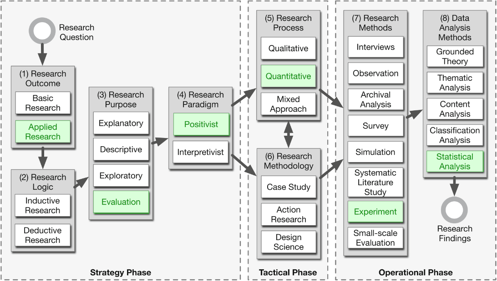
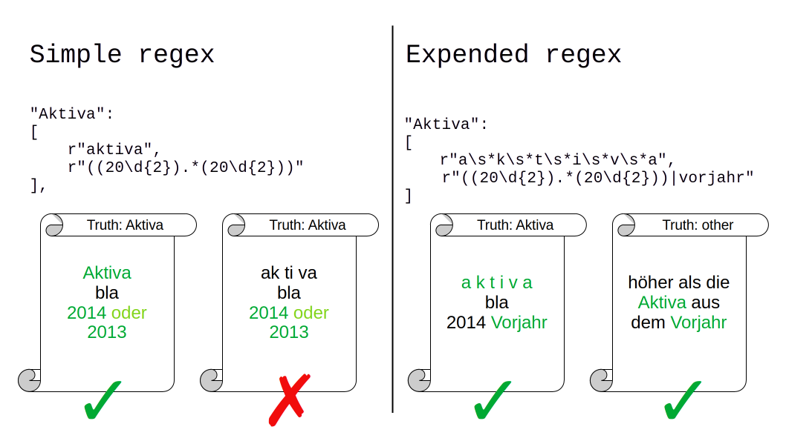
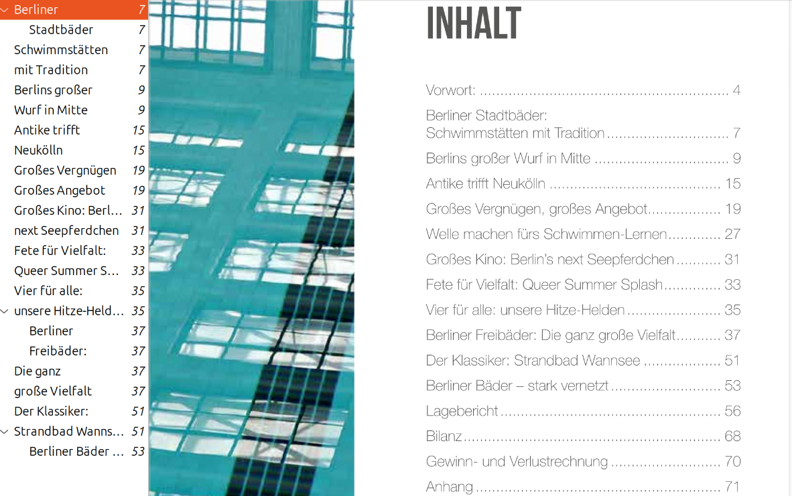
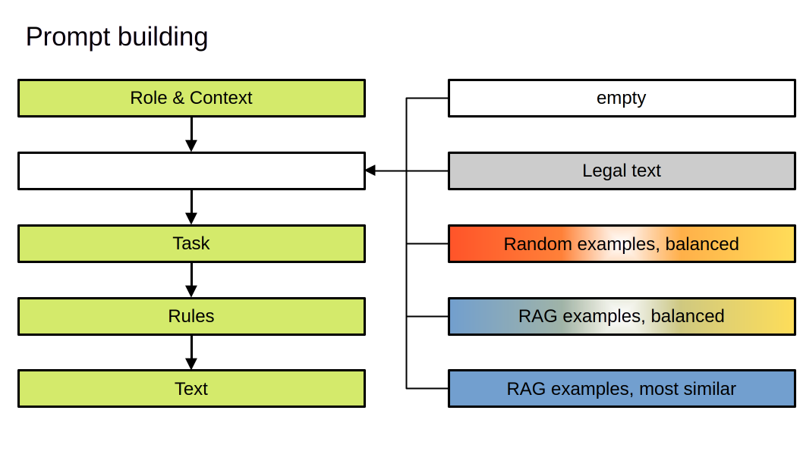
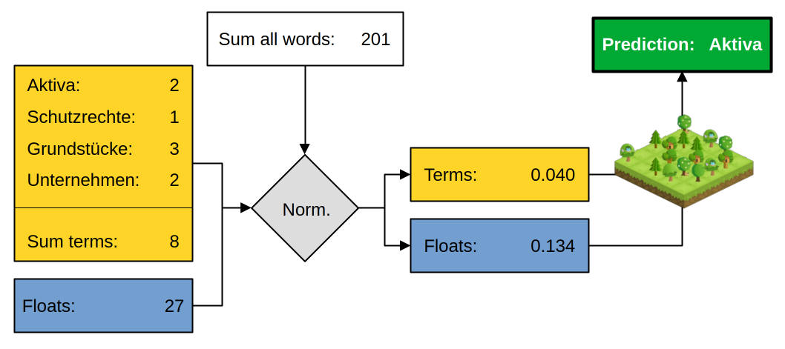
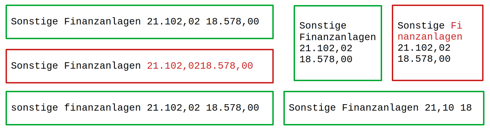
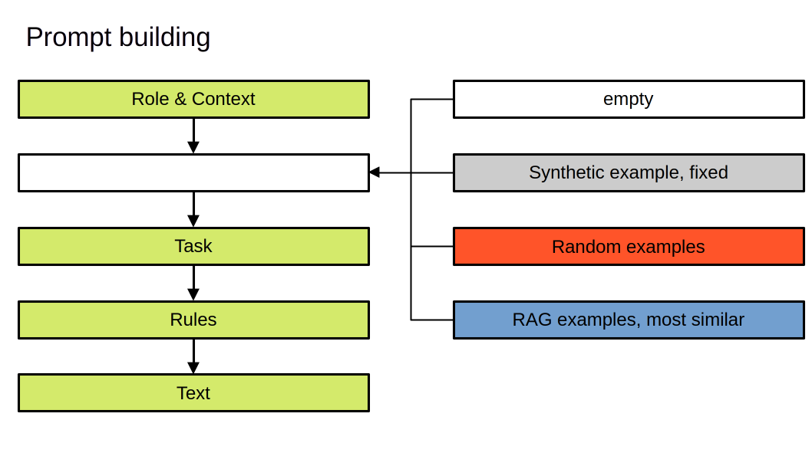

# Methodology {#methodology}

\ChapFrame[Methodology][bhtblue]

This chapter outlines the methodological framework adopted to address the subsequent research questions. It details the problem definition, research design and evaluation strategies used to investigate the effectiveness of \acrfull{LLM}s and alternative approaches for locating and extracting financial information from German annual reports.

For each research question, specific hypotheses are formulated, and the corresponding experimental setups are described. The chapter also presents the data strategy, including data selection, ground truth creation and preprocessing steps. Furthermore, it elaborates on the experimental framework, detailing the various approaches benchmarked, including rule-based methods and machine learning techniques.

The methodology aims to provide a robust foundation for assessing the performance, efficiency and practical applicability of automated information extraction in real-world audit scenarios.

## Problem Definition

This thesis aims to evaluate a framework for information extraction from financial reports using advanced computational algorithms, such as \acr{LLM}s, as presented by @liExtractingFinancialData2023. We apply this framework to German annual reports from multiple companies, focusing on the use of open-weight \acr{LLM}s. This task requires solving two key problems:

1.  The relevant information must be located within the document.
2.  The information must be extracted accurately and formatted to enable further processing in downstream tasks.

We restrict the scope of information to the data found in the balance sheet and profit and loss statement. Both are presented on separate pages and exhibit a table-like structure. The extracted information should reflect the hierarchy defined in @hgbHandelsgesetzbuchImBundesgesetzblatt2025 and consists of numeric values.

Since the information of interest is located on distinct pages, the first problem is to identify the pages containing the balance sheet and profit and loss statement. We do not attempt to select specific regions within a page where the data may be found. Thus, this becomes a classification task: determining whether a page contains the information of interest. Spatial information is not processed.

The second problem is an information extraction task. Relevant information must be identified, its entity recognized and its numeric value extracted. In this thesis, no specialized table extraction techniques are employed; instead, we rely solely on plain text extraction.

## Research Design and Philosophy

The research design for this thesis follows the guidelines outlined in @wohlinExperimentationSoftwareEngineering2024. Figure \@ref(fig:reasearch-design-image) illustrates the decisions made according to these guidelines. Based on the research classification by @collisBusinessResearchPractical2014, the outcome of this thesis is applied research, focused on solving a practical problem. The primary purpose is evaluation research, comparing different approaches (*benchmarking*). The data collected in our experiments is quantitative in nature and is evaluated using (semi-)quantitative methods.

(ref:reasearch-design-caption) Showing the decisions made regarding the research design. (The figure is adapted from @wohlinDecisionmakingStructureSelecting2015. The copyright for the original figure is held by Springer Science+Business Media New York 2014.)

```{r reasearch-design-image, fig.cap="(ref:reasearch-design-caption)", echo=FALSE, out.width="100%"}

```

### Research Questions {#research-questions}

For this thesis, we formulate two main research questions:

```{r, include=knitr::is_html_output(), results='asis', echo=FALSE}
cat("<ol class='rs-questions' style='--counter: 1;'><li>How can we use LLMs effectively to locate specific information in a financial report?</li><li>How can we use LLMs effectively to extract this information from the document?</li></ol>")
```

\begin{enumerate}[label={\textbf{Q\theenumi}}]
  \item How can we use LLMs effectively to locate specific information in a financial report?
  \item How can we use LLMs effectively to extract this information from the document?
\end{enumerate}

Each of these questions is investigated using dedicated methods and experiments. In the following, we refer to the first research question as *page identification* and the second as *information extraction*.

Additionally, we formulate a \acr{UX}-motivated supplementary research question:

```{r, include=knitr::is_html_output(), results='asis', echo=FALSE}
cat("<ol class='rs-questions' style='--counter: 3;'><li>Can we use additional information from the extraction process to guide the user on which values need to be checked and which can be trusted as they are?</li></ol>")
```

\begin{enumerate}[label={\textbf{Q\theenumi}}]
  \setcounter{enumi}{2}
  \item Can we use additional information from the extraction process to guide the user on which values need to be checked and which can be trusted as they are?
\end{enumerate}

We refer to the third research question as *error rate guidance*.

### Hypotheses

Next, we present the hypotheses formulated for the research questions. For the *page identification* task, we propose:

**H1.1:** \acr{LLM}s can be used to locate specific information in a financial report, achieving a high F1 score.

**H1.2:** \acr{LLM}s can be combined with other approaches to reduce the energy consumption, without lowering the systems recall.

For the *information extraction* task, we define two groups of hypotheses. The first group proposes that \acr{LLM}s can match entities, extract numeric values without errors, and avoid hallucinating values when none are present:

**H2.1a:** \acr{LLM}s can be used to correctly extract multiple numeric values from the assets table.

**H2.1b:** \acr{LLM}s can match row identifiers and place the numeric values in the correct target row.

**H2.1c:** \acr{LLM}s can identify unmatched row identifiers and report, that the value is missing.

The second group of hypotheses proposes that there are three sources of potential predictors for information extraction performance: model-specific, prompting-specific, and table-specific factors.

**H2.2a:** Model specific features have an effect on the extraction performance.

**H2.2.b:** Prompt strategy specific features have an effect on the extraction performance.

**H2.2c:** Table specific features have an effect on the extraction performance.

Model-specific predictors include the model family and parameter size. Predictors related to prompting strategies involve in-context learning decisions, such as how many examples should be presented, how those examples are selected and whether it is permissible to use \acrfull{icexs}. Examples of table characteristics investigated include the number of columns, visual separation and the presence of a currency unit (e.g., *T€*).

A comprehensive list of all investigated predictors and their assumed directions of effect on various measures of the information extraction task can be found in the hypotheses evaluation tables in Appendix \@ref(feature-effect-analysis).

The hypotheses for our supplementary research question identify the *confidence score* as the concrete target for investigation.

**H3.1:** The confidence score can be used to guide the user on which of the identified pages need to be checked and which can be trusted as they are.

**H3.2:** The confidence score can be used to guide the user on which of the predicted values in the information extraction task need to be checked and which can be trusted as they are.

### Evaluation Research

We follow the process of evaluation research to investigate our research questions. We compare different approaches to solve the two tasks, seeking the most effective setup. A setup is considered effective if it achieves strong results while remaining as computationally efficient as possible.

For each task, a \acrfull{regex}-based approach is established as the baseline, chosen for its computational efficiency. The results are also compared with the author's human performance. Ultimately, the findings will inform the implementation of an application to be used by employees of \acrfull{RHvB} in the future.

## Evaluation Strategy

This section defines the conditions under which a task is considered successfully solved and specifies the metrics used to measure outcomes.

### Evaluation Framework and Metrics

#### Page Identification

The page identification task is considered successful if a page is correctly classified as containing the information of interest. The balance sheet consists of the assets (*Aktiva*) and liabilities (*Passiva*) tables. Together with the profit and loss statement (*Gewinn- und Verlustrechnung, GuV*), these form the three target classes. The fourth class is designated as *other*. Subsequently, we use the German terms for the target classes (or table types): **Aktiva**, **Passiva** and **GuV**.

::: paragraph-start
##### Metrics

The distribution of target classes and pages of type *other* is highly imbalanced. At most two pages per target class are found in documents with up to 152 pages. Therefore, following the suggestion of @saitoPrecisionRecallPlotMore2015, we report precision, recall and F1 score instead of accuracy to describe the performance of the approaches.
:::

In a \acrfull{HITL} application, recall may be of greater interest than the F1 score. Specifically, the number of pages to check until the correct page of interest is found is relevant. Thus, top-k recall is reported additionally, if the approach allows ranking the classified pages by score.

#### Information Extraction

The information extraction task is considered successful if the correct numeric value is extracted with the correct entity identifier in the appropriate \acr{json} format. If a value defined by the legal text is not present, *null* should be returned with the corresponding entity identifier. The entity identifier may consist of up to three labels, representing the hierarchy defined in the legal text.

::: paragraph-start
##### Metrics

We use two measures to describe the performance of the approaches for the information extraction task. First, we assess how many of the predicted numeric values match the numeric values in the ground truth. The only permitted differences are in the number of trailing zeros. We do not check for partial correctness, as the real-life application requires fully correct extracted numbers.
:::

Second, we report the F1 score for correctly predicting values as missing and thus returning *null*. The distribution of missing and present numeric values is not imbalanced. Nevertheless, we report the F1 score to enable comparability with the results of the page identification task.

#### Error Rate Guidance

An error rate-guided result checking process can be implemented if extraction task-related information can be used to identify trustworthy predictions. This means we could whitelist these values and flag the remaining ones. Thus, we can guide the user's attention in the error checking process to those values that empirically tend to have a higher chance of being faulty.

::: paragraph-start
##### Metrics

In this thesis, we focus on a criterion termed *confidence*. We calculate the *confidence* score for answers received from \acr{LLM}s based on the non-normalized sum of token log probabilities [@boseakEvaluatingLogLikelihoodConfidence2025]:
:::

\begin{equation} 
confidence = \exp \left( \sum logprob(token_i) \right)
(\#eq:confidence)
\end{equation}

For the classification tasks, this is equal to the normalized (averaged) sum, since the answer either contains just one token or the subsequent tokens have a log probability of 0, because the answer is fully determined by the first token.

We use the non-normalized sum of token log probabilities for the information extraction task as well, because we want a single uncertain digit to flag the entire numeric value as unreliable. This means that shorter answers tend to have higher *confidence* scores. This is especially true for predicting *null*. Thus, we investigate the prediction of numeric values and *null* separately.

We group predictions based on their confidence scores in intervals with a range of 0.05 and calculate the empirical error rate for each interval. We aim to find an error rate close to zero for the highest confidence intervals and a noticeable proportion of predictions falling into those intervals.

### Benchmarking

The performance of the approaches benchmarked in this thesis can be directly compared, as all methods within a given task are evaluated on a shared document base. Each approach addresses the same task and the prompts for different prompting strategies are systematically constructed, originating from the base prompt used in the *zero shot* strategy. Runtime and energy consumption are compared using \acr{GPU} benchmark data (see Section \@ref(gpu-benchmark)).

## Data Strategy

The population of annual reports relevant to the work at \acr{RHvB} comprises all reports from companies in which the state of Berlin holds a share. These reports often exist in multiple versions: one publicly available and another intended for share- and stakeholders. Their structure and layout are highly heterogeneous. Frequently, an additional version is produced for internal use or communication with public administrations, typically consisting of plain text and tables, and rarely including diagrams or photographs.

Because evaluations are conducted on the Datexis cluster and partially in the Azure cloud, we utilize publicly available reports, while \acr{RHvB} processes internal documents. Most annual reports are downloaded from company websites, with some accessed via the [Bundesanzeiger](https://www.bundesanzeiger.de) or the [digitale Landesbibliothek Berlin](https://digital.zlb.de). We assume that our findings are transferable to confidential reports, as the structure and content of the targeted tables are nearly identical; visual differences are expected to have minimal impact.

For the page identification task, every page of the annual reports is classified. The information extraction task is restricted to pages containing **Aktiva** tables. Additionally, a set of self-generated synthetic **Aktiva** tables is used to systematically investigate the potential effects of various financial table characteristics.

### Sampling Methodology

The reports are selected to ensure that the sample reflects the diversity of structure and content found in the overall population of documents.

::: paragraph-start
##### Page Identification

We select companies from various business sectors for the page identification task and download all publicly available annual reports. The selected companies are listed in the first row of Figure \@ref(fig:beteiligungsunternehmen).
:::

We assume that each company within a sector can represent the document style of other companies in the same sector, and that the position within a column does not affect the style or content of the annual reports. Reports for *GESOBAU AG* are additionally included, as *degewo AG* reports require \acrfull{OCR} preprocessing. A description of the resulting dataset is provided in Section \@ref(ground-truth-dataset-composition).

::: paragraph-start
##### Information Extraction

For the information extraction task, we download all publicly available reports for most companies. No publicly available reports were found for half of the companies in the culture sector and for some in the education sector; these companies are therefore excluded from the analysis. The number of documents selected per company is more balanced than in the page identification task. A description of the resulting dataset is provided in Section \@ref(ground-truth-dataset-composition).
:::

Companies that do not report their assets table with the most detailed granularity required by legal regulations are also excluded, as these tables do not conform to the strict schema used in this thesis. This decision excludes reports from well-known companies such as BVG and BSR.

::: paragraph-start
##### Error Rate Guidiance

The third research question is investigated using the two datasets described above, rather than creating a separate dataset.
:::

### Ground Truth Creation Process

The ground truth for both tasks is established through manual annotation by the authors. Results from early experiments are used to verify the ground truth for errors or omissions, which are subsequently corrected. Further details on the ground truth creation process are provided in Section \@ref(ground-truth-creation).

### Preprocessing

For all tasks, we use plain text extracted from the annual reports, without retrieving geometric coordinates. As noted by @auerDoclingTechnicalReport2024, open-source PDF parsing libraries may exhibit issues such as slow extraction speeds or randomly merged text cells. We evaluate five PDF extraction libraries, as the quality of text extracts directly affects all subsequent experiments. The results are presented in Appendix \@ref(text-extraction-benchmark).

No manual data cleaning is performed, as this step will not be undertaken by employees of \acr{RHvB} either.

### Data Splitting

When training a machine learning model, we split the data into training and test sets. A validation set is not used, as we do not compare models using extensive hyper-parameter variation strategies. Instead, we report the performance of models built with default settings. Two \acrfull{RF}s are constructed for the term frequency approach in the page identification task, with additional models built to evaluate the hypotheses for the information extraction task.

For the term frequency \acr{RF}, the dataset is highly imbalanced. We apply undersampling during training and evaluate the model on the imbalanced test set.

## Experimental Framework

### LLM Overview

```{r llm-overview-data-loading, echo=echo_flag, warning=warning_flag, message=message_flag}
df_llm_overview <- read_csv("data_storage/model_usage_extraction.csv") %>% 
  arrange(tolower(model_family), parameter_count) %>% 
  rename(parameter = parameter_count) %>% 
  mutate_if(is.character, ~if_else(is.na(.), "", .)) %>% 
  mutate_if(is.character, ~if_else(. == "X", "✓", .))
```

Table \@ref(tab:llm-overview) provides an overview of all \acr{LLM}s used in this thesis. It lists the passive parameter count in billions for each \acr{LLM} and indicates with a tick the specific approaches in which each model is applied. In total, `r length(unique(df_llm_overview$model))` models from `r length(unique(df_llm_overview$model_family))` model families are used. Where available, instruction fine-tuned versions of the models are employed.

```{r llm-overview, echo=echo_flag, warning=warning_flag, message=message_flag, results='asis'}
table <- df_llm_overview %>% 
  render_table(
    alignment="lrccccc", 
    caption="Overview of benchmarked LLMs for all tasks. The column parameter shows the passive parameter count in billions.", 
    ref = opts_current$get("label"),
    colgroups = c(" " = 2, "information extraction" = 3, "page identification" = 2),
    row_group_col = 1,
    force_kable = FALSE
    )
if(knitr::is_latex_output()) {
  table <- table %>% column_spec(1, width = "5.3cm")
}

table
```

### Approaches

#### Page Identification

::: paragraph-start
##### Regular Expressions

We develop multiple sets of regular expressions to filter out pages that do not meet all criteria of a given set. Distinct sets are created for each target type: **Aktiva**, **Passiva** and **GuV**. These sets vary in their ability to handle additional whitespace resulting from imperfect text extraction and in the number of alternative terms accepted for a given concept. Figure \@ref(fig:regex-filter) illustrates two sets of regular expressions used to identify a **Aktiva** page.
:::

```{r regex-filter, fig.cap="Comparing the prediction of two different sets of regular expressions on dummy pages. The simple one has a lower recall, while the  expended one has a lower precision.", echo=FALSE, out.width="100%", fig.align='center'}

```

::: paragraph-start
##### Table of Contents Understanding

We use a \acr{LLM} to extract the \acrfull{TOC} from the initial pages of a document or utilize the embedded \acr{TOC}. The \acr{LLM} is then prompted to identify the pages containing **Aktiva**, **Passiva** and **GuV**. Figure \@ref(fig:toc-screenshot) presents a screenshot of an annual report with an embedded \acr{TOC} and its corresponding text version.
:::

```{r toc-screenshot, fig.cap="Showing a screenshot of a annual report with an embedded TOC (left) and its TOC in text form (right). The embeded TOC is not listing all entries from the TOC in text form.", echo=FALSE, out.width="100%", fig.align='center'}

```

::: paragraph-start
##### Large Language Model Classification

We use \acr{LLM}s to classify whether the text extract of a given page contains a **Aktiva**, **Passiva**, **GuV** table, or another type. Both binary and multi-class classification approaches are evaluated. The resulting confidence scores are used to rank text extracts by their similarity to the target type. A sampling temperature of zero is applied to ensure deterministic and precise outputs.
:::

A wide range of open-weight models is tested, along with various prompting techniques. Figure \@ref(fig:prompt-setup-classification) illustrates the composition of prompts for different strategies. In addition to a zero-shot approach, we evaluate few-shot in-context learning with examples selected either randomly or by vector similarity. Finally, we test using the legal text in place of examples from annual reports.

```{r prompt-setup-classification, fig.cap="Showing the basic structure of the prompts and which strategies are used to pass additional information to the LLM.", echo=FALSE, out.width="100%", fig.align='center'}

```

::: paragraph-start
##### Term Frequency Ranking

Normalized term frequencies and normalized float frequencies are used as features for classification with a \acr{RF}. The predicted scores are used to rank pages by their likelihood of containing the target information. To address data imbalance, an undersampling approach is applied during training. Figure \@ref(fig:tf-flowchart) visualizes the prediction process for this approach.
:::

```{r tf-flowchart, fig.cap="Visualizing, how term and float frequency get calculated and used to predict, if a page is of the target class.", echo=FALSE, out.width="100%", fig.align='center'}

```

#### Information Extraction

::: paragraph-start
##### Regular Expressions

We use regular expressions to extract numeric values for matching row identifiers. These expressions accommodate line breaks between words in row identifiers, but not within individual words. They can handle multiple whitespace characters and are designed to fully match labels from the legal text with the text extract, ignoring case sensitivity. Numbers are extracted using "." as the thousands separator. Figure \@ref(fig:regex-extractor) illustrates these capabilities.
:::

```{r regex-extractor, fig.cap="Visualizing the extraction results for different text examples. Texts in green boxes are matching our regular expression. Texts in red boxes do not, because of the red text part.", echo=FALSE, out.width="100%", fig.align='center'}

```

::: paragraph-start
##### Real Tables

We use \acr{LLM}s to extract numeric values from real **Aktiva** tables using restricted generation. A sampling temperature of zero is applied to ensure deterministic and precise outputs.
:::

The \acr{LLM} must group row identifiers with their corresponding numeric values and match each row identifier to the schema labels. If a row identifier is unknown, its values are discarded. If a label is absent among the row identifiers, the model predicts *null*. All values are extracted in a single pass. No instructions are provided regarding currency units that may appear in certain columns.

A wide range of open-weight models is tested, along with various prompting techniques. Figure \@ref(fig:prompt-setup-extraction) illustrates the composition of prompts for different strategies. In addition to a zero-shot approach, we evaluate few-shot in-context learning with examples selected either randomly or by vector similarity. Finally, we test using a synthetic **Aktiva** table as an example. Models from OpenAI's GPT family are also included in the evaluation alongside open-weight models.

```{r prompt-setup-extraction, fig.cap="Showing the basic structure of the prompts and which strategies are used to pass additional information to the LLM for the information extraction task.", echo=FALSE, out.width="100%", fig.align='center'}

```

::: paragraph-start
##### Synthetic Tables

We use \acr{LLM}s to extract numeric values from synthetic **Aktiva** tables using restricted generation. The procedure is identical to that used for real **Aktiva** tables. All values are extracted both with and without explicit instructions regarding currency units. The evaluation is limited to open-weight models, as the large number of synthetic tables makes benchmarking closed-weight models beyond the scope of this thesis.
:::

::: paragraph-start
##### Hybrid Approach

We use \acr{LLM}s to extract numeric values from real **Aktiva** tables with restricted generation, providing examples from synthetic **Aktiva** tables. The procedure is identical to that used for real **Aktiva** tables. All values are extracted both with and without explicit instructions regarding currency units. The evaluation is limited to open-weight models, as benchmarking closed-weight models is not the focus of this thesis.
:::

### Error Analysis {#error-analysis-methodology}

To better understand the limitations of the evaluated models and prompting strategies and to identify opportunities for further improvement, we conduct a detailed error analysis. Representative error cases are documented to illustrate typical failure modes and inform potential enhancements for future work.

::: paragraph-start
##### Page Identificaion

For page identification, the analysis includes investigation of misclassified pages using confusion matrices and error rate statistics to quantify types of misclassification.
:::

::: paragraph-start
##### Information Extraction

For information extraction, error rates are analyzed across different experimental setups, with stratified analysis by company, table characteristics (such as currency units and input format) and instruction specifications. Errors unique to guided and restricted generation approaches are also investigated.
:::

Based on the findings reported by @liExtractingFinancialData2023, several characteristic error types are expected in the information extraction process. These include omissions, where the model fails to extract all values in a list; confusion between thousands and millions; and incorrect identification of rows and columns within tables.

### Evaluation Methods

We employ a wide range of visual representations to interpret the results. Many of these can be found in the technical report sections of the appendix. Larger graphics with numerous small multiples are presented in Appendix \@ref(figure-collection). These visuals offer high information density and enable comprehensive comparison of results, including distributional information, at a glance[^03_methodology-1]. For presenting results in Chapter \@ref(results), we condense a selection of findings into tabular form for ease of interpretation. Some noteworthy observations are discussed in Chapter \@ref(discussion), but much information remains in the visuals.

[^03_methodology-1]: A large, high-resolution screen is beneficial for this process.

::: paragraph-start
##### Boxplots

Boxplots are used extensively to compare the distributions of sample results. During inspection, we also examine violin plots or add point jitter to assess potential multi-modality. If interesting details are identified, they are retained in the presented graphics; otherwise, only boxplots are shown.
:::

::: paragraph-start
##### SHAP

For interpreting \acr{SHAP} values, we use bar plots to display mean absolute Shapley values as feature importance, which serve as indicators of effect strength. Additionally, bee swarm plots (also called summary plots) and dependency plots are used to determine the direction of effects and identify interesting interaction patterns. Further information is available in Chapter 18 "[Interpretable Machine Learning](https://christophm.github.io/interpretable-ml-book/shap.html)" [@molnarInterpretableMachineLearning2025].
:::

::: paragraph-start
##### Random Forests

We build a \acr{RF} classifier using the term frequency approach for the page identification task to evaluate our hypotheses **H2.2**. No hyperparameter optimization is performed, as the goal is to gain initial insights into factors influencing extraction rather than achieving optimal performance. Causal relationships are not modeled.
:::

\acr{XGBoost} is not used for the final analysis, as calculating \acr{SHAP} values for the \acr{XGBoost} model was too time-consuming. Linear and logistic regression models are also fitted, but not used in the final analysis.

## Summary

In this chapter, we outlined the methodological framework for automated page identification and information extraction in financial documents. We formulated the problem definitions and research questions, along with specific hypotheses to be tested.

We described the selection and preparation of datasets, annotation strategies for ground truth creation and the design of benchmarking tasks. The chapter presented the approaches used for data processing, prompt engineering and evaluation metrics, as well as the methods used for error analysis and interpretation of results.

Having established the methodological foundation, the next chapter focuses on the practical implementation of these concepts. It presents the technical realization, describes the computational environments and documents the software tools and workflows used to translate the proposed methodology into a functional system.
