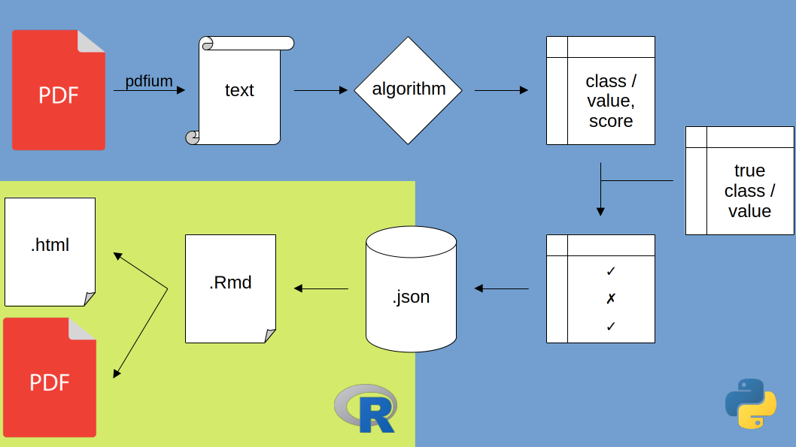

# Implementation {#implementation}

\ChapFrame[Implementation][bhtyellow]

This chapter describes the practical realization of the methods and workflows developed for automated page identification and information extraction in financial documents. It outlines the environment our experiments are conducted in, the software packages utilized, and the datasets created for benchmarking and evaluation.

It presents details of the ground truth creation process, including annotation strategies and dataset composition. The data processing workflow is illustrated, highlighting the system experimental setup on the Datexis Kubernetes cluster as wellas the local environment, used for evaluation and reporting.

By documenting the technical decisions and solutions adopted, this chapter provides a comprehensive overview of how the proposed methodology was translated into a functional system. We hope this will facilitate reproducibility and serve as a reference for future work. We especially want to recommend the use open-source scientific and technical publishing systems, like *R Markdown* and *Quarto*, to create documents that are directly linked to the data and code used for the analysis.

## Environments

The computations for this thesis are performed in two environments. Tasks that do not require a \acr{GPU} are run locally. You can find the specifications of the local device in the Appendix \@ref(local-machine). We run tasks that require a \acr{GPU} on the Datexis Kubernetes cluster.

We perform prototyping for most tasks on the cluster as well. Therefore, an interactive docker image with \acr{SSH} capabilities and Python has been created based on the \acr{vllm}
docker image. In rare cases a \acr{vllm} server is deployed on the cluster and queried from the local machine.

The experiments use the same images as the prototyping environment and connect to a persistent volume, where the scripts to run and data(bases) to use are located. It saves the results on the persistent volume, too. We fill 5 TB of persistent storage. Most of the space is used for caching the \acr{LLM}s safetensors.

We do backups of the folder holding the scripts and data to process and download the results via \acr{SSH} protocol. We use *git* for version control but do not synchronize the data from the persistent volume with GitHub. Within the local environment we use *git* as well. We synchronize all the data stored locally to a *GitHub* repository, except for the 10 GB of \acr{json} formatted raw results.

## Software Packages

::: paragraph-start
##### Python

We use \acr{vllm} and *chromadb* to set up our in-context learning pipeline. \acr{vllm} is a fast and easy to use framework to provide \acr{LLM}s locally or as service. *chromadb* is a vector database and key component of our \acr{RAG} architecture. It provides the \acr{LLM}s with examples that are most similar regarding their vector representations.
:::

For data wrangling we use *pandas*. We save our experiments results using the *json* library. We extract texts from \acr{PDF}s mainly with *pypdfium2* and use *sklearn* for building random forest classifiers.

::: paragraph-start
##### R

We use the *tidyverse* library for data wrangling and to create our visualizations with *ggplot*. We use *h2o* for building random forest models on the Datexis cluster and *shapviz* to interpret these models. *knitr* is used to create this thesis document.
:::

## Ground truth datasets

### Ground truth creation

This section describes the ground truth creation process in detail. It describes our initial annotation process and what improvements are made, based on later iterations and findings from the experiments.

::: paragraph-start
##### Page identification

We search for the target pages in the chosen documents either by using the search functionality, the \acr{TOC} or by scrolling through all pages. For each target page the filepath, page and type is listed in a \acr{csv} file. In some reports we find multiple pages for a single target type. In this case, all pages are added to the ground truth. Sometimes the **Aktiva** and **Passiva** table are on a single page. In this case a single entry is made and its type is noted as  *Aktiva&Passiva*. If a single table spans two pages, both pages are recorded. We created 252 entries, excluding all pages that need \acr{OCR} processing.
:::

For double checking, all identified pages are extracted from their original PDF files and combined in a single file. Thus, problems with the numbers shown in the PDF viewer and the actual page number in the file are identified and resolved. We inspect pages that are classified as target by multiple models in the first experiments. Thus, we identify additional target tables, that span two pages.

In an earlier created sample of pages, we identified all pages that contain a table of any type. This smaller sample is based on all pages that are classified as containing a table of type **Aktiva**, **Passiva** or **GuV** with the \acr{regex} approach. The true as well as the false positive classified ones. This ground truth is used to test the capabilities of various Python libraries, \acr{LLM}s and visual models to detect tables. Results can be found in the Appendix \@ref(table-detection-benchmark).

::: paragraph-start
##### Information extraction

We manually copy the numeric values from the annual reports into \acr{csv} files and replace the thousands separators and floating point delimiters. We multiply the values by 1_000, if a currency unit is given for the column the value comes from. The \acr{csv} files are already prefilled with all entities defined in the legal text, identified by their full hierarchy.
:::

There are cases, where a single line defined in the legal text is split up into multiple lines in the annual reports. In those cases, we write the corresponding sum into the most suitable row in the \acr{csv} file. If entities are found, that do not fit any entity given in the legal text, this entry is dropped. In the first iteration the \acr{csv} files are not prefilled with numeric values.

In the second iteration the \acr{csv} files already contain the predictions of Qwen3-235B. We check the values, highlight mistakes, correct wrong values and log all mistakes found. In this iteration, we also check the ground truth created in the first iteration and identify mistakes made earlier.

Additionally, we implement an algorithm to generate synthetic **Aktiva** tables with systematically varied characteristics to enable experiments that investigate those characteristics as possible predictors for the extraction performance. Additionally, this enables us to estimate an upper limit for the extraction performance with real **Aktiva** tables.

::: paragraph-start
##### Error rate guidiance

There is no separate ground truth for the calculated *confidence* scores. We will investigate, if the true and false predictions can be discriminated based on the returned *confidence scores*. If a prediction is true or false is determined using the previously described ground truth datasets.
:::

### Ground truth dataset composition

```{r count-benchmark-documents, echo=echo_flag, warning=warning_flag, message=message_flag, cache=TRUE, cache.extra = tools::md5sum(c("../benchmark_truth/aktiva_passiva_guv_table_pages_no_ocr.csv", "./scripts/page_identification_preparations.R"))}
source("./scripts/page_identification_preparations.R")

num_multiple_tables_per_document <- df_targets_no_ocr %>%
  anti_join(consecutive_pages, by = c("filepath", "page", "type")) %>% 
  arrange(filepath, page) %>%
  group_by(filepath, type) %>% 
  summarise(count = n()) %>% 
  filter(count > 1) %>%
  group_by(filepath) %>% 
  summarise(count = n()) %>% 
  nrow()

multiple_tables_per_type_and_document <- data_unnested %>%
  anti_join(consecutive_pages, by = c("filepath", "page", "type")) %>% 
  arrange(filepath, page) %>%
  group_by(filepath, type) %>% 
  summarise(count = n()) %>% 
  filter(count > 1) %>% 
  group_by(type) %>% 
  summarise("multiple targets in document" = n())

df_special_targets <- multiple_tables_per_type_and_document %>% left_join(consecutive_pages %>% group_by(type) %>% summarise("target two pages long" = n())) %>% mutate_if(is.numeric,coalesce,0)
```

This section describes the resulting ground truth datasets in detail separate for all our tasks. It shows how many documents from which companies are included and how the synthetic dataset is created.

::: paragraph-start
##### Page identification {#page-identification-dataset-description}

Figure \@ref(fig:document-base-page-identification) shows how many documents from which company are contained in the ground truth dataset. We use `r num_documents` annual reports from `r num_companies` companies. For this thesis, the tables of interest are those that show **Aktiva**, **Passiva** and **GuV**. Among the `r total_pages_no_ocr` pages `r num_tables` tables have to be identified on `r num_target_pages` pages. Figure \@ref(fig:document-base-page-identification) also gives an impression on how many pages the documents have. The documents of *IBB* tend to be longer. The documents of *Amt für Statistik Berlin-Brandenburg* tend to be shorter.
:::

```{r, eval = knitr::is_html_output(), echo=FALSE, warning=warning_flag, message=message_flag, results='asis', class.chunk='pre-detail'}
cat("<p>You can have a look at the ground truth data unfolding the following details element.</p>")
```

```{r ground-truth-tables-of-interest, eval = knitr::is_html_output(), echo=FALSE, warning=warning_flag, message=message_flag, class.chunk='hideme', results='asis'}
df_targets_no_ocr %>% render_table(
  caption = "Showing all pages of interest with the target table type and filepath.",
  ref = opts_current$get("label")
  )
```

```{r document-base-page-identification, echo=echo_flag, warning=warning_flag, message=message_flag, dev=std_dev, fig.cap="Showing the number of pages (bar height) and number of documents (number above the bar) per company for the data used for the page identification task. Some documents would require ocr before being processed and were not used."}
df_pages %>% group_by(company) %>% mutate(
  docs_per_company = n(), pages_per_company = sum(pages)
  ) %>% 
  ggplot() +
  geom_col(aes(x = company, y = pages, fill = needs_ocr), color = "#00000033") +
  geom_text(
    data = . %>% group_by(company) %>% slice_head(n = 1),
    aes(x = company, y = pages_per_company, label = docs_per_company, group = company),
    stat = "identity",
    vjust = -0.5,
    size = 3
  ) +
  scale_x_discrete(
    guide = guide_axis(angle = 45),
    labels = scales::label_wrap(30)
    )
```

Table \@ref(tab:display-multiple-tables-per-type-and-document) shows how many documents have multiple target tables per type and how many target tables span two pages. In total `r num_consecutive_pages` tables span two pages. In `r num_multiple_tables_per_document` documents there are multiple tables per type of interest. There are `r num_two_tables_on_one_page` pages containing both, an **Aktiva** and a **Passiva** table.

```{r display-multiple-tables-per-type-and-document, echo=FALSE, warning=warning_flag, message=message_flag, results='asis'}
df_special_targets %>% render_table(
  caption = "Showing the number of documents with multiple target tables per type and the number of target tables that span two pages.",
  ref = opts_current$get("label")
  )
```

```{r table-extraction-preps, echo=FALSE, warning=warning_flag, message=message_flag, cache=TRUE, cache.extra = tools::md5sum('data_storage/real_table_extraction_llm.rds')}
old_doc_base <- readRDS("data_storage/real_table_extraction_llm.rds") %>% select(filepath) %>% unique()
new_doc_base <- readRDS("data_storage/real_table_extraction_extended_llm.rds") %>% select(filepath) %>% unique() %>% mutate(filepath = str_replace(filepath, "a__f", "af")) %>% filter(!str_detect(filepath, "MEAB GmbH"))
```

::: paragraph-start
##### Information extraction {#information-extraction-data-sampling}

It takes us up to 12 minutes per table to copy over all values from the \acr{PDF} document into the \acr{csv} file. The maximum amount of values to copy and format (or type manually) among the tables used is 40. In addition to this manual process, a conceptional process can be necessary, because the values have to be matched with the strict grammar. Sometimes we have to decide that there is no suitable row for a value and drop it. Sometimes there are multiple values that have to get summed up in order to calculate a value that suits the predefined schema.
:::

This manual work is done for `r old_doc_base %>% nrow()` documents. We include a single **Aktiva** table from every company that reports teh balance sheet in the granularity matching our schema. We include additional documents *Amt für Statistik und Brandenburg* to check, if the in-context learning approach yields better performance, if examples from the same company the subject of extraction is from are used.

Later, the predictions of the \acr{LLM}s are used, to create additional `r (new_doc_base %>% nrow())-(old_doc_base %>% nrow())` ground truth tables. The old ground truth tables are checked in this iteration. We find an error rate of 2.4 %. Thus, the human reference score for percentage of correct predictions is 0.976. Figure \@ref(fig:table-extraction-doc-base) shows how many **Aktiva** tables are used for information extraction tasks, that use real data instead of synthetic data.

```{r table-extraction-doc-base, echo=echo_flag, warning=warning_flag, message=message_flag, out.width="100%", dev=std_dev, fig.cap="Showing the number of documents used for the table extraction task. The number of Aktiva tables is equal to the number documents.", fig.width=9}
new_doc_base %>% rowwise() %>% 
  mutate(
    .before = 1, 
    company = str_match(filepath, "/pvc/benchmark_truth/real_tables_extended/(.*)__")[2],
    initial_doc_base = str_remove(filepath, "_extended") %in% old_doc_base$filepath
    ) %>% ggplot() +
  geom_bar(aes(x = company, fill = initial_doc_base)) +
  scale_x_discrete(
    guide = guide_axis(angle = 60),
    labels = scales::label_wrap(30)
    ) +
  theme(
    axis.title.x = element_blank(),
    legend.position = "top",
    plot.margin = margin(l = 0)
  )
```

We create synthetic **Aktiva** tables to overcome the limited amount of real tables and to allow the systematic investigation of potential predictors for the information extraction performance, even if the occurrence of specific table characteristics is very unbalanced within the real dataset. A detailed description, which table features are varied systematically, can be found in the Appendix \@ref(synthetic-table-extraction). This systematic variation results in 16_504 tables created in three formats each.

## Data processing

This section describes the data flow for \acr{LLM} approaches. Figure \@ref(fig:data-flow-llm) visualizes the different processing steps. On the blue area the data flow of the benchmark is presented, starting with the \acr{PDF} of an annual report as input and ending with the \acr{json} formatted benchmark results as output. The green area shows how R is used to visualize the results for our analysis and interpretation. We use R Markdown to document the results in this thesis.

```{r data-flow-llm, fig.cap="Showing the processing steps from input data to the results in this thesis.", out.width="100%", echo=FALSE}

```

We start by extracting the text for each page from the annual reports, using PDF extraction libraries like *pdfium* and *pymupdf*. We do this once for each document and save all text extracts page-wise in a \acr{json} file. We record the original file path and corresponding pagenumber as meta data.

We embed the text extracts in the prompt template - either in the text section at the end or as an example in the blank section (see Figure \@ref(fig:prompt-setup-classification)). The prompt is then processed by the algorithm, predicting, if the text contains a specific type of information or not. The predictions are compared with the ground truth.

The results of this evaluation are saved as \acr{json}. We save the result for every individual evaluation, as well as calculated performance metrics and the runtime needed to process all texts as batch. This allows us to reevaluate or exclude specific results and recalculate the aggregated metrics later. All steps from the text extraction to the result saving are implemented in *Python*.

The process for the information extraction is similar. One difference is, that the algorithm makes multiple predictions per text. Thus, we do not save a single prediction and its evaluation result but a data frame with all predictions and all ground truth values. Saving the ground truth values in this data frame is not necessary but allows us a more convenient reevaluation.

## Evaluation and Reporting

We mostly use *R* for evaluation, visualization and reporting. We use the *bookdown* library[^04_implementation-1], to create a report, that is linked to our data and thus automatically includes new results and updates all figures and tables if the data changes. This allows us to run small additional experiments until the very end of thesis writing.

[^04_implementation-1]: For the next project we probably will use *Quarto* instead of *bookdown*. This is the new reporting framework of Posit, we became aware of too late.

Furthermore, this allows us to create a \acr{PDF} version and a \acr{HTML} version of the thesis at the same time with low additional effort. The HTML version can include interactive elements as paginated tables with search and sorting capabilities, image light boxes and image sliders. Thus, a lot of information can be offered without occupying too many pages with tables and figures. The \acr{HTML} version is more machine-readable as well.

## Speedup with vLLM and batching

We run our final experiments with the \acr{vllm} library on Python, using its batch processing capabilities. Our first test used the *transformers* library directly and did not use batch processing. The runtime reduction that is achieved with the final setup can be found in the Appendix \@ref(vllm-batch-speed).

## Hardware normalization {#gpu-benchmark}

To make the runtime of different \acr{LLM}s running on different amounts and types of \acr{GPU}s comparable, we conduct a benchmark running the models Qwen2.5-7B and Qwen2.5-32B with different hardware compositions on the Datexis cluster. Figure \@ref(fig:gpu-benchmark-plot) shows the runtime for classifying 100 pages with the multi-class approach, providing three random examples for the in-context learning prompting strategy.

The classification time with Qwen2.5-32B on \acr{GPU}s of type B200 is a little faster than running Qwen2.5-7B on the same amount of A100 \acr{GPU}s. We calculate normalized runtimes for our experiments, based on these runtime measures for small and larger \acr{LLM}s on different types and numbers of \acr{GPU}s. One minute of computation on a single B200 is comparable to 4:30 minutes of computation on a single A100.

```{r gpu-benchmark-plot, echo=echo_flag, warning=warning_flag, message=message_flag, dev=std_dev, fig.cap="Showing the runtime to classify 100 pages with the multi-class approach, providing three random examples for the in-context learning."}
df_gpu_benchmark <- read_csv("../benchmark_jobs/page_identification/gpu_benchmark/gpu_factors.csv")

df_gpu_benchmark %>% ggplot(aes(x = gpu_number, y = runtime_in_s, color = gpu_type)) + geom_line(aes(linetype = model_name)) + geom_point()
```

## Summary

This chapter documented our choices and steps taken for implementing an experimental setup to evaluate the foundation for an automated system for page identification in and information extraction from financial documents.

Overall, the implementation successfully translated the proposed methodology into a functional and adaptable system, laying the foundation for subsequent evaluation and practical application.

The next section presents the key results obtained from the experiments conducted using this implementation. It highlights the performance of different models and approaches for both page identification and information extraction tasks, providing insights into their effectiveness and potential areas for improvement.