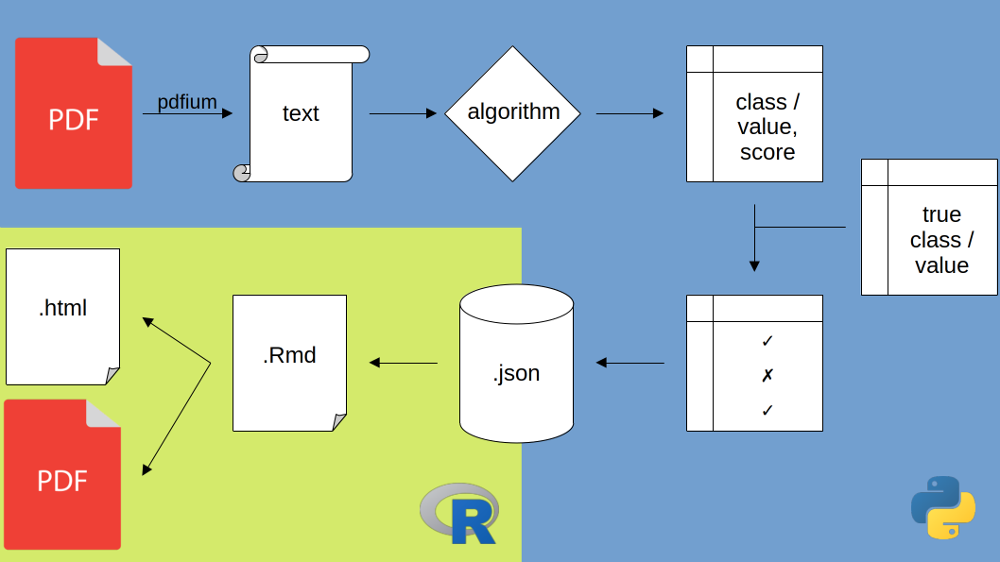

# Implementation (max 5p)

\ChapFrame

## Environments

The computations for this thesis are performed in two environments. Task that do not require a \acr{GPU} are run locally. You can find the specifications of the local device in section \@ref(local-machine). Other tasks are run on the Datexis Kubernetes cluster.

The prototyping for these tasks is performed on the cluster as well. Therefore, a interactive docker image with SSH capabilities and Python has been created based on the \acr{vllm} docker image. In rare cases a \acr{vllm} server is deployed on the cluster and queried from the local machine during prototyping.

The experiments run using the same images as the prototyping environment and connects to the persistent volume, where the scripts to run and data(bases) to use are located and saves the results on the persistent volume as well. We do backups of the folder holding the scripts and data to process and download the results via \acr{SSH} protocoll. We use *git* for version control but do not synchronize the data from the persistent volume with *GitHub*.

We used 5 TB persistent storage. Most of the space is used for caching the \acr{LLM} sefetensors.

Within the local environment we use *git* as well. Except for the gigabytes of result files everything is synchronized with *GitHub*.

Table : what task in what environment? Seems not super important

## Evaluation and Reporting

We mostly use *R* for evaluation, visualization and reporting. We use the *bookdown* library[^04_implementation-1], to create a report, that is linked to our data and thus automatically includes new results and updates all figures and tables. This allows us to run small additional experiments until the very end of thesis writing.

[^04_implementation-1]: For the next project we probably will start using *Quarto* instead of *bookdown*. This is the new reporting framework of Posit, we became aware of too late.

Furthermore, this allows us to create a \acr{PDF} version as well as a \acr{HTML} version of the thesis at the same time with low additional effort. The HTML version allows to use some helpful interactive elements as paginated tables with search and sorting capabilities, image light boxes and image sliders. Thus , a lot of information can be offered without occupying pages over pages with tables and figures. The \acr{HTML} version is more machine readable as well. Lacking machine readability is what makes the information extraction from PDFs mandatory in the first place and we want spare others these difficulties.

## Software Packages

Macht das Sinn, das hier aufzulisten? Wenn ja, wie detailliert? Vielleiche auf eine requirements Datei je Sprache verweisen?

-   Python

    -   pandas

    -   numpy

    -   scikit learn

    -   vLLM

-   R

    -   tidyverse

## Speedup with vLLM and batching

We run our final experiments with the \acr{vllm} library on Python, using its batch processing capabilities. Our first test used the *transformers* library directly and did not use batch processing. Section \@ref(vllm-batch-speed) shows the runtime reduction that is achieved with the final setup.

## Text extraction

We use *pdfium* for the text extraction for all tasks. Some approaches are run with the texts of other PDF extraction libraries as well.

Table : what task had additional extraction backends? Seems not super important

## Data processing

```{r, fig.cap="Showing the processing steps from input data to the results in this thesis.", out.width="100%", echo=FALSE}

```

We start by extracting the text for each page from the annual reports, using PDF extraction libraries like *pdfium*. We do this once for each document and save all text extracts in a \acr{json} file together with the original file path and pagenumber.

For \acr{LLM} approaches we embed the texts in the prompt template. The (merged) texts are then processed by the algorithm, predicting, if the text is including a specific type of information or not. The predictions are compared with ground truth.

The results of this check are saved as \acr{json}. We save the result for every individual check, as well as calculated performance metrics and the runtime needed to process all texts as batch. This allows us to reevaluate or exclude single results and recalculate the aggregated metrics later. All steps from the text extraction to the result saving are implemented in *Python*.

The process for the information extraction is similar. One difference is, that the algorithm makes multiple predictions per text. Thus, we save not a single prediction and evaluation but a data frame with all predictions and all ground truth values per text. Saving the ground truth values in this data frame is not necessary but allows us a more convenient reevaluation.

The (re)evaluation is done in *R* instead of *Python*, because we can seamlessly include it in our reporting engine.
