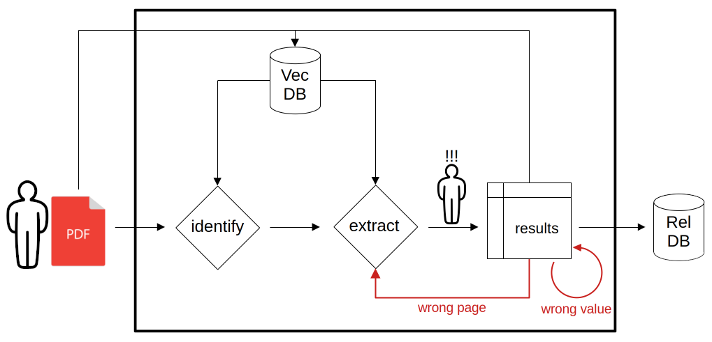

# Discussion {#discussion}

\ChapFrame[Discussion][bhtgray]

## Page identification

-   predictor: n_big_tables (tf or llm relevant?)
-   Why it is important to have a good recall (or top n accuracy)

### General performance {#general-performance-page-identification}

::: paragraph-start
##### Results

The page identification task is solved with higher F1 scores for every target class than the human reference F1 score. It is solved completely on the created dataset for predicting the class **Aktiva**. In two cases the multi-class classification wit Llama 4 Scout is best. For classifying **GuV** the binary classification with Ministral is even better.
:::

::: paragraph-start
##### Interpretations

To get the best results, a combination of two \acr{LLM}s would be necessary. A more general approach is using Llama 4 Scout for multi-class classification. If there is little VRAM Ministral-8B also does a decent job in multi-class classifiacation.
:::

::: paragraph-start
##### Compare with previous work

We are able to narrow down the page range to five pages without using a \acr{LLM}. With the \acr{LLM} we are guaranteed, to find the correct pages within a range of two pages. Most of the time the first page in the \acr{LLM} ranking is the correct one. @liExtractingFinancialData2023 do not present a concrete number of pages, they have to process after page refinement. The \acr{TOC} does not work as well as expected from their report.
:::

::: paragraph-start
##### Implications

Introducing new areas of application should be easily possible and manageable even from a regular user. For the term frequency approach we can set up a pipeline, where the user just has to enter a list of keywords and then he gets presented a page ranking, based on \acr{TF-IDF} values. The user might adjust the key word list or select correct pages to build a ground truth. If there are more measures of interest (e.g. a float frequency as well) we can automatically train a random forest classifier as well.
:::

Another approach is, that the user provides documents and a list on which page the information of interest is located. This can be the base for a retrieval augmented few-shot classifier, that will improve in the process of classifying more pages.

::: paragraph-start
##### Limitations

The term frequency and \acr{LLM} classification might perform worse, if the information searched for, is just making up a small part of the pages content. If the information is placed in a table, we can use a visual table detection model, to identify all tables. Section \@ref(yolo) shows that this is a promising approach. Then we can use the retrieval augmented few-shot approach to identify, which table is the correct one.
:::

If the information is not even in a table, but part of a regular sentence, it might get difficult to find the correct page with this approach. Maybe the \acr{TOC} approach could be used for page range refinement in this case.

::: paragraph-start
##### Unexpected results

-   Ministral is performing unexpected well. Is performs better, than other Mistral models, that are newer and have more parameters.
-   \acr{TOC} approach performs not as well as expected by @liExtractingFinancialData2023 results.
:::

::: paragraph-start
##### Recommendations

We recommend, if possible, to refine the page range, using a term frequency approach. Afterwards a \acr{LLM} can be used to perform a multi-class classification those pages. Use the page with the highest score for the information extraction. Keep the ranking.
:::

Do not include a obligatory step, to confirm the selected page, but start the information extraction right away. When the user is checking the results, a wrong page will be noticed immedeatly. Then other pages can be inspected manually, following the order in the ranking.

Save the examples already classified in a vector database and use those in future tasks. Include documents from the same company. Build the database document by document in the beginning, before starting with batch wise processing.

##### Possible improvement

::: paragraph-start
###### Term frequency approach

Inspecting some of the pages that are ranked high and classified as **Aktiva** by the term frequency based random forest, we find, that the normalized sum of term occurrences, can lead to missclassification. For example, we find a page identified as **Aktiva**, that contains no single table but a long text. The term counts based on the **Aktiva** term list can be found in section \@ref(tf-missclassifications). The term 'Geschäfts' is present 19 times. The term 'Unternehmen' is present 10 times.
:::

Those terms are probably present very often all over the document. Thus, they should get less weight. Additionally it might be better to count, how many of the terms are present in a boolean manner, instead of counting them. Or a measure like the \acr{TF-IDF} could be implemented.

We also find pages that are missclassified, because they have a high density of floats. Figure \@ref(fig:tf-many-floats) shows an example.

Instead of using the normalized sum of term frequencies, sum of boolean indicators or the sum of \acr{TF-IDF} one could also use each single indicator as a feature for random forest.

::: paragraph-start
###### Table of contents understanding approach

@liExtractingFinancialData2023 use a few-shot learning strategy with the \acr{TOC} approach. We implemented only a zero-shot strategy. With more expertise for and verbosity in the prompt building, this approach probably could perform better as reported here.
:::

::: paragraph-start
##### Conclusion
:::

### Energy usage and runtime

The fastest and least energy consuming strategy, using only \acr{LLM}s, is to use a small model as Ministral-8B-Instruct for the multi-class approach. This is more effective than running three binary classifications.

An alternative approach could be to binary predict if the page is of any target type and then perform a classification, which type exactly the page is of. But this would probably consume as much energy as the multi-class approach, because we have to provide a balanced amount of examples for each class. The results of the multi-class strategy are good enough to run it right away.

In both strategies the k required for perfect recall is three, using the Ministral-8B-Instruct model[^06_discussion-1].

[^06_discussion-1]: Potentially smaller fine tuned models can solve the task even more efficient.

Nevertheless, it is more promising, to reduce the number of pages, to classify with the \acr{LLM} in the first place. This can be achieved, by running the term-frequency approach first to refine the page range, and then use the \acr{LLM} approach.

::: paragraph-start
###### Compare with manual page identification

The manual approach is the slowest. We identified the pages of interest for all target classes in ten random documents for the benchmark. We used the \acr{TOC} and the search function to find key words like **Aktiva** or **Bilanz**. Anyhow, its almost as fast as the multi-classification using Llama 4 Scout, while consuming eight times less energy. Comparing it to Ministral-8B-Instruct it take three times longer but consumes less then half of the energy.
:::

Not taken into account fo this comparison are factors as:

-   costs to buy and maintain hardware (i.e. a GPU cluster).

-   higher costs per runtime if the \acr{LLM} compute is purchased from cloud providers. CLOUD: price if LLM is in the cloud \<-- print tokens used

    -   four classes (3 random examples): 11 k tokens

    -   binary (3 random examples): 6.5 k tokens

-   payment and insurance to pay for a human (e.g . student coworker).

-   the training time and energy consumption for training either

    -   a \acr{LLM} (probably done by the \acr{LLM} provider).

    -   a human (growing up, getting educated).

-   the energy consumed with the food humans eat.

## Information extraction

### General performance

::: paragraph-start
##### Results

The best performing model - Qwen3-235B-A22B-Instruct - almost reaches human performance on real **Aktiva** tables, but is much faster. Both measures, percentage of correct numeric predictions (98.0 %) and F1 score (98.1 %) are not perfect yet and could be improved. It achieves perfect results on synthetic tables provided in \acr{HTML} format.
:::

::: paragraph-start
##### Interpretations

The strong performance observed means, that Qwen3-235B is performing numeric transformations, respecting the currency units, in many cases. Otherwise the upper limit for correct numeric extraction would be 80.8 %, since 19.2 % of all numeric values have *T€* as unit.
:::

Furthermore, we can see that it is possible to achieve perfect output, if the input is perfect structured and without unknown row identifiers. Perfect in, perfect out. Thus, we show that there is no \acr{LLM} approach inherent mechanism, that prevents perfect information extraction of numeric values.

The 0.1 % incorrect predictions on synthetic tables from the PDF documents could be caused by faulty text extracts by *pdfium*. But the Markdown input is without any flaws and resulted in 0.1 % errors as well.

investigate F1 score

::: paragraph-start
##### Compare with previous work

@liExtractingFinancialData2023 achieve a perfect extraction result, after refining their approach, extracting a total of 152 data points from 8 ACFRs reports. Before the prompt adjustments they find 96.1 % correct extracted datapoints.

They included an instruction how to handle missing values but do not report any remarkably higher error rates with missing values.

(probably homogeneous) fuzzy matching instruction 3 values per go, instructions for currency units

98.9 % on ESG reports after refinement, 90 values from 15 documents; heterogeneou (multiple ccompanies)? started at 93.3 % misjudging units between grams, kilograms, and tonnes introduced additional fields to the data points and had LLM extract the units as separate output fields

small in sample extractions =\> 4000 county year ACFRs: 96 % (80_000 data points)
:::

::: paragraph-start
##### Implications

We have not investigated yet, if the 2 % wrong extracted numeric values are caused by not respecting currency units, or if there is another reason. A potential reason may be numeric values, that get stiched together during text extraction.
:::

-   invest more into table extraction?

Checked other extraction libraries as well. Including Azure Document Intelligence and Docling, but results not better. In Markdown they get worse.

```{r}
df_qwen235 <-  readRDS("data_storage/table_extraction_qwen3_235B_multiple_input_formats")

table_characteristics <- read.csv("../benchmark_truth/real_tables_extended/table_characteristics_more_examples.csv") %>% 
  mutate(
    filepath = paste0("/pvc/benchmark_truth/real_tables_extended/", company, "__", filename)
  ) %>% as_tibble()

df_qwen235 <- df_qwen235 %>% left_join(table_characteristics)

df_qwen235 %>% group_by(model, method, extractor, input_format) %>% 
  summarize(mean_total = mean(percentage_correct_total)) %>% 
  group_by(model, extractor, input_format) %>% 
  slice_max(n = 1, mean_total, with_ties = FALSE) %>% 
  render_table()
```


Checking the extracted values takes up to three minutes. This totals in 300 minutes prediction checking. Thus, selecting a smaller model that is finishing after 2:30 minutes is not speeding up the process a lot. Once we get a sufficient good performance with the big models the prediction checking can be dropped. This would bring th real benefit.

::: paragraph-start
##### Limitations

-   add schemas for different hierarchies
-   test guided decoding instead of restricted (open a new list for unmatched entries?)
:::

::: paragraph-start
##### Unexpected results

-   converts currency units without being prompted explicitly
:::

::: paragraph-start
##### Recommendations

-   invest in supply of machine-readable information and good user experience, instead of 100 % perfect extraction

-   building a document extraction database document by document can improve performance taking advantage of same-company rag in-context learning
:::

::: paragraph-start
##### Possible improvement

The extraction performance may get higher, if the in-context learning examples show how to deal with columns that have a currency unit.

-   explicitly instruct, how to handle currency units

-   extend schema or sum rows

-   handle non matched rows explicitly
:::

::: paragraph-start
##### Conclusion
:::

-   check if missing value in one col (hand full of those cases) is resulting in hallucinations
-   confusion matrix

### Company specific results

Figure \@ref(fig:extraction-qwen235-by-company) shows, the precision and recall values for predicting a missing value and the percentage of correct numeric predictions for Qwen3-235B for each company. The number after the company name, as well as the color of the boxes indicate, how many of the numeric columns have *T€* as currency unit. The crosses indicate the individual scores per document. The teal crosses represent predictions, if examples from the same company are used for the *top n rag* prompting strategy. Red ones represent predictions, where this is not the case.

```{r extraction-qwen235-by-company, echo=echo_flag, warning=warning_flag, message=message_flag, out.width="100%", dev=std_dev, fig.cap="Comparing the F1 score for predicting the missingness of a value for OpenAi's LLMs with some Qwen 3 models. The green crosses indicate results where a model has predicted only numeric values even though there have been missing values.", fig.width=8, fig.height=10}
# df_real_table_extraction %>% filter(!str_detect(model, "oss")) %>% 
#   filter(n_examples == 3) %>% 
#   mutate(.before = 1, company = map_chr(filepath, ~str_split(str_split(., "/")[[1]][5], "__")[[1]][1])) %>% 
#   group_by(company) %>% 
#   ggplot() +
#   geom_boxplot(aes(x = company, y = percentage_correct_numeric)) + 
#   # geom_jitter(aes(x = company, y = percentage_correct_numeric), alpha= .5) +
#   scale_x_discrete(guide = guide_axis(angle = 30)) + 
#   facet_grid(model_family ~ .)

df_real_table_extraction_best_by_company <- df_real_table_extraction %>% 
  filter(str_detect(model, "235B")) %>% 
  filter(n_examples == 5, method_family == "top_n_rag_examples") %>% 
  # group_by(company) %>% 
  pivot_longer(cols = c(NA_precision, percentage_correct_numeric, NA_recall))

df_real_table_extraction_best_by_company %>% ggplot() +
  geom_boxplot(
    aes(y = paste(company, n_T_EUR), x = value, fill = ordered(n_T_EUR)),
    alpha= .7
    ) + 
  geom_jitter(
    aes(y = paste(company, n_T_EUR), x = value, color = same_company), 
    shape = 4
    ) +
  scale_y_discrete(label = scales::label_wrap(32)) + 
  theme(
    legend.position = "bottom"
  ) +
  ylab("") +
  labs(
    title = df_real_table_extraction_best_by_company$model[[1]],
    subtitle = df_real_table_extraction_best_by_company$method[[1]]
    ) +
  facet_nested(.~name)
```

One can see, that Qwen3-235B yields perfect predictions for the majority of the companies. This is especially true, if only the teal crosses are considerd. The predictions improve for most companies, if examples from the same company are used for the few-shot learning. It is especially helpful for handling the single numeric column with *T€* for *Deutsche Klassenlotterie*. It is also helping with the two columns with *T€* for *Gewobag*, even though the other examples have not *T€* present.

It seems a little harmful for *WBM GmbH* and can not solve the problems for numeric prediction for *Helmholtz Zentrum GmbH* and *Berliner Stadtgüter*. It improved the precision for *Rundfunk Berlin-Brandenburg* and the recall of *Stadt und Land GmbH* and *Partner für Deutschland*.

Table \@ref(tab:information-extraction-compare-same-company-examples-qwen235) shows the performance of Qwen3-235B for the *top n rag* and *n random* example strategies and distinguishes based on the fact, if examples from the same company can be used for in-context learning. The achieved percentage of correct predictions total is highest, if examples form the same company are used. It is even higher than the human reference score.

If using examples form the same company is not allowed, it seems better to use random examples. This is probably the case, because this comes with a higher heterogeneity. High homogeneity among the learning examples from other companies might demonstrate patterns, that are not correct for the company the target document comes from. The pattern, that the same company in-context learning yields best results is true for all models. The order of the results with random examples or examples from other companies varies among the models.

```{r information-extraction-compare-same-company-examples-qwen235, echo=echo_flag, warning=warning_flag, message=message_flag, results='asis'}
table_same_company <- df_real_table_extraction %>% 
  filter(str_detect(model, "235B")) %>% 
  # filter(n_examples == 5, method_family == "top_n_rag_examples") %>%
  group_by(model, method, same_company) %>% 
  reframe(
    mean_numeric = mean(percentage_correct_numeric, na.rm = TRUE),
    mean_F1 = mean(NA_F1, na.rm = TRUE),
    mean_total = mean(percentage_correct_total, na.rm = TRUE)
    ) %>%
  group_by(same_company) %>% slice_max(n = 1, mean_numeric, with_ties = FALSE) %>% 
  # select(model, method, mean_numeric, mean_F1, mean_total) %>% 
  ungroup() %>% 
  mutate_if(
    is.numeric, 
    ~ifelse(
      . == max(., na.rm = TRUE),
      paste0("**", format_floats(., 3), "**"),
      format_floats(., 3)
    )
  ) %>% setNames(colnames(.) %>% str_replace("_", " ")) %>% 
  render_table(
    alignment = "lllrrr",
    caption = "Comparing the performance of Qwen3-235B for the best approaches depending on the circumstance if examples from the same company can be used for learning.",
    ref = opts_current$get("label"),
    dom = "t"
  )
if(knitr::is_latex_output()) {
  table_same_company <- table_same_company %>%
    column_spec(4:6, width = "1.5cm") %>% 
    column_spec(1, width = "3.2cm")
}
table_same_company
```

In general the approach seems not be prone to hallucinations. When we accidentally tried to extract values from a **Passiva** and **GuV** table, no prediction was made, because non of the row identifiers matches our strict schema.

We have not specifically investigated, if an annual report of the following or previous year is more helpful than years further away. This would be plausible, because it serves the correct numeric and missing values for half of the information extract perfectly formatted as \acr{json}. Theoretically it should become trivial to extract all values correct and transform it accordingly to the currency units, if the previous and following years annual reports are presented as examples for the in-context learning. This should be investigated in future work.

predictions for barrierefreie documents of WBM empty

An odd text marking order in a PDF by dragging the mouse is no indicator for a bad text extract.

```{r, echo=FALSE}
# df_real_table_extraction %>% 
#   # filter(str_detect(model, "235B")) %>% 
#   # filter(n_examples == 5, method_family == "top_n_rag_examples") %>%
#   group_by(model_family, model, method, same_company) %>% 
#   reframe(
#     mean_numeric = mean(percentage_correct_numeric, na.rm = TRUE),
#     mean_F1 = mean(NA_F1, na.rm = TRUE),
#     mean_total = mean(percentage_correct_total, na.rm = TRUE)
#     ) %>%
#   group_by(same_company, model) %>% slice_max(n = 1, mean_numeric, with_ties = FALSE) %>% 
#   # select(model, method, mean_numeric, mean_F1, mean_total) %>% 
#   group_by(model) %>% 
#   # mutate_if(
#   #   is.numeric, 
#   #   ~ifelse(
#   #     . == max(., na.rm = TRUE),
#   #     paste0("**", format_floats(., 3), "**"),
#   #     format_floats(., 3)
#   #   )
#   # ) %>% 
#   ggplot() +
#   geom_col(aes(x = model, fill = same_company, y = mean_total), position = position_dodge2()) +
#   scale_x_discrete(guide = guide_axis(angle = 45))
```

### Error analysis

-   check for halluzination vs wrong placed / repeated numbers

-   new lines / splitted lines

-   test synthetic hypothesis with pymupdf extract

-   2.4 % wrong gold standard creation

-   errors from wrong formatted numbers

-   errors from wrong / unclear entity mapping

#### Ground truth creation

During the second pass of the ground truth creation we find, that 2.4 % of the values differ among the previously created gold standard and the results of the second pass. In the first pass the values are copied manually, while the results of the second pass are \acr{LLM}s predictions, that we double checked. We find 75 values differing in the 24 documents that are part of both data collections. Table \@ref(tab:error-analysis-gold-standard-extraction) shows the nature of errors and their counts. Most errors are distributed in the *omission* classes.

Errors of this type result from an inconsistent coding process. In one pass a value might have been included, while it is not included in the other pass. Or the value is matched to different row identifiers during the two passes. To resolve this kind of errors a strict and detailed coding manual is necessary. Additionally, the coding should be done from experts of the field instead of the data scientist.

```{r error-analysis-gold-standard-extraction, echo=echo_flag, warning=warning_flag, message=message_flag, results='asis'}
tribble(
  ~error_type, ~count,
  "ommited in first pass", 29,
  "ommited in second pass", 20,
  "multiple differences", 13,
  "missing digit", 10,
  "swapped digits", 2,
  "comma instead of dot", 1,
) %>% render_table(
  alignment = "lr",
  caption = "Showing the nature of errors and their counts. Errors with multiple difference have Levenshtein distance greater one.",
  ref = opts_current$get("label"),
  dom = "t"
)
```

Inspecting the predictions of the first experiments for the classification task, yielded interesting information, tool. Qwen 2.5 consistently classified some pages right after of the listed **GuV** pages to be of type **GuV** as well. And it was correct. For the company *IBB* the **GuV** spreads over two pages. This led to an adjustment of the ground truth, including all pages of tables, that span multiple pages.

#### Regular expression approach {#regex-synth-backend-discussion}

```{r table-extraction-regex-data-loading-discussion, echo=FALSE, warning=warning_flag, message=message_flag, cache=TRUE, cache.extra = tools::md5sum('data_storage/table_extraction_regex.rds')}
df_table_extraction_regex <- readRDS("data_storage/table_extraction_regex.rds") %>% 
  filter(table_type != "real_tables") %>% mutate(
    table_type = str_remove(table_type, "_extended")
  )
```

We find, that the regular expression approaches performance on the synthetic dataset is highly influenced by the extraction library used. For the real data we find no difference. Figure \@ref(fig:table-extraction-regex-performance) B shows, that the \acr{regex} approach on text extracted with *pdfium* especially has a wider precision range. The number of wrong extracted numeric values is a little as well.

A reason for this might be incorrect extracted texts. We find, that there are issues with missing (or additional) white space, misplaced line breaks and an extraction of the text column first, followed by the numeric columns. You can find examples for those types of incorrect extracted texts by three different PDF extraction libraries in section \@ref(regex-extraction-mistakes). One of the examples is found with the real table dataset, while two are found with the synthetic tables.

The random white space and line breaks could be handles by adjusting the regular expression for the label matching. Missing white space between numeric values could also be handled by adjusting the \acr{regex}. The misplaced columns would need more advanced reprocessing strategies. But all those error ypes shouel influence the recall and not the precision.

A possible explanation for a small spread in precision with both PDF extraction backends could be the duplicated row identifier *Geleistete Anzahlungen*. Our simple approach matches this row always with the first occurrence. This means, if the second occurrence is given in the ground truth, but not the first one, our approach would create a false positive result. The percentage of false positive example is then determining the precision value and is linked to the number of total rows in the ground truth. But we do not see sucha pattern for the *pymupdf* results at all.

A reason for wrong numeric values are rows, where the summed value is given in the next column, but same row, as the individual values. In this case the approach selects one individual value and a sum, instead of two individual values.

-   synthetic tables have been generated with cell lines because this should have improved the performance of a table extraction approach (not conducted)- maybe this is confusing pdfium? Or the zoom level?

## Error rate guidance

::: paragraph-start
##### Results

Confidence score can be used to determine empirical error rate for confidence intervals. For well performing models we find most predictions in the highest confidence interval.

Ministral shows good spread over confidence range for page identification task. We can find confidence intervals with zero error rate for the page identification task and the information instruction task on synthetic data.

We do not find confidence intervals with a error rate below 1 % for real **Aktiva** tables. Explicitly instructing to respect currency units, reduces errors.
:::

::: paragraph-start
##### Interpretations

Confidence score can be used to guide attention for page identification task, but hardly for information extraction task.
:::

::: paragraph-start
##### Compare with previous work
:::

::: paragraph-start
##### Implications

Additional segementation could be necessary, to find values that are predicted well enough.

confidence intervals based on company (know which formats are tricky)
:::

::: paragraph-start
##### Limitations
:::

::: paragraph-start
##### Unexpected results

Most models predict high confidence, even for wrong predictions.
:::

::: paragraph-start
##### Recommendations

0 % empirical error rate unstable. Chose cutoff or show error rate continuously?
:::

::: paragraph-start
##### Possible improvement

Testing normalized confidence.
:::

::: paragraph-start
##### Conclusion
:::

Discussion:

An additional feature to narrow down the selection and get a more concrete error rate scores for similar texts could be the the company.

Check perfect text?

Learning benefit of real examples higher for numeric value extraction as for lable matching.

works only well for page identification, where it is not really needed (perfect results, low checks, implicit found in extraction window)

additional segmentation might help

HTML might help =\> document parsing and table extraction

## Feature effect analysis

### General performance

::: paragraph-start
##### Results
:::

::: paragraph-start
##### Interpretations
:::

::: paragraph-start
##### Compare with previous work
:::

::: paragraph-start
##### Implications
:::

::: paragraph-start
##### Limitations
:::

::: paragraph-start
##### Unexpected results
:::

::: paragraph-start
##### Recommendations
:::

::: paragraph-start
##### Possible improvement
:::

::: paragraph-start
##### Conclusion
:::

## Summary

## Limitations

### Context rot

We reported the worsening performance of Llama 4 Maverick, when it gets to many examples presented in both main tasks. Since we used the FP8 version, we tested if this is a problem of to low precision in the calculation. But we find the same behavior with the FP16 version. It is the only model we detect the issue of *context rot* for.

*Context rot* is a term introduces in [@kellyhongContextRotHow2025] technical report. The investigated an advanced *Needle in the Haystack* problem, including distractors and requiring the \acr{LLM}s to find semantic similarity instead of exact term matching. They find that the accuracy often starts to decrease with 10 k input tokens and more.

Meta claims that Llama 4 Maverick has a context length 1 M (Llama 4 Scout even 10 M), where other models often ar limited to 128 k or 32 k or less. We limited our input token length to 32 k in most cases and reached this limit multiple times. We find it remarkable, that Llama 4 Maverick already shows *context rot* at inputs of length 10 k - 100 times shorter than their context window.

@levySameTaskMore2024 show a notable degradation in LLMs' reasoning performance at much shorter input lengths than their technical maximum. They also show, that Mistral achieves the highest accuracy, when the relevant information is at the end of the prompt. We are not sure, how to relate these findings, since we do not include irrelevant information.

#### Page identification

Figure \@ref(fig:bar-plot-maverick-binary) shows the amount of correct (matching) and incorrect classifications by Llama 4 Maverick for the binary classification tasks ordered by target type and method. One can see, that the *n_rag_example* strategy starts predicting the target class too often with increased number of examples. This behavior is not observed for the *n_random_examples* strategy.

```{r bar-plot-maverick-binary, echo=echo_flag, warning=warning_flag, message=message_flag, out.width="100%", dev=std_dev, fig.cap="Comparing the amount of correct classifications by Llama 4 Maverick for the binary classification tasks ordered by target type and method. With increased number of examples the n-rag-example strategy starts predicting the target class too often."}
df_rot_binary <- df_binary %>% 
  filter(
    str_detect(model, "Mav"), 
    method_family %in% c("n_rag_examples", "n_random_examples")
    ) %>% 
  select(-filepath) %>% 
  unnest(predictions)

df_rot_binary %>% 
  ggplot() +
  geom_bar(aes(x = if_else(predicted_type == "no", "other", "target"), fill = match)) +
  facet_nested(classification_type~method_family+n_examples) +
  xlab("predicted type")
```

Figure \@ref(fig:confusion-matrix-maverick-multi-class) is showing the confusion matrices for the multi-class classification with Llama 4 Maverick grouped by *method_family* and *n_examples*. Teal bordered tiles are correct predictions and red bordered tiles represent wrong predictions. The number is showing the percentage of classifications by the \acr{LLM} of a certain type (*predicted_type*) based on the true count of observations with that type (*type*). They sum up to one column-wise.

We can see, that the *n_rag_example* strategy starts to predict **GuV** too often, when presented with two or more examples. We observe the same for the *n_random_examples* strategy starting from three provided examples. The \acr{LLM} is not just over-predicting **GuV**, but also other target classes. The over-prediction rate for *other* is lowest. Those pages often have no page filling table and thus are more different from the target classes and easier to distinguish (for a human).

```{r confusion-matrix-maverick-multi-class, echo=echo_flag, warning=warning_flag, message=message_flag, out.width="100%", dev=std_dev, fig.cap="Showing the confusion matrices for the multi-class classification with Llama 4 Maverick grouped by method-family and n-examples.", fig.width=9}
df_rot_multi <- df_multi %>% 
  filter(
    str_detect(model, "Mav"), 
    method_family %in% c("n_rag_examples", "n_random_examples")
  ) %>% 
  select(-filepath) %>% 
  unnest(predictions)

df_rot_multi %>% 
  group_by(type, method_family, n_examples) %>%
  mutate(
    count_total = n()
  ) %>% 
  group_by(type, predicted_type, method_family, n_examples) %>% 
  mutate(
    count = n(),
    percentage_correct = count/count_total
  ) %>% 
  ggplot() +
  geom_tile(
    aes(x = type, y = predicted_type, fill = percentage_correct, color = match),
    size = 1, height = 0.81, width = 0.9
    ) + 
  facet_nested(method_family~n_examples) +
  scale_x_discrete(guide = guide_axis(angle = 30)) +
  geom_text(
    data = . %>% select(type, method_family, n_examples, percentage_correct) %>% unique(),
    aes(label = round(percentage_correct, 2), y = predicted_type, x = type), color = "white"
  ) +
  theme(
    legend.position = "bottom"
  )
```

A possible explanation fro over-predicting **GuV** most might be, that the examples for **GuV** are presented first, because we just iterate over the *phrase_dict* dictionary (see code below). @liuLostMiddleHow2023 describe a behavior of \acr{LLM}s, that they are better with identifying relevant information, when it is placed in the beginning or end of the context. Since all examples are provided in the same manner, examples for classes other than the target class, could be interpreted as distractors with a high similarity. @kellyhongContextRotHow2025 shows, that in the presence of similar \acr{LLM}s' performance can degrade quickly. They do not present results, if the position of the picked distractor is important. Thus, we formulate the hypotheses for future investigation:

1.  \acr{LLM}s tend to choose distractors at the beginning or end of the prompt.

2.  \acr{LLM}s tend to choose distractors that apprear first or last.

3.  There is an interaction effect, with the position, where the task itself is specified.

```{python example-order, eval=FALSE, echo=TRUE}
phrase_dict = {
  "GuV": "a 'Gewinn- und Verlustrechnung' (profit and loss statement) table",
  "Aktiva": "a 'Aktiva' (assets) table",
  "Passiva": "a 'Passiva' (liabilities) table",
  'other': "a text that does not suit the categories of interest",
}
```

#### Information extraction

Figure \@ref(fig:confusion-matrix-maverick-extraction) shows the confusion matrix for the information extraction task with Llama 4 Maverick and five examples. It shows, that the \acr{LLM} starts to predict numeric values for every row instead of prediction *null* if a row is missing. Figure \@ref(fig:numeric-predictions-maverick-extraction) shows, what kind of numeric values are predicted. We find two peaks for predicting floating point numbers close to zero or close to 30, while the true values (and values from the examples provided) are in a range of 1_000 and 10_000_000. Thus, we assume the values are hallucinated and not wrongly picked from the examples provided.

Local and global context window / attention [@khowajaAnalysisLlama4s2025]. Trained on 256 k tokens with FP8 precision.

```{r confusion-matrix-maverick-extraction, echo=echo_flag, warning=warning_flag, message=message_flag, out.width="80%", dev=std_dev, fig.cap="Showing the confusion matrix for the information extraction task with Llama 4 Maverick and five in-context learning examples.", fig.height=3, fig.align='center'}
df_rot <- df_real_table_extraction %>% 
  filter(str_detect(model, "Mav"), n_examples == 5) %>% 
  unnest(predictions)

df_rot %>% 
  pivot_longer(NA_true_positive:NA_true_negative) %>% 
  group_by(name) %>% 
  reframe(
    mean = mean(value),
    median = median(value)
    ) %>% 
  mutate(
    predicted = !str_detect(name, "negative"),
    truth = !(name %in% c("NA_true_negative", "NA_false_positive")),
    upper_bond = ordered(ceiling(mean)),
    median = ordered(median)
  ) %>% 
  ggplot() +
  geom_tile(
    aes(y = truth, x = predicted, fill = mean, color = median),
    size=2, height = 0.98, width = 0.98
    ) +
  geom_text(
    data = . %>% select(name, truth, predicted) %>% unique(),
    aes(label = name, y = truth, x = predicted), color = "white"
  )
```

```{r numeric-predictions-maverick-extraction, echo=echo_flag, warning=warning_flag, message=message_flag, out.width="80%", dev=std_dev, fig.cap="Comparing the predicted numeric values with the true value distribution for the information extraction task with Llama 4 Maverick and five in-context learning examples. The dotted line is marking the value 30 EUR.", fig.align='center'}
ticks <- seq(2,8,2)
ooms <- 10^seq(0, 10)
minor_breaks <- as.vector(ticks %o% ooms)

ticks <- 1
ooms <- 10^seq(0, 10)
breaks <- as.vector(ticks %o% ooms)

df_rot %>% 
  pivot_longer(year_truth:previous_year_result) %>% 
  mutate(
    year = str_extract(name, ".*year"),
    type = str_extract(name, "truth|result"),
  ) %>% 
  ggplot() +
  # geom_violin(aes(x = name, y = log(value, 10))) +
  geom_hline(yintercept = 30, linetype = "dotted") +
  geom_violin(aes(x = type, y = value, fill = type)) +
  # coord_cartesian(ylim = c(0, 10)) +
  scale_fill_discrete(guide="none") +
  ylab("EUR") +
  xlab("value status") +
  facet_nested(~year) +
  scale_y_log10(breaks = breaks, minor_breaks=minor_breaks)

```

## Not covered

In this section we briefly mention the topics we have not covered in this thesis.

::: paragraph-start
##### Table extraction and document parsing

There are classical libraries and recent machine learning models, that are specialised on extracting tables from documents. We tested *tabula* as a classical solution, but were not satisfied by its results. Without borders in the tables it rarely identified rows and columns correct.
:::

We did not manage to implement recent models for this task, for example visual \acr{LLM}s. There are promising results for their performance on table extraction, but a easy to use version for *transformers* or *vLLM* is missing most of the time. We were surprised and glad to see, that our approach works well with the basic text extract and did not continue to pursue the attemt to use more sophisticate extraction tolls or models.

::: paragraph-start
##### Optical character recognition

If documents have no textual information, because they are just a collection of (scanned) images, \acr{OCR} is a necessary step in data preparation, because all our approaches use the text extract. In the \acr{OCR} process the textual information of the image is converted into machine-readable text. \acr{OCR} systems often perform a document layout analysis too, in order to handle multi-column layouts and tables.
:::

::: paragraph-start
##### Fine-tuning

\acr{LLM}s can be fine tuned on specific tasks. For example, they can be trained to produce text of a specific style or on classification tasks. For classification tasks a softmax pooling layer is added. Another example is the object detection model Yolo 12 we are using. It is fine tuned on detecting tables.
:::

We do not perform fine tuning with \acr{LLM}s. Instead we are using in-context learning and test, if this yields sufficient results. It would be interesting to estimate, how many in-context prompts have to be queried, so that the energy consumption for the additional token processing is becoming greater than the energy consumption of a fine tuning.

::: paragraph-start
##### Training an encoder model

Instead of fine tuning a \acr{LLM} it probably would be more efficient to train a smaller (encoder-only) model, e.g. \acr{BERT}.
:::

::: paragraph-start
##### UX design study

We have not performed a \acr{UX} design study so far. This might be performed in near future to create an application, using the information extraction processes investigated in this thesis, that can be used well by the employees of \acr{RHvB}. Participating potential users early in the process, is meaningful for successful software development [@UserParticipationSoftware2010] and can prevent developing unnecessary features or non intuitive, cumbersome processes. At the same time it can increase the willingness and motivation to use the final \acr{AI} driven product [@erridaDeterminantsOrganizationalChange2021].
:::

## Outlook

-   XBRL reports instead of PDFs? employees need to know, that they exist and how to work with those
-   flexible extraction (name something, find it, get it)
-   UI
    -   checking results / correct errors; col by col; match entities
    -   add unused entries (backlog? extra table?)
    -   e.g. Wohnungsbaugenossenschaften splitting some rows in multiple and none is picked?
    -   possibilities for rerun / flagging the source of issue
-   ml health check / benchmark framework
    -   test new models performance
    -   check if new examples might be harmful (repredicting)

```{r hitl-error-handling, fig.cap="Showing the information extraction process in a HITL application. We propose to include user action only after the information extraction. If a wrong page is selected, this can be fixed and extraction runs again. Wrong extracted values and handling unknown row identifiers should be done in one place.", echo=FALSE, out.width="100%", fig.align='center'}


```
