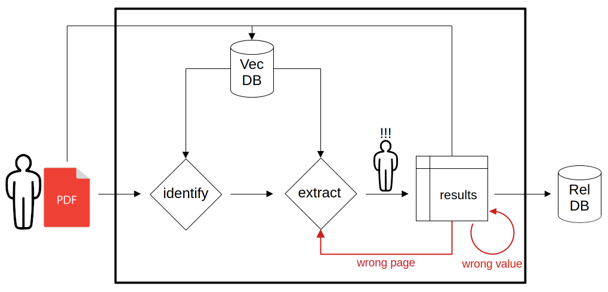

# Discussion {#discussion}

\ChapFrame[Discussion][bhtgray]

This chapter consits of the main sections as follows:

Section \@ref(answer-research-questions) interprets the results in relation to our research questions and hypotheses, compares them with previous work, and highlights any surprising or unexpected outcomes.

Section \@ref(error-analysis) contains our error analysis and discusses interesting findings under a researchers perspective.

Section \@ref(general-performance) discusses practical implications and limitations for the planned \acr{HITL} application, as derived from the error analysis. The results are interpreted from an engineering perspective, focusing on how the findings inform the design and implementation of the application.

Subsequent, Section \@ref(not-covered) describes, what we have neither investigated nor implemented in this thesis. Section \@ref(outlook-implementation) gives an outlook on the challenges for implementing the system at \acr{RHvB}. Finally, ethical and practical consideration are presented in Section \@ref(ethics).

## Research questions {#answer-research-questions}

### Page identification

We posed the following research question and hypotheses for the page identification task:

```{r, include=knitr::is_html_output(), results='asis', echo=FALSE}
cat("<ol class='rs-questions' style='--counter: 1;'><li>How can we use LLMs effectively to locate specific information in a financial report?</li></ol>")
```

\begin{enumerate}[label={\textbf{Q\theenumi}}]
  \item How can we use LLMs effectively to locate specific information in a financial report?
\end{enumerate}

**H1.1:** \acr{LLM}s can be used to locate specific information in a financial report, achieving a high F1 score.

**H1.2:** \acr{LLM}s can be combined with other approaches to reduce the energy consumption, without lowering the systems recall.

::: paragraph-start
##### Results

The page identification task is solved by the \acr{LLM} with higher F1 scores than the human reference F1 score for every target class. It is solved perfectly for the documents of our sample for predicting the class **Aktiva**. The multi-class classification with Llama 4 Scout is best for classifying **Aktiva** and **Passiva** tables. The binary classification with Ministral works best for classifying **GuV** tables.
:::

The prompting strategy *n_rag_examples* often yields best results, especially if \acr{icexs} are used. Section \@ref(same-company-evaluation) is discussing this finding for both tasks.

The term frequency approach reaches a top k recall of 1.0 for a small $k = 5$. It runs 100 times faster than the \acr{LLM} approach and reduces the average number of pages to classify by 92.6 %. We discuss how to combine the two approaches in Section \@ref(efficency-discussion).

::: paragraph-start
##### Interpretations

Both of our hypotheses find support. Thus, we see our research question answered with the following statement: It is possible to locate specific information in a financial report using \acr{LLM}s and it can be done more efficient if a term frequency based approach is used for page range refinement in advance.
:::

::: paragraph-start
##### Comparison with previous work

We are able to narrow down the page range to five pages without using a \acr{LLM}. With the \acr{LLM} we are guaranteed, to find the correct pages within a range of two pages. Most of the time, the page, ranked highest in the confidence score ranking, is the correct one. @liExtractingFinancialData2023 do not present a concrete number of pages, they have to process after page refinement.
:::

The \acr{TOC} does not work as well as expected. @liExtractingFinancialData2023 do not report any issues or a low recall value for their \acr{TOC} based approach. Thus, we assumed to find a recall value close to 1.0 for the \acr{TOC} based approach, too. Instead we find a recall of 0.27. We discuss differences in the two approaches in Section \@ref(toc-discussion).

::: paragraph-start
##### Unexpected results

We are surprised by the strong performance of Ministral-8B. It performs better, than other models of the Mistral family, that have been released more recent and have a larger parameter count. It shows one of the strongest performances with the *zero_shot* and *law_context*, too.
:::

We are also positive surprised of the strong performance of the recently released members of the Qwen3 family. The older Qwen3 models could not handle the classification tasks at all — with or without thinking mode[^06_discussion-1] — while the models of Qwen2.5 performed well. We identified the implementation of sparse \acr{MoE} layers to be an architectural difference between the more recent and older Qwen3 models.

[^06_discussion-1]: The Qwen3 models support two operating modes: A thining mode and a non-thinking mode. The thinking mode should yield better answers in complex tasks and the additional amount of processing can be controlled by setting a thinking budget [@qwenteamQwen3ThinkDeeper2025]. This thinking budget can be seen as the amount of tokens used for a step wise solution.

But we assume the difference in the perfromance is caused by a different fine-tuning process. While the original released models already claimed to deliver "groundbreaking advancements in [...] instruction-following" [@QwenQwen34BHugging2025], we now find a newer version of the Qwen3-4B model that explicitly is tagged as Qwen3-4B-Instruction. It would be interesting, to add this model to the benchmark in future work.

::: paragraph-start
##### Conclusion

In summary, our findings demonstrate that LLMs are highly effective for page identification in financial reports, consistently outperforming human benchmarks and traditional rule-based methods. The combination of LLMs with term frequency-based approaches further enhances efficiency, enabling rapid narrowing of candidate pages while maintaining high recall.
:::

Model selection and prompting strategies play a significant role in optimizing performance, with in-context learning using relevant examples yielding the best results. These insights provide a strong foundation for developing robust, scalable solutions for automated document analysis in audit and regulatory contexts.

### Information extraction

We posed the following research question for the information extraction task:

```{r, include=knitr::is_html_output(), results='asis', echo=FALSE}
cat("<ol class='rs-questions' style='--counter: 2;'><li>How can we use LLMs effectively to extract this information from the document?</li></ol>")
```

\begin{enumerate}[label={\textbf{Q\theenumi}}]
  \setcounter{enumi}{1}
  \item How can we use LLMs effectively to extract this information from the document?
\end{enumerate}

We will start discussing the hypotheses group **H2.1** in Section \@ref(extraction-performace-hypotheses-evaluation), before we will look at the hypotheses group **H2.2** in Section \@ref(extraction-performace-predictor-hypotheses-evaluation). The hypotheses of group **H2.1** are:

**H2.1a:** \acr{LLM}s can be used to correctly extract multiple numeric values from the assets table.

**H2.1b:** \acr{LLM}s can match row identifiers and place the numeric values in the correct target row.

**H2.1c:** \acr{LLM}s can identify unmatched row identifiers and report, that the value is missing.

#### Core capabilities {#extraction-performace-hypotheses-evaluation}

::: paragraph-start
##### Results

The best performing model, Qwen3-235B-A22B-Instruct, almost reaches human performance on real **Aktiva** tables, but is much faster. Both measures, percentage of correct numeric predictions (98.0 %) and F1 score (98.1 %), are not perfect yet and could be improved. It achieves perfect results on synthetic tables provided in \acr{HTML} format.
:::

The prompting strategy *n_rag_examples* often works best, especially if \acr{icexs} are used. Section \@ref(same-company-evaluation) is discussing this finding for both tasks.

::: paragraph-start
##### Interpretations

The high percentage of correct extracted numeric values shows that Qwen3-235B is not only able to exactly copy the values and match corresponding row identifiers, but also to perform numeric transformations, respecting the currency units, in many cases. If no numeric transformations are performed, the upper limit for correct numeric extraction is 80.8 %, because 19.2 % of all numeric values have *T€* as currency unit. We discuss this in Section \@ref(numeric-transformation-discussion).
:::

Furthermore, we can see for the extraction from synthetic **Aktiva** tables, that it is possible to achieve perfect results, if the input is well structured and without unknown row identifiers. In analogy to the concept of *garbage in, garbage out*, we could phrase it as *perfect in, perfect out*. Thus, we show that there is no \acr{LLM} approach inherent mechanism, that prevents perfect information extraction of numeric values. We show this in the Appendix \@ref(error-rat-guidance-synthetic).

The high F1 score shows, that Qwen3-235B also is able to identify missing row identifiers and correctly returns *null* instead of hallucinating numeric values. We discuss the matter of label matching further in Section \@ref(unconsistent-label-matching).

Thus, we conclude, that all hypotheses of group **H2.1** get supported and the research question can be partially answered with the following statement: \acr{LLM}s can be used effectively to extract information from the financial reports using in-context learning and a strict schema.

::: paragraph-start
##### Comparison with previous work

@liExtractingFinancialData2023 achieve a perfect extraction result, after refining their approach, extracting a total of 152 data points from 8 \acr{ACFR} reports. Before the prompt refining they find 96.1 % correct extracted datapoints. Applying the refined approach on a more heterogeneous sample of 4_000 county year \acr{ACFR}s, they achieve a performance of 96 % on 80_000 data points.
:::

Thus, our found performance is higher than their initial in-sample and final out-of-sample performance. Since we did not adjust our prompting strategy before the second iteration of the ground truth creation, we argue that our performance should be compared to their out-of-sample performance.

There are some differences in our prompting approaches, that may have a minor influence on the performance. @liExtractingFinancialData2023 include explicit instructions for handling currency units, which we do not for the extraction task with real **Aktiva** tables. But we investigated this with the synthetic and hybrid approach and discuss the findings in Section \@ref(numeric-transformation-discussion).

@liExtractingFinancialData2023 extract three values per \acr{LLM} call, while we expect 10 to 40 numeric and 18 to 38 *null* predictions per call. They explicitly include an instruction on how to handle missing values and do not report any remarkably higher error rates with missing values. Therefore, we can not compare our F1 score with their results.

::: paragraph-start
##### Unexpected results

We did not expect the \acr{LLM} to perform any currency units related numeric transformations, without being explicitly instructed, (how) to do this. But it is plausible, that this pattern can be learned during in-context learning. This is especially true, if the examples are chosen according to vector similarity and if \acr{icexs} can be used. We describe this in more detail in Section \@ref(same-company-evaluation).
:::

::: paragraph-start
##### Conclusion

The results demonstrate that \acr{LLM}s, are highly effective for extracting structured financial information from assets tables, nearly matching human performance while operating significantly faster. They can accurately extract multiple numeric values, correctly match row identifiers, and reliably identify missing entries.
:::

The success of in-context learning, especially when \acr{icexs} are used, highlights the importance of prompt design and relevant context. While perfect extraction is achievable with well-structured synthetic data, real-world performance is limited mainly by input quality and schema consistency.

Compared to previous work, the approach presented here achieves higher performance without extensive prompt refinement, underscoring the robustness of the method. Unexpectedly, \acr{LLM}s can perform currency-related numeric transformations even without explicit instructions, suggesting that in-context learning can capture the underlying patterns.

Overall, these findings confirm that \acr{LLM}s, combined with a strict schema and in-context learning, offer a reliable and scalable solution for automated information extraction in financial reporting.

#### Feature effects {#extraction-performace-predictor-hypotheses-evaluation}

The hypotheses of group **H2.2** are:

**H2.2a:** Model specific features have an effect on the extraction performance.

**H2.2.b:** Prompt strategy specific features have an effect on the extraction performance.

**H2.2c:** Table specific features have an effect on the extraction performance.

::: paragraph-start
##### Results

The features, that show an noticeable importance value most often, are:
:::

1.  *model_family*
2.  *parameter_count*
3.  *method_family*
4.  *n_examples*
5.  *T_in_previous_year*

We can determine an effect direction for the features *parameter_count*, *n_examples* and *T_in_previous_year*. More parameters and more examples are beneficial. The only exception for this is found for the model Llama 4 Maverick. We discuss this case in section \@ref(context-rot). The performance gain gets smaller comparing experiments with three and more provided examples. The prompting strategies *n_random_examples* and *top_n_rag_examples* perform best.

The method specific feature *respect_units* shows meaningful importance for evaluating synthetic tables. Its effect has opposite direction to our assumption. For the hybrid approach it has a small importance, but with an effect direction matching our assumption. We discuss this in the next paragraph.

With the synthetic tables, we also find that \acr{HTML} and Markdown are a *input_format* that yield better results. We show in section \@ref(alternative-input-formats-extraction), that we do not find these benefits for processing real tables from (imperfect) Markdown input.

::: paragraph-start
##### Interpretations

All model and method specific features are meaningful predictors for the information extraction task. Thus, we argue, that **H2.2a** and **H2.2b** find total support. The high importance of the feature *model_family* could be an artifact of Llama 4 Mavericks bad performance with multiple in-context learning examples.
:::

Of all the table characteristics only *T_in_previous_year* shows a higher importance. Thus, we argue, that **H2.2c** only gets support for a one of the features we proposed a (directed) effect for. There are multiple features we proposed to have no effect and where no effect is found. These hypotheses also get supported by our experiments. We assume, that *T_in_year* would get a higher importance too, if the number of tableswith this characteristic in our sample would be higher.

::: paragraph-start
###### Respecting Units

We find effects with opposite directions for the predictor *respect_units* for the information extraction with synthetic tables and the hybrid approach. This is explained by our experimental designs.
:::

The basic experiments with synthetic tables compare the extracted values with untransformed gold standard values. The in-context learning examples demonstrate no numeric transformations, either. The \acr{LLM} just has to copy the digits. Thus, the task is easier, because no numeric transformation is needed.

If the model is instructed to handle currency units, the extracted values are compared with transformed gold standard values. The in-context learning examples do demonstrate this behavior. Thus, the task is harder, because the model has to learn the numeric transformation pattern.

In contrast, the hybrid approach experiments always compare the extracted values with transformed gold standard values. The in-context learning examples demonstrate this behavior, if the model is instructed to handle currency units. The in-context learning examples do not demonstrate this behavior, if the model is not instructed to handle currency units. Thus, the task is easier, if the model is instructed to handle currency units, because it can learn the patterns from the in-context examples.

::: paragraph-start
##### Compare with previous work

@liExtractingFinancialData2023 report, that the most frequent errors for the extraction of values from \acr{ESG} reports are based on incorrectly handled units. This aligns well with our findings of a high importance value for *T_in_previous_year*. Our results also align well with @brownLanguageModelsAre2020 findings, that the performance might not increase much more by adding additional examples after the second one.
:::

::: paragraph-start
##### Limitations

We failed to reflect the *header_span* and *text_around* characteristics, during the creation of the synthetic \acr{HTML} and Markdown tables. Thus, we can not evaluate the propsed interaction effects with *input_format* for those features. But we find no big importance for *header_span* in any experiment.
:::

We also did not include an indicator, if \acr{icexs} are used, as a method related feature. We show, that this matters in section \@ref(same-company-evaluation).

::: paragraph-start
##### Unexpected results

We did not expect to find such a clear example for context rot as we do for Llama 4 Maverick. We are surprised that we do not find the same behavior with Llama 4 Scout. Since it has an even larger context window, we wonder, if we will observe context rot for Llama 4 Scout too, if we increase the number of in-context learning examples proportionally.
:::

::: paragraph-start
##### Recommendations

We recommend to evaluate the hypotheses for the visual table characteristics once more, when more advanced document parsing methods are used, which process visual information. The method for document parsing should be included as a feature in this future evaluation as well.
:::

::: paragraph-start
##### Conclusion

Overall, both model and prompt strategy features noticeably impact extraction performance, with larger models and well-chosen in-context examples yielding the best results. Table-specific features play a smaller but sometimes meaningful role. In contrast to the classification task, we find no model family that performs worse in general.
:::

Importantly, providing at least one or two relevant examples is more beneficial than simply increasing model size. These findings highlight the need for augmented prompt strategies and model selection to optimize \acr{LLM}-based information extraction.

#### Error rate guidance

We posed the following \acr{UX} inspired side research question and hypotheses:

```{r, include=knitr::is_html_output(), results='asis', echo=FALSE}
cat("<ol class='rs-questions' style='--counter: 3;'><li>Can we use additional information from the extraction process to guide the user on which values need to be checked and which can be trusted as they are?</li></ol>")
```

\begin{enumerate}[label={\textbf{Q\theenumi}}]
  \setcounter{enumi}{2}
  \item Can we use additional information from the extraction process to guide the user on which values need to be checked and which can be trusted as they are?
\end{enumerate}

**H3.1:** The confidence score can be used to guide the user on which of the identified pages need to be checked and which can be trusted as they are.

**H3.2:** The confidence score can be used to guide the user on which of the predicted values in the information extraction task need to be checked and which can be trusted as they are.

::: paragraph-start
##### Results

For the page identification task, we find high confidence intervals with (near) zero empirical error rate for well performing models, containing most of the classifications. Ministral-8B shows a wide spread of confidence scores for the page identification task, that can be used to distinguish correct and wrong classifications.
:::

We do not find high confidence intervals with a error rate below 1 % for the information extraction task on real **Aktiva** tables. Explicitly instructing to respect currency units, reduces the empirical error rate (see Appendix \@ref(hybrid-respect-units)). But we can find confidence intervals with zero error rate for the information extraction task on synthetic data.

::: paragraph-start
##### Interpretations

We find support for the hypothesis **H3.1** but not for hypothesis **H3.2**. Thus we answer the research question as follows: The confidence score can be used to guide users attention for the page identification task, but hardly for the information extraction task.
:::

::: paragraph-start
##### Compare with previous work

The classification task can be interpreted as a best-of-N selection task with two or four choices. Here, our simple measure for confidence seems to be sufficient, aligning well with the findings of @kangScalableBestofNSelection2025.
:::

Generating the information extraction response, can be interpreted as multiple chained best-of-N selections tasks. If every digit, the floating point delimiter, and a end-of-sequence token is counted as individual choice, there are 12 possibilities. Choosing, if a number or *null* should be returned is an additional task with $N=2$ that is to solve multiple times in this decision chain. Even though the number of choices is below $N=16$ for each decision, chaining those choices seems to yield a less meaningful measure of confidence.

::: paragraph-start
##### Unexpected results

Most models predict high confidence for all most of their predictions, even for the wrong ones.
:::

::: paragraph-start
##### Conclusion

In summary, confidence scores are a useful tool for guiding user attention in the page identification task, reliably indicating which pages require review. However, for information extraction, confidence scores are less effective, as high confidence does not consistently correlate with correct predictions. This highlights the need for more robust uncertainty measures in extraction tasks to better support user decision-making.
:::

## Error analysis {#error-analysis}

This section provides a detailed evaluation of the noticeable details found during our evaluation of the experiments. The following sections examine classification errors for each method, analyze the challenges of extracting numeric information and discuss the impact of context rot.

Company-specific results and the influence of example selection strategies are presented, followed by a discussion of numeric transformations and the effects of inaccurate text extraction. The chapter also addresses the performance with a guided decoding aproach and the process of ground truth creation. Each Section aims to highlight practical recommendations and areas for future improvement.

### Page identification {#page-identification-error-analysis}

This section is presenting a brief error analysis for the \acr{LLM} and term frequency approach. We discuss errors related to context rot in Section \@ref(context-rot), because they occurred in both tasks.

#### LLM approach

The seven wrong classified pages by Llama Scout 4 all contain a table, that is filling at least half a page containing one column with text and many columns with numeric values. Six out of those seven are classified as **GuV** and one as **Passiva**. The page, classified as **Passiva** contains the term *Passiva*.

From our point of view it would be more plausible, if page 63 of '/pvc/Geschaeftsberichte/Berlinovo/ berlinovo_Finanzbericht_2021.pdf' is classified as **Aktiva**, because there are a lot of similar row identifiers present. The term frequency approach correctly classifies this page as *other* and ranks it on 8th place for **GuV** and **Passiva** and only on 14th place for **Aktiva**. Thus, our intuition what kind of row identifiers are in the table, is not correct.

To prevent those few incorrect classifications, the system may need more examples for pages, that are similar to the target classes but of different type.

#### Term frequency approach {#error-analysis-tf}

Inspecting some of the pages that are ranked high and wrongly classified as **Aktiva** by the term frequency based random forest, we find, that the normalized sum of term occurrences can lead to missclassification. For example, we find a page identified as **Aktiva**, that contains no single table but a long text. The full term count list based on the **Aktiva** term list can be found in the Appendix \@ref(tf-missclassifications).

The term 'Geschäfts' is present 19 times. The term 'Unternehmen' is present 10 times. Those terms are probably present very often all over the document. Thus, they should get less weight. The \acr{BM25} measure is attributing less weight to common terms and includes an saturation term, too. @kongOpenTabAdvancingLarge2024 shows, that \acr{BM25} can be used effectively to identify relevant tables.

Using a boolean indicator, if a the term is present on a page, instead of counting their individual occurrences, could also be a solution.

We also find pages that are missclassified, because they have a high density of floats. An example for a page with high float density that is not containing an **Aktiva** table can be found in Figure \@ref(fig:tf-many-floats) in the appendix.

We formulate our practical recommendations in Section \@ref(tf-practical-recommendation).

### Information extraction

#### General findings

One of the tested \acr{LLM} families[^06_discussion-2] is not able to handle German Umlaute. Thus we replace those characters with their non-umlaut equivalent and adjusted our schema accordingly.

[^06_discussion-2]: We think it Google's gemma models struggel with Umlaute. But we missed to note the exact family's name and had no time to reconstruct this issue.

In general the approach seems not be prone to hallucinations. When we accidentally tried to extract values from a **Passiva** and **GuV** table, no prediction was made, because non of the row identifiers matches our strict schema.

#### Company specific results {#same-company-evaluation}

::: paragraph-start
##### Real tables

Figure \@ref(fig:extraction-qwen235-by-company) shows, the precision and recall values for predicting a missing value and the percentage of correct numeric predictions for Qwen3-235B for each company. The number after the company name, as well as the color of the boxes indicate, how many of the numeric columns have *T€* as currency unit. The crosses indicate the individual scores per document. The teal crosses represent predictions, if \acr{icexs} are used for the *top n rag* prompting strategy. Red ones represent predictions, where this is not the case.
:::

```{r extraction-qwen235-by-company, echo=echo_flag, warning=warning_flag, message=message_flag, out.width="100%", dev=std_dev, fig.cap="Comparing the F1 score for predicting the missingness of a value for OpenAi's LLMs with some Qwen 3 models. The green crosses indicate results where a model has predicted only numeric values even though there have been missing values.", fig.width=8, fig.height=10}
# df_real_table_extraction %>% filter(!str_detect(model, "oss")) %>% 
#   filter(n_examples == 3) %>% 
#   mutate(.before = 1, company = map_chr(filepath, ~str_split(str_split(., "/")[[1]][5], "__")[[1]][1])) %>% 
#   group_by(company) %>% 
#   ggplot() +
#   geom_boxplot(aes(x = company, y = percentage_correct_numeric)) + 
#   # geom_jitter(aes(x = company, y = percentage_correct_numeric), alpha= .5) +
#   scale_x_discrete(guide = guide_axis(angle = 30)) + 
#   facet_grid(model_family ~ .)

df_real_table_extraction_best_by_company <- df_real_table_extraction %>% 
  filter(str_detect(model, "235B")) %>% 
  filter(n_examples == 5, method_family == "top_n_rag_examples") %>% 
  # group_by(company) %>% 
  pivot_longer(cols = c(NA_precision, percentage_correct_numeric, NA_recall))

df_real_table_extraction_best_by_company %>% 
  mutate(columns_with_T_EUR = ordered(n_T_EUR)) %>%
  ggplot() +
  geom_boxplot(
    aes(y = paste(company, n_T_EUR), x = value, fill = ),
    alpha= .7
    ) + 
  geom_jitter(
    aes(y = paste(company, n_T_EUR), x = value, color = same_company), 
    shape = 4
    ) +
  scale_y_discrete(label = scales::label_wrap(32)) + 
  theme(
    legend.position = "bottom"
  ) +
  ylab("") +
  labs(
    title = df_real_table_extraction_best_by_company$model[[1]],
    subtitle = df_real_table_extraction_best_by_company$method[[1]]
    ) +
  facet_nested(.~name)
```

One can see, that Qwen3-235B yields perfect predictions for the majority of the companies. This is especially true, if we only consider the teal crosses. The predictions improve for most companies, if \acr{icexs} are used for in-context learning. It is especially helpful for handling the single numeric column with *T€* for *Deutsche Klassenlotterie*. It also helps with the two columns with *T€* for *Gewobag*, even though the other examples have no *T€* present.

It seems a little harmful for *WBM GmbH* and can not solve the problems for numeric prediction for *Helmholtz Zentrum GmbH* and *Berliner Stadtgüter*. It improved the precision for *Rundfunk Berlin-Brandenburg* asw+ well as the recall of *Stadt und Land GmbH* and *Partner für Deutschland*.

Table \@ref(tab:information-extraction-compare-same-company-examples-qwen235) shows the performance of Qwen3-235B for the *top n rag* and *n random* example strategies and distinguishes based on the fact, if examples from the same company can be used for in-context learning. The achieved percentage of correct predictions total is highest, if examples form the same company are used. It is even higher than the human reference score.

If using \acr{icexs} is not possible, it seems better to use random examples. This is probably the case, because this comes with a higher heterogeneity. High homogeneity among the learning examples from other companies might demonstrate patterns, that are not correct for the subject of extraction. The observation, that using \acr{icexs} yields best results is true for all models. The performance ranking for the prompting strategies providing random examples or examples from other companies varies among the models.

```{r information-extraction-compare-same-company-examples-qwen235, echo=echo_flag, warning=warning_flag, message=message_flag, results='asis'}
table_same_company <- df_real_table_extraction %>% 
  filter(str_detect(model, "235B")) %>% 
  # filter(n_examples == 5, method_family == "top_n_rag_examples") %>%
  group_by(model, method, same_company) %>% 
  reframe(
    mean_numeric = mean(percentage_correct_numeric, na.rm = TRUE),
    mean_F1 = mean(NA_F1, na.rm = TRUE),
    mean_total = mean(percentage_correct_total, na.rm = TRUE)
    ) %>%
  group_by(same_company) %>% slice_max(n = 1, mean_numeric, with_ties = FALSE) %>% 
  # select(model, method, mean_numeric, mean_F1, mean_total) %>% 
  ungroup() %>% 
  mutate_if(
    is.numeric, 
    ~ifelse(
      . == max(., na.rm = TRUE),
      paste0("**", format_floats(., 3), "**"),
      format_floats(., 3)
    )
  ) %>% setNames(colnames(.) %>% str_replace("_", " ")) %>% 
  render_table(
    alignment = "lllrrr",
    caption = "Comparing the performance of Qwen3-235B for the best approaches depending on the circumstance if examples from the same company can be used for learning.",
    ref = opts_current$get("label"),
    dom = "t"
  )
if(knitr::is_latex_output()) {
  table_same_company <- table_same_company %>%
    column_spec(4:6, width = "1.5cm") %>% 
    column_spec(1, width = "3.2cm")
}
table_same_company
```

#### Numeric transformations {#numeric-transformation-discussion}

::: paragraph-start
##### Real tables

This section discusses the surprisingly high percentage of correct extracted numeric values. If no numeric transformation is performed, 80.8 % is the upper limit. We assume, that the behavior to transform the numeric values without being instructed to do so, is not learned during fine tuning, because the percentage of correct extracted numeric values for the *zero_shot* performance (0.763) and the *static_example* performance (0.803) are below the expected limit. The static example demonstrates no numeric transformation and the observed performance is found to be almost as high as the expected upper limit.
:::

Table \@ref(tab:information-extraction-compare-same-company-examples-qwen235) shows, that this limit is overcome with all other prompting strategies. It is plausible for the *top_n_rag_examples* strategy, if \acr{icexs} are used. But it implies, that almost always there is at least one example among the five random examples present, that shows this transformation. And it implies further, that the model recognizes, that the pattern demonstrated by a minority of examples is to apply for the subject of the current extraction task. For future work the provided examples should be logged as well, to investigate this implication.

::: paragraph-start
##### Hybrid approach

We tested the influence of providing examples, that show how to perform the numeric transformation, together with an explicit instruction to do so, in the hybrid approach (see section \@ref(hybrid-learn-respect-units)). The hybrid approach uses synthetic tables as examples for extracting information from real examples. We show, that Qwen3-235B is capable to learn how to extract numeric values respecting the currency unit and is able to transfer this knowledge from examples with two columns with *T€* to tables that only have one column with *T€*. This transfer is not possible for all models, e.g. not for Ministral-8B. We also find models that over generalize this pattern and achieve worse performance for extraction subjects without *T€* as currency unit — i.e. Qwen3-8B.
:::

We also see in our hybrid approach experiments, that the benefit of providing real tables as examples instead of synthetic ones is larger for extracting the numeric values than for matching the labels. Comparing Figure \@ref(fig:compare-real-table-extraction-by-context-type-numeric) and Figure \@ref(fig:compare-real-table-extraction-by-context-type-F1) shows that \acr{LLM}s yield good results for predicting *null* more consistently than extracting the correct numeric value when synthetic tables are provided as in-context learning examples.

We have not investigated, if an annual report of the following or previous year is more helpful than years further away. This would be plausible, because it serves the correct numeric and missing values for half of the information to extract perfectly matching our schema formatted as \acr{json}. Theoretically it should become trivial to extract all values correct and transform them accordingly to the currency units, if the previous and following years annual reports are presented as examples for the in-context learning. This should be investigated in future work.

#### Inaccurate text extracts {#regex-synth-backend-discussion}

```{r table-extraction-regex-data-loading-discussion, echo=FALSE, warning=warning_flag, message=message_flag, cache=TRUE, cache.extra = tools::md5sum('data_storage/table_extraction_regex.rds')}
df_table_extraction_regex <- readRDS("data_storage/table_extraction_regex.rds") %>% 
  filter(table_type != "real_tables") %>% mutate(
    table_type = str_remove(table_type, "_extended")
  )
```

We find, that the regular expression approaches performance on the synthetic dataset is highly influenced by the extraction library used. For the real data we find no difference. In the appendix, Figure \@ref(fig:table-extraction-regex-performance) B shows, that the \acr{regex} approach on texts extracted with *pdfium* especially has a wider precision range. The number of wrong extracted numeric values is a little higher as well.

A reason for this might be inaccurate extracted texts. We find, that there are issues with missing (or additional) white space, misplaced line breaks and an extraction of the text column first, followed by the numeric columns. You can find examples for those types of incorrect extracted texts by three different PDF extraction libraries in the Appendix \@ref(regex-extraction-mistakes). One of the examples is found for a text extracted from a real table, while two are found with the synthetic tables.

The random white space and line breaks could be handled by adjusting the regular expression for the label matching. Missing white space between numeric values could also be handled by adjusting the \acr{regex}. The misplaced columns would need more advanced reformatting strategies. But all those error types shoudl influence the recall and not the precision.

A possible explanation for a small spread in precision with both PDF extraction backends could be the duplicated row identifier *Geleistete Anzahlungen*. Our simple approach matches this row always with the first occurrence. This means, if the second occurrence is given in the ground truth, but not the first one, our approach would create a false positive result. The percentage of false positive example is then determining the precision value and it is linked to the number of total rows in the ground truth. But we do not observe such a pattern for the *pymupdf* results at all.

A reason for wrong numeric values are rows, where the summed value is given in the next column, but same row, as the individual values. In this case the approach selects one individual value and a sum, instead of two individual values.

Originally, the synthetic tables have been generated with cell lines because this should improve the performance of a (classic) table extraction libraries. But we have not used table extraction libraries in our final experimental setup. Maybe these lines are confusing *pdfium*. We also used a zoom function, shrinking the table so it fits on a single page. This might also have a negative influence on the text extraction quality.

#### OpenAI models {#openai-discussion}

We could not use a strict schema, neither with OpenAIs closed-weight GPT models nor with their new open-weight OSS models. Figure \@ref(fig:table-extraction-llm-prediction-count-gpt) (in the appendix) shows, that this results in many responses with no or few predictions, that have row identifiers matching our ground truth. It might also be, that the models simply made less predictions than the expected 29 rows[^06_discussion-3]. We find this especially for the *nano* models. We even find some responses, where some rows have been predicted multiple time, resulting in more than the expected 29 rows.

[^06_discussion-3]: To investigate this in detail, one has to save the raw response in addition to the avaluation of the response.

Figure \@ref(fig:table-extraction-llm-f1-gpt-slice) (in the appendix) shows, that we also find responses, where no single *null* value is returned. This means, that the models probably hallucinate numeric values. Again, we find this especially for the *nano* models. But this observation also holds for the large GPT-4-1, if it does not get three examples for in-context learning. In contrast, GPT-5-mini and gpt-oss-120B are (almost) without responses that contain no *null* values.

Nevertheless, even without a strict schema, we find GPT-4-1 and GPT-5 performing almost as well as Qwen3-235B. This shows, that a guided decoding approach could also work and that a strict schema is not a prerequisite for larger models. Future work should investigate, under which conditions open-weight models can be used with guided decoding instead with a strict schema.

Unfortunately, we could not use batch processing with the closed-weight models resulting in run times of 30 to 135 minutes. Interestingly, GPT-5-nano had the longest runtime and produced much more output tokens than the other models. We suspect, that it does something similar to the gpt-oss models, which use the new harmony response format, that creates many tokens in a *chain of thought* stream, before it returns the tokens for the requested \acr{json} table in the *final* stream. This might bring insights in the models processes, but increases the response time by a large amount. We would welcome the possibility to disable the chain *of thought* stream and to only get the final answer, as we can disable thinking in Qwen3.

#### Error Types

A comprehensive analysis of specific error types remains a subject for future research. Here, we briefly outline anticipated error categories, potential evaluation metrics, and necessary adjustments to the logging process.

::: paragraph-start
##### Numeric values

For erroneous numeric predictions, it would be valuable to determine whether the errors stem from copying mistakes — such as omitted or transposed digits — similar to those commonly made by humans. Although we have logged the Levenshtein distance to facilitate this analysis, time constraints prevented further investigation.
:::

Another likely error type involves copying an incorrect value, such as a sum from the same row but a different column, a value from another row, or even from one of the provided examples. To examine this, one could check whether the predicted number appears in the prompt text, provided this information is logged.

Errors may also arise from missed or incorrect transformations related to currency units. Additionally, the \acr{LLM} may perform summations across rows, or simply generate hallucinated values, as discussed in Section \@ref(context-rot).

::: paragraph-start
##### Row matching

To analyze false negatives and numeric values assigned to incorrect rows, calculating the Levenshtein distance could be informative; a low distance may indicate the use of a fuzzy matching strategy. Furthermore, semantic similarity scores could be computed to assess whether semantic matching is being employed.
:::

For false positive values, it would be insightful to examine the model's reasoning process (e.g., Qwen3's thinking mode or gpt-oss's chain of thought stream) and to enumerate all rows that are omitted. While an incomplete list can be generated by reviewing false positives, rows excluded from the ground truth due to schema constraints will remain unaccounted for.

Consequently, a more flexible approach is warranted. This could involve expanding the schema to include a less restrictive category for unmatched rows, or adopting a guided decoding strategy. In such cases, we anticipate encountering rows with finer granularity that may need to be aggregated to fit the schema, or rows with identifiers that are semantically equivalent but not sufficiently similar for fuzzy matching.

### Ground truth creation {#unconsistent-label-matching}

We find manual human work to be error-prone. Thus, the ground truth creation process would benefit from multiple passes and cross-checks. Also a strict and detailed coding manual is necessary to ensure a consistent coding process.

Inspecting the results of the \acr{LLM} predictions helped us to identify errors in our previously created gold standard. Thus, we recommend to include \acr{LLM} predictions in the ground truth creation process, especially if a second person for cross-checks is not available.

Subsequently, we discuss two findings from our ground truth creation process:

::: paragraph-start
##### Page identification

Inspecting the predictions of the first experiments, yielded interesting information. Qwen 2.5 consistently classified some pages to be of type **GuV**, that follow right after the **GuV** pages listed in the ground truth. This prediction was correct. The **GuV** table of the company *IBB* span two pages. This led to an adjustment of the ground truth. The ground truth now includes all pages for tables that span multiple pages.
:::

::: paragraph-start
##### Information extraction

During the second pass of the ground truth creation, we find that 2.4 % of the values differ among the previously created gold standard and the results of the second pass. In the first pass the values are copied manually, while the results of the second pass are \acr{LLM}s predictions, that we double checked. We find 75 values differing in the 24 documents that are part of both data collections. Table \@ref(tab:error-analysis-gold-standard-extraction) shows the nature of errors and their counts. Most errors are distributed in the *omission* classes.
:::

Errors of this type result from an inconsistent coding process. In one pass a value with an ambigious row identifier might have been included, while it is not included in the other pass. Or the value is matched to different row identifiers during the two passes. To resolve this kind of errors a strict and detailed coding manual is necessary. Additionally, the coding should be done from experts of the field or in collaboration with these, instead by the data scientist alone.

```{r error-analysis-gold-standard-extraction, echo=echo_flag, warning=warning_flag, message=message_flag, results='asis'}
tribble(
  ~error_type, ~count,
  "ommited in first pass", 29,
  "ommited in second pass", 20,
  "multiple differences", 13,
  "missing digit", 10,
  "swapped digits", 2,
  "comma instead of dot", 1,
) %>% render_table(
  alignment = "lr",
  caption = "Showing the nature of errors and their counts. Errors with multiple difference have Levenshtein distance greater one.",
  ref = opts_current$get("label"),
  dom = "t"
)
```

### Context rot {#context-rot}

We report the worsening performance of Llama 4 Maverick, when it gets to many examples presented in both main tasks. Since we use the FP8 version, we test if this is caused by to low precision during the calculations. But we find the same behavior with the FP16 version. Llama 4 Maverick is the only model in our experiments that exhibits the problem of *context rot*.

*Context rot* is a term introduces in @kellyhongContextRotHow2025. They investigate an advanced *Needle in the Haystack* problem, including distractors and requiring the \acr{LLM}s to find semantic similarity instead of exact term matching. They find that the accuracy often starts to decrease with 10 k input tokens and more.

Meta claims that Llama 4 Maverick has a context length 1 M (Llama 4 Scout even 10 M), where other models often are limited to 128 k, 32 k or less. We limited our input token length to 32 k in most cases and reached this limit multiple times. We find it remarkable, that Llama 4 Maverick already shows *context rot* at inputs of length 10 k — 100 times shorter than their context window.

@levySameTaskMore2024 demonstrate that \acr{LLM}s' reasoning performance can degrade at much shorter input lengths than their technical maximum. They also show that Mistral achieves the highest accuracy when the relevant information is positioned at the end of the prompt. However, it remains unclear how these findings apply to our experiments, as we do not include irrelevant information.

#### Page identification

::: paragraph-start
##### Binary classification

Figure \@ref(fig:bar-plot-maverick-binary) shows the amount of correct (matching) and incorrect classifications by Llama 4 Maverick for the binary classification tasks ordered by target type and method. One can see, that the *n_rag_example* strategy starts predicting the target class too often with increased number of examples. This behavior is not observed for the *n_random_examples* strategy.
:::

```{r bar-plot-maverick-binary, echo=echo_flag, warning=warning_flag, message=message_flag, out.width="100%", dev=std_dev, fig.cap="Comparing the amount of correct classifications by Llama 4 Maverick for the binary classification tasks ordered by target type and method. With increased number of examples the n-rag-example strategy starts predicting the target class too often."}
df_rot_binary <- df_binary %>% 
  filter(
    str_detect(model, "Mav"), 
    method_family %in% c("n_rag_examples", "n_random_examples")
    ) %>% 
  select(-filepath) %>% 
  unnest(predictions)

df_rot_binary %>% 
  ggplot() +
  geom_bar(aes(x = if_else(predicted_type == "no", "other", "target"), fill = match)) +
  facet_nested(classification_type~method_family+n_examples) +
  xlab("predicted type")
```

::: paragraph-start
##### Multi-class classification

Figure \@ref(fig:confusion-matrix-maverick-multi-class) shows the confusion matrices for the multi-class classification with Llama 4 Maverick grouped by *method_family* and *n_examples*. Teal bordered tiles are correct predictions and red bordered tiles represent wrong predictions. The number is showing the percentage of classifications by the \acr{LLM} of a certain type (*predicted_type*) based on the true count of observations with that type (*type*). They sum up to one column-wise.
:::

We can see, that the *n_rag_example* strategy starts to predict **GuV** too often, when presented with two or more examples. We observe the same for the *n_random_examples* strategy starting from three provided examples. The \acr{LLM} is not just over-predicting **GuV**, but also other target classes. The over-prediction rate for *other* is lowest. Those pages often have no page filling table and thus are more different from the target classes and easier to distinguish (for a human). It makes no difference if \acr{icexs} are used.

```{r confusion-matrix-maverick-multi-class, echo=echo_flag, warning=warning_flag, message=message_flag, out.width="100%", dev=std_dev, fig.cap="Showing the confusion matrices for the multi-class classification with Llama 4 Maverick grouped by method-family and n-examples.", fig.width=9}
df_rot_multi <- df_multi %>% 
  filter(
    str_detect(model, "Mav"), 
    method_family %in% c("n_rag_examples", "n_random_examples")
  ) %>% 
  select(-filepath) %>% 
  unnest(predictions)

df_rot_multi %>% 
  group_by(type, method_family, n_examples) %>%
  mutate(
    count_total = n()
  ) %>% 
  group_by(type, predicted_type, method_family, n_examples) %>% 
  mutate(
    count = n(),
    percentage_correct = count/count_total
  ) %>% 
  ggplot() +
  geom_tile(
    aes(x = type, y = predicted_type, fill = percentage_correct, color = match),
    size = 1, height = 0.81, width = 0.9
    ) + 
  facet_nested(method_family~n_examples) +
  scale_x_discrete(guide = guide_axis(angle = 30)) +
  geom_text(
    data = . %>% select(type, method_family, n_examples, percentage_correct) %>% unique(),
    aes(label = round(percentage_correct, 2), y = predicted_type, x = type), color = "white"
  ) +
  theme(
    legend.position = "bottom"
  )
```

A possible explanation for over-predicting **GuV** most might be, that the examples for **GuV** are presented first. We just iterate over the *phrase_dict* dictionary (see code below). @liuLostMiddleHow2023 describe a behavior of \acr{LLM}s, that they are better with identifying relevant information, when it is placed in the beginning or end of the context. We present the relevant task instruction and subject of classification at the end of the propmt, thus this should be processed well.

All examples are provided in the beginning of the prompt. Since they are presented similar to the task's subject, they could be interpreted as distractors with a high similarity. @kellyhongContextRotHow2025 shows, that in the presence of similar distractors \acr{LLM}s' performance can degrade quickly. They do not present results, if the position of the picked distractor is important. Thus, we formulate following hypotheses for future investigation:

1.  \acr{LLM}s tend to choose distractors at the beginning or end of the prompt.

2.  \acr{LLM}s tend to choose distractors that apprear first or last.

3.  There is an interaction effect, with the position, where the task is specified.

4.  There is an interaction effect, with the position, where the task's subject is specified.

```{python example-order, eval=FALSE, echo=TRUE, class.source = 'fold-show'}
phrase_dict = {
  "GuV": "a 'Gewinn- und Verlustrechnung' (profit and loss statement) table",
  "Aktiva": "a 'Aktiva' (assets) table",
  "Passiva": "a 'Passiva' (liabilities) table",
  'other': "a text that does not suit the categories of interest",
}
```

#### Information extraction

Figure \@ref(fig:confusion-matrix-maverick-extraction) shows the confusion matrix for the information extraction task with Llama 4 Maverick and five examples. It shows, that the \acr{LLM} starts to predict numeric values for every row instead of prediction *null* if a row is missing.

```{r confusion-matrix-maverick-extraction, echo=echo_flag, warning=warning_flag, message=message_flag, out.width="80%", dev=std_dev, fig.cap="Showing the confusion matrix for the information extraction task with Llama 4 Maverick and five in-context learning examples.", fig.height=3, fig.align='center'}
df_rot <- df_real_table_extraction %>% 
  filter(str_detect(model, "Mav"), n_examples == 5) %>% 
  unnest(predictions)

df_rot %>% 
  pivot_longer(NA_true_positive:NA_true_negative) %>% 
  group_by(name) %>% 
  reframe(
    mean = mean(value),
    median = median(value)
    ) %>% 
  mutate(
    predicted = !str_detect(name, "negative"),
    truth = !(name %in% c("NA_true_negative", "NA_false_positive")),
    upper_bond = ordered(ceiling(mean)),
    median = ordered(median)
  ) %>% 
  ggplot() +
  geom_tile(
    aes(y = truth, x = predicted, fill = mean, color = median),
    size=2, height = 0.98, width = 0.98
    ) +
  geom_text(
    data = . %>% select(name, truth, predicted) %>% unique(),
    aes(label = name, y = truth, x = predicted), color = "white"
  )
```

Figure \@ref(fig:numeric-predictions-maverick-extraction) shows, what kind of numeric values are predicted. We find two peaks. The model most often predicts floating point numbers close to $0$ or close to $30$, while the true values (and values from the examples provided) are in a range of 1_000 and 10_000_000. Thus, we assume the values are hallucinated and not wrongly picked from the examples provided.

```{r numeric-predictions-maverick-extraction, echo=echo_flag, warning=warning_flag, message=message_flag, out.width="80%", dev=std_dev, fig.cap="Comparing the predicted numeric values with the true value distribution for the information extraction task with Llama 4 Maverick and five in-context learning examples. The dotted line is marking the value 30 EUR.", fig.align='center'}
ticks <- seq(2,8,2)
ooms <- 10^seq(0, 10)
minor_breaks <- as.vector(ticks %o% ooms)

ticks <- 1
ooms <- 10^seq(0, 10)
breaks <- as.vector(ticks %o% ooms)

df_rot %>% 
  pivot_longer(year_truth:previous_year_result) %>% 
  mutate(
    year = str_extract(name, ".*year"),
    type = str_extract(name, "truth|result"),
  ) %>% 
  ggplot() +
  # geom_violin(aes(x = name, y = log(value, 10))) +
  geom_hline(yintercept = 30, linetype = "dotted") +
  geom_violin(aes(x = type, y = value, fill = type)) +
  # coord_cartesian(ylim = c(0, 10)) +
  scale_fill_discrete(guide="none") +
  ylab("EUR") +
  xlab("value status") +
  facet_nested(~year) +
  scale_y_log10(breaks = breaks, minor_breaks=minor_breaks)

```

### Summary

The error analysis compared the performance and limitations of \acr{LLM}-based and term frequency-based approaches for the page identification and information extraction tasks.

For page identification, \acr{LLM}s sometimes misclassify tables with similar content as the target classes, while the term frequency method can be misled by common terms and high float density. We suggest the need for improved weighting schemes like \acr{BM25} or boolean indicators.

In information extraction, using \acr{icexs} improves extraction perfromance. Excessive homogeneity can reduce performance, if examples come from another companies documents. OpenAI models demonstrate, that \acr{LLM}s perform well even without strict schemas if their parameter count is high enough.

Overall, the analysis highlights the importance of careful example selection, robust schema design, and thorough ground truth validation to minimize errors.

## Practical Implications and Limitations {#general-performance}

This section discusses the results from an engineers perspective, focusing on implications for the planned \acr{HITL} application and possible improvements.

### Page identification

A detailed view on the results shows, that a combination of two \acr{LLM}s would be necessary, to get the best results for each target class. A more general approach would be using Llama 4 Scout for multi-class classification for all target classes. If there is little VRAM Ministral-8B also does a decent job in multi-class classification.

We recommend, to refine the page range, using a term frequency based approach, for efficiency reasons discussed in Section \@ref(efficency-discussion). It is an important prerequisite, that any method used for page refinement has a recall of 1.0. Otherwise, a user potentially has to inspect the whole document and no improvement is reached compared to the manual processing.

Afterwards the \acr{LLM} can be used to perform a multi-class classification on the top k pages from the ranking, that results from the term frequency approach. The page, that gets the highest confidence score from the \acr{LLM} should be used for the information extraction task. The confidence score ranking should be kept for presenting alternative pages, if the chosen one is incorrect.

Figure \@ref(fig:hitl-error-handling) illustrates our recommendation to begin information extraction immediately, without requiring a mandatory human confirmation of the selected page. If the user reviews the results and notices an incorrect page, alternative pages can be manually checked in order of their confidence score ranking.

Pages that have already been classified should be saved in a vector database along with their class labels, enabling their reuse in future classification tasks and enhancing overall system performance. For in-context learning, examples should be selected based on vector similarity and should utilize \acr{icexs}. We recommend populating the vector database document by document initially, before moving to batch processing.

```{r hitl-error-handling, fig.cap="Showing the information extraction process in a HITL application. We propose to include user action only after the information extraction. If a wrong page is selected, this can be fixed and extraction runs again. Wrong extracted values and handling unknown row identifiers should be done in one place.", echo=FALSE, out.width="100%", fig.align='center'}


```

#### Transfering the system to new problems

Expanding the system to new application areas should be straightforward, even for non-expert users. For the term frequency approach, a pipeline can be established where users input a list of keywords and receive a page ranking based on term frequency metrics. Users can refine the keyword list or directly select relevant pages to create a ground truth. If additional metrics are needed (such as float frequency), the system can automatically train a random forest classifier.

Alternatively, users can provide documents along with a list indicating which pages contain the desired information. This data can serve as the foundation for a retrieval-augmented few-shot classifier, which will improve as more pages are classified.

#### Limitations of transfer

The term frequency and \acr{LLM} classification might perform worse, if the information of interest, is just making up a small part of the pages' content. If the information is placed in a table, we can use a visual table detection model, to identify all tables. We show in the Appendix \@ref(yolo), that this is a promising approach. Then we can use the retrieval augmented few-shot approach to identify, which table is the correct one.

If the information is not placed in a table, but part of a regular sentence, it might get difficult to find the correct page with this approach. Maybe the \acr{TOC} approach could be used for page range refinement in this case, if the information is found in a section with known heading.

#### Possible improvement {#toc-discussion}

::: paragraph-start
##### Term frequency approach {#tf-practical-recommendation}

Drawing on the error analysis for the term frequency approach (see Section \@ref(error-analysis-tf)), we recommend using either the sum of boolean indicators or the sum of \acr{BM25} scores instead of the normalized sum of term frequencies. Alternatively, each individual indicator could be used as a feature for the random forest classifier; however, this would require a larger training and test dataset to avoid overfitting due to the increased number of features.
:::

::: paragraph-start
##### Table of contents understanding approach

@liExtractingFinancialData2023 applied a few-shot learning strategy for the \acr{TOC} approach, whereas we implemented only a zero-shot strategy. With greater expertise and more concrete examples included in the prompt, this method would likely achieve better results, as reported in Section \@ref(comparison-page-identification). Additionally, they used OpenAI's GPT-4 for the \acr{TOC} understanding task, which has significantly more parameters than Ministral-8B. It would be worthwhile to investigate whether Qwen3-235B performs better with text-based \acr{TOC}.
:::

#### Energy usage and runtime {#efficency-discussion}

The fastest and least energy consuming strategy, using only \acr{LLM}s, is to use a small model as Ministral-8B-Instruct for the multi-class approach. This is more effective than running three binary classifications.

An alternative approach could be to binary predict if the page is of any target type and then perform a classification, which type exactly the page is of. But this would probably consume as much energy as the multi-class approach, because we have to provide a balanced amount of examples for each class. The results of the multi-class strategy are good enough to run it right away.

In both strategies the k required for perfect recall is three, using the Ministral-8B-Instruct model[^06_discussion-4].

[^06_discussion-4]: Potentially smaller fine tuned models can solve the task even more efficient.

Nevertheless, it is more promising, to reduce the number of pages, to classify with the \acr{LLM} in the first place. This can be achieved, by running the term-frequency approach first to refine the page range, and then use the \acr{LLM} approach.

::: paragraph-start
##### Compare with manual page identification

The manual approach is the slowest. We identified the pages of interest for all target classes in ten random documents for the benchmark. We used the \acr{TOC} and the search function to find key words like **Aktiva** or **Bilanz**. Anyhow, it is almost as fast as the full multi-classification using Llama 4 Scout, while consuming eight times less energy. Comparing it to Ministral-8B-Instruct it takes three times longer but consumes less then half of the energy.
:::

Thus, comparing full manual processing and full \acr{LLM}-driven classifiaction, a benefit of the \acr{LLM} approach would be, that the human user could perform another task, while the \acr{LLM} is classifying a whole batch of documents and that it frees the user from a boring task. But in terms of energy consumption the manual approach is still more efficient.

Not taken into account for this comparison so far are factors as:

-   Costs to buy and maintain hardware (i.e. a GPU cluster).

-   Higher costs per runtime/token if the \acr{LLM} compute is purchased from cloud providers.

-   The payment and insurance costs for a human (e.g. student coworker).

-   The training time and energy consumption for training either

    -   a \acr{LLM} (probably done by the \acr{LLM} provider).

    -   a human (growing up, getting educated).

-   The energy consumed to produce the hardware.

The argument that probably will be most important to many CEOs are costs. The costs presented in table \@ref(tab:page-identification-efficiency-overview-all) only include the costs for energy.

To calculate the cloud computing costs it is important to know, how many tokens are processed. The number of response tokens per page identified can be limited to one and thus is neglectable. In contrast, the counts of input tokens needed to classify a single page fall into the range od $10^3$ to $10^4$ tokens. The exact number depends on the number of examples provided for in-context learning. Here are two examples:

-   binary classifiaction wit 3 random examples: 6.5 k input tokens
-   multi-class classification with 3 random examples: 11 k input tokens

If we assume, one uses GPT-4.1-mini hosted in the Azure cloud instead of running the \acr{LLM} locally, we estimate a price of 118.80 € for the multi-class classification of 1_000 documents, assuming a cost of 0.4 \$ per 1 M input tokens and 27 pages per document.

For a human employee we have to add their payment and insurance costs to the energy costs. Even for a student worker this will sum up to 0.5 CENTS per second. This totals in 319.80 € for identifying the target pages for 1_000 documents. This assumes 15 € per hour payment and 10 % additional costs for insurance.

#### Conclusion

In summary, combining term frequency-based page refinement with \acr{LLM}-driven multi-class classification offers an efficient and accurate approach for page identification in financial documents. Storing classified pages in a vector database and leveraging in-context learning further enhances system performance and adaptability.

While limitations exist when relevant information is sparse or embedded in non-tabular text, integrating visual table detection and retrieval-augmented strategies can address these challenges.

Regarding energy usage and runtime, our analysis demonstrates that smaller LLMs such as Ministral-8B-Instruct provide a highly efficient solution for multi-class page identification, outperforming manual methods in speed and energy consumption. While manual identification remains less resource-intensive, it is significantly slower and less scalable. Factoring in hardware, cloud computing, and personnel costs, automated LLM-based approaches offer substantial economic advantages, especially for large-scale document processing. Prioritizing page range refinement before LLM classification further optimizes resource use, making the system both cost-effective and environmentally responsible.

### Information extraction {#alternative-input-formats-extraction}

It remains unclear whether the 2% of incorrectly extracted numeric values are due to unhandled currency units or other factors. One possible explanation is that faulty text extraction may cause numeric values to be concatenated. If this is the case, it raises the question of whether further investment in advanced table extraction methods is warranted.

To further assess extraction performance, we evaluate text extracts from various *Python* libraries, including advanced solutions such as *Azure Document Intelligence* and *Docling*, both capable of table detection and extraction. We also experimented with providing Markdown instead of plain text — generated by *Docling* and *pymupdf* — to preserve table structure information, and tested an \acr{OCR}-based approach using tesseract.

Table \@ref(tab:input-format-qwen235-evaluation) presents the aggregated results for the best prompting method with Qwen3-235B across all input types. No improvement was observed over the results obtained with text extracted by *pdfium*. In fact, performance declined when using Markdown generated by *pymupdf* or text produced via \acr{OCR}. Notably, Qwen3-235B performed equally well with Markdown generated by *Docling* as with other plain text extracts, indicating that the issue is not specific to the Markdown format.

Therfore, we advocate prioritizing the development of end-to-end data pipelines to eliminate the need for document parsing altogether.

```{r input-format-qwen235-evaluation, echo=echo_flag, warning=warning_flag, message=message_flag, results='asis'}
df_qwen235 <-  readRDS("data_storage/table_extraction_qwen3_235B_multiple_input_formats")

table_characteristics <- read.csv("../benchmark_truth/real_tables_extended/table_characteristics_more_examples.csv") %>% 
  mutate(
    filepath = paste0("/pvc/benchmark_truth/real_tables_extended/", company, "__", filename)
  ) %>% as_tibble()

df_qwen235 <- df_qwen235 %>% left_join(table_characteristics)

df_qwen235 %>% group_by(model, method, extractor, input_format) %>% 
  summarize(mean_total = mean(percentage_correct_total)) %>% 
  group_by(model, extractor, input_format) %>% 
  slice_max(n = 1, mean_total, with_ties = FALSE) %>% 
  mutate(mean_total = format_floats(mean_total, 3)) %>% 
  render_table(
    alignment = "lllrr",
    caption = "Comparing the best prompting method for different types of input for the information extraction task with Qwen3-235B.",
    ref = opts_current$get("label")
  )
```

::: paragraph-start
##### Limitations

The current approach uses a single strict schema. This enables straightforward evaluation of the results and processing in down stream tasks. But it excludes reports of well known companies as BVG and BSR. For the final system we intend to add an additional classifier between the page identification and information extraction steps, that detects what granularity the asset table is reported in. Then a proper schema is applied in the information extraction task.
:::

This will still not use all information found in all tables. Therefore, we intend to access, which row identifiers do not match and extract the corresponding rows in a separate \acr{json} formatted list. We have to test, if this can be performed in a single step or with another information extraction prompt.

Another approach would be to use guided instead of restricted decoding. For this strategy one can pass the description of the target structure within the prompt and just enforce the generation of valid \acr{json} code. We unwillingly made first tests with this approach, because we were not able to use a strict schema with the models of OpenAI. We describe our findings about this in Section \@ref(openai-discussion).

::: paragraph-start
##### Conclusion

To summarize, we recommend to invest resources into an end-to-end supply of machine-readable information and good user experience instead of system that achieves perfect extraction results. We believe that the performance as it is is already sufficient. Especially if the document extraction database is build document by document to use a \acr{RAG} architecture to take advantage of in-context learning with \acr{icexs}.
:::

### Error rate guidance

Implementing a measure to guide users' attention, indicating which predictions require review and which can be trusted, would be highly beneficial for the information extraction task. Verifying the extracted values for a single table can take up to three minutes, amounting to 300 minutes for the entire sample. This process is up to four times faster than manually transferring all values.

Choosing a smaller model that completes in 2:30 minutes rather than 3:00 minutes does not significantly accelerate the workflow, as error checking must still be performed on all values. Error checking could be omitted if perfect results are achieved, or if a reliable criterion is identified that allows predictions to be grouped into bins with a near-zero error rate.

One promising criterion for this purpose is the company that published the document. As demonstrated in \@ref(same-company-evaluation), information extraction already yields error-free results for many companies' documents. If the table structure remains consistent, similar empirical error rates can be expected for future documents. However, some companies in our sample have introduced structural changes, such as reporting values in *T€*, which affect error rates.

Additionally, we recommend selecting a threshold value close to zero, rather than exactly zero, to define groups of predictions with sufficiently low empirical error rates. Otherwise, these groups may become too unstable.

More sophisticated confidence measures could also be explored, but we are not optimistic that they will provide substantially better discrimination.

::: paragraph-start
##### Conclusion

Overall, the system effectively distinguishes between correctly and incorrectly classified pages, enabling the creation of a ranking that helps users quickly identify the most promising alternatives when misclassifications occur. Although this functionality may be seldom required due to the high precision achieved, it provides a valuable safety net for edge cases.
:::

For information extraction, further segmentation could enhance the utility of confidence scores, but alternative grouping criteria may ultimately prove more effective and could reduce reliance on confidence scores altogether.

## Not covered {#not-covered}

This section briefly outlines topics that were not addressed within the scope of this thesis.

::: paragraph-start
##### Table extraction and document parsing

Classical libraries and modern machine learning models are available for table extraction from documents. We evaluated *tabula* as a traditional solution, but its performance was unsatisfactory — particularly for tables without borders, where it often failed to correctly identify rows and columns.
:::

We were unable to implement more recent models for this task, such as visual \acr{LLM}s. Although promising results have been reported for these approaches, user-friendly implementations for *transformers* or *vLLM* are still often lacking. Notably, our method performed well using basic text extraction, so we did not pursue more advanced extraction tools or models further.

::: paragraph-start
##### Multi-page tables

Methods for handling multi-page tables were not investigated, as multi-page tables were only encountered for **GuV** tables. Addressing this will be a software engineering challenge for the final system. Document layout analysis models could be used to identify related pages, allowing text extracts to be concatenated for subsequent information extraction.
:::

::: paragraph-start
##### Optical character recognition

For documents consisting solely of scanned images, \acr{OCR} is an essential preprocessing step, as all approaches in this thesis rely on text extraction. \acr{OCR} systems typically include document layout analysis to manage multi-column layouts and tables.
:::

::: paragraph-start
##### Fine-tuning

\acr{LLM}s can be fine-tuned for specific tasks, such as generating text in a particular style or performing classification. For classification, a softmax pooling layer is added. The object detection model Yolo 12 used in this work is an example of a fine-tuned model for table detection.
:::

We did not perform fine-tuning with \acr{LLM}s, opting instead for in-context learning to assess its sufficiency. It would be valuable to estimate how many in-context prompts are required before the energy consumption for additional token processing exceeds that of fine-tuning.

::: paragraph-start
##### Training an encoder-only model

Training a smaller encoder-only model, such as \acr{BERT}, may be more efficient for classification tasks. However, unlike \acr{LLM}s, such models would need to be retrained for each new classification task, necessitating the creation of a dedicated training dataset.
:::

::: paragraph-start
##### UX design study

A \acr{UX} design study has not yet been conducted. Such a study could be valuable in the near future to develop an application based on the information extraction processes explored in this thesis, tailored for employees of \acr{RHvB}. Early involvement of potential users is beneficial for successful software development [@UserParticipationSoftware2010], helping to avoid unnecessary features and cumbersome workflows, while also increasing motivation and willingness to adopt the final \acr{AI}-driven product [@erridaDeterminantsOrganizationalChange2021].
:::

::: paragraph-start
##### Advanced prompting techniques

Advanced prompting strategies, such as Chain-of-Thought, ReAct, or Self-Consistency [@PromptEngineeringGuide], encourage step-by-step reasoning and deeper effort. However, given the strong performance already achieved and initial signs of context rot, we do not recommend further investment in advanced prompt template development at this stage.
:::

## Ethical & Practical Considerations {#ethics}

### Ethical Considerations

Extracting numeric information is distinct from decision-making and is unlikely to introduce human-discriminating bias. Automation of information extraction may replace roles requiring lower qualifications; however, at \acr{RHvB}, such positions no longer exist. Thus, this automation primarily serves to enhance efficiency, allowing staff to focus on more complex tasks.

According to current regulations, individuals should not be subject to decisions based solely on automated processing (such as algorithms) that are legally binding or significantly affect them. But the \acr{AI} Act is likely not applicable here, as no decisions are made at the individual level.

Furthermore, errors, that decisions could be based on, should be catched by an employee in the \acr{HITL} approach before they have down stream implications.

### Computational Constraints

Information extraction using \acr{LLM}s is computationally intensive and ideally requires \acr{GPU} acceleration. For example, running Qwen3-235B-A32B-Instruct-FP8, the model yielding the best extraction results, requires four H200 \acr{GPU}s. Similarly, Llama 4 Scout, which performed best in page identification, also needs four H200 \acr{GPU}s. Loading these models ad hoc is impractical due to setup times of approximately 30 minutes each. In contrast, Ministral-8B and Qwen3-8B can operate on a single NVIDIA 5090 RTX or A100.

### Generalizability Scope

The approach evaluated here is likely applicable to annual reports from other companies. However, if the information of interest occupies only a small portion of a page, the framework may require adaptation. Page identification may also become more challenging when only a single keyword is available for search.

### PDF Extraction Limitations

Pdfminer indicates that the text from certain annual reports, such as those from *IBB* and *Berlinovo*, should not be extracted, as noted in the \acr{PDF} metadata. Nevertheless, we utilized these text extracts for our study.

## Outlook {#outlook-implementation}

To implement the proposed system at \acr{RHvB}, several infrastructural challenges must be addressed. With the transition away from local infrastructure, migration to a secure cloud environment is required, including establishing protected connections to the Berlin intranet and ensuring confidential data is processed securely. In the short term, the strategy does not yet incorporate \acr{GPU} resources.

Key areas for improvement include enhancing system flexibility and expanding the range of supported use cases. This involves developing solutions for users to manage unknown row identifiers and automating the process of populating the \acr{RAG} component with examples for identification and extraction tasks.

A user interface must be developed to guide users through the workflow, enabling error correction and the handling of unknown row identifiers. Additionally, procedures for managing new entries need to be defined: whether to aggregate them with existing row identifiers, extend the database of known entities, or introduce a new hierarchy level to accommodate more granular reporting by housing cooperatives.

We also plan to establish a machine learning operations pipeline to monitor system health and facilitate ongoing benchmarking. This will allow for systematic evaluation of new models and, crucially, assessment of whether new examples provided by employees may negatively impact system performance.

Furthermore, we intend to request annual reports in \acr{XBRL} format. Since 2012, German companies have been required to submit reports in this machine-readable format for tax purposes (§ 5b EStG), although \acr{RHvB} has not yet utilized this resource. Our goal is to develop a robust, error-free solution for this specific task based on \acr{XBRL} data.

## Summary

This chapter critically evaluated the performance, limitations, and practical implications of \{LLM}s and term frequency-based approaches for page identification and information extraction in financial documents. The error analysis highlighted strengths and weaknesses of both methods, emphasizing the importance of robust schema design, careful example selection, and thorough ground truth validation.

Practical recommendations are provided for system implementation, including the integration of \acr{HITL} workflows, energy and cost considerations, and strategies for expanding the system to new use cases. Ethical and computational constraints are discussed, with attention resource requirements and the impact of automation on the workforce.

The chapter concludes that combining term frequency-based refinement with \acr{LLM}-driven classification offers an efficient, scalable, and adaptable solution, while also outlining areas for future improvement and topics not covered in the current work.
