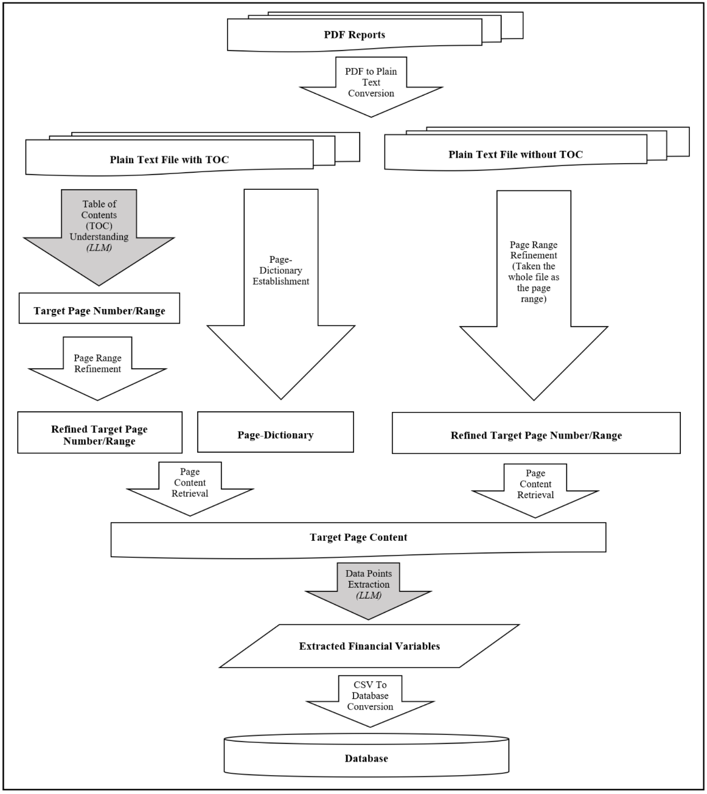

# Appendix E - Miscellaneous
\phantomsection
\ChapFrame[Miscellaneous][bhtyellow]

## Human in the loop application {#hitl}

Using \acr{LLM}s has become a lot easier in the past years. *Python*
frameworks as \acr{vllm} make it easy to deploy open-source models for
developers. *Open WebUI* allows us to set up a sophisticated chat bot UI
with ease. *Dify* promises to create no-code \acr{AI} agents via a
graphical flowchart. But the regular employee at \acr{RHvB} will just
use a provided application. And to solve the task, to extract (tabular)
information for loading it into a relational database, a chat UI seems
not the perfect match.

For the planned application we have two requirements: First, it should
be able to accurately extract information. Second, it has to provide a
good user experience.

Extracting the information of the assets table accurately means:

-   Numeric values have to be extracted and transformed according to
    potentially given currency units, e.g. *T€.*

-   The row labels should be matched with a limited set of labels in the
    target database.

-   Unknown row labels and their values have to treated in a appropriate
    way.

To ensure, that there are no mistakes, a \acr{HITL} approach should be
implemented. Figure \@ref(fig:hitl-workflow) shows that the employee
should initiate the extraction, by providing the document to extract
information from and potentially choose, what to extract. The employee
should also double check the results, before they are saved for future
usage in down stream tasks.

```{r hitl-workflow, fig.cap="Showing the information extraction process in a HITL application. The fed in document and results are saved in a database, that is used for the in-context learning RAG approaches for future extractions. The results are saved in the relational company database as well, e.g. as information to present in dashboards.", out.width="100%", echo=FALSE}
knitr::include_graphics("images/HITL_flowchart.png")
```

Why do we aim to build an application that assists the process instead
of fully automating it? On one hand, building a system that makes no
mistakes might be impossible. And it would be more efficient, to ensure
machine-readable data provision in the first place.

On the other hand, building a \acr{HITL} application, could increase the
employees acceptance for the product and trust in the results. An
assisting application is not as threatening as an application, that
fully automates a process, making the human redundant and potentially
leading to job cuts. Programms building on the machine learning paradigm
are rarely making decisions that are not seen as correct by a human. And
humans make errors as well. Teaming up with an \acr{AI} to reduce the
error rate, should increase the trust in the results, if this story is
sold right. (change management)

We believe, that the \acr{UX} would improve, if we can guide the user,
which values to check and which he can trust. This would reduce the work
load and might increase the feeling to spend the time meaningful, by
finding the same amount of mistakes, while checking less values. Thus,
we formulate our side research question:

```{r, include=knitr::is_html_output(), results='asis', echo=FALSE}
cat("<ol class='rs-questions' style='--counter: 3;'><li>Can we use additional information from the extraction process, to guide the user which values need to be checked and which can be trusted as they are?</li></ol>")
```

\begin{enumerate}[label={\textbf{Q\theenumi}}]
\setcounter{enumi}{3}
\item Can we use additional information from the extraction process, to guide the user which values need to be checked and which can be trusted as they are?
\end{enumerate}

Of course, mistakes not only happen by extracting a wrong value, but by
matching the values row with the wrong row labels from the predefined
set. This can happen, because they are similar but not equal or because
the row label at hand is not present in the predefined set yet. Having a
human in the loop, seems to be a good way to handle such unknown row
labels as well.

The \acr{UI} should assist in all cases. Comparing numeric values,
checking the row label matching and showing, which rows have not been
handled yet and need human decisions. Figure \@ref(fig:compare-results)
shows a first mockup, about what has to be compared focussing on a
single years numeric values and the row lable matching. A \acr{UX} study
should answer questions, how exactly the \acr{UI} should look like and
if the employee prefers to check the identified page, before the
extraction begins (see the human shape with question marks in Figure
\@ref(fig:hitl-workflow)).

```{r compare-results, fig.cap="Showing the information that need to be compared by the user after the information extraction. Unmatched rows could be highlighted in another color.", out.width="100%", echo=FALSE}

```

human in the loop [@natarajanHumanintheloopAIintheloopAutomate2024;
@mosqueira-reyHumanintheloopMachineLearning2023;
@wuSurveyHumanintheloopMachine2022]

-   allowing in place adjustments to the extracted data.

## Local machine {#local-machine}

One can find the specifications of the local machine used to run the tasks that do not require a \acr{GPU} below. It is a lightweight laptop device. Its performance cores support hyper-threading and have a clock range between 2.1 and 4.7 GHz. Due to its slim design, there is little active cooling. Thus, thermal throttling starts quickly. It is a reasonable assumption that most local benchmarks are running at 2.1 GHz. Despite this handicap, it has a sufficiently large RAM of 32 GB and 3 TB of NVMe disk space.

### System Details Report {.unlisted .unnumbered}

#### Report details {.unlisted .unnumbered}

-   **Date generated:** 2025-07-19 13:56:16

#### Hardware Information: {.unlisted .unnumbered}

-   **Hardware Model:** LG Electronics 17ZB90Q-G.AD79G
-   **Memory:** 32.0 GiB
-   **Processor:** 12th Gen Intel® Core™ i7-1260P × 16
-   **Graphics:** Intel® Graphics (ADL GT2)
-   **Disk Capacity:** 3.0 TB

#### Software Information: {.unlisted .unnumbered}

-   **Firmware Version:** A2ZG0150 X64
-   **OS Name:** Ubuntu 24.04.2 LTS
-   **OS Build:** (null)
-   **OS Type:** 64-bit
-   **GNOME Version:** 46
-   **Windowing System:** Wayland
-   **Kernel Version:** Linux 6.11.0-29-generic

## Benchmarks

### Text extraction {#text-extraction-benchmark}

```{r text-extraction, echo=echo_flag, warning=warning_flag, message=message_flag, cache=TRUE, cache.extra = tools::md5sum("../benchmark_results/text_extraction_benchmark_results.csv")}
data_text_extraction <- read.csv("../benchmark_results/text_extraction_benchmark_results.csv") %>% 
  arrange(runtime) %>% 
  rename("package" = "pdfbackend", "runtime in s" = "runtime")

# Find the lowest value in the "runtime in s" column and make it bold
data_text_extraction <- data_text_extraction %>%
  mutate(
    `runtime in s` = round(`runtime in s`, 0), # Ensure the column is numeric
    `runtime in s` = ifelse(
      `runtime in s` == min(`runtime in s`, na.rm = TRUE),
      paste0("**", `runtime in s`, "**"),
      `runtime in s`
    )
  )
```

All our experiments use the text extracted from PDF files. The available open-source libraries differ in their speed, quality of results and restrictiveness of licensing [@auerDoclingTechnicalReport2024 ]. We have tested multiple libraries in this thesis, because @auerDoclingTechnicalReport2024  published no quantitative results. The benchmark runs on the local machine described in section \@ref(local-machine). There are `r total_pages` pages to extract the text from.

Table \@ref(tab:display-data-text-extraction) shows, that *pdfium* and *pymupdf* extract the text fastest. For implementation in a system where the text has to get extracted live or frequently the speed of the library might be paramount. Since the AGPL license of *pymupdf* might not be met with the application, that will be created for \acr{RHvB}, *pdfium* is an interesting candidate for the PDF parsing library to use.

@auerDoclingTechnicalReport2024  reports, that *pdfium* occasionally merges text cells that are not close o each other, resulting in unrecoverable quality issues. Thus we checked some of the extracted texts manually and include the PDF extraction backend as a variable in our experiments. The page identification experiment, using the \acr{regex} approach, shows no effect of the text extraction library. In contrast, we find an effect in the later performed information extraction experiment on synthetic **Aktiva** tables with the \acr{regex} approach.

Some examples for errorneous extracted texts with *pdfium* and *pdfminer* can be found in section \@ref(regex-extraction-mistakes).

time to ocr 107 images with pdf2image and pytesseract: 1:28+11:41

```{r display-data-text-extraction, echo=echo_flag, warning=warning_flag, message=message_flag, results="asis"}
render_table(data_text_extraction, alignment="lr", caption="Comparing extraction time (in seconds) for different Python package", ref = opts_current$get("label"), dom="t")
```

### Table detection {#table-detection-benchmark}

```{r table-detection-data-loading, echo=echo_flag, warning=warning_flag, message=message_flag}
# Get a list of all .json files in the folder
json_files_table_detection <- list.files("../benchmark_results/table_detection/", pattern = "\\.json$", full.names = TRUE)

meta_list <- list()

# Loop through each .json file
for (file in json_files_table_detection) {
  # Read the JSON file
  json_data <- fromJSON(file)
  
  # Extract the threshold and metrics from the "metrics" key
  metrics <- as.data.frame(fromJSON(json_data$metrics))
  
  lst <- list(
    metrics = metrics,
    model = basename(file),
    runtime = json_data$runtime
  )
  meta_list[[length(meta_list) + 1]] <- lst
}

table_detection_result_list <- meta_list %>% 
  tibble() %>% unnest_wider(".") %>% 
  mutate(model = str_remove(model, ".json"))

# Plot the metrics over threshold
metric_plots <- list()

for (result in meta_list) {
  table_detection_plot <- ggplot(result$metrics, aes(x = threshold)) +
    geom_line(aes(y = precision, color = "Precision")) +
    geom_line(aes(y = recall, color = "Recall")) +
    geom_line(aes(y = recall_target, color = "Recall for tables of interest")) +
    geom_line(aes(y = F1, color = "F1")) +
    labs(
      title = str_replace(result$model, ".json", ""),
      subtitle = paste("Runtime:", round(result$runtime, 0) , "s"),
      x = "Threshold",
      y = "Metric Value",
      color = "Metric"
    ) +
    # theme_minimal() +
    theme(legend.position = "bottom") +
    coord_cartesian(ylim = c(0,1))
  
  metric_plots[[length(metric_plots) + 1]] <- list(image = table_detection_plot, title = str_replace(result$model, ".json", ""))
}

json_files_table_detection_llm <- list.files("../benchmark_results/table_detection/llm/", pattern = "\\.json$", full.names = TRUE)

meta_list_llm <- list()

# Loop through each .json file
for (file in json_files_table_detection_llm) {
  # Read the JSON file
  json_data <- fromJSON(file)
  
  # Extract the threshold and metrics from the "metrics" key
  metrics <- as.data.frame(json_data$metrics)
  
  lst <- list(
    metrics = metrics,
    model = basename(file),
    runtime = json_data$runtime
  )
  meta_list_llm[[length(meta_list_llm) + 1]] <- lst
}

results_df_llm <- data.frame(
  llm = character(),
  parameters = character(),
  method = character(),
  loop = numeric(),
  # acc = numeric(),
  # precision = numeric(),
  # recall = numeric(),
  F1_Aktiva = numeric(),
  runtime_in_s = numeric(),
  stringsAsFactors = FALSE
)

for (result in meta_list_llm) {
  
  name_split = result$model %>% str_split("__")
  name_split = name_split[[1]]
  
  llm = name_split[1]
  parameters = str_extract(llm, "\\d*\\.?\\d+B")
  method = name_split[length(name_split)-1]
  loop = name_split[length(name_split)] %>% str_remove(".json") %>% str_remove("loop_") %>% as.integer()
  F1_Aktiva = result$metrics$Aktiva.f1_score
  runtime = result$runtime
  
  results_df_llm <- results_df_llm %>%
    add_row(
      llm = llm,
      parameters = parameters,
      method = method,
      loop = loop,
      # acc = acc,
      # precision = precision,
      # recall = recall,
      F1_Aktiva = F1_Aktiva, #round(F1_Aktiva, 2),
      runtime_in_s = round(runtime, 2)
    )
}

pr_auc_custom <- function(df_temp) {
  DescTools::AUC(c(0,df_temp$precision), c(1,df_temp$recall))
}

df_table_detection_result <- table_detection_result_list %>%
  rowwise() %>% mutate(
    runtime = to_minutes(runtime), 
    pr_auc = pr_auc_custom(metrics)
    ) %>% ungroup()
```

#### old classification with llm

First experiments for the page identification task ran on a smaller dataset. The pages used for this setup are the pages, that are classified as target class by the regular expression approach. Without batch processing and the \acr{vllm} framework classifying these `r json_data$results %>% fromJSON() %>% nrow()` pages already takes very long. This motivated the test, if image detection models can be used for the page refinement by detecting tables. Subsection \@ref(yolo) shows the results of this attempt.

benchmark and n-shot base for llm classification (contrasts)

#### yolo benchmark and table transformer {#yolo}

We test three visual models, trained for table detection. One is based on Microsofts table transformer. The other two are based on Ultralytics Yolo 12 and differ in their parameter size:

* microsoft/table-transformer-detection
* yolo12l-doclaynet
* yolo12n-doclaynet

The Yolo models performed much better. Up to a threshold of 0.5 they show a recall of around 1 and a precision over 0.95. Thus, they can be used to refine the page range, by identifying all pages that have a table. The table transformer model has a worse precision of around 0.7

microsoft `r filter(table_detection_result_list, model == "microsoft-table-transformer-detection")$runtime %>% to_minutes()` min
yolo large `r filter(table_detection_result_list, model == "yolo12l-doclaynet")$runtime %>% to_minutes()` min
yolo nano `r filter(table_detection_result_list, model == "yolo12n-doclaynet")$runtime %>% to_minutes()` min

```{r df-yolo}
df_table_detection_result %>% 
  select(model, runtime, pr_auc) %>% 
  mutate(pr_auc = format_floats(pr_auc, 3))
```


```{r pr-curve-yolo}
table_detection_result_list %>% rowwise() %>% 
  mutate(metrics = list(bind_rows(metrics, c(precision = 0, recall = 1)))) %>% 
  unnest(metrics) %>% 
  ggplot() + 
  geom_line(aes(x = precision, y = recall, color = model), alpha = 0.6) +
  theme(
    legend.position = "bottom"
  )
```


```{r metric-plots-slider, echo=echo_flag, warning=warning_flag, message=message_flag, class.chunk='image-slider', out.width="100%", results='asis'}
for (entry in metric_plots) {
  print(entry$image)
  cat(paste0("<span class='image-caption'>You see the plot for: ",entry$title,". \n(Click to stop automatic rotation.)</span>"))
}
```

```{r metric-plots-selector, echo=echo_flag, warning=warning_flag, message=message_flag, class.chunk='image-selector', out.width="100%", results='asis'}
for (entry in metric_plots) {
  print(entry$image)
  cat(paste0("<span class='image-caption'>",entry$title,"</span>"))
}
```

```{r display-results-df-llm, echo=echo_flag, warning=warning_flag, message=message_flag, eval=knitr::is_html_output(), results='asis'}
results_df_llm %>% 
  mutate(
    F1_Aktiva = round(F1_Aktiva, 2),
  ) %>% 
  render_table(
    alignment = "lllrr",
    caption = "Results of the table detection benchmark with LLMs",
    ref = "display-results-df-llm"
  )
```

### Large language model process speed {#vllm-batch-speed}

In April 2025 there have been issues with running \acr{vllm} within the Python framework. Thus, the first experiments are conducted, using the *transformers* library. When we managed to build a working \acr{vllm} based docker image for the experiments, we measured, how long the same task takes with the *transformers* and the \acr{vllm} library and how the batched processing competes versus a loop approach. The model family used is Qwen2.5-Instruct. The task is to extract the information from ten real **Aktiva** tables.

Table \@ref(tab:llm-spped-mini-benchmark-table) shows that the experiments with \acr{vllm} run around four to five times faster. Processing the messages in a batched mode is six to seven times faster than using a looped approach. Thus, the change of the experimental setup from a *transformers* powered loop-based approach to a \acr{vllm} powered batched processing approach, increased the speed by 2500 %.

This allows us to run the page identification benchmark on whole an nual reports, giving a sound estimate of the false positive rate (see section \@ref(llm-page-identification)). Previous experiments were only conducted on a subset of pages, that were selected based on the results of the *simple regex* approach (see section \@ref(regex-page-identification)).

```{r llm-spped-mini-benchmark-table, echo=echo_flag, warning=warning_flag, message=message_flag}
data_llm_speed <- data.frame(
  # model = c("Qwen 2.5 Instruct"),
  parameters = c(0.5, 3, 7),
  transformers = c(330, 628, 940),
  vllm = c(65, 130, 217),
  vllm_batched = c(NA, 20, 30)
) %>% setNames(c("Model parameters (in B)", "Transformers", "vLLM", "vLLM batched"))

knitr::kable(data_llm_speed, caption = "Comparing time (in seconds) for extract the information from ten Aktiva tables using different libraries and approaches.")
```

## Prompts

### TOC understanding {#toc-understanding-promts}

Base prompt:

```{python, eval=FALSE}
    messages = [
        {"role": "system", "content": "You are a helpful assistant that can determine the page range information in a German financial report can be found at based on the documents table of contents."},
        {"role": "user", "content": f"This is the table of contents:\n\n{toc_string}"},
        {"role": "user", "content": f"On which pages might the win and loss statement (in German: Gewinn- und Verlustrechnung; GuV) and the balance sheets (German: Bilanz) be located? Give seperate answers for:\n\n1) the assets (German: Aktiva) table.\n2) the liabilities (German: Passiva) table.\n3) the win and loss statement."},
        specific_prompt,
        {"role": "user", "content": f"Answer in JSON format with keys 'GuV', 'Aktiva', and 'Passiva' and the page range as values."},
    ]
```

First attempt:

```{python, eval=FALSE}
specific_prompt = {"role": "user", "content": f"The assets and liabilities tables often are on separate pages. They are often located directly before the win and loss statement. Rarely the tables for any of the three can span multiple pages."}
```

Given hint that assets and liabilities are part of the balance sheet:

```{python, eval=FALSE}
specific_prompt = {"role": "user", "content": f"The assets and liabilities are part of the balance sheet (in German: Bilanz). The assets and liabilities tables often are on separate pages. They are often located directly before the win and loss statement. Rarely the tables for any of the three can span multiple pages."}
```

Stating, that liabilities are on next page:

```{python, eval=FALSE}
specific_prompt = {"role": "user", "content": f"The assets and liabilities are part of the balance sheet (in German: Bilanz). The liabilities table is often on the page after the assets table. They are often located directly before the win and loss statement. Rarely the tables for any of the three can span multiple pages."}
```

\acr{TOC} extraction from text prompt:

```{python, eval=FALSE}
    messages = [
        {"role": "system", "content": "[Role] You are a helpful assistant that can identify table of contents in a German financial report."},
        {"role": "system", "content": f"[Context] These are the text lines of the first {i} pages:\n\n{start_pages}"},
        {"role": "user", "content": f"[Tasks] 1. Please identify if there is a table of contents in the text."},
        {"role": "user", "content": f"2. If there is a table of contents, please extract its text."},
        {"role": "user", "content": f"3. Answer as JSON with the table of contents text as string in the key 'toc'."},
        {"role": "user", "content": f"If there is no table of contents, return an empty string."},
    ]
```

### Classification {#classification-prompts}

binary classification prompt factory

```{python, eval=FALSE}
messages = [{"role": "system", "content": "[Role and Context]: You are a helpful assistant that can classify texts extracted from PDFs."}]

if law_context:
    if classification_type == "GuV":
        messages.append({"role": "system", "content": f"You know the laws about how to structure the 'Gewinn- und Verlustrechnung' (profit and loss statement) table:' \n\n'''\n{hgb_guv}\n'''."})
    elif classification_type == "Aktiva":
        messages.append({"role": "system", "content": f"You know the laws about how to structure the 'Aktiva' (assets) table for a 'Bilanz' (balance sheet):' \n\n'''\n{hgb_aktiva}\n'''."})
    elif classification_type == "Passiva":
        messages.append({"role": "system", "content": f"You know the laws about how to structure the 'Passiva' (liabilities) table for a 'Bilanz' (balance sheet):' \n\n'''\n{hgb_passiva}\n'''."})
    else:
        raise ValueError(f"Unknown classification type: {classification_type}. Expected 'GuV', 'Aktiva', or 'Passiva'.")

if random_examples:
    system_messages = self.__get_random_example_message(classification_type, **kwargs)
    for msg in system_messages:
        messages.append({"role": "system", "content": msg})

if rag_examples:
    system_messages = self.__get_rag_example_message(text, classification_type, **kwargs)
    for msg in system_messages:
        messages.append({"role": "system", "content": msg})

if top_n_rag_examples:
    system_messages = self.__get_top_n_rag_example_message(text, classification_type, **kwargs)
    for msg in system_messages:
        messages.append({"role": "system", "content": msg})

messages.append({"role": "user", "content": f"[Task]: Decide if the given text contains {phrase_dict[classification_type]}.\n\n[Rule]: Answer with 'yes' if it does. Otherwise answer with 'no'.\n\n[Text]: Here is the text to classify: \n\n'''\n{text}\n'''"})
return messages
```

example for binary classification with 1 random example with Qwen 3

```{verbatim}
<|im_start|>system
/no_think [Role and Context]: You are a helpful assistant that can classify texts extracted from PDFs.<|im_end|>
<|im_start|>system
You know this example for a \'Gewinn- und Verlustrechnung\' (profit and loss statement) table and for this example you should answer with "no":

\'\'\'
28
2023
EUR
2022
EUR
EUR EUR
1. Umsatzerlöse 1.315.073,26 1.507.621,05
2. Sonstige betriebliche Erträge 562.644,72 631.803,96
3. Materialaufwand -388.989,26 -98.471,89
4. Abschreibungen -447.356,00 -460.923,00
5. Sonstige betriebliche Aufwendungen -907.414,53 -2.304.390,53
6. Sonstige Zinsen und ähnliche Erträge 95.260,94 -2.533,45
7. Ergebnis nach Steuern 229.219,13 -726.893,86
8. Sonstige Steuern -857.535,62 -879.289,10
9. Jahresfehlbetrag -628.316,49 -1.606.182,96
Gewinn- und Verlustrechnung
für die Zeit vom 01. Januar bis 31. Dezember 2023
\'\'\'.<|im_end|>
<|im_start|>system
You know this example for a \'Aktiva\' (assets) table and for this example you should answer with "yes":

\'\'\'
BEN Berlin Energie und Netzholding GmbH (vormals: Berlin Energie Rekom 2 GmbH)
Berlin
Bilanz zum 31.12.2021
Aktivseite 31.12.2021 31.12.2020 31.12.2021 31.12.2020
T€ T€ T€ T€
A. Anlagevermögen A. Eigenkapital
imv I. Immaterielle Vermögensgegenstände 0,8 - ek I. Gezeichnetes Kapital 25,0 25,0
bga II. Sachanlagen 73,1 - kr II. Kapitalrücklage 6,9 6,9
III. Finanzanlagen 2.094.146,0 - vv III. Verlustvortrag - 6,9 - 6,9
IV. Jahresüberschuss 1.326,7 -
 2.094.219,9 -
 1.351,7 25,0
B. Umlaufvermögen sor
unf I. Forderungen und sonstige B. Rückstellungen
 Vermögensgegenstände Sonstige Rückstellungen 265,1 6,7
Forderungen gegen verbundene
Unternehmen 423,1 - anzC. Verbindlichkeiten
1. Verbindlichkeiten gegenüber
fll II. Guthaben bei Kreditinstituten 166.662,0 39,2 vll Kreditinstituten 2.180.051,3 -
2. Verbindlichkeiten aus
 167.085,1 39,2 Lieferungen und Leistungen 91,9 1,9
3. Verbindlichkeiten gegenüber
 verbundenen Unternehmen 81.286,7 -
C. Rechnungsabgrenzungsposten 2.471,2 - vvu 4. Verbindlichkeiten gegenüber
 Gesellschaftern 713,9 5,6
5. Sonstige Verbindlichkeiten 15,6 -
 2.262.159,4 7,5
 2.263.776,2 39,2 2.263.776,2 39,2
Passivseite
 21-006917
\'\'\'.<|im_end|>
<|im_start|>system
You know this example for a \'Passiva\' (liabilities) table and for this example you should answer with "no":

\'\'\'
4 
 Bilanz Elektrizitätsverteilung 
Aktiva 31.12.2022
T€
Anlagevermögen
imv Immaterielle Vermögensgegenstände -
bga Sachanlagen -
Finanzanlagen -
 -
Umlaufvermögen
unf Forderungen und sonstige Vermögensgegenstände 329,6
davon Verrechnungsposten gegenüber anderen Aktivitäten 289,9
fll Guthaben bei Kreditinstituten -
 329,6
Rechnungsabgrenzungsposten 17,9
 347,6
Passiva 31.12.2022
T€
Eigenkapital
ek Gezeichnetes Kapital -
kr Kapitalrücklage -
vv Gewinnrücklage/Verlustvortrag -
Jahresüberschuss 0,1
 0,1
Rückstellungen
Sonstige Rückstellungen 258,4
Verbindlichkeiten
anz Verbindlichkeiten gegenüber Kreditinstituten -
vll Verbindlichkeiten aus Lieferungen und Leistungen 89,0
Verbindlichkeiten gegenüber Gesellschaftern -
Sonstige Verbindlichkeiten -
 89,0
 347,6
\'\'\'.<|im_end|>
<|im_start|>system
You know this example for a text that does not suit the categories of interest and for this example you should answer with "no":

\'\'\'
Bericht des 
Aufsichtsrates
Sehr geehrte Damen, 
sehr geehrte Herren,
mit diesem Bericht informieren wir über unsere Tätigkeit im Geschäftsjahr 2016 
und das Ergebnis der Prüfung des Jahresabschlusses. Die uns nach Gesetz, Satzung 
und Geschäftsordnung obliegenden Kontroll- und Beratungsaufgaben haben 
wir verantwortungsvoll und mit der gebührenden Sorgfalt wahrgenommen. Dabei 
haben wir den Vorstand bei der Leitung der GESOBAU beratend begleitet, seine 
Tätigkeit überwacht und waren in alle für die Gesellschaft grundlegend bedeutenden 
Entscheidungen unmittelbar eingebunden. Der Vorstand ist seinen Informations\x02pflichten uneingeschränkt nachgekommen und hat uns regelmäßig sowohl schrift\x02lich als auch mündlich informiert. Dies geschah zeitnah und umfassend zu allen 
Aspekten der Unternehmensplanung, dem Verlauf der Geschäfte, der strategischen 
Weiterentwicklung sowie der aktuellen Lage des Unternehmens. Planabweichungen 
beim Geschäftsverlauf wurden uns im Einzelnen erläutert und mit schlüssigen 
Argumenten begründet. Der Vorstand stimmte die strategische Ausrichtung des 
Unternehmens vertrauensvoll mit uns ab. Die für das Unternehmen bedeutenden 
Geschäftsvorgänge haben wir auf der Basis der Berichte des Vorstandes ausführlich 
erörtert und seinen Beschlussvorschlägen nach gründlicher Prüfung und Beratung 
zugestimmt.
Sitzungen
Im Berichtsjahr fanden vier turnusgemäße und eine außerordentliche Sitzung statt. 
Die Sitzungen des Aufsichtsrates sind von einem intensiven und offenen Austausch 
geprägt. Ein Mitglied des Aufsichtsrates hat im abgelaufenen Geschäftsjahr an 
weniger als der Hälfte der Sitzungen teilgenommen. Aufgrund besonderer Eilbe\x02dürftigkeit erfolgten in Abstimmung mit der Vorsitzenden des Aufsichtsrates vier 
Beschlussfassungen im Umlaufverfahren.
Die Mitglieder des Aufsichtsrates bereiten sich auf anstehende Beschlüsse regelmäßig 
auch anhand von Unterlagen vor, die der Vorstand vorab zur Verfügung stellt. Dabei 
wurden sie von den jeweils zuständigen Ausschüssen unterstützt. Die Aufsichtsrats\x02sitzungen werden zudem von den Arbeitnehmervertretern in Gesprächen mit dem 
Vorstand vorbereitet.
Information durch den Vorstand
Über die wichtigsten Indikatoren der Geschäftsentwicklung und bestehende Risiken 
unterrichtet der Vorstand den Aufsichtsrat anhand schriftlicher Quartalsberichte. 
Zwischen den Sitzungsterminen des Aufsichtsrates und seiner Ausschüsse wurde 
die Aufsichtsratsvorsitzende ausführlich unterrichtet. Hierbei wurde die Strategie 
des Unternehmens besprochen, wie auch die aktuelle Geschäftsentwicklung und 
-lage, das Risikomanagement, Fragen der Compliance sowie wesentliche Einzel\x02themen und bevorstehende bedeutsame Entscheidungen erörtert.
16 Perspektiven Bericht des Aufsichtsrates
\'\'\'.<|im_end|>
<|im_start|>user
[Task]: Decide if the given text contains a \'Aktiva\' (assets) table.

[Rule]: Answer with \'yes\' if it does. Otherwise answer with \'no\'.

[Text]: Here is the text to classify: 

\'\'\'
22 Amt für Statistik Berlin-Brandenburg | Geschäftsbericht 2014
Amt für Statistik Berlin-Brandenburg Anstalt des öffentlichen Rechts, Potsdam
Bilanz zum 31. Dezember 2014
A K T I V S E I T E 31.12.2014 Vorjahr 
EUR EUR TEUR 
A. ANLAGEVERMÖGEN 
I. Immaterielle Vermögensgegenstände 
1. Entgeltlich erworbene Konzessionen, gewerbliche 
Schutzrechte und ähnliche Rechte und Werte 
sowie Lizenzen an solchen Rechten und Werten 81.480,00 146
II. Sachanlagen
1. Grundstücke, grundstücksgleiche Rechte und Bauten 
einschließlich der Bauten auf fremden Grundstücken 68.386,00 93
2. Andere Anlagen, Betriebs- und Geschäftsausstattung 140.186,00 174 
208.572,00 267
III. Finanzanlagen 
1. Wertpapiere des Anlagevermögens 2.000.000,00 2.000 
2.000.000,00 2.000 
2.290.052,00 2.413
B. UMLAUFVERMÖGEN 
I. Forderungen und sonstige Vermögensgegenstände 
1. Forderungen aus Lieferungen und Leistungen 36.617,86 14 
2. Sonstige Vermögensgegenstände 297.982,42 267 
334.600,28 281 
II. Kassenbestand, Bundesbankguthaben, Guthaben bei 
Kreditinstituten und Schecks 5.560.638,85 7.783
5.895.239,13 8.064
C. RECHNUNGSABGRENZUNGSPOSTEN 216.321,49 213
8.401.612,62 10.690 
Bestätigungsvermerk 
des Abschlussprüfers
Anhang
\'\'\'<|im_end|>
<|im_start|>assistant
```

multi-class classification prompt factory

```{python, eval=FALSE}
messages = [
  {"role": "system", "content": "[Role and Context]: You are a helpful assistant that can classify texts extracted from PDFs."},
]

if law_context:
  messages.append({"role": "system", "content": f"You know the laws about how to structure the 'Gewinn- und Verlustrechnung' (profit and loss statement) table:' \n\n'''\n{hgb_guv}\n'''."})
  messages.append({"role": "system", "content": f"You also know the laws about how to structure the 'Aktiva' (assets) and 'Passiva' (liabilities) table for a 'Bilanz' (balance sheet):' \n\n'''\n{hgb_bilanz}\n'''."})

if random_examples:
  system_messages = self.__get_random_example_message(**kwargs)
  for msg in system_messages:
      messages.append({"role": "system", "content": msg})

if rag_examples:
  system_messages = self.__get_rag_example_message(text, **kwargs)
  for msg in system_messages:
      messages.append({"role": "system", "content": msg})

if top_n_rag_examples:
  system_messages = self.__get_top_n_rag_example_message(text, **kwargs)
  for msg in system_messages:
      messages.append({"role": "system", "content": msg})

messages.append({"role": "user", "content": f"""
[Task]: Decide of what type the given text is. You can differentiate between four types of pages: 'Aktiva', 'GuV', 'Passiva' and 'other'.\n\n
[Rules]:\n
  1) If the text contains a 'Gewinn- und Verlustrechnung' (profit and loss statement) table, answer with 'GuV'.\n\n
  2) If the text contains an 'Aktiva' (assets) table, answer with 'Aktiva'.\n\n
  3) If the text contains a 'Passiva' (liabilities) table, answer with 'Passiva'.\n\n
  4) If the text contains something else, answer with 'other'.\n\n
[Text]: Here is the text to classify: \n\n'''\n{text}\n'''
"""})
```

example for multi-class classification with 1 rag example with Qwen 3

```{verbatim}
<|im_start|>system
/no_think [Role and Context]: You are a helpful assistant that can classify texts extracted from PDFs.<|im_end|>
<|im_start|>system
You know this example for a \'Gewinn- und Verlustrechnung\' (profit and loss statement) table and for this example you should answer with "GuV":

"""
74
Gewinn- und Verlustrechnung für die Zeit vom 01.01.2014 bis 31.12.2014
Aufwendungen in TEUR Vorjahr
1. Zinsaufwendungen 302.081 314.077
2. Provisionsaufwendungen 714 656
4. Allgemeine Verwaltungsaufwendungen
a) Personalaufwand
 aa) Löhne und Gehälter
 ab) Soziale Abgaben und Aufwendungen
 für Altersversorgung und für Unterstützung
 darunter: für Altersversorgung
b) andere Verwaltungsaufwendungen
 
39.535
9.009
2.417
48.544
31.161
79.705
39.310
11.020
4.651
50.330
24.983
75.313
5. Abschreibungen und Wertberichtigungen auf immaterielle
Anlagewerte und Sachanlagen 3.647 3.707
6. Sonstige betriebliche Aufwendungen 25.803 26.412
7. Abschreibungen und Wertberichtigungen auf Forderungen und 
bestimmte Wertpapiere sowie Zuführungen zu 
Rückstellungen im Kreditgeschäft 25.366 14.666
8. Abschreibungen und Wertberichtigungen auf Beteiligungen,
Anteile an verbundenen Unternehmen
und wie Anlagevermögen behandelte Wertpapiere 421 0
9. Aufwendungen aus Verlustübernahme 1.268 0
13. Sonstige Steuern, soweit nicht unter Posten 6 ausgewiesen 65 80
15. Jahresüberschuss 25.863 36.897
Summe der Aufwendungen 464.933 471.808
Jahresüberschuss 25.863 36.897
Gewinnvortrag aus dem Vorjahr 0 0
Bilanzgewinn 25.863 36.897
An unsere Geschäftspartner | Grußwort der Vorsitzenden des Verwaltungsrats | Bericht des Verwaltungsrats
Wohnungsbauförderung | Wirtschaftsförderung | Beteiligungen | Immobilien- und Stadtentwicklung | Personalbericht | Nachhaltigkeit 
Lagebericht | Jahresabschluss | Anhang | Bestätigungsvermerk | Corporate-Governance-Bericht | Organigramm
""". (The L2 distance of this example text is: 0.562)<|im_end|>
<|im_start|>system
You know this example for a \'Aktiva\' (assets) table and for this example you should answer with "Aktiva":

"""
52 Gruppenbilanz
Gruppenbilanz zum 31. Dezember 2016
A K T I V A 31. 12. 2016 31. 12. 2015
€ € €
A. ANLAGEVERMÖGEN
I. Immaterielle Vermögensgegenstände
Entgeltlich erworbene Konzessionen, gewerbliche 
Schutzrechte und ähnliche Rechte 122.148,00 185.602,00
II. Sachanlagen
1. Anlageimmobilien 3.423.064.255,69 3.338.758.481,04
2. übrige Grundstücke und Bauten 4.143.376,87 1.087.406,00
3. technische Anlagen und Maschinen 120.700,00 149.667,00
4. andere Anlagen, Betriebs- und Geschäftsausstattung 5.143.477,51 4.555.161,48
5. geleistete Anzahlungen und Anlagen im Bau 1.007.468,36 180.543,58
3.433.479.278,43 3.344.731.259,10
III. Finanzanlagen
1. Anteile an verbundenen Unternehmen 1.026.647,27 1.027.646,27
2. Ausleihungen an verbundene Unternehmen 157.645,00 214.395,00
3. Beteiligungen 284.138,88 40.073,02
4. sonstige Ausleihungen 120.966,91 120.966,91
1.589.398,06 1.403.081,20
3.435.190.824,49 3.346.319.942,30
B. UMLAUFVERMÖGEN
I. Vorräte
1. unfertige Leistungen 48.642.315,18 52.057.422,25
2. andere Vorräte 13.053,63 21.315,99
48.655.368,81 52.078.738,24
II. Forderungen und sonstige Vermögensgegenstände
1. Forderungen aus Lieferungen und Leistungen 32.107.301,91 35.679.035,16
2. Forderungen gegen verbundene Unternehmen 74.457,55 554.130,28
3. Forderungen gegen Unternehmen, 
mit denen ein Beteiligungsverhältnis besteht 108.647,73 23.698,71
4. sonstige Vermögensgegenstände 100.560.866,41 100.896.144,88
132.851.273,60 137.153.009,03
III. Wertpapiere
sonstige Wertpapiere 1.700,00 1.700,00
IV. Kassenbestand, Guthaben bei Kreditinstituten 893.140.123,18 689.887.519,98
1.074.648.465,59 879.120.967,25
C. RECHNUNGSABGRENZUNGSPOSTEN 9.245.284,80 9.917.197,12
D. AKTIVER UNTERSCHIEDSBETRAG AUS DER 
VERMÖGENSVERRECHNUNG 68.523,69 0,00
4.519.153.098,57 4.235.358.106,67
 
""". (The L2 distance of this example text is: 0.421)<|im_end|>
<|im_start|>system
You know this example for a \'Passiva\' (liabilities) table and for this example you should answer with "Passiva":

"""
Anlage 1
BEN Berlin Energie und Netzholding GmbH
Berlin
Bilanz zum 31.12.2023
Aktivseite 31.12.2023 31.12.2022 31.12.2023 31.12.2022
T€ T€ T€ T€
A. Anlagevermögen A. Eigenkapital
imv I. Immaterielle Vermögensgegenstände 58,0 20,2 ek I. Gezeichnetes Kapital 25,0 25,0bga II. Sachanlagen 106,7 70,7 kr II. Kapitalrücklage 6,9 6,9
III. Finanzanlagen 2.194.146,0 2.094.146,0 vv III. Gewinnrücklage/Verlustvortrag 41.023,4 1.319,8
IV. Jahresüberschuss 51.158,5 39.703,6
 2.194.310,6 2.094.236,9
 92.213,8 41.055,3
B. Umlaufvermögen sor
unf I. Forderungen und sonstige B. Rückstellungen
 Vermögensgegenstände Sonstige Rückstellungen 4.759,3 460,0
1. Forderungen aus Lieferungen und Leistungen 73,1 70,72. Forderungen gegen verbundene C. Verbindlichkeiten Unternehmen 96.998,2 60.960,4 anz 1. Verbindlichkeiten gegenüber 3. Sonstige Vermögensgegenstände 988,6 923,3 Kreditinstituten 2.317.498,9 2.148.050,6
fll II. Guthaben bei Kreditinstituten 226.047,2 160.535,8 vll 2. Verbindlichkeiten aus
 Lieferungen und Leistungen 272,0 158,4
 324.107,1 222.490,2 3. Verbindlichkeiten gegenüber 
 verbundenen Unternehmen 104.704,9 128.407,54. Verbindlichkeiten gegenüber 
C. Rechnungsabgrenzungsposten 1.969,9 2.207,9 vvu Gesellschaftern 695,8 706,1
5. Sonstige Verbindlichkeiten 242,9 97,1
 2.423.414,4 2.277.419,7
 2.520.387,6 2.318.935,0 2.520.387,6 2.318.935,0
Passivseite
3
""". (The L2 distance of this example text is: 0.481)<|im_end|>
<|im_start|>system
You know this example for a text that does not suit the categories of interest and for this example you should answer with "other":

"""
46 Konzernbilanz
Konzernbilanz zum 31. Dezember 2013
A K T I V A 31. 12. 2013 31. 12. 2012
€ € €
A. ANLAGEVERMÖGEN
I. Immaterielle Vermögensgegenstände
Konzessionen, gewerbliche Schutzrechte und ähnliche 
Rechte
344.384,00 461.417,00
II. Sachanlagen
1. Grundstücke und Bauten 1.242.921,00 1.272.566,00
2. Technische Anlagen und Maschinen 122.769,00 62.405,00
3. Andere Anlagen, Betriebs- und Geschäftsausstattung 2.339.362,51 1.562.893,45
4. Geleistete Anzahlungen 704,76 33.483,89
3.705.757,27 2.931.348,34
III. Finanzanlagen
1. Anteile an verbundenen Unternehmen 3.201.349,87 3.201.436,42
2. Ausleihungen an verbundene Unternehmen 217.680,00 223.395,00
3. Beteiligungen 42.171.545,24 54.585.174,81
4. Sonstige Ausleihungen 76.015.926,17 99.994.824,65
121.606.501,28 158.004.830,88
125.656.642,55 161.397.596,22
B. UMLAUFVERMÖGEN
I. Vorräte
1. Unfertige Leistungen 12.885.172,94 8.843.369,97
2. Zum Verkauf bestimmte Grundstücke und Gebäude 139.000,00 139.002,00
3. Andere Vorräte 61.319,05 93.039,06
13.085.491,99 9.075.411,03
II. Forderungen und sonstige Vermögensgegenstände
1. Forderungen aus Lieferungen und Leistungen 8.666.340,95 12.099.596,63
2. Forderungen gegen verbundene Unternehmen 1.409.363,51 7.573.168,86
3. Forderungen gegen Unternehmen, 
mit denen ein Beteiligungsverhältnis besteht
555.093,06 1.651.573,06
4. Sonstige Vermögensgegenstände 345.991.815,13 163.003.969,98
356.622.612,65 184.328.308,53
III. Wertpapiere
Sonstige Wertpapiere 52.252.850,00 59.329.212,00
IV. Kassenbestand, Guthaben bei Kreditinstituten 152.594.976,48 248.363.122,67
574.555.931,12 501.096.054,23
C. RECHNUNGSABGRENZUNGSPOSTEN 7.545.702,82 7.957.871,65
707.758.276,49 670.451.522,10
Treuhandvermögen 1.943.915.141,66 1.953.309.522,69
""". (The L2 distance of this example text is: 0.434)<|im_end|>
<|im_start|>user

[Task]: Decide of what type the given text is. You can differentiate between four types of pages: \'Aktiva\', \'GuV\', \'Passiva\' and \'other\'.


[Rules]:

1) If the text contains a \'Gewinn- und Verlustrechnung\' (profit and loss statement) table, answer with \'GuV\'.


2) If the text contains an \'Aktiva\' (assets) table, answer with \'Aktiva\'.


3) If the text contains a \'Passiva\' (liabilities) table, answer with \'Passiva\'.


4) If the text contains something else, answer with \'other\'.


[Text]: Here is the text to classify: 

\'\'\'
22 Amt für Statistik Berlin-Brandenburg | Geschäftsbericht 2014
Amt für Statistik Berlin-Brandenburg Anstalt des öffentlichen Rechts, Potsdam
Bilanz zum 31. Dezember 2014
A K T I V S E I T E 31.12.2014 Vorjahr 
EUR EUR TEUR 
A. ANLAGEVERMÖGEN 
I. Immaterielle Vermögensgegenstände 
1. Entgeltlich erworbene Konzessionen, gewerbliche 
Schutzrechte und ähnliche Rechte und Werte 
sowie Lizenzen an solchen Rechten und Werten 81.480,00 146
II. Sachanlagen
1. Grundstücke, grundstücksgleiche Rechte und Bauten 
einschließlich der Bauten auf fremden Grundstücken 68.386,00 93
2. Andere Anlagen, Betriebs- und Geschäftsausstattung 140.186,00 174 
208.572,00 267
III. Finanzanlagen 
1. Wertpapiere des Anlagevermögens 2.000.000,00 2.000 
2.000.000,00 2.000 
2.290.052,00 2.413
B. UMLAUFVERMÖGEN 
I. Forderungen und sonstige Vermögensgegenstände 
1. Forderungen aus Lieferungen und Leistungen 36.617,86 14 
2. Sonstige Vermögensgegenstände 297.982,42 267 
334.600,28 281 
II. Kassenbestand, Bundesbankguthaben, Guthaben bei 
Kreditinstituten und Schecks 5.560.638,85 7.783
5.895.239,13 8.064
C. RECHNUNGSABGRENZUNGSPOSTEN 216.321,49 213
8.401.612,62 10.690 
Bestätigungsvermerk 
des Abschlussprüfers
Anhang
\'\'\'
        <|im_end|>
<|im_start|>assistant
```

## Regular expressions {#regex-page-identification-code}

Here one can find the three regular expressions used for the benchmarks presented in section \@ref(regex-page-identification).

```{python simple-regex-page-identification, eval=FALSE, class.source = 'fold-show'}
simple_regex_patterns = {
    "Aktiva": [
        r"aktiva",
        r"((20\d{2}).*(20\d{2}))"
    ],
    "Passiva": [
        r"passiva",
        r"((20\d{2}).*(20\d{2}))"
    ],
    "GuV": [
        r"gewinn",
        r"verlust",
        r"rechnung",
        r"((20\d{2}).*(20\d{2}))"
    ]
}
```

```{python exhaustive-restricted-regex-page-identification, eval=FALSE, class.source = 'fold-show'}
regex_patterns_5 = {
    "Aktiva": [
        r"a\s*k\s*t\s*i\s*v\s*a|a\s*k\s*t\s*i\s*v\s*s\s*e\s*i\s*t\s*e|anlageverm.{1,2}gen",
        r"((20\d{2}).*(20\d{2}))|((20\d{2}).*vorjahr)|vorjahr",
        r"Umlaufverm.{1,2}gen|Anlageverm.{1,2}gen|Rechnungsabgrenzungsposten|Forderungen",
        r"\s([a-zA-Z]|[0-9]{1,2}|[iI]+)[\.\)]\s"
    ],
    "Passiva": [
        r"p\s*a\s*s\s*s\s*i\s*v\s*a|p\s*a\s*s\s*s\s*i\s*v\s*s\s*e\s*i\s*t\s*e|eigenkapital",
        r"((20\d{2}).*(20\d{2}))|((20\d{2}).*vorjahr)|vorjahr",
        r"Eigenkapital|R.{1,2}ckstellungen|Verbindlichkeiten|Rechnungsabgrenzungsposten",
        r"\s([a-zA-Z]|[0-9]{1,2}|[iI]+)[\.\)]\s"
    ],
    "GuV": [
        r"gewinn|guv",
        r"verlust|guv",
        r"rechnung|guv",
        r"((20\d{2}).*(20\d{2}))|vorjahr"
        r"Umsatzerl.{1,2}se|Materialaufwand|Personalaufwand|Abschreibungen|Jahres.{1,2}berschuss|Jahresfehlbetrag|Steuern|Vertriebskosten|Verwaltungskosten|Aufwendungen|Ertr.{1,2}ge",
        r"\s([a-zA-Z]|[0-9]{1,2}|[iI]+)[\.\)]\s"
    ]
}
```

```{python exhaustive-regex-page-identification, eval=FALSE, class.source = 'fold-show'}
regex_patterns_3 = {
    "Aktiva": [
        r"a\s*k\s*t\s*i\s*v\s*a|a\s*k\s*t\s*i\s*v\s*s\s*e\s*i\s*t\s*e|anlageverm.{1,2}gen",
        r"((20\d{2}).*(20\d{2}))|((20\d{2}).*vorjahr)|vorjahr"
    ],
    "Passiva": [
        r"p\s*a\s*s\s*s\s*i\s*v\s*a|p\s*a\s*s\s*s\s*i\s*v\s*s\s*e\s*i\s*t\s*e|eigenkapital",
        r"((20\d{2}).*(20\d{2}))|((20\d{2}).*vorjahr)|vorjahr"
    ],
    "GuV": [
        r"gewinn|guv",
        r"verlust|guv",
        r"rechnung|guv",
        r"((20\d{2}).*(20\d{2}))|vorjahr"
    ]
}
```

## Annual Comprehensive Financial Report Balance Sheet

```{r acfr23-balance-sheet, out.width="100%", out.height="95%", out.extra='keepaspectratio', echo=echo_flag, warning=warning_flag, message=message_flag, fig.cap=c("Example balance sheet pagefom Californias Annual Comprehensive Financial Report 2023"), class.chunk='pdf-embed'}
knitr::include_graphics("./images/acfr23_balance.pdf")
```

## Extraction framework flow chart

(ref:flow-chart-caption) Flowchart of the extraction framework of @auerDoclingTechnicalReport2024 

```{r extraction-framework-flow-chart, out.width="100%", out.height="95%", out.extra='keepaspectratio', echo=echo_flag, warning=warning_flag, message=message_flag, fig.cap="(ref:flow-chart-caption)"}

```

## Table extraction with regular expressions {#regex-extraction-mistakes}

Extract by pdfium for '../../benchmark_truth/synthetic_tables/separate_files/final/aktiva_table\_\_3_columns\_\_span_False\_\_thin_False\_\_year_as_text\_\_unit_in_first_cell_True\_\_Mio. €\_\_enumeration_False\_\_shuffle_True\_\_text_around_True\_\_max_length_50\_\_sum_in_same_row_False\_\_0.pdf':

```{verbatim}
A

ktiva(inMio. €)GeschäftsjahrVorjahr

Anlagevermögen Immaterielle Verm

ögensgegenstände

SelbstgeschaffenegewerblicheSchutzrechteund

ähnlicheRechteundWerte

0,184,77

Geschäfts-oderFirmenwert4,426,78

geleisteteAnzahlungen1,780,65

entgeltlicherworbeneKonzessionen, gewerbliche

SchutzrechteundähnlicheRechteundWertesowie

LizenzenansolchenRechtenundWerten

4,646,71

11,0218,91

Sachanlagen

Grundstücke, grundstücksgleicheRechteundBauten

einschließlichderBautenauffremdenGrundstücken

2,802,55

TechnischeAnlagenundMaschinen5,205,53

AndereAnlagen, Betriebs-undGeschäftsausstattung1,601,93

geleisteteAnzahlungenundAnlagen imBau3,255,81

12,8615,83

Finanzanlagen

SonstigeFinanzanlagen7,446,51

AnteileanverbundenenUnternehmen0,499,83

AusleihungenanverbundeneUnternehmen0,573,49

Beteiligungen1,059,43

AusleihungenanUnternehmen, mitdenenein

Beteiligungsverhältnisbesteht

6,957,65

WertpapieredesAnlagevermögens2,002,71

SonstigeAusleihungen9,091,52

27,5841,13

51,4675,87

Umlaufvermögen

Vorräte

Roh-, Hilfs-undBetriebsstoffe0,382,98

UnfertigeErzeugnisse, unfertigeLeistungen3,236,19

FertigeErzeugnisseundWaren6,724,98

GeleisteteAnzahlungen4,024,83

14,3418,98

ForderungenundsonstigeVermögensgegenstände

ForderungenausLieferungenundLeistungen4,328,36

ForderungengegenverbundeneUnternehmen6,082,38

ForderungengegenUnternehmen, mitdenenein

Beteiligungsverhältnisbesteht

7,878,11

SonstigeVermögensgegenstände1,968,30

20,2227,15

Wertpapiere

AnteileanverbundenenUnternehmen2,383,24

SonstigeWertpapiere0,077,65

2,4410,88

Kassenbestand, Bundesbankguthaben, Guthabenbei Kreditinstituten und Schecks

4,144,00

41,1561,01

Rechnungsabgrenzungsposten2,746,78

Aktive latenteSteuern8,464,60

AktiverUnterschiedsbetragausder

Vermögensverrechnung

2,863,35

106,67151,61
```

Extract by pdfminer for '../../benchmark_truth/synthetic_tables/separate_files/final/aktiva_table\_\_3_columns\_\_span_False\_\_thin_False\_\_year_as_text\_\_unit_in_first_cell_True\_\_Mio. €\_\_enumeration_False\_\_shuffle_True\_\_text_around_True\_\_max_length_50\_\_sum_in_same_row_False\_\_0.pdf':

```{verbatim}
Aktiva (in Mio. €)

Anlagevermögen

Immaterielle Vermögensgegenstände

Selbst geschaffene gewerbliche Schutzrechte und
ähnliche Rechte und Werte

Geschäfts- oder Firmenwert

geleistete Anzahlungen

entgeltlich erworbene Konzessionen, gewerbliche
Schutzrechte und ähnliche Rechte und Werte sowie
Lizenzen an solchen Rechten und Werten

Sachanlagen

Grundstücke, grundstücksgleiche Rechte und Bauten
einschließlich der Bauten auf fremden Grundstücken

Technische Anlagen und Maschinen

Andere Anlagen, Betriebs- und Geschäftsausstattung

geleistete Anzahlungen und Anlagen im Bau

Finanzanlagen

Sonstige Finanzanlagen

Anteile an verbundenen Unternehmen

Ausleihungen an verbundene Unternehmen

Beteiligungen

Ausleihungen an Unternehmen, mit denen ein
Beteiligungsverhältnis besteht

Wertpapiere des Anlagevermögens

Sonstige Ausleihungen

Umlaufvermögen

Vorräte

Roh-, Hilfs- und Betriebsstoffe

Unfertige Erzeugnisse, unfertige Leistungen

Fertige Erzeugnisse und Waren

Geleistete Anzahlungen

Forderungen und sonstige Vermögensgegenstände

Forderungen aus Lieferungen und Leistungen

Forderungen gegen verbundene Unternehmen

Forderungen gegen Unternehmen, mit denen ein
Beteiligungsverhältnis besteht

Sonstige Vermögensgegenstände

Wertpapiere

Anteile an verbundenen Unternehmen

Sonstige Wertpapiere

Kassenbestand, Bundesbankguthaben, Guthaben bei
Kreditinstituten und Schecks

Rechnungsabgrenzungsposten

Aktive latente Steuern

Aktiver Unterschiedsbetrag aus der
Vermögensverrechnung

Geschäftsjahr

Vorjahr

0,18

4,42

1,78

4,64

11,02

2,80

5,20

1,60

3,25

12,86

7,44

0,49

0,57

1,05

6,95

2,00

9,09

27,58

51,46

0,38

3,23

6,72

4,02

14,34

4,32

6,08

7,87

1,96

20,22

2,38

0,07

2,44

4,14

41,15

2,74

8,46

2,86

4,77

6,78

0,65

6,71

18,91

2,55

5,53

1,93

5,81

15,83

6,51

9,83

3,49

9,43

7,65

2,71

1,52

41,13

75,87

2,98

6,19

4,98

4,83

18,98

8,36

2,38

8,11

8,30

27,15

3,24

7,65

10,88

4,00

61,01

6,78

4,60

3,35

106,67

151,61
```

Extract by PdfReader for '../Geschaeftsberichte/IBB/ibb\_geschaeftsbericht\_2006.pdf', p. 67:

```{verbatim}
'\x18\x18
Jahresbilanz zum 31. Dezember 2006
a ktivseite in te U r
31.12.2006 31.12.2005
1. Barreserve
	
	
b)	
	
Guthaben
	
bei
	
Zentralnotenbanken	
darunter:
	
bei
	
der
	
Deutschen
	
Bundesbank:	
TEUR
	
19.823
	
(31.12.2005
	
:
	
TEUR
	
28.873)
3. Forderungen an 
k
reditinstitute
	 a)
	
täglich
	
fällig
	 b)
	
andere
	
Forderungen
4. Forderungen an 
k
unden
	
	
darunter:
		
durch
	
Grundpfandrechte
	
gesichert:	
TEUR
	
9.496.661
	
(31.12.2005
	
:
	
TEUR
	
10.660.277)	
Kommunalkredite:
	
TEUR
	
3.532.796
	
(31.12.2005
	
:
	
TEUR
	
2.338.961)
5. Schuldverschreibungen und andere festverzinsliche Wertpapiere
	 a)
	
	Geldmarktpapiere
	
		 ab)
	
von
	
anderen
	
Emittenten	
	 b)
	
	Anleihen
	
und
	
Schuldverschreibungen
	
		 ba)
	
von
	
öffentlichen
	
Emittenten
	
		 darunter:
	
beleihbar
	
bei
	
der
	
Deutschen
	
Bundesbank
	
		 bb)
	
von
	
anderen
	
Emittenten
	
		 darunter:
	
beleihbar
	
bei
	
der
	
Deutschen
	
Bundesbank
	 c)
	
	eigene
	
Schuldverschreibungen
	 	 Nennbetrag
7. Beteiligungen	
	
	
darunter:
		
an
	
Kreditinstituten
	
TEUR
	
0
	
(31.12.2005
	
:
	
TEUR
	
0)
8. 
a
nteile an verbundenen Unternehmen
	
	
darunter:
		
an
	
Kreditinstituten
	
TEUR
	
0
	
(31.12.2005
	
:
	
TEUR
	
0)
9. 
t
reuhandvermögen
	
	darunter:
	
Treuhandkredite
11. Immaterielle 
a
nlagewerte
12. Sachanlagen
15. Sonstige 
v
ermögensgegenstände
16. 
r
echnungsabgrenzungsposten
Summe der 
a
ktiva
19.823
 
 
132.272
1.562.290
24.138
126.223
126.223 
3.115.852
2.976.213
718
718
101.246
19.823
1.694.562
14.758.008
3.266.931
11.440
178.004
101.246
10.038
46.863
141.626
17.804
20.246.345
28.873
2.195.434
205.129
1.990.305
14.728.310
1.682.660
0
49.152
49.152
1.585.752
1.585.752
47.756
47.722
11.440
178.004
103.297
103.297
17.705
50.334
141.791
11.957
19.149.805
Jahresabschluss  | Jahresbilanz'
```

## Term frequency missclassifications {#tf-missclassifications}

Term counts for '../Geschaeftsberichte/GESOBAU AG/GESOBAU_Geschaeftsbericht_2012.pdf' page 36:

```{verbatim}
{'Vorjahr': 0,

 'Bau': 3,

 'Aktive': 1,

 'Immaterielle': 0,

 'Kassenbestand': 0,

 'Lieferungen': 0,

 'Hilfs': 0,

 'Anteile': 0,

 'Vermögensverrechnung': 0,

 'Rechten': 0,

 'Betriebsstoffe': 0,

 'Geschäfts': 19,

 'Beteiligungen': 0,

 'Wertpapiere': 0,

 'Betriebs': 0,

 'Sachanlagen': 0,

 'Lizenzen': 0,

 'Umlaufvermögen': 0,

 'Vorräte': 0,

 'Kreditinstituten': 0,

 'Grundstücke': 0,

 'Schecks': 0,

 'Unterschiedsbetrag': 0,

 'Aktiver': 1,

 'Werte': 0,

 'Guthaben': 0,

 'Konzessionen': 0,

 'Unternehmen': 10,

 'Leistungen': 1,

 'Werten': 0,

 'Aktiva': 0,

 'Ausleihungen': 0,

 'Anzahlungen': 0,

 'Finanzanlagen': 0,

 'Aktivseite': 0,

 'Maschinen': 0,

 'Anlagevermögens': 0,

 'Forderungen': 0,

 'Rechte': 0,

 'Anlagevermögen': 0,

 'Beteiligungsverhältnis': 0,

 'Firmenwert': 0,

 'Bundesbankguthaben': 0,

 'III': 1,

 'Erzeugnisse': 0,

 'Geschäftsjahr': 1,

 'Vermögensgegenstände': 0,

 'Geschäftsausstattung': 0,

 'Roh': 0,

 'Rechnungsabgrenzungsposten': 0,

 'Grundstücken': 0,

 'Steuern': 0,

 'Anlagen': 1,

 'Bauten': 1,

 'Schutzrechte': 0}
```

(ref:tf-many-floats-caption) Showing page 48 of '../Geschaeftsberichte/Berlinovo/geschaeftsbericht_berlinovo_2017_0.pdf' as a page with a high float frequency.

```{r tf-many-floats, fig.cap="(ref:tf-many-floats-caption)", out.width="100%"}

```

