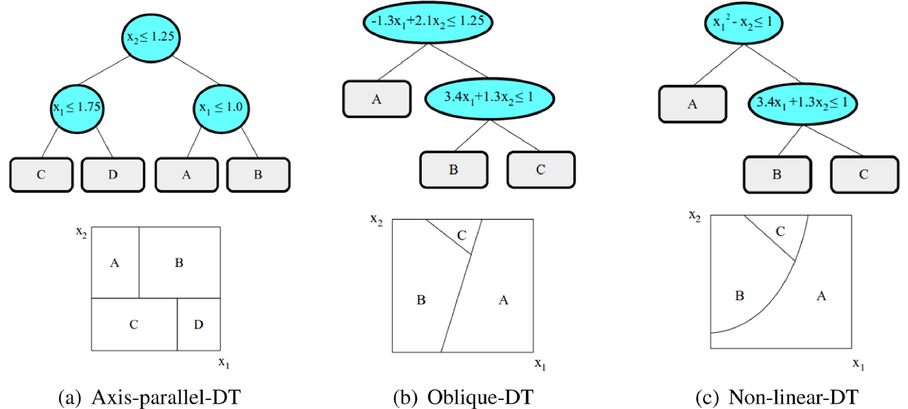

```{r setup, include=FALSE}
knitr::opts_chunk$set(echo = TRUE)
options(kableExtra.latex.load_packages = FALSE)
# knitr::opts_chunk$set(fig.width=8, fig.height=4) 
# knitr::opts_chunk$set(fig.pos = "H", out.extra = "")

library(jsonlite)
library(tidyverse)
library(reticulate)
use_python("~/anaconda3/envs/llm/bin/python")

library(knitr)
library(kableExtra)
library(DT) # For interactive HTML tables

library(shapviz)
library(h2o)

library(stringr)
library(readr)
library(xml2)
library(knitr)

library(ggplot2)
library(patchwork)
library(ggh4x)
library(PRROC)
library(yardstick)
```

```{r load_layout_functions, include=FALSE}
source("report_misc/layout_functions.R")
source("report_misc/helper_functions.R")

echo_flag <- knitr::is_html_output() ? NA : FALSE
message_flag = FALSE
warning_flag = FALSE
cache_large_figures = TRUE
std_dev <- knitr::is_html_output() ? 'png' : 'pdf'
```

\setDefaultLayout
\pagenumbering{gobble}
\pagestyle{empty}

#  {.unlisted .unnumbered}

## Abstract {.unlisted .unnumbered}

Content of this thesis is a benchmark on information extraction from PDFs. The focus are annual reports of German companies. Special characteristic of the task is handling hierarchies in tables with financial data to prepare the data for import into a relational database.

The benchmark is composed of two sub tasks and the performance of different open source large language models is tested with different prompting approaches and compared to alternative methods.

This can be seen as a reimplementation study of "Extracting Financial Data from Unstructured Sources: Leveraging Large Language Models" - a paper published by @liExtractingFinancialData2023. The key differences are the application on German documents using open source large language models.

We show, that also smaller open source \acr{LLM}s can be used to identify the pages that contain the information of interest and to extract it. Based on these findings we sketch a process, how humans can use \acr{LLM}s to extract information from financial reports.

## Zusammenfassung {.unlisted .unnumbered}

Gegenstand dieser Arbeit ist ein Benchmark zur Informationsextraktion aus PDF-Dateien. Dabei wird sich auf das Auslesen der Bilanzen und Gewinn- und Verlustrechnungen aus Jahresabschlüssen deutscher Unternehmen beschränkt. Ein besonderer Aspekt der Aufgabe ist die Berücksichtigung der Hierarchie innerhalb der Tabellen, um die Werte einem festen Schema zuzuordnen und so den Import in eine relationale Datenbank vorzubereiten.

## Reading advices {.unlisted .unnumbered}

The author recommends to read the thesis in its [digital gitbook version](https://famondir.github.io/Thesis/) instead of the PDF version. Furthermore, the author recommends to read the thesis (any version) on a screen that is larger than 21" and has at least full HD resolution[^index-1]. The more, the merrier.

[^index-1]: Most of the time the thesis was inspected at a third of the authors 42" screen with 4k resolution. For inspecting the large overview graphics it is a very handy tool the author recommends every data scientist or software developer.

\huge [😊]{style="font-size: 1.5em;"} \normalsize

## Declaration of the Use of Artificial Intelligence {.unlisted .unnumbered}

We use Github Copilot in VSCode for coding assistance. Mostly the GPT-4.1 is used. Sometimes Claude Sonnet 4.

We use perplexity.ai in our literature research process.

We use [] for 

## Goals and Learnings {.unlisted .unnumbered}

Achieved:

-   thesis with bookdown
-   docker image creation
-   cluster orchestration
-   llm usage
-   guided decoding

Missed:

-   Administrating a k8s cluster
-   Fine tuning a model
-   using small language models
-   training a lm
-   using vllms

## Dedication {.unlisted .unnumbered}

Micha

\pagestyle{fancy}

\cleardoublepage
\pagenumbering{roman}
\setcounter{page}{1}
\tableofcontents

\large\bfseries
\addthumbsoverviewtocontents{section}{Thumb marks overview}
\thumbsoverviewback{Table of Thumbs}
\normalsize\mdseries

\cleardoublepage
\pagenumbering{arabic}
\setcounter{page}{1}

<!--chapter:end:index.Rmd-->

---
editor_options: 
  markdown: 
    wrap: 72
---

\pagenumbering{arabic}

# Introduction

\ChapFrame[Introduction][bhtyellow]

Information is generated and processed by humans. And it is shared among
humans. At first this information sharing was done synchronous using
their voice. Later they developed the capabilities to store information
at clay tablets, paper and most recently in digital files
[@bentleyKnowingYouKnow2025]. The amount of stored information, the
human knowledge base grew paper by paper, file by file. The field of
library and information science emerged, to organize these information,
in order to allow efficient access. Since the information was shared
only among humans, the format of stored data was optimized for human
perception as well.

But things have changed in multiple ways. First, the amount of
information generation is growing rapidly and the amount of relevant
knowledge is increasing faster, than humans can absorb
[@chamberlainKnowledgeNotEverything2020]. Alone in the field of science
each year volumes of new information is beyond any human’s ability to
read are created [@hongChallengesAdvancesInformation2021]. Luckily, the
advent of recent \acr{LLM}s gives us a tool to compress this information
before reception by summarizing texts.

But on the same time generative \acr{AI} drives the increasing rate of
information generation. A human can initiate the generation of a whole
website or book with a single sentence of natural language. Most
recently \acr{AI} agents can, once created, react to triggers in the
digital or real world and automatically generate content. Together with
the information generated by devices in the Internet of Things the
extrapolation of a information duplication every eleven hours
[@ibmglobaltechnologyservicesToxicTerabyte2006] might have become
reality. This is the second thing that changed: algorithms generate,
process and share information too.

What often remains unchanged until today: a lot of the published
information is optimized for human processing, e.g. in \acr{PDF}
documents. Algorithms can be very efficient in information processing,
iff the information is machine readable. Since it is inefficient and
error-prone to let humans encode the information, the field of
information retrieval emerged as a new field of research. \acr{LLM}s can
help to retrieve information, even in a structured format, that can be
used from other algorithms in downstream tasks.

For older sources of information this is the only way possible. For
information shared in future there is another, more direct solution:
additionally providing the information in a machine readable format in
the first place. Otherwise we keep facing the "Last Mile Problem"
[@liAddressingLastMile2023]. Since the format, data is provided in, can
only be changed for the data owned by one self, one has to cope with the
data received, until the needs for machine-readable formats is
successfully communicated to and served by the data owners.

Section \@ref(motivation) describes, that the amount and format of
information provided to the \acr{RHvB} are raising challenges for the
audition process. Section \@ref(objectives) specifies these challenges
to specific real world problem. We derive our research questions from
this use case. Section \@ref(introduction-methodology) gives an overview
of our methodology and the thesis outline can be found in section
\@ref(thesis-outline).

## Motivation {#motivation}

In the last decades the digital transformation accelerated and
"electronic documents have increasingly supplanted paper documents as
the primary medium for information exchange across various industries"
[@zhangDocumentParsingUnveiled2024, p. 1]. And also within the finance
industry a lot of information is stored in (unstructured) digital
formats, i.e. in \acr{PDF} files [@liExtractingFinancialData2023]. This
is not only impeding investment decisions
[@el-hajRetrievingClassifyingAnalysing2020] and academic research
[@jrHowBigData2015] but also regulatory processes
[@liAddressingLastMile2023].

Such regulatory processes may be grounded on the audition reports by the
\acr{RHvB}. The \acr{RHvB} is contributing to the transparent usage of
tax money in Berlin by auditing public administrations and companies,
where the state of Berlin is a shareholder or that get funded with
public money. This prevents corruption and ensures efficient spending
procedures.

In the audition process the employees at \acr{RHvB} are faced with a lot
of information embedded in \acr{PDF} documents. Some are native digital
documents, while other are just scanned paper pages.For the audition of
the UEFA football championship they receive gigabytes of data. To
extract the information necessary to perform the audition is a big
challenge and would require a huge amount of human work force.
Algorithmic assistance is highly welcome.

Since the targets of the audition change frequently, classical rule
based approaches seem to have a rather limited payoff, comparing time
used programming the system and the times it gets used. Thus, leveraging
the flexible automation capabilities through programming by examples
with \acr{LLM}s [@liProgrammingExampleSolved2024] seems promising. The
need for automation is also driven by the impending shortage of
experienced employees due to large number of retirements.

## Objectives {#objectives}

The sixth division at \acr{RHvB} is auditing the companies where Berlin
is a shareholder (see Figure \@ref(fig:beteiligungsunternehmen). They
have to process the balance sheets and profit and loss accounting as a
fundamental information. Those information is provided via the companies
annual reports in form of \acr{PDF} files. Automate the extraction of
those information would be a good starting point for \acr{AI} assisted
information retrieval from \acr{PDF}s for the \acr{RHvB} overall. It
especially is worth the effort invested in a thesis, because exporting
financial data from the 59 companies is a recurring task.

```{r beteiligungsunternehmen, echo=FALSE, out.width="100%", fig.cap="Overview of the 59 companies Berlin holds share at."}
knitr::include_graphics("images/beteiligungsunternehmen.png")
```

The provided annual reports often differ from the publicly available
ones in matter of information granularity and design and are treated as
non public information. For this thesis we use the publicly available
versions to allow a comparison of open-source models with OpenAIs
\acr{GPT} models. We focus on open-source models, because the
information in the non public reports might be confidential. The
Berliner IKT-Richtlinie prohibits the processing of such information at
public clouds and empowers the usage of open-source solutions.

We limit the broad field of information retrieval for this thesis on the
extraction of the assets table, that is part of the balance sheet. To
reach a high degree of automation, we investigate the possibilities of
detecting the table, without having the user to provide the page number
or area, as a second task. We formulate our two main research questions:

```{r, include=knitr::is_html_output(), results='asis', echo=FALSE}
cat("<ol class='rs-questions'><li>How can we use LLMs effectively to locate specific information in a financial report?</li><li>How can we use LLMs effectively to extract these information from the document?</li></ol>")
```

\begin{enumerate}[label={\textbf{Q\theenumi}}]
  \item How can we use LLMs effectively to locate specific information in a financial report?
  \item How can we use LLMs effectively to extract these information from the document?
\end{enumerate}

Since the results of this thesis will be used to create an application
with \acr{HITL} approach, we want to investigate an additional side
research question. Section \@ref(hitl) presents the idea for the
application. The user should check the information extraction results
and resolve issues, the system alone could not handle. But redundant
double work should be minimized. Therefore we formulate our third
research question:

```{r, include=knitr::is_html_output(), results='asis', echo=FALSE}
cat("<ol class='rs-questions' style='--counter: 3;'><li>Can we use additional information from the extraction process, to guide the user which values need to be checked and which can be trusted as they are?</li></ol>")
```

\begin{enumerate}[label={\textbf{Q\theenumi}}]
  \setcounter{enumi}{3}
  \item Can we use additional information from the extraction process, to guide the user which values need to be checked and which can be trusted as they are?
\end{enumerate}

The following section will briefly describe our methodology to
investigate our research questions. The corresponding hypotheses are
formulated in section \@ref(research-questions).

## Methodology {#introduction-methodology}

This thesis is aiming to give a recommendation, how to solve the
described extraction task best. Thus, it is placed in the field of
applied research. We benchmark a broad variety of approaches and conduct
experiments, to identify general predictors for the task performance. We
start our investigation, implementing the framework described by
@liExtractingFinancialData2023. Figure
\@ref(fig:extraction-framework-flow-chart) shows that they describe two
stages, that match with our main research questions.

First, they show different approaches to identify the page, that
contains the searched information, and how to combine those approaches
efficiently. Additionally to a \acr{regex} based and a \acr{LLM} driven
\acr{TOC} based approach, we test a \acr{LLM} driven classification
approach, as well as a term-frequency based ranking approach.

Second, they show that \acr{LLM}s can effectively extract the target
information with the correct prompting strategy. We extend their task by
testing, how well \acr{LLM} can extract multiple values in a single
prompt and designed experiments measure the effect of different
influence factors. Besides model and prompting specific predictors, we
systematically evaluate characteristics of the tabular structure as
well.

Furthermore, we test the upper limits for the extraction performance
with a synthetic dataset, that is free of unknown target row
identifiers. This allows us, to test, if a simple text extract can be
sufficient as input or if additional effort - e.g. performing a document
layout analysis or using specialiced table extraction techniques -
should be invested, to extract the assets tables structure as well.

Our work is also contributing to the question, if the presented
framework is promising on more heterogeneous documents, how open-source
models perform and if the German language of the annual reports may hold
unique challenges.

## Thesis Outline {#thesis-outline}

Chapter \@ref(literature-review) briefly introduces into the theoretical
background of the used concepts and references literature, that is
describing them in depth.

Chapter \@ref(methodology) is describing our research design, research
questions and hypotheses. Separate for our three research questions, it
presents our evaluation and data strategy. It gives an overview about
the experimental setting, including the used evaluation methods and
expected error types .

Chapter \@ref(implementation) describes the hardware the experiments run
on and the software used to implement them. It presents a flow chart and
description of the data processing workflow.

Chapter \@ref(results) briefly presents the results for the three
investigated research questions. Detailed descriptions, how the results
are obtained can be found in the appendix.

Chapter \@ref(discussion) discusses the results. It interprets the
results in regard to the research questions and hypotheses. It contains
the error analysis. It shows the limitations of this study and names
what is not covered yet. It gives an outlook, on how we will proceed
with the results of this thesis, to solve the real life problem.

Chapter \@ref(conclusion) summarizes the answers on our research
questions.

## Summary

This chapter, showed the challenges that result from the ever growing
amount of information to process and the hurdles that
non-machine-readable data is placing on the way to use algorithms, to
handle the information overflow. It described the specific problem we
tackle with this thesis of extracting financial information from annual
reports, to prepare the audition processes at \acr{RHvB}. We formulated
our research questions, sketched our methodology to investigate them and
gave an outlook on the subsequent chapters.

## To place in chapters above

XBRL reports instead of PDFs? employees need to know, that they exist
and how to work with those

It is important to get numeric values totally accurate; numeric values
are difficult to handle for langauge models

Research questions and hypothesss

Q1: Can a \acr{LLM} be used to efficiently extract financial information
from German annual reports? Q2. Can LLMs be used to identify the page of
interest automatically?

Q3: Can confidence scores be used to head up the human in the loop on
which results to double check? (How can sources of the automatic
extraction being communicated down stream in order to make double
checking easy before making decisions?) Q4: Can contextual information
from similar documents reduce errors made during table extraction? Q5:
What are characteristics of financial tables that make it hard for LLMs
to identify / extract them? (How does the length and complexity of
financial documents (e.g., multi-column layouts, nested tables) affect
table extraction performance?)

missing law to access digital data and no law to choose the format of
the data [extensible Business Reporting Language](https://de.xbrl.org/)
as a standard changing from HGB to IFSR

## Unstrukturierte Daten

-   Beispielbilder

### Portable Document Format

-   print optimized
-   Table structure information gets lost
-   Bild und Textextract
-   see Erics thesis ;)

<!--chapter:end:01_Introduction.Rmd-->

# Literature review {#literature-review}

(less than 10 p)

\ChapFrame[Literature review][bhtblue]

The introduction described, that the problem, we want to solve with thesis, is part of the field of information retrieval. Thus, section \@ref(information-retrieval) describes methods, used to retrieve information from documents. It gives a brief overview on \acrfull{regex}, before subsection \@ref(llm-theory) describes the mechanisms and architecture of recent \acrfull{LLM}s, including \acr{MoE} architecture.

Afterwards, subsection \@ref(llm-methods) describes the method of few-shot prompting, that leverages the programming by example paradigm, and how \acr{RAG} fits in this picture. We show how guided decoding can be used to generated structured responses for usage in down stream tasks.

Section \@ref(other-concepts) presents the \acr{SHAP} framework. It is a unified explanation model for machine learning models and can be applied to complex models like deep neutral networks or random forests. The latter are briefly introduced as well. We use random forests and \acr{SHAP} to check our hypotheses on possible predictors for the information extraction task (see \@ref(research-questions)).

## Information extraction / retrieval {#information-retrieval}

closed-domain vs open-domain

### Term frequency

Term frequency $\mathrm{tf}_{t,d}$ is a very simple measure. It just counts the number of occurrences of a term in a document. Document is an abstraction in this case. It can be a sentence, a page or a file. Since longer documents might have higher term frequency for each term, it is useful to normalize the value by the document length $|d|$. This measure could be called term rate:

\begin{equation} 
\mathrm{tr}_t = \frac{\mathrm{tf}_{t,d}}{|d|}
(\#eq:term-rate)
\end{equation}

It is part of well established measures as \acr{TF-IDF} and Okapi \acr{BM25}. Both are used for ranking, how relevant a document is for a given search query and are widely used in information retrieval systems [@robertsonUnderstandingInverseDocument2004; @robertsonProbabilisticRelevanceFramework2009] and thus can be part of a \acr{RAG} architecture too. \acr{BM25} is one of the "most successful Web-search and corporate-search algorithms" [@robertsonProbabilisticRelevanceFramework2009, p. 1].

The \acr{IDF} is often used as a weighting function. If the ranking of possible results of a search query is simply calculated as sum of all term frequencies in a document, that are present in the query as well less informative terms get equal weight.

Looking at the search query: "Is the positron blue?", helps to illustrate the problem. The terms *is*, *the* and *blue* might be present often in a document for children that is talking about the sky or sea. Such a document could get high score, even though *positron* is never mentioned. It would be good, if it is most important if the term *positron* is in the document. We can achieve this by multiplying all term frequencies with the \acr{IDF} score [@manningIntroductionInformationRetrieval2008, pp. 118]:

\begin{equation} 
\mathrm{idf}_t = \log \frac{N}{\mathrm{df}_t}
(\#eq:idf)
\end{equation}

$N$ is the number of documents in the collection of documents and $\mathrm{df}_t$ the number of documents, that contain term $t$. While the term frequencies $\mathrm{tf}_{t,d}$ are calculated separate for each document, the \acr{IDF} score is computed once for the whole collection. The \acr{TF-IDF} score is then defined by:

\begin{equation} 
\mathrm{tf\text{-}idf}_t = \mathrm{idf}_t \cdot \mathrm{tf}_{t,d}
(\#eq:tf-idf)
\end{equation}

The more advanced measure \acr{BM25} is derived in @manningIntroductionInformationRetrieval2008.

Measures as \acr{TF-IDF} are also used for classification tasks, i.e. in the context of sentiment analysis [@carvalhoTFIDFCRFNovelSupervised2020] and semantic understanding [@rathiImportanceTermWeighting2023].

### Text processing

document layout analysis?

### Regular expressions

### Large Language Models {#llm-theory}

Wichtig

#### Transformers

Wichtig

hauptsächlich decoder (generieren)

seit 2017

#### Encoder

Wichtig

#### Decoder

Wichtig

Token sampling, temperature 0

#### GPT (Generative Pretrained Transformers)

Wichtig

#### Mixture of Experts

Recent \acrfull{LLM}s often use a \acr{MoE} architecture. The models of Llama 4, Qwen3 and GPT-4.1 are prominent examples for this kind of \acr{LLM}s. @zhangMixtureExpertsLarge2025 and @caiSurveyMixtureExperts2025a give an exhaustive overview of different types of \acr{MoE} architectures. While @zhangMixtureExpertsLarge2025 lists also models released this year and shows some applications of \acr{MoE}, is @caiSurveyMixtureExperts2025a discussing different architecture types in more detail. @grootendorstVisualGuideMixture2024 gives a guid to \acr{MoE} with many helpful illustrations.

The basic idea of \acr{MoE} models is to combine multiple smaller, specialized \acr{FFN}s to achieve better predictions overall. The \acr{MoE} "paradigm offers a compelling method to significantly expand model capacity while avoiding a corresponding surge in computational demands during training and inference phases" [@caiSurveyMixtureExperts2025a, p. 21].

Figure \@ref(fig:moe-architecture) shows two main differences in the architecture. One one hand there is the dense (a) architecture. Here, each token is fed into every \acr{FFN} and all results are pooled. On the other hand, there is the sparse architecture. Here, each token is just fed into a subset of \acr{FFN}s. Dense \acr{MoE} models often yield higher prediction accuracy, but also significantly increase the computational overhead [@caiSurveyMixtureExperts2025a].

The gate (also router) takes care of the distribution of tokens to the \acr{FFN}s. There is a high diversity of the routing algorithms and its goals are to "ensure expert diversity while minimizing redundant computation" [@zhangMixtureExpertsLarge2025]. There are algorithms that focus on load-balancing, domain specific routing and many more. Traditional \acr{MoE} assumes homogeneous experts, where load balancing might be the paramount goal. Recent advances explore more heterogeneous sets of experts and flexible routing strategies, that promise more efficiency [@zhangMixtureExpertsLarge2025].

```{r moe-architecture, fig.cap="Showing schemas of the dense and sparse mixture of experts architecture.", echo=FALSE, out.width="100%"}
knitr::include_graphics("images/moe_architecture.png")
```

Most of the Qwen3 models have a dense \acr{MoE} architecture. Only the two models released in July 2025 have a sparse architecture. These models have two parameter specifications. For example Qwen3-235B-A22B is specifying that the model has 235B token in total. But per token processed it uses (activates) just 22B parameters. In their mixture of experts architecture this means that 8 of 128 experts are participating in processing each token.

The Llama 4 models have a shared expert \acr{MoE} architecture. It combines a shared, fixed expert that processes every token and combines those results with results from a sparse \acr{MoE} layer.

Googles gemma-3n-E4B uses a selective parameter activation as well. They use the prefix E for effective instead of A for active [@googleGemma3nModel]. In gemma-3n there are parameters to handle input of different types - text, vision and audio - and they get loaded and activated as necessary. This allows a multi modal functionality. It additionally caches the \acr{PLE} in fast storage (RAM) instead of keeping it in the model memory space (VRAM), allowing to run models in low resource environments.

Raus oder woanders hin: The Qwen3 models support two operating modes: A thining mode and a non-thinking mode. The thinking mode should yield better answers in complex tasks and the additional amount of processing can be controlled by setting a thinking budget [@qwenteamQwen3ThinkDeeper2025]. This thinking budget can be seen as the amount of tokens used for a step wise solution.

#### Mixed modal

[@teamChameleonMixedModalEarlyFusion2024]

### Methods for LLM application {#llm-methods}

#### Few-shot Learning

Wichtig

#### RAG

Wichtig

#### Guided and restricted decoding

generation template strict (closed) vs open

always selecting the most probable response (temp = 0), so numeric values are correct and classification as well

## Other concepts {#other-concepts}

### Sample distribution visualization methods

##### Boxplots

@wickham40YearsBoxplots2011 describe boxplots as "a compact distributional summary, displaying less detail than a histogram or kernel density, but also taking up less space. Boxplots use robust summary statistics that are always located at actual data points, are quickly computable (originally by hand), and have no tuning parameters. They are particularly useful for comparing distributions across groups."

Figure \@ref(fig:boxplot-gauss) shows a box and whiskers plot and its components and compares it to a gaussian probability distribution. Half of all observations fall within the box and the median is marked by a thick line. Outliers are defined as observations that are outside the area marked with the (horizontal) lines -called whiskers - that potentially have small bars at their ends. Outliers can be shown by circles or dots.

(ref:boxplot-gauss-caption) Showing a box and whiskers plot with its components - median, quartiles, whiskers and outliers - and compare it with a gaussian probability distribution. Graphic adjusted from @jhguchBoxPlot2025.

```{r boxplot-gauss, echo=FALSE, fig.cap="(ref:boxplot-gauss-caption)", out.width="80%", fig.align = 'center'}
knitr::include_graphics("images/Boxplot_vs_PDF.png")
```

The median and quartiles are less sensitive to outliers, than the mean and standard deviation of a sample. Thus, they are more suitable for distributions that are asymmetric or irregularly shaped and for samples with extreme outliers [@krzywinskiVisualizingSamplesBox2014]. They can be used with five observations and more. But even for large samples $(n \geq 50)$, whisker positions can vary greatly.

##### Violin plots

There are variations, that try to communicate the sample size of a box plot, either by adjusting the width of the whole box or by introducing notches, that indicate the confidence interval for the median [@wickham40YearsBoxplots2011]. Violin plots [@hintzeViolinPlotsBox1998] additionally indicate an density estimate, dropping the strict rectangular shape of the box. Figure \@ref(fig:violinplot) shows, that the shapes can be necessary to identify multi-modal distributions, that are invisible with regular boxplots [@wickham40YearsBoxplots2011]. One can tackle this problem by adding a jitter plot layer to the boxplots. Violin plots can also be used for large datasets, preventing to plot a lot of outliers.

(ref:violinplot-caption) Comparing boxplots and violinplots, showing that boxplots can not identify multi-modal distributions on their own. Graphic adjusted from @amgenscholarsprogramHowInterpretViolin.

```{r violinplot, echo=FALSE, fig.cap="(ref:violinplot-caption)", out.width="100%"}
knitr::include_graphics("images/violin_plots_horizontal.png")
```

### Tree based machine learning algorithms

Random forests are a ensemble supervised machine learning technique, composed of multiple decision trees [@kulkarniRandomForestClassifiers2013]. @mienyeSurveyDecisionTrees2024 give a detailed insight into decision trees and their high-performing ensemble algorithms. Tree based machine learning algorithms have gained significant popularity, due to their simplicity and good interpretability [@mienyeSurveyDecisionTrees2024].

##### Decision tree

"The basic idea behind decision tree-based algorithms is that they recursively partition the data into subsets based on the values of different attributes until a stopping criterion is met" [@mienyeSurveyDecisionTrees2024]. Figure \@ref(fig:decision-tree) shows this for artificial data of two continuous features. Popular measures to determine how to split a set of observations are the Gini index, information gain or information gain criteria [@mienyeSurveyDecisionTrees2024].

The tree shown is used for a regression task and will predict the average of all values of the corresponding terminal node (leaf). To find out, which leaf will be the target terminal node for a given set of features one just follows the path from the top node (root) downwards, checking the splitting criteria. Thus, the interpretation of decisions made by a decision tree is very easy.

(ref:decision-tree-caption) Visualizing the of partitioning of a two-dimensional continuous feature space based on multiple splitting criteria for decision tree inducing. Graphic adjusted from @molnarInterpretableMachineLearning2025.

```{r decision-tree, echo=FALSE, fig.cap="(ref:decision-tree-caption)", out.width="80%", fig.align = 'center'}
knitr::include_graphics("images/tree_simple.png")
```

Further benefits of decision trees - besides the good interpretability and computational efficiency - are the native capturing of interactions between features [@molnarInterpretableMachineLearning2025], without modeling this explicitly, as it would for example be necessary in a linear regression. Decision trees can be used for classification and regression. They even can incorporate linear functions as leafs, enabling them to better capture linear relationships [@raymaekersFastLinearModel2024].

Problems of decision trees are, that they lack resilience against data changes and a tendency to overfitting. A method against overfitting is pruning [@mienyeSurveyDecisionTrees2024]. Building an ensemble of decision trees is another possibility, that results in the random forest algorithm, described in the next paragraph .

@rivera-lopezInductionDecisionTrees2022 are focusing on decision trees, describing multiple decision tree types, e.g. based on the splitting procedure (see Figure \@ref(fig:advanced-tree-splitting)). In addition to axis-parallel splitting, they show oblique and non-linear splitting criteria. They present a state-of-the-art review and a summary analysis of metaheuristics based approaches for decision tree induction.

(ref:advanced-tree-splitting-caption) Visualizing the of partitioning of a two-dimensional continuous feature space based on multiple splitting criteria for decision tree inducing. Graphic adjusted from @rivera-lopezInductionDecisionTrees2022.

```{r advanced-tree-splitting, echo=FALSE, fig.cap="(ref:advanced-tree-splitting-caption)", out.width="100%", fig.align = 'center'}

```

##### Random forest

A random forest is using the principle of bagging and applies it on the level of features and observations. This means, it starts, creating basic decision trees with differing subsets of features and uses bootstrapping to select a randomized set of observations to train the tree with. The final prediction is then determined by voting (for classification) or averaging (for regression) the predictions of all trees in the ensemble.

The induction of the trees can be be parallelized, making it efficient on modern hardware. Random forests can cope with thousands of features and can be applied to large datasets [@breimanRandomForests2001]. There are methods that address the problems of imbalanced datasets too. As there are methods to prune a decision tree to fight overfitting, there are methods to prune a random forest by removing whole trees, to improve the learning and classification performance, too [@kulkarniPruningRandomForest2012].

Random forests are "powerful learning ensemble[s] given its predictive performance, flexibility, and ease of use [@haddouchiSurveyTaxonomyMethods2024]. While it is based on decision trees, that are considered to be *white boxes*, because of their easy interpretability, random forests are seen as *black boxes*. The decision could be tracked without complicated math, but is tedious, because it would require propagating through many decision trees, noting their predictions and then averaging those.

The fact that the RF model is categorized as a black-box model restricts its deployment in many fields of application [@haddouchiSurveyTaxonomyMethods2024]. One feature oriented tool for explainability is the \acr{SHAP} framework, presented in section \@ref(shap). It allows local explanation, a global overview and pattern discovery for random forests [@haddouchiSurveyTaxonomyMethods2024].

##### Gradient boosted decision trees

Another highly effective and widely used advancement to decision trees are gradient boosted decision trees [@chenXGBoostScalableTree2016]. Instead of the principle of bagging it applies the principle of boosting. it is sequentially building decision trees, where the later ones correct the errors in predictions made by the former trees. It uses gradient descent to minimize those errors [@mienyeSurveyDecisionTrees2024].

The \acr{XGBoost} algorithm is a famous member of this family, with "an outstanding performance record" [@burnwalComprehensiveSurveyPrediction2023]. "Among the 29 challenge winning solutions published at Kaggle's blog during 2015, 17 solutions used XGBoost" [@chenXGBoostScalableTree2016].

In the following we will emphasize some of its benefits as described by @burnwalComprehensiveSurveyPrediction2023:

-   \acr{XGBoost} employs both L1 (Lasso) and L2 (Ridge) regularization in its objective function to penalize model complexity, mitigating overfitting. However, overfitting can occur, especially if hyperparameters are not adjusted properly.

-   \acr{XGBoost} provides feature importance metrics to facilitate model interpretation, facilitating feature selection and improving the understanding of the model's decision-making process.

-   \acr{XGBoost} "runs more than ten times faster than existing popular solutions on a single machine and scales to billions of examples in distributed or memory-limited settings" [@chenXGBoostScalableTree2016] using parallelization techniques.

But there are some challenges, that are to investigate in future research. E.g. finding methods to handle imbalanced data and automate the hyperparameter tuning process.

### Model agnostic explanation models {#shap}

##### Shapley values

Shapley values are introduced by @shapley17ValueNPerson2016 originally in 1952 in the field of game theory. He defined three axioms that a fair allocation of value must fulfill:

1.  Symmetry: If two players contribute the same amount, they are interchangeable and should gain equal reward.

2.  Efficiency: The whole value of the game is distributed among the players.

3.  Law of aggregation: If a player contributes to multiple independent games, his contribution in total should be the sum of contributions in each game.

From the third axiom a fourth property derives, that is sometimes named independently. If a player is not contributing to a game, he gets no share. @osullivanMathematicsShapleyValues2023 calls this the *null player* property.

The formula for a single shapley values is given by [@lundbergUnifiedApproachInterpreting2017][^02_literature_review-1]:

[^02_literature_review-1]: We replaced $F$ by $P$ to speak in the terms of players instead of features. We also replcaed $f$ by $val$, because it better fits the story, that this is the value gain in a game, as explained by @osullivanMathematicsShapleyValues2023.

\begin{equation} 
\phi_{i} = \sum_{S \subseteq P \setminus \{i\}}{\frac{|S|! \left( |P|-|S|-1 \right) !}{|P|!} \left[ val \left( S \cup \{i\} \right) - val\left(S\right) \right]}
(\#eq:shapley)
\end{equation}

@molnarInterpretableMachineLearning2025 bridges the game theory terms to the field of machine learning as follows: "The *game* is the prediction task for a single instance of the dataset. The *gain* is the actual prediction for this instance minus the average prediction for all instances. The *players* are the feature values of the instance that collaborate to receive the gain (= predict a certain value)."

##### SHAP framework

@lundbergUnifiedApproachInterpreting2017 are presenting "A Unified Approach to Interpreting Model Predictions" based on shapley values, called \acrfull{SHAP}. It assigns each feature an importance value for every observation. This allows to inspect, why a specific prediction is made and might explain, why a model makes a mistake for specific observations. Inspecting the predictions for all observations can show generalized effects of features.

@lundbergUnifiedApproachInterpreting2017 show that their approach is the only possible explanation model for the class of additive feature attribution methods, that has three desirable characteristics: local accuracy, missingness and consistency. Shapely values can be computed for any machine learning model, but its exact calculation is computationally extremely expensive [@huComputingSHAPEfficiently2023], since it is of exponential complexity $\mathcal{O}(2^p)$ regarding the number of features (or predictors) $p = |P|$.

Even with the approximation of the shapley values, introduced in @lundbergUnifiedApproachInterpreting2017 as Kernel SHAP, the complexity for tree based algorithms is $\mathcal{O}(MTL2^p)$, with the number of samples $M$, number of trees $T$ and the number of leaves $L$. The tree based optimization of the algorithm, TreeSHAP, allows an approximation in $\mathcal{O}(MTLD^2)$ [@lundbergExplainableAITrees2019], with the maximum tree depth $D$. Depending on the number of observations to calculate shapley values for ($M$), the Fast TreeSHAP algorithm has a even lower time complexity of $\mathcal{O}(TLD2^D+MTLD)$ [@yangFastTreeSHAPAccelerating2022].

Calculating the effect a feature has for the whole model, we calculate the mean of the absolute for single shapley values. Adjusting @molnarInterpretableMachineLearning2025 so it follows the notation of Equation \@ref(eq:shapley) yields:

\begin{equation} 
 mean\left(|SHAP|\right) = \frac{1}{n} \sum_{k=1}^n | \phi_{i}^{\left( k \right)} |
(\#eq:meanSHAP)
\end{equation}

This value is called \acr{SHAP} feature importance. It can be interpreted similar to standardized beta values for a linear regression. In some cases it would be possible to calculate an effect direction for the feature importance. But it is not common practice. Instead visual representations presented in section \@ref() are used for such interpretations.

@lundbergUnifiedApproachInterpreting2017 also showed that SHAP values are more consistent with human intuition than preceding local explainable models. @liBuildingTrustMachine2024 mention, that explainability of machine learning models is not only important for researches but also for practitioners, to demonstrate their reliability to potential users and build trust. Regardless of the popularity of \acr{SHAP} scores, there are claims that they can be inadequate as a measure of feature importance [@huangFailingsShapleyValues2024]. The approximated as well as exact \acr{SHAP} scores can assign higher value to unimportant features than to important ones.

However, the need for a high explainability of machine learning algorithms is more urgent than ever, since the EU's regulatory ecosystem is emphasizing the importance of \acr{XAI} [@nanniniOperationalizingExplainableArtificial2024].

## Summary (0.5 p)

-   lessons learned
-   link to goal thesis
-   link to next chapter

## To place in chapters above

## Table extraction tasks

### Difficulties

-   Beispielbilder

## Document Extraction Process

### Document Layout Analysis

An important step in the process of extracting information from documents is to recognize the layout of a document [@zhongPubLayNetLargestDataset2019].

Getting the order of texts correct align captions to tables and figure identify headings, tables and figures

One of the most popular datasets used for training and benchmarking is PubLayNet (see [PubLayNet on paperswithcode.com](https://paperswithcode.com/sota/document-layout-analysis-on-publaynet-val)). It contains over 360_000 document automatically annotated images from scientific articles publicly available on PubMed Central [@zhongPubLayNetLargestDataset2019, p. 1]. This was possible, because the articles have been provided in PDF and XML format. For the annotations most text categories (e.g. text, caption, footnote) have been aggregated into one category. \<-- is this a problem for later approaches where a visual and textual model work hand in hand to identify e.g. table captions?

Manual annotated datasets often were limited to several hundred pages. Deep learning methods need a much larger training dataset. Previously optical character recognition (OCR) methods were used.

Identify potentially interesting pages with text / regex search. Check if there is a table present on this page.

Object detection

## Tools

Vlt egal oder outlook

#### Vision Grid Transformer

#### TableFormer

SynthTabNet \<-- has it: - nested / hierarchical tables, where rows add up to another row? - identifying units and unit cols/rows

<!--chapter:end:02_Literature_review.Rmd-->

# Methodology {#methodology}

\ChapFrame

This chapter describes the research design of this thesis. In the subsequent sections it elaborates

## Problem Definition

This thesis aims to evaluate a framework for information extraction from financial reports using advanced computing algorithms as \acr{LLM}s, presented by @liExtractingFinancialData2023. We apply this framework on German annual reports of multiple companies and focus on using open source \acr{LLM}s. This task requires two problems to be solved:

1.  The information to extract has to be located in the document.
2.  The information has to be extracted correct and in form that allows further processing in down stream tasks.

We limit the information of interest on the data found in the balance sheet and profit and loss statement. Both are found on separate pages and have a table-like structure. The information of interest is ordered by a hierarchy defined in @hgbHandelsgesetzbuchImBundesgesetzblatt2025. The information to extract are numeric values.

Since the information of interest is placed on separated pages, the first problem is to find the pages that contain the balance sheet and profit and loss statement. We do not attempt to select a specific part of the page, where the data can be found. Thus, this becomes a classification task, if a page contains the information of interest. Spatial information is not processed.

The second problem is an information extraction task. Potential information has to be identified, its entity has to recognized and finally its numeric value has to be extracted. In this thesis no special techniques for the table extraction sub field are used.

## Research Design & Philosophy

The research design for this thesis is set up, following the guideline found in @wohlinExperimentationSoftwareEngineering2024 and Figure \@ref(fig:reasearch-design-image) shows the decisions made. According to @collisBusinessResearchPractical2014 research classification the outcome of this thesis is applied research, focusing on solving a practical problem. Its purpose is evaluation research, comparing different approaches with each other. The data collected in our experiments is of quantitative nature and its evaluation uses (semi-)quantitative methods.

Research logic? Methods fit deductive. But I start with a very specific problem. Literature describing basic approaches?

(ref:reasearch-design-caption) Showing the decisions made regarding the research design. (The figure is adapted from @wohlinDecisionmakingStructureSelecting2015. The copyright for the original figure is held by Springer Science+Business Media New York 2014.)

```{r reasearch-design-image, fig.cap="(ref:reasearch-design-caption)", echo=FALSE, out.width="100%"}
knitr::include_graphics("images/research_design.png")
```

### Research questions {#research-questions}

For this thesis we formulate two main research questions:

```{r, include=knitr::is_html_output(), results='asis', echo=FALSE}
cat("<ol class='rs-questions' style='--counter: 1;'><li>How can we use LLMs effectively to locate specific information in a financial report?</li><li>How can we use LLMs effectively to extract these information from the document?</li></ol>")
```

\begin{enumerate}[label={\textbf{Q\theenumi}}]
  \item How can we use LLMs effectively to locate specific information in a financial report?
  \item How can we use LLMs effectively to extract these information from the document?
\end{enumerate}

Each of this questions is investigated with its own methods and experiments. In the following we will use the term *page identification* to refer to the first research question and *information extraction* to refer to the second.

Additionally, we formulate a \acr{UX} motivated side research question:

```{r, include=knitr::is_html_output(), results='asis', echo=FALSE}
cat("<ol class='rs-questions' style='--counter: 3;'><li>Can we use additional information from the extraction process, to guide the user which values need to be checked and which can be trusted as they are?</li></ol>")
```

\begin{enumerate}[label={\textbf{Q\theenumi}}]
  \setcounter{enumi}{3}
  \item Can we use additional information from the extraction process, to guide the user which values need to be checked and which can be trusted as they are?
\end{enumerate}

The third question is refered to, using the term *error rate guidiance*.

### Evaluation framework

::: paragraph-start
##### Page identification

The page identification task is successful, if a page is correctly classified to contain the information of interest. The balance sheet is composed of the assets (*Aktiva*) and liabilities (*Passiva*) table. Together with the profit an loss statement (*Gewinn- und Verlustrechnung, GuV*) they form the three target classes. The fourth class is called *other*. Subsequently will will use the German terms for the target classes (or table types): **Aktiva**, **Passiva** and **GuV**.
:::

::: paragraph-start
##### Information extraction

The information extraction task if successful, if the correct numeric value is extracted with the correct entity identifier in the correct \acr{json} format. If a value, defined by the legal text, is not present *null* should be returned with the corresponding entity identifier. The entity identifier can be composed of up to three labels, representing the hierarchy defined in the legal text.
:::

::: paragraph-start
##### Error rate guidance

A error rate guided result checking process can be implemented, if we can use extraction task related information, to identify thrust worthy. This means, we could white list these values and red flag the remaining ones. Thus, we could guide the users attention in the error checking process on those values, that empirically tend to have a high chance to be faulty.
:::

### Evaluation research

We compare different approaches to solve the two tasks, searching for the most effective setup, to solve the problems. A task is considered effective if it achieves good results while being as computationally efficient as possible. As a baseline for each task a \acrfull{regex} based approach is set up. Regular expressions are chosen as baseline because they are computationally efficient. The results are compared with the authors performance as well.

The results should be used to implement an application that is used by the employees of \acr{RHvB} in future.

## Evaluation Strategy

### Metrics

::: paragraph-start
##### Page identification

The distribution of target classes and pages of type *other* is highly imbalanced. At most two pages per target class are found in documents with up to 152 pages. Thus, following @saitoPrecisionRecallPlotMore2015 suggestion, we report measures as precision, recall and F1 score instead of accuracy, to describe the approaches performances.
:::

In a \acr{HITL} application the recall value might be of higher interest than the F1 score. More precisely, in those cases the number of pages to check until the correct page is found is of interest. Thus, the top k recall is reported additionally, if the approach permits to rank the classified pages according to a score.

Precision-recall curve

::: paragraph-start
##### Information extraction

We use two measures to describe the approaches performances for the information extraction task. First, we check how many of the predicted numeric value are matching the numeric values in the ground truth. The only permitted differences are based on the number of trailing zeros. We do not check for partial correctness, since the real life application requires totally correct extracted numbers.
:::

Second, we report the F1 score for correctly predicting values as missing and thus returning *null*. The distribution of missing values and given numeric values is not very imbalanced. Nevertheless, we report the F1 score to establish a comparability with the results od the page identification task.

::: paragraph-start
##### Error rate guidiance

In this thesis we focus our attention on a criteria, which we name *confidence*. We calculate the *confidence* score for answers received from \acr{LLM} based on the non-normalized sum of token log probabilities [@boseakEvaluatingLogLikelihoodConfidence2025]:
:::

\begin{equation} 
confidence = \exp \left( \sum logprob(token_i) \right)
(\#eq:confidence)
\end{equation}

For the classification tasks this is equal to the normalized sum, since the answer is either containing just one token or the subsequent tokens have a log probability of 0, because the fully answer is determined by the first token.

We are using the non-normalized sum of token log probabilities as well, because we want a single uncertain digit to flag the whole numeric value as as unreliable. This means, that shorter answers tend to have higher *confidence* scores. This is especially true for predicting *null*. Thus, we investigate the prediction of numeric values and *null* separated.

### Benchmarking

Comparing the performance of different approaches benchmarked in this thesis is possible, because the approaches within a task are performed on a common document base. The task to solve is the same for each approach. The prompts for the different prompting strategies are build systematically and derive from the base prompt formulated for the *zero shot* strategy. Comparing the runtime or energy consumption gets possible with the \acr{GPU} benchmark data (see section \@ref(gpu-benchmark))

## Data Strategy

The population of annual reports of interest for the work at the \acr{RHvB} is composed of all annual reports of companies, where the state of Berlin holds a share. There are often multiple versions of those annual reports: one that is publicly available and targeting share- and stakeholders. The structure and layout of there reports is quite heterogeneous. Often there is a second version that is used internally or for communications with public administrations. They often consist of plain text and tables and shows neither diagrams nor photos.

Since the evaluations are run on the \acr{BHT} cluster and partially in the Azure cloud, we work with the publicly available reports, while at \acr{RHvB} the internal documents are more common. The annual reports mostly are downloaded from the companies websites. Some documents are accessed via [Bundesanzeiger](https://www.bundesanzeiger.de) or the [digitale Landesbibliothek Berlin](https://digital.zlb.de).

For the page identification task all kinds of pages from the annual reports are used. For the information extraction only pages with **Aktiva** tables are used. In addition, a set of self-generated synthetic **Aktiva** tables is used for the information extraction task. It is created to systematically investigate potential effects of characteristics financial tables could have.

### Sampling methodology

```{r count-benchmark-documents, echo=echo_flag, warning=warning_flag, message=message_flag, cache=TRUE, cache.extra = tools::md5sum(c("../benchmark_truth/aktiva_passiva_guv_table_pages_no_ocr.csv", "./scripts/page_identification_preparations.R"))}
source("./scripts/page_identification_preparations.R")

num_multiple_tables_per_document <- df_targets_no_ocr %>%
  anti_join(consecutive_pages, by = c("filepath", "page", "type")) %>% 
  arrange(filepath, page) %>%
  group_by(filepath, type) %>% 
  summarise(count = n()) %>% 
  filter(count > 1) %>%
  group_by(filepath) %>% 
  summarise(count = n()) %>% 
  nrow()

multiple_tables_per_type_and_document <- data_unnested %>%
  anti_join(consecutive_pages, by = c("filepath", "page", "type")) %>% 
  arrange(filepath, page) %>%
  group_by(filepath, type) %>% 
  summarise(count = n()) %>% 
  filter(count > 1) %>% 
  group_by(type) %>% 
  summarise("multiple targets in document" = n())

df_special_targets <- multiple_tables_per_type_and_document %>% left_join(consecutive_pages %>% group_by(type) %>% summarise("target two pages long" = n())) %>% mutate_if(is.numeric,coalesce,0)
```

::: paragraph-start
##### Page identification

Figure \@ref(fig:document-base-page-identification) shows how the document base for the tasks in this section is composed[^03_methodology-1]. Overall `r num_documents` annual reports from `r num_companies` companies are used. For this thesis the tables of interest are those that show **Aktiva**, **Passiva** and **GuV**. Among the `r total_pages_no_ocr` pages `r num_tables` tables have to be identified on `r num_target_pages` pages. Figure \@ref(fig:document-base-page-identification) also gives an impression on how many pages the documents have. The documents of *IBB* tend to be longer. The documents of *Amt für Statistik Berlin-Brandenburg* tend to be shorter.
:::

[^03_methodology-1]: I downloaded all publicly available annual reports for some of the companies shown in the first row of Figure \@ref(fig:beteiligungsunternehmen). I assumed that this will give a representative sample of document structures for the other companies of the same type. Realizing that the degewo AG reports would require ocr preprocessing I additionally downloaded reports for GESOBAU AG. This approach could have been more systematic. For the second task I downloaded reports for all companies available and tried to use a balanced amount of reports per company.

```{r, eval = knitr::is_html_output(), echo=FALSE, warning=warning_flag, message=message_flag, results='asis', class.chunk='pre-detail'}
cat("<p>You can have a look at the ground truth data unfolding the following details element.</p>")
```

```{r ground-truth-tables-of-interest, eval = knitr::is_html_output(), echo=FALSE, warning=warning_flag, message=message_flag, class.chunk='hideme', results='asis'}
df_targets_no_ocr %>% render_table(
  caption = "Showing all pages of interest with the target table type and filepath.",
  ref = opts_current$get("label")
  )
```

```{r document-base-page-identification, echo=echo_flag, warning=warning_flag, message=message_flag, dev=std_dev, fig.cap="Showing the number of pages (bar height) and number of documents (number above the bar) per company for the data used for the page identification task. Some documents would require ocr before being processed and were not used."}
df_pages %>% group_by(company) %>% mutate(
  docs_per_company = n(), pages_per_company = sum(pages)
  ) %>% 
  ggplot() +
  geom_col(aes(x = company, y = pages, fill = needs_ocr), color = "#00000033") +
  geom_text(
    data = . %>% group_by(company) %>% slice_head(n = 1),
    aes(x = company, y = pages_per_company, label = docs_per_company, group = company),
    stat = "identity",
    vjust = -0.5,
    size = 3
  ) +
  scale_x_discrete(guide = guide_axis(angle = 30))
```

Table \@ref(tab:display-multiple-tables-per-type-and-document) shows how many documents have multiple target tables per type and how many target tables span two pages. In total `r num_consecutive_pages` tables are distributed on two pages. In `r num_multiple_tables_per_document` documents there are multiple tables per type of interest. There are `r num_two_tables_on_one_page` pages with two target tables (**Aktiva** and **Passiva**) on it.

```{r display-multiple-tables-per-type-and-document, echo=FALSE, warning=warning_flag, message=message_flag, results='asis'}
df_special_targets %>% render_table(
  caption = "Showing the number of documents with multiple target tables per type and the number of target tables that span two pages.",
  ref = opts_current$get("label")
  )
```

```{r table-extraction-preps, echo=FALSE, warning=warning_flag, message=message_flag, cache=TRUE, cache.extra = tools::md5sum('data_storage/real_table_extraction_llm.rds')}
old_doc_base <- readRDS("data_storage/real_table_extraction_llm.rds") %>% select(filepath) %>% unique()
new_doc_base <- readRDS("data_storage/real_table_extraction_extended_llm.rds") %>% select(filepath) %>% unique() %>% mutate(filepath = str_replace(filepath, "a__f", "af")) %>% filter(!str_detect(filepath, "MEAB GmbH"))
```

::: paragraph-start
##### Information extraction

For the manual information extraction we need up to 12 minutes per table. The maximum amount of values to copy and format (or type manually) among the tables used is 40. In addition to this manual process conceptional process can be necessary, because the values have to matched to the strict grammar. Sometimes we have to decide that there is no row a value fits in or there are multiple values that have to get summed up in order to calculate the value that fits in the predefined schema.
:::

This manual work was done for `r old_doc_base %>% nrow()` documents. For every company that published the detailed form of balance sheets a single document was included. Additionally documents were included for *Amt für Statistik und Brandenburg* to check, if a context learning approach is benefiting from documents from the same company. Later, the predictions of the \acr{LLM}s were used, to create additional `r new_doc_base %>% nrow()` ground truth tables. The old ground truth tables were checked in this this iteration and an error rate of 2.4 % was detected. Thus, the human reference score for percentage of correct predictions is 0.976. Figure \@ref(fig:table-extraction-doc-base) shows how many **Aktiva** tables are used for all tasks in this subsection, that use real data instead of synthetic data.

To overcome the limited amount of real data and to allow the systematic investigation of potential predictors for the extraction performance, even if their occurrence is very unbalanced within the real data, synthetic **Aktiva** tables were created (see subsection \@ref(synthetic-table-extraction)).

```{r table-extraction-doc-base, echo=echo_flag, warning=warning_flag, message=message_flag, out.width="100%", dev=std_dev, fig.cap="Showing the number of documents used for the table extraction task. The number of Aktiva tables is equal to the number documents."}
new_doc_base %>% rowwise() %>% 
  mutate(
    .before = 1, 
    company = str_match(filepath, "/pvc/benchmark_truth/real_tables_extended/(.*)__")[2],
    initial_doc_base = str_remove(filepath, "_extended") %in% old_doc_base$filepath
    ) %>% ggplot() +
  geom_bar(aes(x = company, fill = initial_doc_base)) +
  scale_x_discrete(guide = guide_axis(angle = 45)) +
  theme(
    axis.title.x = element_blank(),
    legend.position = "top"
  )
```

::: paragraph-start
##### Error rate guidiance

We investigate the third research question on the two datasets described above, instead of creating a separate dataset.
:::

### Ground truth creation process

The ground truth for both tasks is created by by manual labor of the authors. The results of early experiments are used to check the ground truth for mistakes or missed items.

::: paragraph-start
##### Page identification

For the page identification task the chosen documents are searched for the target pages either by using the search functionality, \acr{TOC} or scrolling through all pages. For each target page the filepath, page and type is listed in a csv file. For some reports there are multiple pages present for a single target type. In this case, both pages are added to the ground truth. Sometimes the **Aktiva** and **Passiva** page are on a single page. In this case a single entry is made and its type is *Aktiva&Passiva*. If a table spans two pages, both pages are recorded. Excluding pages that need \acr{OCR} processing we created 252 entries.
:::

For double checking all identified pages are extracted from their original PDF files and combined in a single file. Thus, problems with the numbers shown in the PDF viewer and the actual page number in the file are identified and resolved. After the first experiments pages, that have been classified as a target by multiple models, are checked. Thus, some additional target tables, that span two pages, are identified.

::: paragraph-start
##### Information extraction

For the information extraction task we copy the numeric values from the annual reports into csv files, replace the thousands separators and floating point delimiters and multiply those values by 1_000, if a currency unit is given for the column the value comes from. The csv files are already prefilled with all entities defined in the legal text, identified by their full hierarchy. Thus, we choose which line to put the value in, if the description in the annual report is different.
:::

There are cases, where a single line defined in the legal text is split up into multiple lines in the annual reports. In those cases we enter the sum into the according row in the csv file. If entities are found, that do not fit any entity given in the legal text, this entry is dropped. For the first iteration the csv files just contained the entities and column names but no values.

In the second iteration we use the predictions of Qwen3-235B, check the values and mark mistakes, correct the values and log all mistakes found. In this iteration we check the ground truth created in the first iteration as well and correct mistakes made earlier.

::: paragraph-start
##### Error rate guidiance

There is not ground truth for the calculated *confidence* scores. We will simply check, if the true and false predictions can be separated based on the returned *confidence scores*.
:::

### Preprocessing

We use plain text extracted from the annual reports for all tasks. We do not extract geometric coordinates for the text. @auerDoclingTechnicalReport2024 describes, that available open-source PDF parsing libraries may show issues as poor extraction speed or randomly merged text cells. We tested five PDF extraction libraries, because the results of all subsequent experiments will depend on the text extracts. Section \@ref(text-extraction-benchmark) shows the results.

We perform no manual data cleaning, because this will not be done from the employees of \acr{RHvB} either.

### Data splitting

When we train a machine learning model, we split the data into train and a test set. We do not use a validation set, because we do not compare models using an extended hyper-parameter variation strategy. Instead we just report the performance found for the models build with default settings. We build two random forests for the term frequency approach in the page identification task and more random forests for evaluating the hypotheses for the information extraction task.

Building the term frequency random forest, we face a highly imbalanced dataset. We apply undersampling for the training and evaluate the model on the imbalanced test set.

## Experimental Framework

### LLM overview

Table \@ref(tab:llm-overview) einbinden

```{r llm-overview, echo=FALSE, warning=warning_flag, message=message_flag, results='asis'}
table <- read_csv("data_storage/model_usage_extraction.csv") %>% 
  arrange(tolower(model_family), parameter_count) %>% 
  rename(parameter = parameter_count) %>% 
  mutate_if(is.character, ~if_else(is.na(.), "", .)) %>% 
  render_table(
    alignment="lrccccc", 
    caption="Overview of benchmarked LLMs for all tasks. Parameter shows passive parametercount in billions.", 
    ref = opts_current$get("label"),
    colgroups = c(" " = 2, "information extraction" = 3, "page identification" = 2),
    row_group_col = 1
    )
if(knitr::is_latex_output()) {
  table <- table %>% column_spec(1, width = "5.8cm")
}

table
```

### Hardware normalization {#gpu-benchmark}

To make the runtime of different \acr{LLM}s running on different amounts and types of \acr{GPU}s comparable, we conducted a benchmark running the models Qwen2.5-7B and Qwen2.5-32B with different hardware compositions on the Datexis cluster. Figure \@ref(fig:gpu-benchmark-plot) shows the runtime for classifying 100 pages with the multi-class approach, providing three random examples for the in-context learning.

The classification time with Qwen2.5-32B on \acr{GPU}s of type B200 is a little faster than running Qwen2.5-7B on the same amount of A100 \acr{GPU}s. We calculate normalized runtimes for our experiments, based on these runtime measures for small and larger \acr{LLM}s on different types and numbers of \acr{GPU}s. A minute of computation on a single B200 is comparable to 4:30 minutes of computation on a single A100.

```{r gpu-benchmark-plot, echo=echo_flag, warning=warning_flag, message=message_flag, dev=std_dev, fig.cap="Showing the runtime to classify 100 pages with the multi-class approach, providing three random examples for the in-context learning."}
df_gpu_benchmark <- read_csv("../benchmark_jobs/page_identification/gpu_benchmark/gpu_factors.csv")

df_gpu_benchmark %>% ggplot(aes(x = gpu_number, y = runtime_in_s, color = gpu_type)) + geom_line(aes(linetype = model_name)) + geom_point()
```

### Error analysis

The ultimate goal is to fully automate the information extraction task at hand. Thus, it is important to analyse potential errors, to identify obstacles that hinder performance and find ways to further improve the system.

We expect to find issues with wrong extracted or hallucinated numbers, wrong entity recognition and false positive *null* values. Not respected units

Quantitative / stratified: We will compare the error rates based on the different variables of the experiments. For the approaches using \acr{LLM}s to solve the problem there are model specific, prompting strategy specific and example specific variables.

Qualitative: Finally, we investigate some of the erroneous extracted examples manually, and try to identify the underlying issues.

Tools and criteria

Reporting

Example:

To better understand the limitations of the evaluated models, we will conduct a detailed error analysis. We will first quantify the types of errors (e.g., false positives, false negatives, misclassifications) using confusion matrices and error rate statistics. Additionally, we will manually inspect a sample of erroneous predictions to identify common causes, such as ambiguous table layouts, OCR errors, or model misinterpretations. Errors will be categorized by document type and extraction task to reveal systematic weaknesses. Representative error cases will be documented to illustrate typical failure modes and to inform potential improvements for future work.

99.5 % or 96 % accuracy for extracting financial data from Annual Comprehensive Financial Reports [@liExtractingFinancialData2023] In the untabulated test, GPT-4 achieved an average accuracy rate of 96.8%, and Claude 2 achieved 93.7%. Gemini had the lowest accuracy rate at 69%. (ebd.)

Too many hallucinated values when it was NA instead [@grandiniMetricsMultiClassClassification2020]

### Baseline selection rationale

see section Evaluation research

### Prompt building

### Evaluation methods

-   box plots

-   PR-curve

-   random forest + SHAP

XGBoost not used finally, because calculation \acr{SHAP} values for XGBoost model took to long for just a first glimpse on what might influence the extraction. lm also fitted and not used

## Ethical & Practical Considerations (eher am Ende oder weg?)

### PDF extraction limitations

Pdfminer informs that the text of some annual reports from *IBB* and *Berlinovo* should not be extracted. This information is given in a meta data field of the PDF. We use the text extract from these documents for our study anyway.

Errors catched by \acr{HITL} approach before they have down stream implications.

### Computational constraints

The extraction with \acr{LLM}s is computationally demanding and should be run on \acr{GPU}s. To run model that yields the best results four H200 \acr{GPU}s are needed.

### Generalizability scope

The approach tested here is probably using on other companies annual reports as well. To extract information that is only filling a small part of a page the framework may has to be adjusted. The page identification could be trickier with some approaches if only a single key word is searched.

### Ethical considerations

The extraction of numeric information is not the same as making decisions. It probably isn't affected by any bias, that is discriminating humans.

The automatisation of information extraction is potentially replacing low requirements work places. At \acr{RHvB} there are no jobs for such a task anymore. More free time for other tasks. Shifting to more complex tasks.

AI Act does probably not apply, since decisions are not made on individual level?: Are there restrictions on the use of automated decision-making? Yes, **individuals should not be subject to a decision that is based solely on automated processing** (such as algorithms) and that is legally binding or which significantly affects them.

<!--chapter:end:03_Methodology.Rmd-->

# Implementation {#implementation}

(max 5p)

\ChapFrame

## Environments

The computations for this thesis are performed in two environments. Task that do not require a \acr{GPU} are run locally. You can find the specifications of the local device in section \@ref(local-machine). Other tasks are run on the Datexis Kubernetes cluster.

Egal ab hier:

The prototyping for these tasks is performed on the cluster as well. Therefore, a interactive docker image with SSH capabilities and Python has been created based on the \acr{vllm} docker image. In rare cases a \acr{vllm} server is deployed on the cluster and queried from the local machine during prototyping.

The experiments run using the same images as the prototyping environment and connects to the persistent volume, where the scripts to run and data(bases) to use are located and saves the results on the persistent volume as well. We do backups of the folder holding the scripts and data to process and download the results via \acr{SSH} protocoll. We use *git* for version control but do not synchronize the data from the persistent volume with *GitHub*.

We used 5 TB persistent storage. Most of the space is used for caching the \acr{LLM} sefetensors.

Within the local environment we use *git* as well. Except for the gigabytes of result files everything is synchronized with *GitHub*.

Table : what task in what environment? Seems not super important

## Evaluation and Reporting

We mostly use *R* for evaluation, visualization and reporting. We use the *bookdown* library[^04_implementation-1], to create a report, that is linked to our data and thus automatically includes new results and updates all figures and tables. This allows us to run small additional experiments until the very end of thesis writing.

[^04_implementation-1]: For the next project we probably will start using *Quarto* instead of *bookdown*. This is the new reporting framework of Posit, we became aware of too late.

Furthermore, this allows us to create a \acr{PDF} version as well as a \acr{HTML} version of the thesis at the same time with low additional effort. The HTML version allows to use some helpful interactive elements as paginated tables with search and sorting capabilities, image light boxes and image sliders. Thus , a lot of information can be offered without occupying pages over pages with tables and figures. The \acr{HTML} version is more machine readable as well. Lacking machine readability is what makes the information extraction from PDFs mandatory in the first place and we want spare others these difficulties.

## Software Packages

Macht das Sinn, das hier aufzulisten? Wenn ja, wie detailliert? Vielleiche auf eine requirements Datei je Sprache verweisen?

Einmal die großen und was es macht

-   Python

    -   pandas

    -   numpy

    -   scikit learn

    -   vLLM

    -   chroma DB

-   R

    -   tidyverse

## Speedup with vLLM and batching

We run our final experiments with the \acr{vllm} library on Python, using its batch processing capabilities. Our first test used the *transformers* library directly and did not use batch processing. Section \@ref(vllm-batch-speed) shows the runtime reduction that is achieved with the final setup.

## Text extraction

We use *pdfium* for the text extraction for all tasks. Some approaches are run with the texts of other PDF extraction libraries as well.

Table : what task had additional extraction backends? Seems not super important

## Data processing

```{r, fig.cap="Showing the processing steps from input data to the results in this thesis.", out.width="100%", echo=FALSE}
knitr::include_graphics("images/unified_flowchart.png")
```

We start by extracting the text for each page from the annual reports, using PDF extraction libraries like *pdfium*. We do this once for each document and save all text extracts in a \acr{json} file together with the original file path and pagenumber.

For \acr{LLM} approaches we embed the texts in the prompt template. The (merged) texts are then processed by the algorithm, predicting, if the text is including a specific type of information or not. The predictions are compared with ground truth.

The results of this check are saved as \acr{json}. We save the result for every individual check, as well as calculated performance metrics and the runtime needed to process all texts as batch. This allows us to reevaluate or exclude single results and recalculate the aggregated metrics later. All steps from the text extraction to the result saving are implemented in *Python*.

The process for the information extraction is similar. One difference is, that the algorithm makes multiple predictions per text. Thus, we save not a single prediction and evaluation but a data frame with all predictions and all ground truth values per text. Saving the ground truth values in this data frame is not necessary but allows us a more convenient reevaluation.

The (re)evaluation is done in *R* instead of *Python*, because we can seamlessly include it in our reporting engine.

<!--chapter:end:04_Implementation.Rmd-->

---
editor_options: 
  markdown: 
    wrap: 72
---

# Results {#results}

<!-- \addthumb{Chapter~\thechapter.1}{\textbf{\Huge{\thechapter}\Large{.1}}}{white}{gray} -->
\ChapFrame

This chapter presents the results for the two main and our side research
questions of this thesis:

```{r, include=knitr::is_html_output(), results='asis', echo=FALSE}
cat("<ol class='rs-questions' style='--counter: 1;'><li>How can we use LLMs effectively to locate specific information in a financial report?</li><li>How can we use LLMs effectively to extract these information from the document?</li><li>Can we use additional information from the extraction process, to guide the user which values need to be checked and which can be trusted as they are?</li></ol>")
```

\begin{enumerate}[label={\textbf{Q\theenumi}}]
  \item How can we use LLMs effectively to locate specific information in a financial report?
  \item How can we use LLMs effectively to extract these information from the document?
  \item Can we use additional information from the extraction process, to guide the user which values need to be checked and which can be trusted as they are?
\end{enumerate}

Section \@ref(page-identification-introduction) presents the results for
the first research question. Section
\@ref(table-extraction-introduction) presents the results for the second
question. Section \@ref(error-rate-guidance-results) shows the results
for the side research question. Finally, we will summarize all results
in section \@ref(summary-results).

Each section will start with an overview about the specific sub tasks as
well about the models, methods and data used to investigate the research
question. We refer to the sections in the appendix that document our
investigation and the results of the sub tasks in detail.

## Page identification {#page-identification-introduction}

(ref:page-identification-intro-text) The first research question asks, how \acr{LLM}s can be used, to effectively locate specific information in a financial report. The task
for this thesis is identifying the pages where the balance sheet
(*Bilanz*) and the profit-and-loss-and-statement (*Gewinn- und
Verlustrechnung, GuV*) are located. The balance sheet is composed of two
tables showing the assets (*Aktiva*) and liabilities (*Passiva*) of a
company. Often these two tables are on separate pages. Hereafter, the
German terms **Aktiva**, **Passiva** and **GuV** will be used.

(ref:page-identification-intro-text)

@liExtractingFinancialData2023 describes two ways to identify the
relevant pages (see Figure \@ref(fig:extraction-framework-flow-chart)).
For longer documents they propose to use the \acr{TOC} to determine a
page range that includes the information of interest. In addition, they
develop target specific regular expressions and rules to filter out
irrelevant pages[^05_results-1]. The result of this "Page Range
Refinement" is then passed to the \acr{LLM} to extract information from.

[^05_results-1]: Personal opinion: Developing well performing regular
    expressions can be a very tedious and setting appropriate rules
    requires some domain knowledge. It can be worth the effort if there
    are a lot of documents with similar information to extract. For this
    thesis it took multiple months. At least, now there is kind of a
    pipeline one can reuse, exchanging the rules and key word lists.
    Thus the next similar task should be solved faster.

This section is presenting the results of four approaches to identify
the page[^05_results-2] of interest:

[^05_results-2]: In some cases the information of interest is spanning
    two pages. These rare cases are not covered from the approaches
    presented here, yet.

* Subsection \@ref(regex-page-identification) presents the findings
    of a page range refinement using a list of key words with a regular
    expression.
* Subsection \@ref(toc-understanding) presents the findings of a
    \acr{TOC} understanding approach
* Subsection \@ref(llm-page-identification) presents the findings
    of a text classification approach using \acr{LLM}s.
* Subsection \@ref(tf-classifier) presents the findings of a
    term-frequency approach.


In subsection \@ref(comparison-page-identification) the results get
compared and summarized. Subsection \@ref() proposes an efficient
combination of approaches to solve the task of this thesis and discusses
its limitations.

###  {.unlisted .unnumbered}

Woanders hin oder weg:

* Thus, we prompt the \acr{LLM} to classify if the text extract of a given
page
* for implementation: As described in \@ref(text-extraction-benchmark)
open source libraries have been used to extract the text from the annual
reports.

::: paragraph-start
##### Dataset describtion

For the page identification task companies (mainly) from the first row of Figure \@ref(fig:beteiligungsunternehmen) have been selected, to build the ground truth from. The idea is that the documents of a companies within a category are more similar to each other, than to documents of companies of other categories. For the chosen companies all available annual reports are selected. Since one of the companies mainly published documents that require \acr{OCR} preprocessing, we include the documents of a second company for this category.
:::

### Approaches

The page identification task is broken down to a classification task for all of the approaches presented in this section but the \acr{TOC} understanding approach. This subsection briefly describes our approaches. A detailed report can be found in chapter \@ref(page-identification-report).

::: paragraph-start
##### Regular expressions

We develop multiple sets of regular expressions and filter out all pages that do not fulfill all regular expressions of a given set. There are different sets for each target type, **Aktiva**, **Passiva** and **GuV**. The sets also differ in how versatile they can cope with additional white space introduced by a imperfect text extraction and how many different words for a given term are accepted. Figure \@ref(fig:regex-filter) shows an example for two sets of regular expressions to identify a **Aktiva** page.
:::

```{r regex-filter, fig.cap="Comparing the prediction of two different sets of regular expressions on dummy pages. The simple one has a lower recall, while the  expended one has a lower precision.", echo=FALSE, out.width="100%", fig.align='center'}
knitr::include_graphics("images/regex_filtering.png")
```

::: paragraph-start
##### Table of Contents Understanding

We use a \acr{LLM} to extract the \acr{TOC} from the first pages from a document or use the embedded \acr{TOC} and prompt a \acr{LLM} to identify the pages where the **Aktiva**, **Passiva** and **GuV** are located. Figure \@ref(fig:toc-screenshot) shows a screenshot of a annual report with an embedded TOC and its TOC in text form.
:::

```{r toc-screenshot, fig.cap="Showing a screenshot of a annual report with an embedded TOC (left) and its TOC in text form (right). The embeded TOC is not listing all entries from the TOC in text form.", echo=FALSE, out.width="100%", fig.align='center'}
knitr::include_graphics("images/toc.png")
```

::: paragraph-start
##### Large Language Model Classification

We use \acr{LLM}s to classify if the text extract of a given page is containing a **Aktiva**, **Passiva** or **GuV** table or something else. We test binary classification and a multi-classification approach. The reported confidence scores can be used to form a ranking, which text extract might be most similar to the target type.
:::

We test a wide range of open-weight models and compare different prompting techniques. Figure \@ref(fig:prompt-setup-classification) shows, how the prompts are composed for the different strategies. Besides a zero shot approach we test few-shot in-context learning with examples that are either chosen randomly or retrieved based on their vector similarity. Finally, we test passing the legal text instead of examples from a annual report. 

```{r prompt-setup-classification, fig.cap="Showing the basic structure of the prompts and which strategies are used to pass additional information to the LLM.", echo=FALSE, out.width="100%", fig.align='center'}
knitr::include_graphics("images/promt_building_classification.png")
```

::: paragraph-start
##### Term frequency Ranking

We use normalized term frequencies and normalized float frequency to as features for a classification using a random forest. The predicted scores are used to build a ranking, which page most probably contains the target pages. Undersampling is used during training, to handle the unbalanced data. Figure \@ref(fig:tf-flowchart) visualizes, how the prediction works in this approach.
:::

```{r tf-flowchart, fig.cap="Visualizing, how term and float frequency get calculated and used to predict, if a page is of the target class.", echo=FALSE, out.width="100%", fig.align='center'}
knitr::include_graphics("images/tf_flowchart.png")
```

### Comparison {#comparison-page-identification}

```{r load-page-identification-comapison-data, echo=echo_flag, warning=warning_flag, message=message_flag}
df_page_identification_comparing_performance <- readODS::read_ods("data_storage/page_identification_summary.ods", sheet = 1)
df_page_identification_comparing_efficiency <- readODS::read_ods("data_storage/page_identification_summary.ods", sheet = 2)

df_df_page_identification_comparing_performance_formatted <- df_page_identification_comparing_performance %>% 
  group_by(type) %>% 
  mutate(
    across(
      c(precision, recall, F1, `top 1 recall`),
      ~ifelse(      
        . == max(., na.rm = TRUE),
        paste0("**", round(., 3), "**"),
        round(., 3)
        )
      )) %>% 
  mutate(`k for full recall` = ifelse(      
        `k for full recall` == min(`k for full recall`, na.rm = TRUE),
        paste0("**", round(`k for full recall`, 3), "**"),
        round(`k for full recall`, 3)
        ))
```

This subsection presents the performance and efficiency for all
four presented approaches and compare it with the the results a human
achieves manually

::: paragraph-start
##### Prediction performance

Table \@ref(tab:page-identification-performance-overview-all) shows the
best performance achieved by the four presented approaches regarding precision, recall and F1 score.

```{r page-identification-performance-overview-all, echo=echo_flag, warning=warning_flag, message=message_flag, results='asis'}
df_df_page_identification_comparing_performance_formatted %>% 
  select(-c(`top 1 recall`, `k for full recall`)) %>% 
  arrange(type) %>% 
  render_table(
    alignment = "lllrrr",
    caption = "Comparing page identification perfromance among all four approaches.",
    ref = opts_current$get("label"),
    row_group_col = 3
    )
```

The best
F1 score is reached by Llama 4 Scout for the target types **Akiva** and
**Passiva** in the multi-class classification approach. For **GuV** the
best F1 score (0.985) is found with Ministral-8B-Instruct in the binary
classification approach. Llama 4 Scout reaches a F1 score of 0.971 for
target type **GuV** and multi-class classification.
:::

In the dataset preparation for the table extraction task (see section
\@ref(table-extraction-introduction) 107 **Aktiva** pages have been
selected. In this manual process we made two mistakes, accidently
selecting one **Passiva** and one **GuV** page. Thus the human baseline
to compete with is 0.981. Thus, Llama 4 Scout is more precise than us.

Furthermore, Llama 4 Scout reached a recall of 1.0 for all target types.
This means, the results can be used downstream, even though the
precision is not always perfect. The pages classified as target can be
double checked by a human, without missing any page.

The other approaches' performance is way worse.

Only the term-frequency approach's results could be used downstream, because we find a recall of 1.0. Table \@ref(tab:page-identification-performance-overview-top-k-recall) shows the results of the top k recall for the term-frequency and \acr{LLM}
approaches. The \acr{LLM}s always rate the correct **GuV** page highest.
With Llama Scout 4 we find all target pages within the first two ranked
pages. For the term-frequency approach a human sometimes has to check up
to five pages.

```{r page-identification-performance-overview-top-k-recall, echo=echo_flag, warning=warning_flag, message=message_flag, results='asis'}
df_df_page_identification_comparing_performance_formatted %>% 
  select(-c(precision, recall, F1)) %>% 
  filter(!is.na(`top 1 recall`)) %>% 
  arrange(type) %>% 
  render_table(
    alignment = "lllrr",
    caption = "Comparing the top k recall for the term-frequency and LLM approaches.",
    ref = opts_current$get("label"),
    row_group_col = 3
    )
```

::: paragraph-start
##### Energy usage and runtime

Table \@ref(tab:page-identification-efficiency-overview-all) shows the
runtime in seconds per document, estimated energy consumption in Joule
per document and costs in **CENTS per 1000 documents**. The runtime for
the \acr{LLM}s was normalized to seconds on a nvidia B200 and thus the
TDP of 700 W is used to calculate the energy consumption. For the other
approaches, running on my laptop (see section \@ref(local-machine)) a
TDP of 28 Watts is used. For manual work by a human additional 60 W are
added for the screen used. It is assumed that the \acr{LLM} is hosted
locally.
:::

```{r page-identification-efficiency-overview-all, echo=echo_flag, warning=warning_flag, message=message_flag, results='asis'}
df_page_identification_comparing_efficiency %>% filter(!drop == 1) %>% 
  select(approach, strategy, `runtime per document in s`, `energy in J`, `costs in CENTS per 1000 documents`) %>%
  mutate(
    across(
      where(is.numeric),
      ~ifelse(      
        . == min(., na.rm = TRUE),
        paste0("**", round(., 3), "**"),
        round(., 3)
        )
      )) %>% 
  render_table(
    alignment = "llrrr",
    caption = "Comparing page identification efficiency among all four approaches.",
    ref = opts_current$get("label"))
```

Table \@ref(tab:page-identification-efficiency-overview-all) shows, that
the regular expression approach is fastest and consumes least energy.
Nevertheless, since the results are not sufficient another approach has
to be chosen if the amount of manual labor should be reduced for the
human inn the loop.

Second place regarding all these criteria is the term-frequency
approach, which guarantees a perfect recall, while reducing the number
of pages to investigate to five per target type. This is similar to the
number of pages a human has to investigate to find the \acr{TOC} of the
document. And it is a reduction to 7.4 % of the average 67 pages the
documents in this dataset have. The costs are still negligible.

The \acr{LLM} approaches have the highest runtime and energy
consumption. This is the case, because they process every page with very
computational demanding algorithms. The fastest and least energy
consuming strategy is to use a small model as Ministral-8B-Instruct for
the multi-class approach. This is more effective than running three
binary classifications.

An alternative approach could be to binary
predict if the page is of any target type and then perform a
classification, which type exactly the page is of. But the results of
the multi-class strategy are good enough as well. In both strategies the
k required for perfect recall is three, using the Ministral-8B-Instruct
model[^05_results-23].

[^05_results-23]: Potentially smaller fine tuned models can solve the
    task even more efficient.

For the \acr{TOC} approach \acr{LLM}s are used as well, but they process
far less of the documents pages. This can be achieved for the good
performing \acr{LLM} classification strategy too, by combining the term-frequency
approach with the \acr{LLM} approach.

::: paragraph-start
###### Compare with manual page identification

The manual approach is the slowest. For the benchmark ten random
documents were processed by us. We used the \acr{TOC} and the search
function to find key words like **Aktiva** or **Bilanz**. Anyhow, its
almost as fast as the multi-classification using Llama 4 Scout, while
consuming eight times less energy. Comparing it to Ministral-8B-Instruct
it take three times longer but consumes less then half of the energy.
:::

Not taken into account fo this comparison are factors like

-   costs to buy and maintain hardware (i.e. a GPU cluster).

-   higher costs per runtime if the \acr{LLM} compute is purchased from
    cloud providers. CLOUD: price if LLM is in the cloud \<-- print
    tokens used

    -   four classes (3 random examples): 11 k tokens

    -   binary (3 random examples): 6.5 k tokens

-   payment and insurance to pay for a human (e.g . student coworker).

-   the training time and energy consumption for training either

    -   a \acr{LLM} (probably done by the \acr{LLM} provider).

    -   a human (growing up, getting educated).

-   the energy consumed with the food humans eat.

Since all approaches but the manual identification need the text
extract, this runtime and energy consumption are also not listed (but
low).

## Information extraction {#table-extraction-introduction}

<!-- \addthumb{Chapter~\thechapter.2}{\textbf{\Huge{\thechapter}\Large{.2}}}{white}{gray} -->

(ref:information-extraction-intro-text) The second research question asks, how \acr{LLM}s can be used, to
effectively extract specific information from a financial report. The
task for this thesis is to extract the numeric values for the assets
(*Aktiva*) table, which is part of the balance sheet (*Bilanz*).
Hereafter, the German term **Aktiva** will be used. We are limiting the
scope even further than in subsection
\@ref(page-identification-introduction), because it takes more time to
manually create the first reference dataset.

(ref:information-extraction-intro-text)

###  {.unlisted .unnumbered}

::: paragraph-start
##### Structured output

We are using a strict schema for the extraction process that is derived
from the legal text [@hgbHandelsgesetzbuchImBundesgesetzblatt2025,
§266]. Actually, there are three types of verbosity, that are defined in
the law. Smaller companies are permitted to create less detailed balance
sheets. Our schema is created based on the most detailed level. This is
the form most often found in the document base[^05_results-24].
:::

[^05_results-24]: Unfortunately, well known companies as BVG and BSR
    publish a less detailed form. Thus, their documents are not included
    in the document base for this task.

Using a strict schema has advantages for processing the
results in downstream tasks - i.e. for adding the results to a
relational database. It is also easier to compare the results with a
ground truth if the names of all rows and their order is fixed. The
schema is defined as \acr{ebnf}-grammar and passed as an argument to
\acr{vllm}.

::: paragraph-start
##### Gound truth dataset

For the information extraction task two datasets are used. First, a collection of 107 real **Aktiva** tables is created, going through two sampling iterations. In the first iteration a single report is selected for each company. In addition, all available reports from the first listed company are chosen, to test an in-company learning approach. In the second iteration more reports of the other companies are added, to increase the ground truth size and allow to test the in-company approach for all companies.
:::

Second, a dataset of 16_504 synthetic **Aktiva** tables is created. These tables are generated based on the extraction schema and filled with random numeric values. Different table characteristics are systematically combined, to investigate potential effects of these features on the extraction performance. The tables are created as \acr{PDF}, \acr{HTML} and Markdown files each. This dataset allows to estimate the extraction performance, if there are no unknown row identifiers present.

### Approaches

::: paragraph-start
##### Regular expressions

We use regular expressions to extract the numeric values for matching row identifiers. The regular expressions handle line breaks between words in the row identifiers, but not within a word. They can handle multiple signs of white space. Besides that, they try to fully match the labels from the legal text with the text extract, ignoring upper case. They extract numbers with "." as thousands separator.
:::

::: paragraph-start
##### Real tables

We use \acr{LLM}s to extract the numeric values of real **Aktiva** tables with restricted generation. The \acr{LLM} has to group row identifiers and corresponding numeric values and match the row identifier with the labels of the schema. If a row identifier is unknown, the values have to be discarded. If a label is not present among the row identifiers, the model predicts *null*. All values are extracted in one pass. We do not include any instruction, how to proceed with currency units, that might be given for certain columns.
:::

We test a wide range of open-weight models and compare different prompting techniques. Figure \@ref(fig:prompt-setup-extraction) shows, how the prompts are composed for the different strategies. Besides a zero shot approach we test few-shot in-context learning with examples that are either chosen randomly or retrieved based on their vector similarity. Finally, we test passing a synthetic **Aktiva** table as example. We test models from OpenAIs GPT family in addition to the open-weight models.

```{r prompt-setup-extraction, fig.cap="Showing the basic structure of the prompts and which strategies are used to pass additional information to the LLM for the information extraction task.", echo=FALSE, out.width="100%", fig.align='center'}
knitr::include_graphics("images/promt_building_classification.png")
```

::: paragraph-start
##### Synthetic tables

We use \acr{LLM}s to extract the numeric values of synthetic **Aktiva** tables with restricted generation. The procedure is identical as with the real **Aktiva** tables. We extract all values with and without an explicit instruction on how to proceed with currency units. We limit our test on the open-weight models.
:::

::: paragraph-start
##### Hybrid approach

We use \acr{LLM}s to extract the numeric values of real **Aktiva** tables with restricted generation, providing examples from synthetic **Aktiva** tables. The procedure is identical as with the real **Aktiva** tables. We extract all values with and without an explicit instruction on how to proceed with currency units. We limit our test on the open-weight models.
:::

### Comparison {#comparing-table-extraction-methods}

This subsection compares the results for the table extraction tasks. It
will discuss the findings about performance and runtime and compare it
with the results a human may achieve wit manual labor.

::: paragraph-start
##### Performance

Table \@ref(tab:compare-extraction-performance) summarizes the mean
percentage of correct predictions total for all approaches and both
types of **Aktiva** tables. The highest baseline for the extraction
tasks is set by our own manual performance. We achieve 97.6 % correct
extracted values on the real **Aktiva** tables. The \acr{regex}
performance on the synthetic **Aktiva** tables comes close but on real
**Aktiva** tables it is far off.
:::

The mean performance of Qwen3-235B does not match our baseline on the
real **Akiva** tables. But its median performance already is 100 %. The
extraction performance may get higher, if the in-context learning
examples show how to deal with columns that have a currency unit. But
the strong performance observed right now is already based on implicit
numeric transformations, since 19.2 % of all numeric values have *T€* as
unit. Furthermore, both measures, percentage of correct numeric
predictions (98.0 %) and F1 score (98.1 %) are not perfect yet and could
be improved.

On synthetic tables its mean performance is almost perfect, if currency
units get respected. The 0.1 % incorrect prediction from the PDF
documents could be caused by faulty text extracts by *pdfium*. With HTML
documents we find 100 % correct predictions. With Markdown documents we
find 99.9 % correct predictions as well. Figure
\@ref(fig:comparing-table-extraction-performance-among-real-and-synth-aktiva-data)
shows, that the better performance on the synthetic tables is found for
almost all models.

Qwen3-8B performed best among the small models \acr{LLM}s but shows over
4 % more wrong predictions than Qwen3-235B. Using synthetic examples,
results in worse performance. But it can be used to show how to handle
currency units.

```{r compare-extraction-performance, echo=echo_flag, warning=warning_flag, message=message_flag, results='asis'}
tribble(
  ~approach, ~strategy, ~table_type, ~percentage_correct_total,
  "human", "manual", "real", 97.6,
  "regex", "", "real", 68.6,
  "llm", "Qwen3-235B, top_5_rag_examples", "real", 97.0,
  "llm", "Qwen3-8B, top_5_rag_examples", "real", 92.7,
  "llm", "Qwen3-235B, top_5_rag_examples, synth examples", "real", 91.8,
  "regex", "", "synth", 96.9,
  "llm", "Qwen3-235B, top_5_rag_examples, respect_units", "synth", 99.9,
  "llm", "Qwen3-8B, top_5_rag_examples", "synth", 94.6,
) %>% # arrange(table_type) %>% 
  group_by(table_type) %>% 
  mutate(
    across(
      c(percentage_correct_total),
      ~ifelse(      
        . == max(., na.rm = TRUE),
        paste0("**", round(., 3), "**"),
        round(., 3)
        )
      )) %>% 
  render_table(
    alignment = "lllr",
    caption = "Comparing the mean percentage of correct predictions total among all approaches and table types.",
    ref = opts_current$get("label"),
    row_group_col = 3
    )
```

::: paragraph-start
##### Runtime

Extracting the values from all 106 tables took Qwen3-235B around six
minutes. Thus, excluding the setup time for the LLM,
Qwen3-235B-A22B-Instruct is around 100 times faster than a human.
Checking the extracted values takes up to three minutes. This totals in
300 minutes prediction checking. Thus, selecting a smaller model that is
finishing after 2:30 minutes is not speeding up the process a lot. Once
we get a sufficient good performance with the big models the prediction
checking can be dropped. This would bring th real benefit.
:::

::: paragraph-start
##### Hypotheses

The predictor that showed a strong effect in all approaches is currency
unit. Reflecting this in the table extraction is a key factor to
optimize the performance. For the approaches that use \acr{LLM}s most of
the model and method related variables showed a strong effect. Using a
versatile model and providing good learning examples is mandatory.
:::

Especially for the approaches that use synthetic tables show that the
input format could also have a meaningful effect. It seems important to
prevent erroneous text extraction and converting the extracted text in
HTML might be helpful to eliminate last unclarities. But the question,
if a perfect text extract would be as good as HTML or Markdown, is not
answered yet.

## Error rate guidance {#error-rate-guidance-results}

(ref:error-rate-guidance-intro-text) The side research question asks, if it is possible to guide the users attention to predictions that have a higher empirical rate of errors. In this thesis we focus the confidence score reported with \acr{LLM}s responses.

(ref:error-rate-guidance-intro-text)

Subsection \@ref(page-identification-error-rate-results) presents the results found regarding our side research question for the page identification task. Subsection \@ref(information-extraction-error-rate-results) presents the results found regarding our side research question for the information extraction task. 

### Page identification {#page-identification-error-rate-results}

We find, that the confidence score can be used in the page identification task, to identify confidence intervals, that contain no or only a few error. The amount of predictions falling in these intervals varies among models and classification task and target class.

The 

### Information extraction {#information-extraction-error-rate-results}


Other possibilities narrow the selection down and get a more concrete error rate score for similar texts can be the type of information to extract, the company, ...

## Summary {#summary-results}

<!--chapter:end:05_Results.Rmd-->

# Discussion {#discussion}

\ChapFrame

## Interpretations

#### Table extraction

##### Regular expression approach

```{r table-extraction-regex-data-loading-discussion, echo=FALSE, warning=warning_flag, message=message_flag, cache=TRUE, cache.extra = tools::md5sum('data_storage/table_extraction_regex.rds')}
df_table_extraction_regex <- readRDS("data_storage/table_extraction_regex.rds") %>% 
  filter(table_type != "real_tables") %>% mutate(
    table_type = str_remove(table_type, "_extended")
  )
```


Some possible explanations for the different performance on the extracted texts are:

-   a duplicated row name[^06_discussion-1]
-   numeric columns extracted separated from row names by extraction libraries
-   sums in the same row as the single values[^06_discussion-2]
-   with pdfium: missing white space[^06_discussion-3]
-   with pdfium: random line breaks[^06_discussion-4]

[^06_discussion-1]: The row *Geleistete Anzahlungen* can be found in two parts of the table and the simple approach just matches the numbers to the first found entry.

[^06_discussion-2]: In this case the \acr{regex} takes the sum as the value for the previous year.

[^06_discussion-3]: This can form unexpected numeric patterns or prevent the row names to be recognized.

[^06_discussion-4]: The approach takes care of line breaks between words, but not within. This leads to unrecognized row names as well.

You can find some examples for incorrect extracted texts in section \@ref(regex-extraction-mistakes).

The random line breaks result in some missed row names which is reflected by the bigger spread for NA precision with *pdfium* on the synthetic dataset (see Figure \@ref(fig:table-extraction-regex-performance) B). Nevertheless, the NA precision for the majority of the cases is perfect. This is different with the real dataset. The NA precision is found to be at only `r df_table_extraction_regex %>% filter(table_type == "real_tables") %>% pull(NA_precision) %>% mean() %>% round(2)`.

## Limitations

### table extraction

-   found mistakes in gold standard with the llm results; mistakes found by human double check
-   new lines / splitted lines
-   test synthetic hypothesis with pymupdf extract
-   2.4 % wrong gold standard creation
-   confidence intervals based on company (know which formats are tricky)

#### Regex baseline

-   synthetic tables have been generated with cell lines because this should have improved the performance of a table extraction approach (not conducted)- maybe this is confusing pdfium? Or the zoom level?

### classification

-   Qwen 2.5 hat zweiseitige GuV von IBB entdeckt und zur Anpassung der Ground Truth
-   predictor: n_big_tables (tf or llm relevant?)
-   Why it is important to have a good recall (or top n accuracy)
-   bad performance for Maverick with more models relied to FP8 model version? No. Same reults with FP16

One could build an application that is not asking for a human intervention for reported confidences over 0.9 and then give the possibility to change the page to extract information from later on.

For humans: Easily identifiable if page has a big table with numbers but not so easy to spot the Aktiva / Passiva label.

## Not covered

-   OCR
-   fine-tuning
-   using something smaller (e.g. LSTMs) instead LLMs
-   building application, UX design (ref Ambacher 2024)
-   table extraction (either VLLMs (visual) or classic approaches \<-- tried tabula but was not successful (because of missing visual traits)?) to prevent wrong text flow and have clear cell borders
-   classification oriented models with softmax

in company document next / previous year more helpful than years further away?

### Table detection / extraction

Can be used to narrow down set of possible pages

Can be used to focus only on the table content (measure if correct area was identified would be necessary)

Vision model as baseline

## Outlook

-   ensemble from multiple models or are errors systematic? (e.g. Wohnungsbaugenossenschaften splitting some rows in multiple and none is picked?)
-   check for halluzination vs wrong placed / repeated numbers
-   no perfect score even with synthetic data
-   flexible extraction (name something, find it, get it)
-   UI
    -   checking results / correct errors; col by col; match entities
    -   add unused entries (backlog? extra table?)
    -   possibilities for rerun / flagging the source of issue
-   ml health check / benchmark framework
    -   test new models performance
    -   check if new examples might be harmful (repredicting)

Ad-hocs for monitoring during the year

### Vision Model

Yolo

### Docling and Co

### Table extraction

building a document extraction database document by document can improve performance taking advantage of same-company rag in-context learning

predictions for barrierefreie documents of WBM empty, one time because the pages showed **GuV**; also no predictions for Zoo 2024 **Passiva**

### Sophisticated approaches for text extraction

-   docling

not implemented

-   Nougat
-   maker
-   Azure

## Error analysis

-   errors from wrong formatted numbers

-   errors from wrong / unclear entity mapping

<!--chapter:end:06_Discussion.Rmd-->

# Conclusion {#conclusion}
\ChapFrame


<!--chapter:end:07_Conclusion.Rmd-->

# References {-}
\addthumb{References and glossary}{\Huge{\textbf{8}}}{white}{gray}

<div id="refs"></div>

\listoffigures

\listoftables

# Glossary {-}

\printacronyms

<!--chapter:end:08_Reference_list.Rmd-->

\setcounter{chapter}{0}
\renewcommand{\thechapter}{\Alph{chapter}}

# Appendix A - Page identification report {#page-identification-report}
\phantomsection
\ChapFrame

(ref:page-identification-intro-text)

## Baseline: Regex {#regex-page-identification}

```{r page-identification-regex-data-loading, echo=echo_flag, warning=warning_flag, message=message_flag, message=FALSE, cache=TRUE, cache.extra = tools::md5sum("data_storage/page_identification_regex.rds")}
data_page_identification_regex <- readRDS("data_storage/page_identification_regex.rds")

metrics <- data_page_identification_regex$metrics
metric_summaries <- data_page_identification_regex$metric_summaries
metrics_by_company_and_type <- data_page_identification_regex$metrics_by_company_and_type

metrics_plot_regex_page_identification <- metrics %>% bind_rows() %>%
  pivot_longer(
    cols = -c(package, method, classification_type),
    names_to = "metric",
    values_to = "value"
  ) %>%
  filter(metric %in% c(
    # "acc", 
    "precision", "recall", "F1")) %>%
  ggplot() +
  geom_jitter(aes(x = method, y = value, color = package), alpha = 0.5, width = 0.2, height = 0) +
  facet_grid(metric~classification_type) +
  scale_x_discrete(guide = guide_axis(angle = 30)) +
  theme(
    legend.position = "bottom"
  ) +
  coord_cartesian(ylim = c(0, 1))

# creating combi table
df_list <- list()

for (type in c("Aktiva", "Passiva", "GuV")) {
  df_temp <- metric_summaries[type][[1]] %>%
    mutate_if(
        is.numeric, 
        ~ifelse(
            . == max(., na.rm = TRUE),
            paste0("**", format(round(., 3), nsmall=3), "**"),
            format(round(., 3), nsmall=3)
        )
    ) %>% pivot_wider(names_from = stat, values_from = c(precision, recall, F1)) %>% mutate(
        precision = paste(precision_mean, "±", precision_sd),
        recall = paste(recall_mean, "±", recall_sd),
        F1 = paste(F1_mean, "±", F1_sd),
    ) %>% 
    select(-ends_with("_mean")) %>% select(-ends_with("_sd")) %>% mutate_all(~str_remove(., " ± NA")) %>% 
  arrange(desc(method)) %>% mutate(.before = 2, type = type)
  # rownames(df_temp) <- df_temp$method
  
  df_list[[type]] <- df_temp
}

df_combined <- bind_rows(df_list) %>% bold_value_in_table()
```

The first approach presented in this section is, to use a key word list
and \acrfull{regex} to filter out irrelevant pages. It is setting the
performance baseline for the following approaches. Building a sound
regular expression often is an iterative process. In a first approach a
very *simple regex* was implemented. To increase the recall to 1.0 the
regular expression was extended[^05_results-4]. This second regex is
called *exhaustive regex*. In a third attempt minor changes have been
made to the *exhaustive regex* to increase the precision without
decreasing the recall. This regular expression is called *exhausitve
regex restricted*. The regular expressions can be found in the appendix
(see section \@ref(regex-page-identification-code)).

[^05_results-4]: The idea is that the regular expression approach is
    computationally cheap. If we can rely on the fact, that it keeps all
    relevant pages we can use additional, computationally more expensive
    approaches to further refine the page range.

Table \@ref(tab:display-metrics-regex-page-identification-all) shows the
mean performance for precision, recall and F1 for the three regular
expressions for the three types of pages to identify[^05_results-5]. It
was possible to create a regular expression that has a high recall for
all target types. The precision is low for all tested regular
expressions and target types. Figure
\@ref(fig:display-metrics-plot-regex-page-identification-details) gives
insight into performance differences between the companies. There is
only one document from *Berlin Energie und Netzholding* where the
**GuV** is not identified except with the *exhausitve regex
restricted*[^05_results-6].

[^05_results-5]: See Figure
    \@ref(fig:display-metrics-plot-regex-page-identification) for a
    graphical representation.

[^05_results-6]: I don't understand why the restricted version is
    finding the page but the non-restricted regex is not.

The regular expressions have been tested on the texts extracted with
multiple Python libraries. The reported standard deviations are very
small. This means that there are no substantial differences in the
extracted texts on a word level[^05_results-7]. But table
\@ref(tab:display-data-text-extraction) in section
\@ref(text-extraction-benchmark) shows that there are differences in the
extraction speed.

[^05_results-7]: Since the results are not depending on the text
    extraction library, the *exhaustive regex restricted* ran only with
    the text extracted by the fastest extraction library: *pdfium*. This
    library is used for the most tasks in this thesis. Later faced
    issues with the text extracted by *pdfium* are discussed in \@ref().

Code can be found at
"benchmark_jobs/page_identification/page_identification_benchmark_regex.ipynb"

Todo: \* look into details where they differ and if it is because of a
line break or whitespace?

```{r display-metrics-regex-page-identification-all, echo=echo_flag, warning=warning_flag, message=message_flag, results=ifelse(knitr::is_html_output(), "asis", 'markup')}
if (knitr::is_html_output()) {
  # Set caption
  cat("<table>",paste0("<caption>", "(#tab:", opts_current$get("label"), ")", "Comparing page identification metrics for different regular expressions for each classification task by type of the target table.", "</caption>"),"</table>", sep ="\n")

  df_combined %>% datatable(
    escape = FALSE, options = list(
      pageLength = 10, scrollX = TRUE, dom = "t", rowGroup = list(dataSrc=c(2)), ordering=FALSE, 
      columnDefs = list(list(visible=FALSE, targets=c(2)))
    ), extensions = 'RowGroup'
  )
} else if (knitr::is_latex_output()) {
  df_combined %>% kbl(caption = "Comparing page identification metrics for different regular expressions for each classification task by type of the target table.", escape = FALSE) %>%
    pack_rows("Aktiva", 1, 3, label_row_css = "background-color: #666; color: #fff;") %>%
    pack_rows("Passiva", 4, 6, label_row_css = "background-color: #666; color: #fff;") %>%
    pack_rows("GuV", 7, 9, label_row_css = "background-color: #666; color: #fff;")
}
```

```{r display-metrics-plot-regex-page-identification-details, echo=echo_flag, warning=warning_flag, message=message_flag, figwidth=8, fig.height=8, out.width="100%", dev=std_dev, fig.cap="Comparing the performance among different companies."}
metrics_by_company_and_type %>% 
    select(company, n_files, method, precision, recall, classification_type) %>%
    pivot_longer(cols=c(precision, recall), names_to = "metric") %>% 
    ggplot() +
    geom_boxplot(aes(x = company, y = value, fill = n_files), alpha = 0.5) +
    geom_jitter(aes(x = company, y = value, color = method), alpha = 1, height = 0) +
    facet_grid(classification_type~metric) +
    scale_x_discrete(guide = guide_axis(angle = 30)) +
  theme(
    legend.position = "bottom"
  )
```

::: paragraph-start
##### Summary

Nothing works well
:::

## Table of Contents understanding {#toc-understanding}

```{r page-identification-toc-data-loading, echo=echo_flag, warning=warning_flag, message=message_flag, cache=TRUE, cache.extra = tools::md5sum(c("scripts/page_identification_toc_data_loading.R", "../benchmark_truth/toc_data.json", "../Python/pdf_texts.json"))}
source("scripts/page_identification_toc_data_loading.R")
```

The second approach presented in this section leverages the \acr{TOC}
understanding capabilities of \acr{LLM}s. @liExtractingFinancialData2023
use this approach with long documents as a first step to determine a
page range of interest. If the predicted page range is correct and
narrow, this approach is more efficient than processing the whole
document with a \acr{LLM} directly. The \acr{TOC} in a \acr{PDF}
document can be embedded in a standardized, machine readable format or
be presented in varying, human readable forms of text on any page. Of
course there are documents without any \acr{TOC}.

Thus, the task is investigated based on two different input data formats
In one case the \acr{LLM} is provided with text extracted from the
beginning of the document. In the other case the \acr{LLM} is provided
with the Markdown formatted version of the machine readable \acr{TOC}
embedded in the document. Subsection \@ref(text-based-toc-understanding)
shows the results for the text based approach. Subsection
\@ref(code-based-toc-understanding) shows the results for the approach,
using the embedded \acr{TOC}.

Additionally, each approach is performed three times with minor changes
in the prompt. The prompts used for both approaches can be found at
\@ref(toc-understanding-promts). The prompt was adjusted two times to
tackle shortcomings in the results. The first change adds the
information, that assets and liabilities are part of the balance sheet.
It is the balance sheet, that is listed in the \acr{TOC} - not the
assets or liabilities itself. The second change specifies the
information, that assets and liabilities are often on separated pages,
into, liabilities often are found on the page after the assets.

The code can be found in:

-   "benchmark_jobs/page_identification/toc_extraction_mistral.ipynb"

-   "benchmark_jobs/page_identification/toc_extraction_qwen.ipynb"

Discussion:

-   @liExtractingFinancialData2023 did not report any issues with this
    approach. They use few-shot learning and Chain-of-Thought techniques
    to help the \acr{LLM} to understand the task. They ask just for one
    information at a time.
-   ChatGPT 4 vs Mistral 2410 8B (huge parameter difference)
-   For a lot of short annual reports one can find the tables of
    interest within the first eight pages as well.

### Details for the approaches {#text-based-toc-understanding}

::: paragraph-start
##### Text based

@liExtractingFinancialData2023 used the \acr{TOC} to identify the pages
of interest. In their approach the table of contents is extracted from
the text. Based on their observation, that the \acr{TOC} in \acr{ACFR}s
is found within the initial 165 lines of the converted document
[@liExtractingFinancialData2023, p. 20], they use the first 200 lines of
text.
:::

My initial expectation was to find the \acr{TOC} within the first five
pages. Often there are way less than 200 lines of text on the five first
pages (see Figure \@ref(fig:page-identification-toc-histogram)). In my
approach the first step is to prompt the \acr{LLM} to identify and
extract the \acr{TOC} in a given text extract\^[The prompt can be found
in section \@ref(toc-understanding-promts)]. For the same documents
Mistral 2410 8B finds\^[The strings extracted in this step have not been
checked in detail.]

-   `r n_found_toc_5_pages` strings that should represent a table of
    contents among the first five pages.

-   `r n_found_toc_200_lines` strings that should represent a table of
    contents among the first 200 lines.

```{r page-identification-toc-histogram, echo=echo_flag, warning=warning_flag, message=message_flag, fig.width=8, fig.height=3, out.width="80%", dev=std_dev, fig.cap="Histogram of the number of lines in the first 5 pages of the annual reports"}
df_num_lines %>% 
  filter(filepath %in% df_targets_no_ocr$filepath) %>% # filter documents that would need ocr preprocessing
  ggplot() +
  geom_histogram(aes(x = num_lines), bins = 20) +
  labs(x = "Number of lines in the first 5 pages", y = "Count") +
  coord_cartesian(xlim = c(0, max(df_num_lines$num_lines)))
```

::: paragraph-start
##### Machine readable TOC based {#code-based-toc-understanding}

I also tested to use the \acr{TOC} representation embedded within the
PDF files. First, this limits the text amount to process. Second, this
hopefully increases the quality of the data passed to the \acr{LLM}.
`r n_toc` of the `r n_toc+n_no_toc` annual reports have a machine
readable embedded \acr{TOC}. The embedded \acr{TOC} is converted into
markdown format before it gets passed to the \acr{LLM}. Here is an
example:
:::

```{r page-identification-markdown-code, echo=FALSE, warning=warning_flag, message=message_flag}
cat(toc_data$files_with_toc$markdown_toc[[1]])
```

### Results

::: paragraph-start
##### Comparison of the different approaches: base prompt

Table \@ref(tab:page-identification-toc-analysis-table) shows that the
machine readable \acr{TOC} approach has the highest rate of correct page
ranges for all types with the base prompt. It also predicts the most
correct page ranges in absolute numbers for **Aktiva** and **GuV**.
Thus, it also has the highest rate of correct page ranges based on the
total number of page ranges to identify over all documents - no matter,
if there was a \acr{TOC} of any type in the document or not - for
**Aktiva** and **GuV** of around `r perc_correct_total_base` %.
:::

```{r page-identification-toc-analysis-table, echo=FALSE, warning=warning_flag, message=message_flag, results='asis'}
df_toc_benchmark %>% group_by(benchmark_type, type) %>% 
  reframe(n_correct = sum(in_range), n = n()) %>% 
  left_join(data_unnested %>% group_by(type) %>% summarise(n_total = n())) %>% 
  mutate(
    perc_correct = n_correct/n*100,
    perc_correct_total = n_correct/n_total*100
    ) %>% 
  group_by(type) %>% 
  mutate_at(
    vars(perc_correct, n_correct, perc_correct_total), 
    ~ifelse(
      . == max(., na.rm = TRUE),
      paste0("**", format_floats(.), "**"),
      format_floats(.)
    )
  ) %>% 
  render_table(alignment="llrrrrr", caption="Comparing the number and percentage of correct identified page ranges among the approaches.", ref = opts_current$get("label"), dom="t")
```

Figure \@ref(fig:page-identification-toc-analysis) shows that the amount
of correct predicted page ranges for **Passiva** is lowest for all
approaches but can be improved by simply extending the predicted end
page number by one the most. This improvement would be best for the
machine readable \acr{TOC} approach. This approach is the only one,
where the number of correct page ranges **Aktiva** would not increase if
we extend its range by one. Table
\@ref(tab:page-identification-toc-analysis-same-end-page) shows that
this is the case, because the machine readable \acr{TOC} approach
predicts the same end page for **Passiva** as for **Aktiva** in
`r perc_equal_end_page_mr` % of the cases, even though the prompt for
all approaches included the information, that **Aktiva** and **Passiva**
are on separate pages.

```{r page-identification-toc-analysis, echo=echo_flag, warning=warning_flag, message=message_flag, out.width="100%", dev=std_dev, fig.cap="Comparing number of found TOC and amount of correct and incorrect predicted page ranges"}
df_toc_benchmark %>% ggplot() +
  geom_bar(aes(x = type, fill = in_range, colour = min_distance <= 1)) +
  geom_text(
    data = . %>% filter(in_range == TRUE),
    aes(x = type, label = paste0(round(perc_correct, 2), "")),
    stat = "count",
    vjust = 1.2,
    color = "white"
  ) +
  geom_text(
    aes(x = type, label = paste0(round(1-perc_correct, 2), "")),
    stat = "count",
    vjust = 1.5,
    color = "white"
  ) +
  facet_wrap(~benchmark_type, nrow = 1)
```

```{r page-identification-toc-analysis-same-end-page, echo=echo_flag, warning=warning_flag, message=message_flag, results='asis'}
df_toc_benchmark %>%
  filter(type != "GuV") %>%
  group_by(benchmark_type, filepath) %>%
  summarise(all_equal = n_distinct(end_page) == 1) %>% 
  group_by(benchmark_type) %>% 
  reframe(equal_end_page = sum(all_equal), n = n()) %>% 
  mutate(perc_equal_end_page = round(equal_end_page/n*100,1)) %>% 
  render_table(alignment="lrrr", caption="Comparing the number and percentage end pages prediction for Aktiva and Passiva that are equal.", ref = opts_current$get("label"), dom="t")
```

::: paragraph-start
##### Comparison of the different approaches: advanved prompts

As a first attempt, to increase the correct page range rate for
**Passiva** I tried to specify, that assets and liabilities are part of
the balance sheet. This did work for the text based approaches, but not
for the machine readable approach (see Figure
\@ref(fig:page-identification-toc-analysis-balanced)). Figure
\@ref(fig:page-identification-toc-analysis-next-page) shows that it is
more successful, to explicit tell the \acr{LLM} that the liabilities
table is often on the page, after the assets table.
:::

```{r page-identification-toc-analysis-next-page, echo=echo_flag, warning=warning_flag, message=message_flag, out.width="100%", dev=std_dev, fig.cap="Comparing number of fount TOC and amount of correct and incorrect predicted page ranges"}
next_page_df_toc_benchmark %>% ggplot() +
  geom_bar(aes(x = type, fill = in_range, colour = min_distance <= 1)) +
  geom_text(
    data = . %>% filter(in_range == TRUE),
    aes(x = type, label = paste0(round(perc_correct, 2), "")),
    stat = "count",
    vjust = 1.2,
    color = "white"
  ) +
  geom_text(
    aes(x = type, label = paste0(round(1-perc_correct, 2), "")),
    stat = "count",
    vjust = 1.5,
    color = "white"
  ) +
  facet_wrap(~benchmark_type, nrow = 1) # +
  # theme(
  #   legend.position = "bottom"
  # )
```

Table \@ref(tab:page-identification-toc-analysis-table-next-page) shows
the results from the final zero shot prompt. The machine readable
\acr{TOC} approach is now predicting best for all types. Nevertheless, a
correct page range prediction rate below `r worst_finaLcorrect_rate_toc`
% is still unsufficient to build downstream task on withou human
checkups. Table \@ref(tab:page-identification-toc-gpu-time-comparison)
shows, that the machine readable \acr{TOC} approach is the fastest as
well.

```{r page-identification-toc-analysis-table-next-page, echo=FALSE, warning=warning_flag, message=message_flag, results='asis'}
next_page_df_toc_benchmark %>% group_by(benchmark_type, type) %>% 
  reframe(n_correct = sum(in_range), n = n()) %>% 
  left_join(data_unnested %>% group_by(type) %>% summarise(n_total = n())) %>% 
  mutate(
    perc_correct = n_correct/n*100,
    perc_correct_total = n_correct/n_total*100
    ) %>% 
  group_by(type) %>% 
  mutate_at(
    vars(perc_correct, n_correct, perc_correct_total), 
    ~ifelse(
      . == max(., na.rm = TRUE),
      paste0("**", format_floats(.), "**"),
      format_floats(.)
    )
  ) %>% 
  render_table(alignment="llrrrrr", caption="Comparing the number and percentage of correct identified page ranges among the approaches.", ref = opts_current$get("label"), dom="t")
```

```{r page-identification-toc-gpu-time-comparison, echo=echo_flag, warning=warning_flag, message=message_flag, results="asis"}
gpu_time_per_document_page_range %>% mutate_if(
  is.numeric, 
  ~ifelse(
    . == min(., na.rm = TRUE),
    paste0("**", ., "**"),
    .
  )
) %>% 
  render_table(alignment="lrr", caption="Comparing GPU time for page range prediction and table of contents extraction. Time in seconds per text processed.", ref = opts_current$get("label"))
```

Table \@ref(tab:page-range-prediction-performance-table) shows, that
this advantage of the machine readable \acr{TOC} approach is not coming
from wide predicted page ranges. It has the smallest median range size
among all approaches. Figure
\@ref(fig:page-identification-toc-range-plot) shows, that especially the
ranges for **GuV** are not normally distributed. Some far off lying
range sizes are shifting the mean off from the median.

```{r page-range-prediction-performance-table, echo=echo_flag, warning=warning_flag, message=message_flag, results='asis'}
mean_ranges %>%
  mutate_at(
    vars(median_range),
    ~ifelse(
      . == min(., na.rm = TRUE),
      paste0("**", ., "**"),
      .
    )
  ) %>%
  render_table(alignment="lrrrr", caption="Comparing the mean and median page range sizes.", ref = opts_current$get("label"))
```

```{r page-identification-toc-range-plot, echo=echo_flag, warning=warning_flag, message=message_flag, out.width="100%", dev=std_dev, fig.cap="Comparint the predicted page range sizes. The red vertical line shows the mean and the green one shows the median of these sizes.", fig.height=4}
next_page_df_toc_benchmark %>% 
  # mutate(range = range-1) %>% 
  ggplot() +
  geom_histogram(aes(x = range), binwidth = 1) +
  geom_vline(data = mean_ranges, aes(xintercept = mean_range), color = "red") +
  geom_vline(data = mean_ranges, aes(xintercept = median_range), color = "green") +
  facet_grid(benchmark_type~type)
```

Figure \@ref(fig:page-identification-toc-range-logprobs) shows that the
confidence of the \acr{LLM}s responses is higher for the machine
readable \acr{TOC} approach as well. Besides a single group that was
predicted far off, the page ranges are closer to the correct pages too.
A linear regression of the correlation between minimal page distance and
logistic probability shows that is has a similar slope for all
approaches and target types.

```{r page-identification-toc-range-logprobs, echo=echo_flag, warning=warning_flag, message=message_flag, out.width="100%", dev=std_dev, fig.cap="Showing the minimal distance of the predicted page range to the actual page number overthe logprobs of the models response confidence.", fig.height=4}
next_page_df_toc_benchmark %>% group_by(filepath, benchmark_type) %>%
  distance_confidence_plot() +
  facet_grid(type~benchmark_type) +
  theme(
    legend.position = "bottom"
  )
```

::: paragraph-start
### Machine readable TOC approach specific results

Figure \@ref(fig:page-identification-toc-mr-degration) shows, that
correct predictions for the page range are more probable when the
embedded \acr{TOC} has a medium number of entries. It is possible to
drop documents with less than `r min_n_entries_max_correct` without
loosing a single correct prediction. This means that the \acr{LLM} was
not able to make a correct prediction for documents with \acr{TOC}, that
have less then `r min_n_entries_max_correct` entries. This is not
surprising since neither **Bilanz** nor **GuV** are mentioned there
explicit.
:::

It has no big influence on the predictions, if the \acr{TOC} is passed
formatted as markdown or json. With the json formatted \acr{TOC} it
found two more correct page ranges[^05_results-8]. This was tested
because the relation between heading and value for the column
*page_number* might have been clearer[^05_results-9] in json for a
one-dimensional working \acr{LLM}.

[^05_results-8]: This result is based on a single test run.

[^05_results-9]: With json the key *page_number* gets repeated every
    line, while it is just mentiones once in the beginning of the
    markdown formatted tables.

```{r page-identification-toc-mr-degration, echo=echo_flag, warning=warning_flag, message=message_flag, dev=std_dev, fig.cap="Showing the amount of correct and incorrect predicted page ranges (bars) and the percentage of correct predictions (black line)."}
df_toc_benchmark_mr_degration_next_page %>% 
  ggplot() +
  geom_col(aes(x = n_entries, y = value, fill = correct)) +
  geom_line(aes(x = as.numeric(n_entries), y = 100*perc_correct, group = 1)) +
  scale_x_discrete(guide = guide_axis(angle = 90)) +
  facet_wrap(~type, ncol = 1)
```

Delete or place somewhere else?:

-   Thus it is safer to go with the 200 lines approach. But it also
    takes longer. \@ref(tab:page-identification-toc-gpu-time-comparison)

-   Values can be higher than 80, the total number of PDF files, since
    there can be multiple tables of interested for the same type in a
    single document or a table of interest can span two pages.

## Classification with LLMs {#llm-page-identification}

```{r page-identification-llm-data-loading, echo=echo_flag, warning=warning_flag, message=message_flag}
temp_list <- readRDS("data_storage/page_identification_llm.rds")
df_binary <- temp_list$df_binary
df_multi <- temp_list$df_multi

method_families <- c("zero_shot", "law_context", "top_n_rag_examples", "n_random_examples", 'n_rag_examples')

method_familiy_colors <- c(
  "zero_shot" = "#e41a1c", 
  "law_context" = "#377eb8", 
  "top_n_rag_examples" = "#4daf4a", 
  "n_random_examples" = "#984ea3", 
  'n_rag_examples' = "#ff7f00"
  )

model_by_size_classification <- c('google_gemma-3-4b-it-0-9-1', 'google_gemma-3n-E4B-it-0-9-1', "google_gemma-3-12b-it-0-9-1",
  "google_gemma-3-27b-it-0-9-1", "meta-llama_Llama-3.1-8B-Instruct", 
  "meta-llama_Llama-3.1-70B-Instruct", "meta-llama_Llama-3.3-70B-Instruct",
  "meta-llama_Llama-4-Scout-17B-16E-Instruct", "meta-llama_Llama-4-Maverick-17B-128E-Instruct-FP8",
  "mistralai_Ministral-8B-Instruct-2410", "mistralai_Mistral-Small-3.1-24B-Instruct-2503",
  "mistralai_Mistral-Large-Instruct-2411", "Qwen_Qwen2.5-0.5B-Instruct",
  "Qwen_Qwen2.5-1.5B-Instruct", "Qwen_Qwen2.5-3B-Instruct", "Qwen_Qwen2.5-7B-Instruct",
  "Qwen_Qwen2.5-14B-Instruct", "Qwen_Qwen2.5-32B-Instruct", "Qwen_Qwen2.5-72B-Instruct",
  "Qwen_Qwen3-8B", "Qwen_Qwen3-30B-A3B-Instruct-2507", "Qwen_Qwen3-32B", "Qwen_Qwen3-235B-A22B-Instruct-2507",
  "tiiuae_Falcon3-10B-Instruct", "microsoft_phi-4"
  ) %>% gsub("^[^_]+_", "", .)

df_binary <- df_binary %>% 
  mutate(
  n_examples = as.numeric(n_examples),
  n_examples = if_else(method_family == "zero_shot", 0, n_examples),
  n_examples = if_else(method_family == "law_context", 1, n_examples),
  method_family = factor(method_family, levels = method_families)
) %>% mutate(model = gsub("^[^_]+_", "", model)) %>% 
  filter(model %in% model_by_size_classification) %>% 
  ungroup() # %>% 
  # mutate(
  #   model = str_replace(model, "_vllm", ""),
  #   model_family = sub("_.*", "", model),
  #   model_family = if_else(str_detect(model, "Qwen2"), "Qwen 2.5", model_family),
  #   model_family = if_else(str_detect(model, "Qwen3"), "Qwen 3", model_family),
  #   model_family = if_else(str_detect(model, "Llama-3"), "Llama-3", model_family),
  #   model_family = if_else(str_detect(model, "Llama-4"), "Llama-4", model_family)
  # )

binary_task <- list()
binary_task$n_models <- df_binary$model %>% unique() %>% length()
binary_task$n_model_families <- df_binary$model_family %>% unique() %>% length()
binary_task$n_method_families <- df_binary$method_family %>% unique() %>% length()

top_performer_binary <- df_binary %>% 
  filter(is.finite(f1_score), loop == 0) %>% 
  filter(n_examples <= 3 | is.na(n_examples)) %>%
  group_by(model_family, classification_type) %>% 
  slice_max(n = 1, f1_score) %>% 
  arrange(desc(f1_score)) %>% 
  select(model_family, model, classification_type, method_family, n_examples, f1_score, norm_runtime) %>%
  mutate(
    f1_score = round(f1_score, 2),
    norm_runtime = round(norm_runtime, 0),
  ) %>% rename(
    "runtime in s" = norm_runtime,
  )

top_performer_binary_median <- top_performer_binary %>% group_by(classification_type) %>% summarise(median = median(f1_score))
top_performer_binary_median_guv <- top_performer_binary_median %>% filter(classification_type == "GuV") %>% pull(median)
top_performer_binary_median_aktiva <- top_performer_binary_median %>% filter(classification_type == "Aktiva") %>% pull(median)
top_performer_binary_median_passiva <- top_performer_binary_median %>% filter(classification_type == "Passiva") %>% pull(median)

df_multi <- df_multi %>% 
  mutate(
  n_examples = as.numeric(n_examples),
  n_examples = if_else(method_family == "zero_shot", 0, n_examples),
  n_examples = if_else(method_family == "law_context", 1, n_examples),
  method_family = factor(method_family, levels = method_families)
) %>% mutate(model = gsub("^[^_]+_", "", model)) %>% 
  filter(model %in% model_by_size_classification) %>% 
  ungroup() #%>%
  # mutate(
  #   model = str_replace(model, "_vllm", ""),
  #   model_family = sub("_.*", "", model),
  #   model_family = if_else(str_detect(model, "Qwen2"), "Qwen 2.5", model_family),
  #   model_family = if_else(str_detect(model, "Qwen3"), "Qwen 3", model_family),
  #   model_family = if_else(str_detect(model, "Llama-3"), "Llama-3", model_family),
  #   model_family = if_else(str_detect(model, "Llama-4"), "Llama-4", model_family)
  # )

top_performer_multu <- df_multi %>% 
  unnest(metrics) %>% 
  filter(metric_type %in% c("Aktiva", "Passiva", "GuV")) %>% 
  filter(is.finite(f1_score), loop == 0) %>% 
  filter(n_examples <= 3 | is.na(n_examples)) %>%
  group_by(model_family, metric_type) %>% 
  slice_max(n = 1, f1_score) %>% 
  arrange(desc(f1_score)) %>% # head(10) %>% 
  select(model_family, model, metric_type, method_family, n_examples, f1_score, norm_runtime) %>%
  mutate(
    f1_score = round(f1_score, 2),
    norm_runtime = round(norm_runtime, 0),
  ) %>% rename(
    "runtime in s" = norm_runtime,
  )
```

The third approach we present in this section, uses pretrained
\acr{LLM}s to classify, if a given text extract is including any of the
target tables. Two classification approaches are presented.

On the one hand, a binary classification is used three times, to
predict, if the text extract is including an **Aktiva**, **Passiva** or
**GuV** table, once at a time. In this case the \acr{LLM} is forced to
answer with either *yes* or *no*. On the other hand, the \acr{LLM}
performed a \\acr{mcc]. For the \acr{mcc} the \acr{LLM} is forced to
answer *Aktiva*, *Passiva*, *GuV* or *other*. The prompts can be found
in appendix in section \@ref(classification-prompts).

The different classification tasks are combined with different prompting
strategies. A zero shot approach is setting the baseline. In a second
approach the excerpt of the relevant law is provided with the context.
Additionally, three few shot approaches are used.

In the few shot approaches text examples and a correct classification
for the text examples are provided. Figure
\@ref(fig:comparing-actual-number-of-in-context-examples-plot) shows how
many examples the \acr{LLM} gets provided, depending on the
classification type and chosen parameter *n_example*[^05_results-10].
For both approaches three example selection strategies are implemented.
First, random examples for each page type get sampled from the truth
dataset. Second, a vector database provides the entries that are closest
to the target text for each page type. Third, the vector database just
provides the texts that are closest to the target text without
considering the page type of the examples returned.

[^05_results-10]: See also Table
    \@ref(tab:comparing-actual-number-of-in-context-examples).

For the binary classification task the \acr{LLM} is provided with more
examples for the target type than for other types. Thus, the number of
examples and tokens is reduced. This should reduce the runtime as well.
On the same time the \acr{LLM} should get enough information about the
structure and contents of the target class and some information how it
differs from other big tables or general text pages.

For the \acr{mcc} the same amount of every possible class is provided.
Thus, the relation between the parameter *n_examples* and the number of
tokens to process is stronger for the *n_random_examples* and
*n_rag_examples* strategies.

```{r comparing-actual-number-of-in-context-examples-plot, echo=echo_flag, warning=warning_flag, message=message_flag, out.width="100%", dev=std_dev, fig.cap="Comparing the actual number of provided examples depending on the classification type, example selection strategy and chosen parameter n-examples. The slope for the top-n-rag-examples strategy is the same for both approaches. The line for the strategies n-random-examples and n-rag-examples is equal within each approach."}
df_classification_n_examples <- read_csv("../benchmark_truth/real_example_count.csv")

df_classification_n_examples %>% 
  rename(strategy = approach) %>% 
  ggplot() +
  geom_point(aes(x = n_example, y = sum, color = strategy), alpha = .5) +
  geom_line(data = . %>% filter(strategy != "n_random_examples"), aes(x = n_example, y = sum, color = strategy)) +
  geom_line(data = . %>% filter(strategy == "n_random_examples"), aes(x = n_example, y = sum, color = strategy), linetype = "dashed") +
  facet_grid(~classification)
```

Table \@ref(tab:page-identification-llm-overview) shows, which models
have been used in the classification benchmarks. Overall
`r binary_task$n_models` models from `r binary_task$n_model_families`
model families have been tested. Prerequirement for a model to be tested
is, that it can be used with the \acr{vllm} library, accessed via
hugging face and fits into the combined VRAM of 8 nvidia B200 graphic
cards (1.536 TB). The models cover a wide range of (active) parameter
sizes. Especially for the Qwen family many models of different parameter
sizes are used in the benchmark, to investigate if there is a clear
minimum amount of parameters needed, to solve the classification task.

The results of the benchmarks have been logged as \acr{json} files
totaling in 2.1 GB of data for the final results.

```{r page-identification-llm-overview, echo=FALSE, warning=warning_flag, message=message_flag, results='asis'}
df_binary %>% 
  mutate(
   model = str_replace(model, "_vllm", ""),
   model_family = sub("_.*", "", model),
   model_family = if_else(str_detect(model, "Qwen2"), "Qwen 2.5", model_family),
   model_family = if_else(str_detect(model, "Qwen3"), "Qwen 3", model_family),
   model_family = if_else(str_detect(model, "Llama-3"), "Llama-3", model_family),
   model_family = if_else(str_detect(model, "Llama-4"), "Llama-4", model_family)
  ) %>% filter(model %in% model_by_size_classification) %>% select(model_family, model, parameter_count) %>% unique() %>% arrange(tolower(model_family), parameter_count) %>% 
  render_table(alignment="llr", caption="Overview of benchmarked LLMs for the classification tasks.", ref = opts_current$get("label"))
```

To do:

-   compare out of company vs in company rag

### Binary classification

Table \@ref(tab:table-metrics-llm-page-identification-binary) shows the
best performing combination of model family and prompting method for
each classification target type. The classification of **GuV** tables
works best and is solved almost perfectly. The F1 score for **Aktiva**
and **Passiva** are 0.07 lower for the top performing model. The median
F1 score of **GuV** is `r top_performer_binary_median_guv` 0.1 higher
than the median F1 score for **Aktiva**
(`r top_performer_binary_median_aktiva`) and 0.2 higher than the median
F1 score for **Passiva**
(`r round(top_performer_binary_median_passiva, 2)`).

Mistral 8B Instruct 2410 is performing best for the binary
classification task for each target type. Llama-4-Scout-17B-16E-Instruct
is performing second best for **Aktiva** and **GuV** and is close to the
second best for **Passiva** as well. The runtime of Mistral 8B Instruct
2410 is four times lower than the runtime of
Llama-4-Scout-17B-16E-Instruct. In addition, the time to load
Llama-4-Scout-17B-16E-Instruct into the VRAM is much
longer[^05_results-11], because it has a total of 109B parameters. It
was surprising that Googles gemma models perform so bad[^05_results-12].

[^05_results-11]: It takes around 30 minutes to setup a vllm instance
    with Llama-4 Scout compared to 4:30 minutes setuptime for Mistral 8B
    2410.

[^05_results-12]: This is not due to a temporary technical problems
    caused by a bug in the transformers version shipped with the vllm
    0-9-2 image. Those problems have been overcome. The performance
    stays bad.

```{r table-metrics-llm-page-identification-binary, echo=echo_flag, warning=warning_flag, message=message_flag, results="asis", class.chunk="big-table"}
top_performer_binary %>% 
  render_table(alignment="llllrrr", caption="Overview of benchmarked LLMs for the binary classification tasks. Limiting the number of examples provided for the few shot approach to 3.", ref = opts_current$get("label"))
```

Figure \@ref(fig:binary-classification-result-mistral-plot) shows, the
classification performance for Mistral 8B 2410 in detail. It shows the
F1 score for each target type over the models runtime. It shows the
results for the different prompting strategies (*method_families*) with
differently colored shapes. The *zero_shot* strategy performs worst with
a F1 score below 0.6. Next come the *law_context* and
*top_n_rag_examples* strategy. Above those the *n_random_examples* and
finally the *n_rag_examples* strategy perform best.

The shape is giving information, if the example proveded to the
\acr{LLM} are selected from other companies than the target table comes
from only, or if they can also be selected from documents of the same
company. This is only relevant for strategies that get the examples
picked by the documents vector embedding distances. The \acr{LLM}
performs better[^05_results-13], if examples from documents of the same
company can be used. If this is not permitted, the *n_random_example*
approach performs better than the *n_rag_example* for the classification
of **GuV** and **Passiva** tables.

[^05_results-13]: It has a better F1 score, when examples from the same
    company are permitted. The recall is better with examples from same
    company. The precision is better without. The improvement in the
    recall is stronger.

The number inside of the shapes is referring to the *n_examples*
function parameter. Most models got benchmarked with an *n_examples*
value of up to three. The actual number of examples provided to the
models is depending on the method family / example selection strategy
and can be looked up in Table
\@ref(tab:comparing-actual-number-of-in-context-examples).

The best performing model, Mistral 8B 2410, was provided with mode
examples to investigate the effect of a richer context. The predictions
do not get better by providing more and more examples. Figure
\@ref(fig:binary-classification-result-mistral-plot) shows, that the
improvements get smaller naturally going from three to five examples
while approaching an F1 score of 1.0.

But for the *n_rag_example* strategy we find a significant drop in the
F1 score, if we set the *n_examples* to five[^05_results-14] and
examples pages come from annual reports of other companies. This is
caused by a sever recall drop. For the *n_random_example* strategy we
see a small drop with the F1 score for the class **Passiva** as well.
Taking into account that the runtime also almost is twice as high, this
is very inefficient.

[^05_results-14]: In this case five examples for the target table type
    and two examples for each other type are provided, totaling at
    twelve examples.

Figure \@ref(fig:binary-classification-result-mistral-plot) also shows,
that the results are stable[^05_results-15]. Running the benchmark three
times shows similar results in the F1 score for each strategy. This is
reflected by closely overlapping shapes of the same color with the same
number within.

[^05_results-15]: Earlier experiments on a subset of the pages have been
    run five times indicating stable results. Running the experiments up
    to tree times in this very task indicate this as well.

```{r binary-classification-result-mistral-plot, echo=echo_flag, warning=warning_flag, message=message_flag, out.width="100%", dev=std_dev, fig.cap="Showing F1 score performance over normalized runtime for binary classification for Mistral-8B-Instruct-2410."}
df_binary %>% filter(model == "Ministral-8B-Instruct-2410", loop < 3) %>% 
  filter(n_examples <= 5 | is.na(n_examples)) %>% 
  ggplot(aes(x = norm_runtime/60, y = f1_score)) +
  geom_point(aes(color = method_family, shape = out_of_company), size = 7, alpha = .6) +
  scale_shape(na.value = 15, guide = "legend") +
  geom_text(aes(label = n_examples)) +
  scale_color_manual(values = method_familiy_colors) +
  facet_grid(model~classification_type) +
  # theme(legend.position = "bottom") +
  guides(
    color = guide_legend(ncol = 1, title.position = "top"),
    shape = guide_legend(ncol = 1, title.position = "top")
  ) +
  labs(x = "normalized runtime in minutes")
```

Figure
\@ref(fig:binary-classification-result-mistral-many-random-examples-plot)
shows the experiments for Ministral-8B-Instruct-2410 with *n_examples*
greater or equal three. This time the actual number of examples provided
to the \acr{LLM} are shown in the shapes to increase the comparability
among the different strategies. Additionally, it shows results for the
*top_n_rag_example* strategy with *n_examples* up to 13. The F1 score of
the *top_n_rag_example* strategy stays lower than the F1 score of the
*n_rag_examples* strategy, even though there are more examples used.
This is mainly caused by lower precision scores, probably because there
are no contrasting examples provided.

```{r binary-classification-result-mistral-many-random-examples-plot, echo=echo_flag, warning=warning_flag, message=message_flag, out.width="100%", dev=std_dev, fig.cap="Showing F1 score performance over normalized runtime for binary classification for Mistral-8B-Instruct-2410. Comparing the performance based on the real number of provided examples."}
df_binary %>% left_join(df_classification_n_examples, by = c(
  "method_family" = "approach", 
  "n_examples" = "n_example", 
  "classifier_type" = "classification"
  )) %>% rename(sum_examples = sum) %>% 
  filter(model == "Ministral-8B-Instruct-2410", loop < 2) %>% 
  filter(n_examples > 1 | is.na(n_examples)) %>% 
  ggplot(aes(x = norm_runtime/60, y = f1_score)) +
  geom_point(aes(color = method_family, shape = out_of_company), size = 7, alpha = .6) +
  scale_shape(na.value = 15, guide = "legend") +
  scale_color_manual(values = method_familiy_colors) +
  geom_text(aes(label = sum_examples)) +
  facet_grid(model~classification_type) +
  # theme(legend.position = "bottom") +
  guides(
    color = guide_legend(ncol = 1, title.position = "top"),
    shape = guide_legend(ncol = 1, title.position = "top")
  ) +
  labs(x = "normalized runtime in minutes")
```

Figure \@ref(fig:binary-classification-performance-over-runtime) and
Figure
\@ref(fig:binary-classification-performance-over-runtime-full-time)
shows the F1 performance over normalized rundtime for all benchmarked
models. Comparing Mistral-8B-Instruct-2410 with
Mistral-124B-Instruct-2411 shows that one can spend over tenfold amount
of computation power without getting better results.

It also shows, that with Qwen 2.5 it needs at least the 3B parameter
model to achieve good results. Comparing the 32B and 72B parameter
models shows, that th performance does not increase anymore, but starts
to decrease. For Qwen 3 it shows, that only the newer mix of experts
models give reasonable results.

The mix of expert models show good performance for the Llama 4 family as
well and reduce the compute time compared with the 72B models of LLama
3. But for LLama 4 Maverick the performance drops using the
*n_rag_examples* strategy with three *n_examples*. The performance of
Llama 3.1 70B was higher than the performance of Llama 3.3 70B.

Summary:

Neither do newer generations always improve the performance for the
binary classification task, nor do more parameters always improve or at
least show stable performance.

### Multi-class classification

Table \@ref(tab:table-metrics-llm-page-identification-multi) shows that
Llama-4-Scout solves the \acr{mcc} task almost perfect for all classes.
Mistral-Large-Instruct-2411 performs second best. In contrast to the
binary classification task no order is visible, what class was easiest
to predict. Googles gemma models perform much better in the \acr{mcc}
task with F1 scores of 0.89 instead of 0.58 for the binary
classification task.

Table
\@ref(tab:table-metrics-llm-page-identification-multi-small-models)
shows that the smaller models do perform good, too. Ministral-8B
performs good but is around tenfold faster than Mistral-Large and
Llama-4 Scout. For the larger models the *n_rag_examples* strategy is
performing best. For the smaller models the *top_n_rag_examples*
strategy is performing good as well and is faster because of shorter
contexts.

```{r table-metrics-llm-page-identification-multi, echo=echo_flag, warning=warning_flag, message=message_flag, results="asis", class.chunk="big-table"}
top_performer_multu %>% render_table(alignment="llllrrr", caption="Overview of benchmarked LLMs for the multi-class classification tasks. Limiting the number of examples provided for the few shot approach to 3.", ref = opts_current$get("label"))

```

```{r table-metrics-llm-page-identification-multi-small-models, echo=echo_flag, warning=warning_flag, message=message_flag, results="asis", class.chunk="big-table"}
df_multi %>% 
  unnest(metrics) %>% 
  filter(metric_type %in% c("Aktiva", "Passiva", "GuV")) %>% 
  filter(is.finite(f1_score), loop == 0) %>% 
  filter(parameter_count<17) %>% 
  filter(n_examples <= 3 | is.na(n_examples)) %>%
  group_by(model_family, metric_type) %>% 
  filter(f1_score == max(f1_score, na.rm = TRUE)) %>% 
  arrange(desc(f1_score)) %>% # head(10) %>% 
  select(model_family, model, metric_type, method_family, n_examples, f1_score, norm_runtime) %>%
  mutate(
    f1_score = round(f1_score, 2),
    norm_runtime = round(norm_runtime, 0),
  ) %>% rename(
    "runtime in s" = norm_runtime,
  ) %>% 
  render_table(alignment="llllrrr", caption="Overview of benchmarked LLMs for the multi-class classification tasks focussing on models with less than 17B parameters. Limiting the number of examples provided for the few shot approach to 3.", ref = opts_current$get("label"))
```

Figure
\@ref(fig:performance-over-runtime-multi-classification-mistral-vs-llama-scout)
shows, the micro averaged F1 score for the three minority classes over
the normalized runtime for two models. It shows the results for the
different prompting strategies (*method_families*) with differently
colored shapes.

The shape is giving information, if the examples provided to the
\acr{LLM}, are exclusively selected from other companies than the target
table comes from, or if they can also be selected from documents of the
same company. This is only relevant for strategies that get the examples
picked by the documents vector embedding distances (*top_n_rag_examples*
and *n_rag_examples*). The \acr{LLM} performs better, if examples from
documents of the same company can be used.

The number inside of the shapes is referring to the *n_examples*
function parameter. Most models got benchmarked with an *n_examples*
value of up to three. The actual number of examples provided to the
models is depending on the method family / example selection strategy
and can be looked up in Table
\@ref(tab:comparing-actual-number-of-in-context-examples).

*n_rag_examples* better for Llama 4 Scout than *n_random_examples* ; For
Ministral it is depending on the *out_of_company* setting

On can see, that Ministral–8B 2410 reaches a good performance already
with few examples, but only if *out_of_company* is false. It performs
moderate with the *law-context* strategy and *zero_shot*, too. Adding
more examples does not improve the performance. Best with
*top_n_rag_examples*

```{r performance-over-runtime-multi-classification-mistral-vs-llama-scout, echo=echo_flag, warning=warning_flag, message=message_flag, out.width="100%", dev=std_dev, fig.cap="Comparing F1 score micro averaged for the minority classes for two models over their normalized runtime."}
df_selected <- df_multi %>% unnest(metrics) %>% filter(metric_type == "micro_minorities")

df_selected %>% 
  filter(model %in% c(
    "Ministral-8B-Instruct-2410",
    # "Mistral-Large-Instruct-2411",
    # "Mistral-Small-3.1-24B-Instruct-2503",
    "Llama-4-Scout-17B-16E-Instruct"
    # "Llama-4-Maverick-17B-128E-Instruct-FP8"
  ),
  loop == 0,
  n_examples <= 9
  ) %>% 
  ggplot(aes(x = norm_runtime/60, y = f1_score)) +
  geom_point(aes(color = method_family, shape = out_of_company), size = 7, alpha = .6) +
  scale_shape(na.value = 15, guide = "legend") +
  geom_text(aes(label = n_examples)) +
  facet_grid(model~metric_type) +
  scale_color_manual(values = method_familiy_colors) +
  labs(x = "normalized runtime in minutes") #+
  # theme(legend.position = "bottom") +
  # guides(
  #   color = guide_legend(ncol = 1, title.position = "top"),
  #   shape = guide_legend(ncol = 1, title.position = "top")
  # ) +
  # scale_x_discrete(guide = guide_axis(angle = 30))
```

## Term frequency based classifier {#tf-classifier}

The fourth approach uses term frequencies for a key word list and the
number of floats to rank pages. The approach is inspired by
\acr{TF-IDF} - a technique commonly used for information retrieval. It
is similar to the baseline approach, because it uses a key word list and
regular expressions to count terms and floats. But it is more flexible
because the works in the key word list are not mandatory. This makes the
approach robust against issues in the text extracts for single key
words.

The key word list is generated removing the stop words from the law
about **Aktiva**, **Passiva** and **GuV**. The key words from the
\acr{regex} approach are added, e.g. *GuV* and *Gewinn- und
Verlustrechnung*. Since real life representations of those target types
never contain all entries, it is not possible to include most of those
words in a strict \acr{regex} search as presented in the first approach.

This approach sums the counts of each word from the key word list per
page in a first variable. In a second variable it counts the number of
floats on each page. These two variables are then divided by the number
of words found on the page. These densities are used to rank all pages
from a single document. This is done with a unique key word list for
each target type.

A random forest is trained to determine which density should be weighted
to what amount. Because of the imbalanced data set undersampling is used
when the training data set is created[^05_results-22]. A single random
forest is trained because the density of floats and specific words is
assumed to be similar. The actual type of the page is not taken into
account. The model just knows if the page is a page of any target type,
based on the term and float density. This trippels the data points of
the target class.

[^05_results-22]: The random forest build with undersampling performs
    much better as a classifier, that is trained using n oversamples
    train dataset.

This single random forest performs much better than random forests that
are trained using the dataset for each target type separatly. The
performance is tested on all data points not included in the
undersampled train dataset. Thus the test dataset is again highly
imbalanced.

The random forest performs a binary classification task. But instead of
the actual classifications, the predicted scores are used to rank the
pages. Instead of precision or recall the metric used for the evaluation
is top k recall. It is of interest which value of k is required to get a
recall of 100 %.

The code can be found at:
"benchmark_jobs/page_identification/term_frequency.ipynb"

```{python random-forest-2-predictors, include=TRUE, eval=FALSE, echo=echo_flag, warning=warning_flag, message=message_flag}
import pandas as pd
import numpy as np
from sklearn.ensemble import RandomForestClassifier
from sklearn.metrics import accuracy_score
from sklearn.model_selection import train_test_split

df_train_us = pd.read_csv("../benchmark_results/page_identification/term_frequency_table.csv")

# Drop rows without ground truth
# df_train_us = df_word_counts.merge(df_truth, on=["filepath", "type"], how="left")
df_train_us["is_truth"] = (df_train_us["page"] == df_train_us["page_truth"]).astype(int)
df_train_us = df_train_us.dropna(subset=["page_truth"])

# Undersample the majority class (is_truth == 0)
df_true = df_train_us[df_train_us["is_truth"] == 1]
df_false = df_train_us[df_train_us["is_truth"] == 0]
df_false_undersampled = df_false.sample(n=len(df_true), random_state=42)
df_train_us_balanced = pd.concat([df_true, df_false_undersampled]).sample(frac=1, random_state=42).reset_index(drop=True)
# df_train_us_balanced

# Features and target
X = df_train_us_balanced[["term_frequency", "float_frequency"]].values
y = df_train_us_balanced["is_truth"].values

# Train-test split (70% train, 30% test)
X_train, X_test, y_train, y_test, df_train_split, df_test_split = train_test_split(
    X, y, df_train_us_balanced, test_size=0.3, random_state=42, stratify=y
)

# Train Random Forest model
clf = RandomForestClassifier(n_estimators=100, random_state=42)
clf.fit(X_train, y_train)
score = clf.score(X_train, y_train)
# print(f"Training accuracy: {score:.2%}")
score = clf.score(X_test, y_test)
# print(f"Test accuracy: {score:.2%}")

# Predict and rerank: get predicted probabilities for each page
df_train_split["score"] = clf.predict_proba(X_train)[:, 1]
df_test_split["score"] = clf.predict_proba(X_test)[:, 1]

# Add all not-chosen negatives from df_false to test split
df_false_unused = df_false.loc[~df_false.index.isin(df_false_undersampled.index)]
df_false_unused = df_false_unused.copy()
df_false_unused["score"] = clf.predict_proba(df_false_unused[["term_frequency", "float_frequency"]].values)[:, 1]
df_false_unused["rank"] = np.nan  # Not ranked yet

# Concatenate with test split
df_test_split = pd.concat([df_test_split, df_false_unused], ignore_index=True)

# For each group (filepath, type), sort by score descending
df_train_split["rank"] = df_train_split.groupby(["filepath", "type"])["score"].rank(ascending=False, method="first")
df_test_split["rank"] = df_test_split.groupby(["filepath", "type"])["score"].rank(ascending=False, method="first")
```

-   top 1
-   top k

low precision llm linked to position of correct page? numeric frequency?

Figure \@ref(fig:forest-map-tf-2-predictors) shows how the test data
points are distributed in the two dimensional value map for the random
forest with two predictors. The target pages have a *float_frequncy*
between 0.2 and 0.5 and pages with a *term_frequency* value over 0.07
get classified as target. One target page shows a lower *term_frequency*
and thus does not get ranked correct. (recall, precision?)

```{python forest-map-tf-2-predictors, echo=echo_flag, warning=warning_flag, message=message_flag, cache=TRUE, cache.extra = tools::md5sum('data_storage/rf-tf-2preds.sav'), results='hold', fig.cap="Classification map showing which score a data point gets based on its term and float frequency and which type the data points in the test dataset actually have."}
import shap
import pickle
import pandas as pd

import matplotlib.pyplot as plt
from sklearn.inspection import DecisionBoundaryDisplay
from matplotlib.colors import ListedColormap

predictors = [
    "term_frequency", 
    "float_frequency", 
    "date_count", 
    "integer_count"
]

clf = pickle.load(open('data_storage/rf-tf-2preds.sav', 'rb'))
df_test_split = pd.read_csv("data_storage/term_frequency_results_2_predictors_test.csv")


X = df_test_split[["term_frequency", "float_frequency"]].values

cm = plt.cm.RdBu
cm_bright = ListedColormap(["#FF0000", "#0000FF"])
x_min, x_max = X[:, 0].min() - 0.05, X[:, 0].max() + 0.05
y_min, y_max = X[:, 1].min() - 0.05, X[:, 1].max() + 0.05

plt.figure(figsize=(8, 6))
ax = plt.gca()
catch_this_message =DecisionBoundaryDisplay.from_estimator(
    clf, X, cmap=cm, alpha=0.8, ax=ax, eps=0.05
)

df_test_split_sorted = df_test_split.sort_values('is_truth')
X_test = df_test_split_sorted[["term_frequency", "float_frequency"]].values
y_test = df_test_split_sorted["is_truth"].values
score = clf.score(X_test, y_test)

# ax.scatter(X_train[:, 0], X_train[:, 1], c=y_train, cmap=cm_bright, edgecolors="k", label="Train")
ax.scatter(X_test[:, 0], X_test[:, 1], c=y_test, cmap=cm_bright, alpha=0.6, edgecolors="k", label="Test")
catch_this_message =ax.set_xlim(x_min, x_max)
catch_this_message =ax.set_ylim(y_min, y_max)
ax.set_xlabel("term_frequency")
ax.set_ylabel("float_frequency")
ax.set_title(f"RandomForestClassifier (accuracy={score:.2f})")
plt.legend()
plt.show()
```

A second random forest is trained supplementing the two predictors *term
density* and *float density* with two additional predictors: *date
count* and *integer count*. Figure
\@ref(fig:top-n-recall-term-frequency) shows the top n recall for both
random forests. On the left side the top n recall on the imbalanced test
dataset is shown. On the right side the performance on the train
dataset.

Both random forests perform similar on the train dataset. The random
forest with four predictors reaches perfect recall faster for **Aktiva**
on the test dataset. Thus, with $n = 5$ 100 % recall is reached for the
random forest with four predictors. With the random forest with two
predictors it needs $n = 7$.

```{r top-n-recall-term-frequency, echo=echo_flag, warning=warning_flag, message=message_flag, dev=std_dev, fig.cap="Comparing the top n recall on training and test dataset among the random forest with two and four predictors."}
df_2_predictors_test <- read_csv("/home/simon/Documents/data_science/Thesis/benchmark_results/page_identification/term_frequency_results_2_predictors_test.csv") %>% 
  mutate(data_split = 'test', n_predictors = 2)
df_2_predictors_train <- read_csv("/home/simon/Documents/data_science/Thesis/benchmark_results/page_identification/term_frequency_results_2_predictors_train.csv") %>% 
  mutate(data_split = 'train', n_predictors = 2)
df_4_predictors_test <- read_csv("/home/simon/Documents/data_science/Thesis/benchmark_results/page_identification/term_frequency_results_4_predictors_test.csv") %>% 
  mutate(data_split = 'test', n_predictors = 4)
df_4_predictors_train <- read_csv("/home/simon/Documents/data_science/Thesis/benchmark_results/page_identification/term_frequency_results_4_predictors_train.csv") %>% 
  mutate(data_split = 'train', n_predictors = 4)

df_rf_results <- bind_rows(
  df_2_predictors_train, df_2_predictors_test,
  df_4_predictors_train, df_4_predictors_test
  )

max_rank = df_rf_results %>% filter(is_truth == 1) %>% pull(rank) %>% max()
results <- map_dfr(1:max_rank, function(i_rank) {
  df_rf_results %>% 
    filter(is_truth == 1) %>% 
    group_by(type, data_split, n_predictors) %>% 
    mutate(le = if_else(rank <= i_rank, 1, 0)) %>% 
    summarise(mean = mean(le), .groups = "drop") %>% 
    mutate(i_rank = i_rank)
})

results %>% ggplot() +
  geom_col(aes(x = i_rank, y = mean)) +
  facet_nested(type ~ data_split + n_predictors) +
  labs(
    x = "rank",
    y = "top n recall",
    # title = "Top n recall for different ranks, data splits and number of predictors"
  )

```

```{python random-forest-4-predictors, include=TRUE, eval=FALSE, echo=echo_flag, warning=warning_flag, message=message_flag}
import pandas as pd
import pickle
import numpy as np
from sklearn.ensemble import RandomForestClassifier
from sklearn.metrics import accuracy_score
from sklearn.model_selection import train_test_split

df_train_us = pd.read_csv("../benchmark_results/page_identification/term_frequency_table.csv")

# Drop rows without ground truth
# df_train_us = df_word_counts.merge(df_truth, on=["filepath", "type"], how="left")
df_train_us["is_truth"] = (df_train_us["page"] == df_train_us["page_truth"]).astype(int)
df_train_us = df_train_us.dropna(subset=["page_truth"])

# Undersample the majority class (is_truth == 0)
df_true = df_train_us[df_train_us["is_truth"] == 1]
df_false = df_train_us[df_train_us["is_truth"] == 0]
df_false_undersampled = df_false.sample(n=len(df_true), random_state=42)
df_train_us_balanced = pd.concat([df_true, df_false_undersampled]).sample(frac=1, random_state=42).reset_index(drop=True)
# df_train_us_balanced

predictors = [
    "term_frequency", 
    "float_frequency", 
    "date_count", 
    "integer_count"
]

# Features and target
X = df_train_us_balanced[predictors].values # only better with date and integer counts; otherwise worse
y = df_train_us_balanced["is_truth"].values

# Train-test split (70% train, 30% test)
X_train, X_test, y_train, y_test, df_train_split, df_test_split = train_test_split(
    X, y, df_train_us_balanced, test_size=0.3, random_state=42, stratify=y
)

# Train Random Forest model
clf = RandomForestClassifier(n_estimators=100, random_state=42)
catch_this_message =clf.fit(X_train, y_train)

# Predict and rerank: get predicted probabilities for each page
df_train_split["score"] = clf.predict_proba(X_train)[:, 1]
df_test_split["score"] = clf.predict_proba(X_test)[:, 1]

# Add all not-chosen negatives from df_false to test split
df_false_unused = df_false.loc[~df_false.index.isin(df_false_undersampled.index)]
df_false_unused = df_false_unused.copy()
df_false_unused["score"] = clf.predict_proba(df_false_unused[predictors].values)[:, 1]
df_false_unused["rank"] = np.nan  # Not ranked yet

# Concatenate with test split
df_test_split = pd.concat([df_test_split, df_false_unused], ignore_index=True)

# For each group (filepath, type), sort by score descending
df_train_split["rank"] = df_train_split.groupby(["filepath", "type"])["score"].rank(ascending=False, method="first")
df_test_split["rank"] = df_test_split.groupby(["filepath", "type"])["score"].rank(ascending=False, method="first")
```

Figure \@ref(fig:shap-tf-4-predictors) shows that the two additional
predictors *date_count* and *integer_count* have little importance. But
since it is computationally cheap to determine their value and the
effiency of a random forest classifier, there is little reason not to
use them.

```{python shap-tf-4-predictors, echo=echo_flag, warning=warning_flag, message=message_flag, cache=TRUE, cache.extra = tools::md5sum('data_storage/rf-tf-preds.sav'), fig.cap="Beeswarm plot of SHAP importance values for the four predictors of the second random forest classifier."}
import shap
import pickle
import pandas as pd

predictors = [
    "term_frequency", 
    "float_frequency", 
    "date_count", 
    "integer_count"
]

clf = pickle.load(open('data_storage/rf-tf-4preds.sav', 'rb'))
df_test_split = pd.read_csv("data_storage/term_frequency_results_4_predictors_test.csv")

# Use the same predictors and trained RandomForestClassifier (clf) as in cell 20
explainer = shap.TreeExplainer(clf)
shap_values = explainer.shap_values(df_test_split[predictors].values)

# Plot summary for class 1 (is_truth == 1)
shap.summary_plot(shap_values[:,:,1], df_test_split[predictors].values, feature_names=predictors)
```

Fianlly, figure \@ref(fig:micro-pr-curve-tf-4-predictors) shows the
precision-recall-curves for the term frequency approach for all three
target types. The \acr{AUC} for all types is below 0.5. The precision
and F1 score stay below 0.5 as well. A high recall can be maintained for
all types for threshold values up to at least 0.72.

```{r micro-pr-curve-tf-4-predictors, echo=echo_flag, warning=warning_flag, message=message_flag, out.width="100%", dev=std_dev, fig.cap="Showing the precsion-recall-curve for the random forest with four predictors.", fig.height=8}
plot_pr_double_curve_tf <- function(df, selected_type, x_stuff = FALSE) {
  df_temp2 <- df %>% filter(
    n_predictors == 4, data_split == "test",
    type == selected_type
  ) %>% 
    rename(
      confidence_score = score
    ) %>% 
    mutate(
      type = factor(is_truth, levels = c(1, 0))
    )
  
  # Precision-Recall Curve with ggplot2
  
  pr_df <- df_temp2 %>% pr_curve(type, confidence_score) %>%
    rename(threshold = .threshold) %>% filter(threshold<=1) %>% 
    mutate(f1 = 2 * precision * recall / (precision + recall))
  
  pr_auc <- round(df_temp2 %>% pr_auc(type, confidence_score) %>% .$.estimate, 3)
  best_F1_row <- pr_df %>% slice_max(n = 1, f1)  
  best_F1_row_high_recall <- pr_df %>% 
    filter(recall > 0.999, precision > 0.1) %>% slice_max(n = 1, f1)  
  best_F1 <- best_F1_row  %>% pull(f1)
  best_F1_high_recall <- best_F1_row_high_recall %>% pull(f1)
  best_threshold <- best_F1_row  %>% pull(threshold)
  best_threshold_high_recall <- best_F1_row_high_recall  %>% pull(threshold)
  best_precision_high_recall <- best_F1_row_high_recall  %>% pull(precision)
  
  g1 <- pr_df %>%
    ggplot(aes(x = recall, y = precision)) +
    geom_line(aes(color = threshold), size = 1.2) +
    scale_color_viridis_c(option = "plasma", limits = c(0, 1)) +
    labs(
      subtitle = paste0("Precision-Recall Curve for ", selected_type, " (AUC = ", pr_auc, ")"),
      x = "Recall",
      y = "Precision"
    ) +
    coord_cartesian(ylim = c(0,1), xlim = c(0,1)) +
    theme(
      legend.position = "bottom"
    )
  
  g2 <- pr_df %>%
    ggplot(aes(x = recall, y = precision, color = f1)) +
    geom_line(size = 1.2) +
    scale_color_viridis_c(option = "viridis", limits = c(0, 1)) +
    labs(
      # title = "Precision-Recall Curve colored by F1 score",
      x = "Recall",
      y = NULL,
      color = "F1 score"
    ) +
    coord_cartesian(ylim = c(0,1), xlim = c(0,1))+
    theme(
      legend.position = "bottom"
    ) 
  
  if (x_stuff == FALSE) {
    g1 <- g1 + guides(color = FALSE) +
      labs(x = element_blank())
    
    g2 <- g2 + guides(color = FALSE) +
      labs(x = element_blank())
  }
  
  combined_plot <- g1 + g2
  combined_plot + plot_annotation(caption = paste0(
    'Best F1 score of ', round(best_F1,3) , ' gets reached with threshold of value ', round(best_threshold,3), '\n',
    'Best F1 score with recall > 0.999 of ', round(best_F1_high_recall,3) , ' gets reached with threshold of value ', round(best_threshold_high_recall,3), ' (corresp. precision value: ', round(best_precision_high_recall,3) , ')'))
}

df_temp <- df_rf_results

p_aktiva <- df_temp %>% plot_pr_double_curve_tf("Aktiva", x_stuff = FALSE)
p_passiva <- df_temp %>% plot_pr_double_curve_tf("Passiva", x_stuff = FALSE)
p_guv <- df_temp %>% plot_pr_double_curve_tf("GuV", x_stuff = TRUE)
# p_other <- df_temp_mistral_multi %>% plot_pr_double_curve_multi("other", x_stuff = TRUE)

wrap_elements(p_aktiva) / wrap_elements(p_passiva) / wrap_elements(p_guv) +
  plot_layout(heights = c(2, 2, 3)) +
  plot_annotation(title = "Random forest with four predictors")
```

## Summary


<!--chapter:end:09_Page_Identification.Rmd-->

# Appendix B - Information extraction report
\phantomsection
\ChapFrame

(ref:information-extraction-intro-text)

## Baseline: Regex

```{r table-extraction-regex-data-loading, echo=FALSE, warning=warning_flag, message=message_flag, cache=TRUE, cache.extra = tools::md5sum('data_storage/table_extraction_regex.rds')}
df_table_extraction_regex <- readRDS("data_storage/table_extraction_regex.rds") %>% 
  filter(table_type != "real_tables") %>% mutate(
    table_type = str_remove(table_type, "_extended")
  )

real_table_extraction_regex_total_performance_median <- df_table_extraction_regex %>% filter(table_type == "real_tables") %>% pull(percentage_correct_total) %>% median()
real_table_extraction_regex_num_performance_median <- df_table_extraction_regex %>% filter(table_type == "real_tables") %>% pull(percentage_correct_numeric) %>% median(na.rm = TRUE)
real_table_extraction_regex_NA_F1_median <- df_table_extraction_regex %>% filter(table_type == "real_tables") %>% pull(NA_F1) %>% median()

synth_table_extraction_regex_total_performance_median <- df_table_extraction_regex %>% filter(table_type == "synth_tables", extraction_backend == "pymupdf") %>% pull(percentage_correct_total) %>% median()
synth_table_extraction_regex_num_performance_median <- df_table_extraction_regex %>% filter(table_type == "synth_tables", extraction_backend == "pymupdf") %>% pull(percentage_correct_numeric) %>% median(na.rm = TRUE)
synth_table_extraction_regex_NA_F1_median <- df_table_extraction_regex %>% filter(table_type == "synth_tables", extraction_backend == "pymupdf") %>% pull(NA_F1) %>% median(na.rm = TRUE)

real_table_extraction_regex_total_performance_mean <- df_table_extraction_regex %>% filter(table_type == "real_tables") %>% pull(percentage_correct_total) %>% mean()
real_table_extraction_regex_num_performance_mean <- df_table_extraction_regex %>% filter(table_type == "real_tables") %>% pull(percentage_correct_numeric) %>% mean(na.rm = TRUE)
real_table_extraction_regex_NA_F1_mean <- df_table_extraction_regex %>% filter(table_type == "real_tables") %>% pull(NA_F1) %>% mean()

synth_table_extraction_regex_total_performance_mean <- df_table_extraction_regex %>% filter(table_type == "synth_tables", extraction_backend == "pymupdf") %>% pull(percentage_correct_total) %>% mean()
synth_table_extraction_regex_num_performance_mean <- df_table_extraction_regex %>% filter(table_type == "synth_tables", extraction_backend == "pymupdf") %>% pull(percentage_correct_numeric) %>% mean(na.rm = TRUE)
synth_table_extraction_regex_NA_F1_mean <- df_table_extraction_regex %>% filter(table_type == "synth_tables", extraction_backend == "pymupdf") %>% pull(NA_F1) %>% mean(na.rm = TRUE)

table_extraction_regex_baseline_medians <- tribble(
  ~measure, ~real_mean, ~real_median, ~synthetic_mean, ~synthetic_median,
  "percentage of correct predictions total", real_table_extraction_regex_total_performance_mean, real_table_extraction_regex_total_performance_median, synth_table_extraction_regex_total_performance_mean, synth_table_extraction_regex_total_performance_median,
  "percentage of correct numeric predictions", real_table_extraction_regex_num_performance_mean, real_table_extraction_regex_num_performance_median, synth_table_extraction_regex_num_performance_mean, synth_table_extraction_regex_num_performance_median,
  "F1 score", real_table_extraction_regex_NA_F1_mean, real_table_extraction_regex_NA_F1_median, synth_table_extraction_regex_NA_F1_mean, synth_table_extraction_regex_NA_F1_median
)
```

The baseline for the table extraction task is set by an approach using
regular expressions on the text extract. Figure
\@ref(fig:table-extraction-regex-performance) shows the performance of
this approach. In the first row (A) the percentage of correct predicted
numeric values and the percentage of total correct responses is shown.
The second row (B) shows the precision, recall and F1 score for
identifying a value as missing and thus predicting *null*. The
percentage of total correct responses is calculated as

$$
percentage\_correct\_total = \frac{n_{correct\_numeric} + n_{missing\_true\_positive}}{n_{total\_entries}}
$$

with $n_{total\_entries} = 58$ . This implies that the correct
prediction of missing values has more influence for tables, that have
only a few numeric values in the ground truth. The minimal number of
numeric values in a tables is ten. Figure
\@ref(fig:display-extraction-metrics-full-NA) shows, that the percentage
of total correct responses is not a sufficient metric, because responses
that only predicted *null* can have a high score if there are only a few
numeric values in the ground truth table.

::: paragraph-start
##### Performance

In each frame there are two groups of two box-plots. The left group is
showing the performance on real **Aktiva** tables. The right group shows
the performance on synthetic **Aktiva** tables. Within the group the
green (left) box shows the performance on text extracted with the
*pdfium* library. The peach colored (right) box shows the performance on
text extracted with the *pymupdf* library.
:::

Figure \@ref(fig:table-extraction-regex-performance) shows, that the
\acr{regex} approach performs better[^05_results-25] on the synthetic
tables compared to the real tables. Even though, the performance is not
perfect and more consistent on the text extracted with *pymupdf*
compared to *pdfium*. In contrast, the used text extraction library has
no noticeable influence on the real **Aktiva** tables.

[^05_results-25]: A comparison of the numeric values over all methods
    can be found in section \@ref(comparing-table-extraction-methods).

The performance for the \acr{regex} based table extraction is much
better than the \acr{regex} based page identification performance. The
median performance scores of the \acr{regex} approaches will be
reflected by a dashed line in the box-plots in subsequent sections. The
scores for the real **Aktiva** table extraction are:

```{r table-extraction-regex-baseline-medians, echo=echo_flag, warning=warning_flag, message=message_flag}
table_extraction_regex_baseline_medians %>% mutate(
  across(is.numeric, ~round(., 3))
) %>% kbl(caption = "Summarizing the median performance of the regex approaches for the real and synthetic table extracion task.")
```

```{r table-extraction-regex-performance, echo=echo_flag, warning=warning_flag, message=message_flag, out.width="100%", dev=std_dev, fig.cap="Performance overall and on numeric value extraction with regular expressions."}
p1 <- df_table_extraction_regex %>%
  select(c(table_type, percentage_correct_numeric, percentage_correct_total, T_EUR, extraction_backend)) %>% 
  pivot_longer(cols = -c(table_type, T_EUR, extraction_backend)) %>% 
  ggplot() +
  # geom_point(
  #   data= . %>% filter(table_type == "real_tables", name == "percentage_correct_numeric"),
  #   aes(x = table_type, y = value, alpha = extraction_backend), color = "#264DEB",
  #   shape = 4, position=position_jitterdodge(dodge.width=0.9, jitter.width = 0.2, jitter.height = 0.005)
  # ) +
  geom_boxplot(aes(x = table_type, y = value, fill = extraction_backend), alpha = .3) +
  # geom_jitter(data= . %>% filter(table_type == "real_tables"), aes(x = table_type, y = value, color = T_EUR), alpha = .8, height = 0, shape = 4) +
  # facet_wrap(~name, ncol = 1) +
  scale_alpha_manual(values = c(1, 1), guide = "none") +
  scale_fill_manual(values = c("#94EB1F", "orange")) +
  scale_x_discrete(guide = guide_axis(angle = 0)) +
  facet_grid(~name) +
  theme(
    axis.title.x = element_blank()
  )

p2 <- df_table_extraction_regex %>% select(c(table_type, NA_precision, NA_recall, NA_F1, T_EUR, extraction_backend)) %>% 
  pivot_longer(cols = -c(table_type, T_EUR, extraction_backend)) %>% 
  ggplot() +
  geom_boxplot(aes(x = table_type, y = value, fill = extraction_backend), alpha = .3) +
  scale_alpha_manual(values = c(1, 1)) +
scale_fill_manual(values = c("#94EB1F", "orange")) +
  scale_x_discrete(guide = guide_axis(angle = 0)) +
  facet_grid(~name)

design <- "ac \n bb"

p1 + p2 + guide_area() + 
  plot_layout(
    design = design, 
    guides = "collect", 
    widths = c(2, 1)
  ) + plot_annotation(tag_levels = 'A')
```

## Extraction with LLMs {#extraction-with-llms-real-tables}

```{r loading-table-extraction-datasets, echo=echo_flag, warning=warning_flag, message=message_flag, cache=TRUE, cache.extra = tools::md5sum(c("data_storage/real_table_extraction_extended_llm.rds", "data_storage/real_table_extraction_extended_synth.rds", "data_storage/real_table_extraction_extended_azure.rds"))}
df_real_table_extraction <- readRDS("data_storage/real_table_extraction_extended_llm.rds") %>% 
  filter(!model %in% c("deepseek-ai_DeepSeek-R1-Distill-Qwen-32B", 'google_gemma-3n-E4B-it')) %>% 
  mutate(
    model = gsub("^[^_]+_", "", model),
    company = map_chr(filepath, ~str_split(str_split(., "/")[[1]][5], "__")[[1]][1])
    ) %>% filter(company != "MEAB GmbH")
df_real_table_extraction_synth <- readRDS("data_storage/real_table_extraction_extended_synth.rds") %>% 
  mutate(
    model = gsub("^[^_]+_", "", model),
    company = map_chr(filepath, ~str_split(str_split(., "/")[[1]][5], "__")[[1]][1])
    ) %>% filter(company != "MEAB GmbH")
df_real_table_extraction_azure <- readRDS("data_storage/real_table_extraction_extended_azure.rds") %>% 
  mutate(
    model = gsub("^[^_]+_", "", model),
    company = map_chr(filepath, ~str_split(str_split(., "/")[[1]][5], "__")[[1]][1])
    ) %>% filter(company != "MEAB GmbH")

model_by_size <- c(
  'gemma-3-4b-it', #'gemma-3n-E4B-it', 
  "gemma-3-12b-it", "gemma-3-27b-it",
  "gpt-oss-20b", "gpt-oss-120b",
  "Llama-3.1-8B-Instruct", "Llama-3.1-70B-Instruct", "Llama-3.3-70B-Instruct",
  "Llama-4-Scout-17B-16E-Instruct", "Llama-4-Maverick-17B-128E-Instruct-FP8",
  "Ministral-8B-Instruct-2410", "Mistral-Small-3.1-24B-Instruct-2503",
  "Mistral-Large-Instruct-2411", "Qwen2.5-0.5B-Instruct",
  "Qwen2.5-1.5B-Instruct", "Qwen2.5-3B-Instruct", "Qwen2.5-7B-Instruct",
  "Qwen2.5-14B-Instruct", "Qwen2.5-32B-Instruct", "Qwen2.5-72B-Instruct",
  "Qwen3-0.6B", "Qwen3-1.7B", "Qwen3-4B",
  "Qwen3-8B", "Qwen3-14B", "Qwen3-30B-A3B-Instruct-2507", "Qwen3-32B",
  "Qwen3-235B-A22B-Instruct-2507-FP8", "Qwen3-235B-A22B-Instruct-2507",
  # "gpt-4.1-nano", "gpt-4.1-mini", "gpt-4.1",
  "Falcon3-10B-Instruct", "phi-4"
)

method_order <- c("top_n_rag_examples", "n_random_examples", "top_n_rag_examples_out_of_sample", "static_example", "zero_shot" )

norm_factors <- read_csv("../benchmark_jobs/page_identification/gpu_benchmark/runtime_factors_real_table_extraction.csv") %>% 
  mutate(
    model_name = model_name %>% str_replace("/", "_")
  )
norm_factors_few_examples <- norm_factors %>% filter((str_ends(filename, "binary.yaml") | str_ends(filename, "multi.yaml") | str_ends(filename, "vllm_batched.yaml")))

df_real_table_extraction <- df_real_table_extraction %>% left_join(
  norm_factors_few_examples %>% mutate(model_name = gsub("^[^_]+_", "", model_name)) %>% select(model_name, parameter_count, normalization_factor),
  by = c("model" = "model_name")
  ) %>% mutate(normalized_runtime = round(runtime*normalization_factor, 0))

df_overview <- bind_rows(df_real_table_extraction, df_real_table_extraction_azure) %>% 
  filter(out_of_company != TRUE | is.na(out_of_company), n_examples <= 5) %>% 
  filter(model %in% model_by_size) %>%
  filter(n_examples != 2) %>% 
  mutate(
    model = factor(model, levels = model_by_size),
    method_family = factor(method_family, levels = method_order),
    n_examples = fct_rev(ordered(paste("n =", n_examples)))
    )

units_real_tables <- read_csv("../benchmark_truth/real_tables_extended/table_characteristics_more_examples.csv") %>% mutate(
  filepath = paste0('/pvc/benchmark_truth/real_tables_extended/', company, '__', filename),
  T_EUR = (T_in_year + T_in_previous_year)>0,
  T_EUR_both = (T_in_year + T_in_previous_year)>1
) %>% select(filepath, T_EUR, T_EUR_both)

df_real_table_extraction_synth <- df_real_table_extraction_synth %>% left_join(units_real_tables)
```

where to put?:

-   GESOBAU AG and WBM GmbH bad, text selection with mouse odd
-   shift median upwards for GESOBAU: Qwen3, mitral, microsoft, Llama
-   shift median upwards for WBM: Llama 4

```{r}
df_real_table_extraction %>% filter(!str_detect(model, "oss")) %>% 
  filter(n_examples == 3) %>% 
  mutate(.before = 1, company = map_chr(filepath, ~str_split(str_split(., "/")[[1]][5], "__")[[1]][1])) %>% 
  group_by(company) %>% 
  ggplot() +
  geom_boxplot(aes(x = company, y = percentage_correct_numeric)) + 
  geom_jitter(aes(x = company, y = percentage_correct_numeric), alpha= .5) +
  scale_x_discrete(guide = guide_axis(angle = 30)) + 
  facet_grid(model_family ~ .)

df_real_table_extraction %>% filter(str_detect(model, "235B")) %>% 
  filter(n_examples == 5, method_family == "top_n_rag_examples") %>% 
  mutate(.before = 1, company = map_chr(filepath, ~str_split(str_split(., "/")[[1]][5], "__")[[1]][1])) %>% 
  group_by(company) %>% 
  ggplot() +
  geom_boxplot(aes(x = company, y = percentage_correct_numeric)) + 
  geom_jitter(aes(x = company, y = percentage_correct_numeric), alpha= .5) +
  scale_x_discrete(guide = guide_axis(angle = 30)) + 
  facet_grid(model_family ~ .)
```

This section presents the results for the table extraction task
performed with \acr{LLM}s on **Aktiva** tables. Subsection
\@ref(real-table-extraction-results) compraes the performance of open
source models on real tables. It also compares those results with the
table extraction performance achieved with models by OpenAI.

Subsection \@ref(synthetic-table-extraction) presents the results on
synthetic **Aktiva** tables. Subsection
\@ref(real-table-extraction-synth-context) shows a hybrid approach,
where synthetic tables are used for the in-context learning, to extract
real **Aktiva** tables. Finally, we summarize the results for all
approaches in subsection \@ref(comparing-table-extraction-methods).

-   confidence usable to head for user checks?
-   not handled new entries
-   five examples bring not much more, but a little

Explain *static_example* method.

### Real tables {#real-table-extraction-results}

```{r table-metrics-llm-real-table-extraction-presentation-table-building, echo=echo_flag, warning=warning_flag, message=message_flag}
df_top_scoring_models_big <- df_real_table_extraction %>% 
  # filter(parameter_count>20) %>% 
  group_by(model, method) %>% 
  mutate(
    median_total = median(percentage_correct_total, na.rm = TRUE),
    mean_total = mean(percentage_correct_total, na.rm = TRUE)
    ) %>%
  group_by(model_family) %>% slice_max(n = 1, mean_total, with_ties = FALSE) %>% 
  select(model_family, model, method_family, n_examples, parameter_count, mean_total, median_total, normalized_runtime) %>% 
  arrange(desc(mean_total))

top_scoring_model_big_mean <- df_top_scoring_models_big %>% ungroup() %>% slice_head(n = 1) %>% .$mean_total %>% round(2)

df_top_scoring_models_small <- df_real_table_extraction %>% 
  filter(parameter_count<17) %>% 
  group_by(model, method) %>% 
  mutate(
    median_total = median(percentage_correct_total, na.rm = TRUE),
    mean_total = mean(percentage_correct_total, na.rm = TRUE)
    ) %>%
  group_by(model_family) %>% slice_max(n = 1, mean_total, with_ties = FALSE) %>% 
  select(model_family, model, method_family, n_examples, parameter_count, mean_total, median_total, normalized_runtime) %>% 
  arrange(desc(mean_total)) 

top_scoring_model_small_mean <- df_top_scoring_models_small %>% ungroup() %>% slice_head(n = 1) %>% .$mean_total %>% round(2)

zero_shot_stars <- df_real_table_extraction %>% filter(method == "zero_shot") %>% group_by(model) %>% 
  reframe(median_total = median(percentage_correct_total, na.rm = TRUE), median_num = median(percentage_correct_numeric, na.rm = TRUE), median_F1 = median(NA_F1, na.rm = TRUE)) %>% filter(median_total>real_table_extraction_regex_total_performance_median, median_num>real_table_extraction_regex_num_performance_median, median_F1>real_table_extraction_regex_NA_F1_median)

static_example_stars <- df_real_table_extraction %>% filter(method == "static_example") %>% group_by(model) %>% 
  reframe(median_total = median(percentage_correct_total, na.rm = TRUE), median_num = median(percentage_correct_numeric, na.rm = TRUE), median_F1 = median(NA_F1, na.rm = TRUE)) %>% filter(median_total>real_table_extraction_regex_total_performance_median, median_num>real_table_extraction_regex_num_performance_median, median_F1>real_table_extraction_regex_NA_F1_median)

underperformer <- df_real_table_extraction %>% filter(!method %in% c('zero_shot', 'static_example')) %>% group_by(model, method) %>% 
  reframe(median_total = median(percentage_correct_total, na.rm = TRUE), median_num = median(percentage_correct_numeric, na.rm = TRUE), median_F1 = median(NA_F1, na.rm = TRUE)) %>% group_by(model) %>% filter(any(median_total<real_table_extraction_regex_total_performance_median, median_num<real_table_extraction_regex_num_performance_median, median_F1<real_table_extraction_regex_NA_F1_median)) %>% arrange(median_total) %>% slice_head(n = 1)

super_underperformer <- df_real_table_extraction %>% filter(!method %in% c('zero_shot', 'static_example'), n_examples>1) %>% group_by(model, method, parameter_count) %>% 
  reframe(median_total = median(percentage_correct_total, na.rm = TRUE), median_num = median(percentage_correct_numeric, na.rm = TRUE), median_F1 = median(NA_F1, na.rm = TRUE)) %>% group_by(model) %>% filter(any(median_total<real_table_extraction_regex_total_performance_median, median_num<real_table_extraction_regex_num_performance_median, median_F1<real_table_extraction_regex_NA_F1_median)) %>% arrange(median_total) %>% slice_head(n = 1)
```

::: paragraph-start
##### Performance

For the table extraction task
`r length(unique(df_real_table_extraction$model))+2` open source models
from `r length(unique(df_real_table_extraction$model_family))` model
families have been benchmarked[^05_results-26]. Table
\@ref(tab:table-metrics-llm-real-table-extraction) shows the best
performing combination of \acr{LLM} and prompting strategy for each
model family. The results are sorted by their mean percentage of total
correct predictions. It also shows the normalized runtime in seconds and
the parameter number of the model.
:::

[^05_results-26]: The models *deepseek-ai_DeepSeek-R1-Distill-Qwen-32B*
    and *google_gemma-3n-E4B-it* have been tested as well but don't get
    presented as they never performed anywhere beyond random guessing.

Qwen3-235B-A22B-Instruct performed best with a mean score of
`r top_scoring_model_big_mean`. This is equal with the performance that
we achieved building the ground truth dataset. There are other models
that perform almost as good with a score of 0.96 and more, but that
don't match the human performance. These models show a median score of
1.0. Qwen3-235B-A22B-Instruct is the second fastest of those well
performing models and needs less than six minutes. Only Llama 4 Maverick
is faster. It needs half the time to extract the information.

```{r table-metrics-llm-real-table-extraction, echo=echo_flag, warning=warning_flag, message=message_flag, results="asis"}
df_top_scoring_models_big %>% 
  mutate(
    median_total = round(median_total, 3),
    mean_total = round(mean_total, 3)
    ) %>% 
  render_table(caption = "Comparing best table extraction performance with real 'Aktiva' dataset for each model family", ref = opts_current$get("label"), alignment = "lllrrrrr", dom="t")
```

Table \@ref(tab:table-metrics-llm-real-table-extraction-small) shows the
performance of models with less than 17B parameters, that have not been
listed above. Qwen3-14B performs best among the smaller models achieving
a mean of `r top_scoring_model_small_mean` and median of 1.0. It takes
1:49 minutes to extract the information from all **Aktiva** tables.
Ministral-8B-Instruct does not perform as good as in the page
identification task.

```{r table-metrics-llm-real-table-extraction-small, echo=echo_flag, warning=warning_flag, message=message_flag, results="asis"}
df_top_scoring_models_small %>% 
  filter(!model %in% df_top_scoring_models_big$model) %>% 
  mutate(
    median_total = round(median_total, 3),
    mean_total = round(mean_total, 3)
    ) %>% 
  render_table(caption = "Comparing best table extraction performance with real 'Aktiva' dataset for each model family for models with less than 17B parameters. Models that have been listes in the previous table are not listed again.", ref = opts_current$get("label"), alignment = "lllrrrrr", dom="t")
```

Most models need a context learning approach to beat the performance of
the regular expression approach at total and numeric correctness rate
and F1 score. Table \@ref(tab:zero-and-synth-performing-models-tab)
shows, that `r nrow(zero_shot_stars)` models perform better without any
guidance[^05_results-27]. `r nrow(static_example_stars)` models achieved
an performance better than the \acr{regex} baseline using the approach
to learn with a fixed example from the synthetic dataset.

[^05_results-27]: There is an external guidance through the provided
    xgrammar template but it is not communicated to the model in form of
    a promt.

In contrast: most of the models achieved a better performance than the
regex baseline when they were provided with one or more examples from
real **Aktiva** tables. Table
\@ref(tab:super-underperforming-models-tab) shows, that
`r nrow(super_underperformer)` don't consitently achieve a better score,
when provided with three or five real **Aktiva** table examples. Here we
find the smallest models with less than 2B parameters which don't
achieve a consistence performance no matter how many examples they get.
But we also find models that start to perform bad if they get a too long
context with too many examples like the very recent and large model
Llama 4 Maverick.

The results for all models are presented in Figure
\@ref(fig:table-extraction-llm-performance-total-overview),
\@ref(fig:table-extraction-llm-performance-numeric-overview) and
\@ref(fig:table-extraction-llm-f1-overview). In general the performance
within a model family is positive correlated with the models number of
parameters, if we provide real **Aktiva** examples. Once the 4B
parameters are passed, the improvements get less and less, approaching
the perfect performance. But no model achieves sperfect result on all
documents. The *zero_shot* and *static_example* approach show some
unpredicted performance drop, i.e. for Qwen3-14B.

```{r zero-and-synth-performing-models-tab, echo=echo_flag, warning=warning_flag, message=message_flag, results='asis'}
zero_shot_stars %>% full_join(static_example_stars, join_by(model), suffix = c("_zero_shot", "_static_example")) %>% select(model, starts_with("median_total")) %>% 
mutate_if(
    is.numeric, 
    ~ifelse(
      . == max(., na.rm = TRUE),
      paste0("**", round(., 3), "**"),
      round(., 3)
    )
  ) %>% 
  render_table(
    alignment = "lrr",
    caption = "Comparing table extraction performance with real 'Aktiva' dataset for models that perform well without or with little context learning",
    ref = opts_current$get("label"), dom="t")
```

```{r super-underperforming-models-tab, echo=echo_flag, warning=warning_flag, message=message_flag, results='asis'}
super_underperformer %>% select(model, method, parameter_count, median_total) %>% ungroup() %>% # mutate(model = str_replace_all(model, "_", " ")) %>% 
mutate_if(
    is.numeric, 
    ~ifelse(
      . == max(., na.rm = TRUE),
      paste0("**", round(., 3), "**"),
      round(., 3)
    )
  ) %>% 
  render_table(
    alignment = "llrr",
    caption = "Comparing table extraction performance with real 'Aktiva' dataset for models that perform worse than the regex baselin with 3 or 5 examples for in-context learning",
    ref = opts_current$get("label"), dom="t")
```

```{r, echo=echo_flag, warning=warning_flag, message=message_flag, cache=TRUE, cache.extra = tools::md5sum(c("data_storage/real_table_extraction_llm.rds", "data_storage/real_table_extraction_azure.rds"))}
model_by_size_gpt <- c(
  "Qwen3-0.6B", "Qwen3-8B", "Qwen3-30B-A3B-Instruct-2507", "Qwen3-235B-A22B-Instruct-2507-FP8",
 "gpt-4.1-nano", "gpt-5-nano", "gpt-4.1-mini", "gpt-5-mini",
 "gpt-oss-20b", "gpt-oss-120b", "gpt-4.1"
)

df_overview_gpt <- bind_rows(df_real_table_extraction, df_real_table_extraction_azure) %>% 
  filter(out_of_company == TRUE | is.na(out_of_company), n_examples <= 5) %>% 
  filter(model %in% model_by_size_gpt) %>%
  mutate(
    model = factor(model, levels = model_by_size_gpt),
    method_family = factor(method_family, levels = method_order),
    n_examples = fct_rev(ordered(paste("n =", n_examples)))
    ) %>% mutate(
      n_predicted_values = NA_true_positive+NA_false_positive+NA_false_negative+NA_true_negative
    )

perc_wrong_prediction_count <- round((df_overview_gpt %>% filter(!str_detect(model, "Qwen"), n_predicted_values != 58) %>% nrow()/df_overview_gpt %>% filter(!str_detect(model, "Qwen")) %>% nrow()) * 100, 1)
```

::: paragraph-start
##### OpenAI models

Even though a lot of documents to process at \acr{RHvB} will not be
public and thus must not be processed on public cloud infrastructure,
the performance of models like OpenAI's GPT are interesting benchmark
references within this thesis and for comparing these findings with
other papers results. Therefore for this thesis the public available
versions of annual reports have been used instead of the ones used
internally or for public administration purposes. Those public available
reports often are visually more appealing and more heterogeneous in
their structure.
:::

Table \@ref(tab.table-extraction-llm-performance-total-gpt-ranking)
shows the ranking for the best model-method combinations Qwen3 235B is
performing best. gpt-4.1 and gpt-5-mini perform equally well and are
almost as good as Qwen3 235B. All models but gpt-4.1-nano, gpt-5-nano
and Qwen3-0.6B manage to beat the \acr{regex} threshold. Qwen3-0.6B
performs better than the nano models once it gets provided with an
example.

Table \@ref(tab:costs-azure) shows the accumulated costs for the table
extraction task for the models provided by Azure. Using gpt-4.1 is most
expensive, followed by gpt-5-mini. Next is gpt-5-nano. This is caused by
an unexpected high cost for output tokens. In general we find, that the
ratio of output costs to input costs is much higher for gpt-5 models.
Since gpt-5-mini gives consistently good results already with one
provided example, this could be the most cost efficient strategy. But it
takes gpt-5-mini more than three times longer to respond than gpt-4.1.

```{r table-extraction-llm-performance-total-gpt-ranking, echo=echo_flag, warning=warning_flag, message=message_flag, results='asis'}
df_overview_gpt %>% group_by(model, method) %>% 
  reframe(
    mean_percentage_correct_total = mean(percentage_correct_total, na.rm=TRUE),
    median_percentage_correct_total = median(percentage_correct_total, na.rm=TRUE),
    # median_runtime = median(runtime)
    ) %>% arrange(desc(mean_percentage_correct_total)) %>% 
  group_by(model) %>% 
  slice_max(n = 1, mean_percentage_correct_total, with_ties = FALSE) %>% 
  ungroup() %>% 
  arrange(desc(mean_percentage_correct_total)) %>% 
  mutate(
    mean_percentage_correct_total = round(mean_percentage_correct_total, 2),
    median_percentage_correct_total = round(median_percentage_correct_total, 2),
    # median_runtime = round(median_runtime)
    ) %>% rename("median correct total" = median_percentage_correct_total) %>% 
  render_table(
    alignment = "llrr",
    caption = "Comparing table extraction performance with real 'Aktiva' dataset for OPenAIs GPT models with a selection of Qwen3 models.",
    ref = opts_current$get("label"), dom="t"
  )
```

```{r costs-azure, echo=echo_flag, warning=warning_flag, message=message_flag, results='asis'}
costs_azure <- read_csv("../CostManagement_master-thesis_2025.csv")

costs_azure %>% 
  mutate(Model = map_chr(
    Model, ~{paste(str_split(., " ")[[1]][1:3], collapse = " ")}
    )) %>% mutate(
      Model = str_replace_all(tolower(str_remove(Model, " Inp| Outp| cached")), " ", "-"),
      Cost = round(Cost, 2)
  ) %>% group_by(Model, Meter) %>% 
  summarise(
      Cost = sum(Cost)
      ) %>% 
  pivot_wider(names_from = Meter, values_from = Cost, names_prefix = "Cost_") %>% 
  mutate(
    Cost_total = Cost_Input+Cost_Output,
    ) %>% 
  arrange(desc(Cost_total)) %>% 
  setNames(tolower(colnames(.))) %>% 
  left_join(
    df_overview_gpt %>% group_by(model) %>% 
      summarize("median runtime in minutes" = paste0(round(median(runtime)/60), ":", round(median(runtime)%%60)))
  ) %>% 
  render_table(
    alignment = "lrrrr",
    caption = "Comparing the costs for OpenAIs GPT models provided by Azure. Notice the high output cost for GPT 5 Nano.",
    ref = opts_current$get("label"), dom="t"
  )
```

Discussion?:

Since the output token costs are not that different (2 \$ for 1M output
tokens with gpt-5-mini vs 1.6 \$ with gpt-4.1-mini), the generated
output token number has to be much higher for the gpt-5-mini models. But
since the responses are based on the same schema and required the same
numeric values there shouldn't be a big difference[^05_results-28].

[^05_results-28]: With the gpt-oss models we found the new Harmony
    response format to produce a lot of tokens in the chain of thought
    stream, we discarded, because we only need the \acr{json} in the
    final stream Maybe this is similar for gpt-5 models as well but the
    chain of thought stream is kept on Azures side?

Figure \@ref(fig:table-extraction-llm-f1-gpt-slice) shows the
distribution of F1 score for up to three examples. It shows green
crosses at the bottom of the abscissa that indicate prediction, where no
*null* value is reported. This means, the model hallucinates many
numeric values. This is only the case for OpenAI's models but not for
Qwen3 models. This behaviour persists up to five examples for the nano
as well the gpt-oss 20b model. For gpt-4.1 and gpt-4.1-mini these cases
vanish when we provide three or more examples and never appeared for
gpt-5-mini.

One can find the full plots in Figures
\@ref(fig:table-extraction-llm-performance-total-gpt),
\@ref(fig:table-extraction-llm-performance-numeric-gpt) and
\@ref(fig:table-extraction-llm-f1-gpt)).

We were not able to get OpenAI's models to stick to the provided
\acr{json} schema strictly. Passing the \acr{ebnf} grammar did not work
at all. This means that with gpt-4.1-nano there have been
`r df_overview_gpt %>% filter(n_predicted_values == 0, model == "gpt-4.1-nano") %>% nrow()`
predictions that have been completely empty. For gpt-5-nano we find
`r df_overview_gpt %>% filter(n_predicted_values == 0, model == "gpt-5-nano") %>% nrow()`
such predictions. Figure
\@red(fig:table-extraction-llm-prediction-count-gpt) shows the
distribution of responses with a wrong number of predictions (including
*null* and numeric predictions). Overall there have been
`r perc_wrong_prediction_count` % of the responses of OpenAI's models
that were compatible with the schema but had a wrong number of rows
predicted. The maximum number of returned values (by gpt-5-nano) is 714.

Using gpt-5-chat for the table extraction task with structured output is
not working, returning an error informing that a *json_schema* can't be
used with this model. Figure \@ref(fig:table-extraction-llm-errors-gpt)
shows, where other models produced an answer that could not be parsed as
valid \acr{json}.Most errors occured for gpt-oss-20B and the
*static_example* method. Over half of all tables could not be
transcripted in \acr{json} with in the 40_000 response token
limit[^05_results-29]. Only with gpt-5-mini we had no \acr{json} parsing
error.

[^05_results-29]: Without the Harmony format 4_000 are enough.

```{r table-extraction-llm-f1-gpt-slice, echo=echo_flag, warning=warning_flag, message=message_flag, out.width="100%", out.height="90%", out.extra='keepaspectratio', fig.height=10, , dev=std_dev, fig.cap="Comparing the F1 score for predicting the missingness of a value for OpenAi's LLMs with some Qwen 3 models. The green crosses indicate results where a model has predicted only numeric values even though there have been missing values."}
df_overview_gpt %>% 
  filter(as.numeric(str_remove(as.character(n_examples), "n = ")) < 5) %>% 
  mutate(NA_F1 = if_else(is.na(NA_F1), 0, NA_F1)) %>% 
  ggplot() +
  geom_hline(yintercept = real_table_extraction_regex_NA_F1_median, linetype = "dashed") +
  geom_boxplot(aes(x = model, y = NA_F1, fill = model_family)) +
  geom_jitter(data = df_overview_gpt %>% filter(is.na(NA_F1), as.numeric(str_remove(as.character(n_examples), "n = ")) < 5), aes(x = model, y = 0), height = 0, color = "green", alpha = .5, shape = 4) +
  scale_x_discrete(guide = guide_axis(angle = 30)) +
  facet_nested(method_family + n_examples ~ .) +
  theme(
    axis.title.x = element_blank()
  )
```

```{r table-extraction-llm-prediction-count-gpt, echo=echo_flag, warning=warning_flag, message=message_flag, out.width="100%", dev=std_dev, fig.cap="Showing the number of predictions OpenAI's models made."}
df_overview_gpt %>% filter(n_predicted_values != 58) %>% 
  mutate(color_code = if_else(n_predicted_values==0, "zero", if_else(n_predicted_values > 58, "too many", "too little"))) %>% 
  ggplot() +
  geom_histogram(aes(x = n_predicted_values, fill = color_code), binwidth = 2) + facet_grid(model~.) +
  coord_cartesian(xlim= c(0,66))
```

```{r table-extraction-llm-errors-gpt, echo=echo_flag, warning=warning_flag, message=message_flag, out.width="100%", dev=std_dev, fig.cap="Showing the number of predictions OpenAI's models made."}
df_overview_gpt %>% mutate(n_pred = map_dbl(predictions, ~nrow(.)), .before = 1) %>% filter(n_pred != 29) %>% # select(model, method, n_pred, filepath) %>% 
  ggplot() +
  geom_bar(aes(x = method_family, fill = n_examples)) + 
  facet_grid(model~.)
```

::: paragraph-start
##### Out of company performance

Table \@ref(tab:table-extraction-same-company-improvement-table) shows
the improvement for the percentage of correct predictions total, when
**Aktiva** tables from the same company as the target tables company are
provided for the in-context learning. It shows that this improvement is
biggest for goolge and Qwen and smallest for Llama models.
:::

Figure
\@ref(fig:table-extraction-llm-performance-total-overview-out-of-company)
shows, that using **Aktiva** in-company examples improves the
performance, mainly by reducing the number of bad predictions. The found
improvement is present for all models but Llama 4 Maverick. Here the
number of bad predictions gets larger if we provide three or more
examples. With five examples the performances totally collapses.

The perfromance improvement for GPT-4.1-mini and GTP-4.1 with only one
provided example seems to be big, because the box is getting much more
narrow. But the median shifts not more than for other models.

Check results for openai, when 5 nano finished

```{r table-extraction-same-company-improvement-table, echo=echo_flag, warning=warning_flag, message=message_flag, results='asis'}
bind_rows(df_real_table_extraction, df_real_table_extraction_azure) %>% 
  mutate(
    examples_from_same_company = !out_of_company
  ) %>% filter(
    # str_detect(filepath, "Statistik"), 
    method_family == "top_n_rag_examples",
    n_examples != 2,
    n_examples < 5,
    ) %>% group_by(model_family, examples_from_same_company) %>% 
  reframe(
      mean_total = mean(percentage_correct_total, na.rm = TRUE),
      median_total = median(percentage_correct_total, na.rm = TRUE)
    ) %>% pivot_wider(names_from = examples_from_same_company, values_from = c(mean_total, median_total)) %>% 
  mutate(
      improvement_mean = round(mean_total_TRUE - mean_total_FALSE, 2),
      improvement_median = round(median_total_TRUE - median_total_FALSE, 2)
    ) %>% select(model_family, improvement_mean, improvement_median) %>% 
  arrange(desc(improvement_mean)) %>% #kbl()
  render_table(
    alignment = "lrr",
    caption = "Comparing the extraction performance when Aktiva tables from the same company can be used for in-context learning or not.",
    ref = opts_current$get("label"), dom="t"
  )
```

### Synthetic tables {#synthetic-table-extraction}

```{r loading-synth-table-extraction-datasets, echo=echo_flag, warning=warning_flag, message=message_flag, cache=TRUE, cache.extra = tools::md5sum(c("data_storage/synth_table_extraction_llm.rds")), cache.lazy = FALSE}
df_synth_table_extraction <- readRDS("data_storage/synth_table_extraction_llm.rds") %>%
  mutate(model = if_else(model == "Qwen3-235B-A22B-Instruct-2507", "Qwen3-235B-A22B-Instruct-2507-FP8", model)) %>% 
  sample_frac(size = .05) %>% 
  filter(!model %in% c("deepseek-ai_DeepSeek-R1-Distill-Qwen-32B", 'google_gemma-3n-E4B-it')) %>% 
  mutate(
    model = gsub("^[^_]+_", "", model)
    )

norm_factors <- read_csv("../benchmark_jobs/page_identification/gpu_benchmark/runtime_factors_synth_table_extraction.csv") %>% 
  mutate(
    model_name = model_name %>% str_replace("/", "_")
  )
norm_factors_few_examples <- norm_factors %>% filter((str_ends(filename, "binary.yaml") | str_ends(filename, "multi.yaml") | str_ends(filename, "vllm_batched.yaml")))

df_synth_table_extraction <- df_synth_table_extraction %>% left_join(
  norm_factors_few_examples %>% mutate(model_name = gsub("^[^_]+_", "", model_name)) %>% select(model_name, parameter_count, normalization_factor),
  by = c("model" = "model_name")
  ) %>% mutate(
    normalized_runtime = normalization_factor * runtime
  )

df_overview_synth <- df_synth_table_extraction %>% 
  mutate(
    model = factor(model, levels = model_by_size),
    method_family = factor(method_family, levels = method_order),
    n_examples = fct_rev(ordered(paste("n =", n_examples)))
  )

# synth

zero_shot_stars_synth <- df_synth_table_extraction %>% filter(method == "zero_shot") %>% group_by(model) %>% 
  reframe(median_total = median(percentage_correct_total, na.rm = TRUE), median_num = median(percentage_correct_numeric, na.rm = TRUE), median_F1 = median(NA_F1, na.rm = TRUE)) %>% filter(median_total>synth_table_extraction_regex_total_performance_median, median_num>synth_table_extraction_regex_num_performance_median, median_F1>synth_table_extraction_regex_NA_F1_median)

static_example_stars_synth <- df_synth_table_extraction %>% filter(method == "static_example") %>% group_by(model) %>% 
  reframe(median_total = median(percentage_correct_total, na.rm = TRUE), median_num = median(percentage_correct_numeric, na.rm = TRUE), median_F1 = median(NA_F1, na.rm = TRUE)) %>% filter(median_total>synth_table_extraction_regex_total_performance_median, median_num>synth_table_extraction_regex_num_performance_median, median_F1>synth_table_extraction_regex_NA_F1_median)

underperformer_synth <- df_synth_table_extraction %>% filter(!method %in% c('zero_shot', 'static_example')) %>% group_by(model, method) %>% 
  reframe(median_total = median(percentage_correct_total, na.rm = TRUE), median_num = median(percentage_correct_numeric, na.rm = TRUE), median_F1 = median(NA_F1, na.rm = TRUE)) %>% filter(any(median_total<synth_table_extraction_regex_total_performance_median, median_num<synth_table_extraction_regex_num_performance_median, median_F1<synth_table_extraction_regex_NA_F1_median)) %>% arrange(median_total) %>% slice_head(n = 1)

super_underperformer_synth <- df_synth_table_extraction %>% filter(!method %in% c('zero_shot', 'static_example'), n_examples>1) %>% group_by(model, method) %>% 
  reframe(median_total = median(percentage_correct_total, na.rm = TRUE), median_num = median(percentage_correct_numeric, na.rm = TRUE), median_F1 = median(NA_F1, na.rm = TRUE)) %>% group_by(model) %>% filter(any(median_total<synth_table_extraction_regex_total_performance_median, median_num<synth_table_extraction_regex_num_performance_median, median_F1<synth_table_extraction_regex_NA_F1_median)) %>% arrange(median_total) %>% slice_head(n = 1)

df_synth_top_performance <- df_synth_table_extraction %>% group_by(model, method) %>%
  filter(input_format == "pdf") %>% 
  mutate(
    median_total = median(percentage_correct_total, na.rm = TRUE),
    mean_total = mean(percentage_correct_total, na.rm = TRUE),
    median_runtime = median(normalized_runtime, na.rm = TRUE)
    ) %>%
  # arrange(desc(median_total)) %>% 
  group_by(model_family) %>% slice_max(n = 1, mean_total, with_ties = FALSE) %>% 
  select(model_family, model, method_family, n_examples, mean_total, median_total, median_runtime) %>% 
  arrange(desc(mean_total)) %>% 
  mutate(
    mean_total = round(mean_total, 3),
    median_total = round(median_total, 3)
    )

df_synth_top_performance_small <- df_synth_table_extraction %>% 
  filter(input_format == "pdf") %>% 
  filter(parameter_count < 17) %>% 
  group_by(model, method) %>%
  mutate(
    median_total = median(percentage_correct_total, na.rm = TRUE),
    mean_total = mean(percentage_correct_total, na.rm = TRUE),
    median_runtime = median(normalized_runtime, na.rm = TRUE)
    ) %>%
  # arrange(desc(median_total)) %>% 
  group_by(model_family) %>% slice_max(n = 1, mean_total, with_ties = FALSE) %>% 
  select(model_family, model, method_family, n_examples, mean_total, median_total, median_runtime) %>% 
  arrange(desc(mean_total)) %>% 
  mutate(
    mean_total = round(mean_total, 3),
    median_total = round(median_total, 3)
    )

n_better_as_regex <- df_synth_table_extraction %>% group_by(model, method) %>%
  filter(input_format == "pdf") %>% 
  summarise(median_total = median(percentage_correct_total, na.rm = TRUE)) %>%
  arrange(desc(median_total))  %>% 
  mutate(
    better_than_regex =  median_total>synth_table_extraction_regex_total_performance_median
  ) %>% group_by(better_than_regex) %>% summarise(n())

n_better_as_regex_families <- df_synth_top_performance %>% mutate(
    better_than_regex =  median_total>synth_table_extraction_regex_total_performance_median
) %>% group_by(better_than_regex) %>% summarise(n())

n_synth_tables <- list.files(
  "../benchmark_truth/synthetic_tables/separate_files/final/"
) %>% length()

n_synth_table_extraction <- list.files(
  "../benchmark_results/table_extraction/llm/final/synth_tables/"
) %>% length()

# confidence_vs_truth_synth <- df_synth_table_extraction %>% 
#   # filter(method_family %in% c("top_n_rag_examples", "n_random_examples")) %>% 
#   filter(model %in% c("Ministral-8B-Instruct-2410", "Qwen3-8B", "Qwen3-235B-A22B-Instruct-2507-FP8")) %>% 
#   group_by(method, model, loop) %>% mutate(
#     mean_percentage_correct_total = mean(percentage_correct_total, na.rm=TRUE), .before = 1,
#     respect_units = !ignore_units
#   ) %>% group_by(respect_units, model, filepath) %>% 
#   # arrange(desc(mean_percentage_correct_total)) %>% 
#   slice_max(mean_percentage_correct_total, n = 1, with_ties = FALSE) %>% 
#   mutate(predictions_processed = map(predictions, ~{
#     .x %>% 
#       select(-"_merge") %>% 
#       mutate(
#         match = (year_truth == year_result) | (is.na(year_truth) & is.na(year_result)),
#         confidence = confidence_this_year,
#         truth_NA = is.na(year_truth),
#         predicted_NA = is.na(year_result),
#         .before = 4
#       ) %>% nest(
#         tuple_year = c(match, confidence, truth_NA, predicted_NA)
#       ) %>% 
#       mutate(
#         confidence = confidence_previous_year,
#         match = (previous_year_truth == previous_year_result) | (is.na(previous_year_truth) & is.na(previous_year_result)),
#         truth_NA = is.na(previous_year_truth),
#         predicted_NA = is.na(previous_year_result),
#         .before = 4
#       ) %>% nest(
#         tuple_previous_year = c(match, confidence, truth_NA, predicted_NA)
#       ) %>% select(
#         -c(year_truth, previous_year_truth, year_result, previous_year_result,
#            confidence_this_year, confidence_previous_year)
#       ) %>% 
#       pivot_longer(-c("E1", "E2", "E3")) %>% 
#       unnest(cols = value) %>% mutate(
#         match = if_else(is.na(match), FALSE, match)
#       )
#   })) %>% 
#   unnest(predictions_processed) %>% mutate(
#     match = factor(match, levels = c(F, T)),
#     truth_NA = factor(truth_NA, levels = c(F, T))
#   )
# 
# confidence_intervals_synth <- confidence_vs_truth_synth %>% #rename(confidence = confidence_score) %>% 
#   mutate(
#     conf_interval = cut(confidence, breaks = seq(0, 1, by = 0.05), include.lowest = TRUE),
#     conf_center = as.numeric(sub("\\((.+),(.+)\\]", "\\1", levels(conf_interval))[conf_interval]) + 0.025
#   ) %>%
#   group_by(conf_center, predicted_NA, model, respect_units) %>%
#   summarise(
#     n_true = sum(match == TRUE, na.rm = TRUE),
#     n_false = sum(match == FALSE, na.rm = TRUE),
#     total = n_true + n_false,
#     chance_false = if_else(total > 0, n_false / total * 100, NA_real_),
#     chance_zero = chance_false == 0,
#     chance_below_1 = chance_false < 1,
#     chance_low = if_else(chance_zero, 0, if_else(chance_below_1, 1, 2)),
#     chance_low = factor(chance_low, levels = c(0,1,2), labels = c("equls 0 %", "below 1 %", "more"))
#   ) %>% group_by(predicted_NA, model, respect_units) %>% mutate(
#     perc = total/sum(total)*100
#   ) %>% ungroup() %>% 
#   mutate(
#     chance_false_interval = cut(
#       chance_false,
#       breaks = c(0, 1, 2, 4, 8, 16, 32, 64, Inf),
#       labels = c("[0,1)", "[1,2)", "[2,4)", "[4,8)", 
#                  "[8,16)", "[16,32)", "[32,64)", "[64,Inf)"),
#       right = FALSE,
#       ordered_result = TRUE
#     ),
#   )
```

::: paragraph-start
##### Ground truth dataset

For this task we created synthetic **Aktiva** tables that should allow
to investigate the influence certain characteristics of tables on the
extraction task. We systematically created **Aktiva** tables that vary
over the following characteristics:
:::

1.  n_columns: Number of columns the numeric values are distributed over
    ranging from 2 to 4.
2.  header_span: Span in the header rows.
3.  thin: Including just a subset of all possible entries for a
    **Aktiva** table.
4.  unit_in_first_cell: Is the currency unit (e.g. T€) given in the
    beginning of the table instead for each column.
5.  enumeration: Are the rows numerated following the schema in the
    legal text.
6.  many_line_breaks: Limiting the character length for the row
    descriptions to 50 to introduce line breaks.
7.  shuffle_rows: The order of the rows within lower hierarchies can
    vary.
8.  text_around: There is some random text before and after the table on
    the generated page.
9.  sum_same_line: Summed values are in the same line as single values
    if there are more than two columns.
10. unit: Eight different currency units from. E.g.: €, TEUR, Mio. €
11. input_format: Table is exported as PDF, HTML or Markdown document.

This results in `r n_synth_tables` tables. A sample of 10 % is used for
the extraction task. The *header_span* and *text_around* are only varied
for the PDF format.

::: paragraph-start
##### Extraction task overview

For the table extraction task with synthetic **Aktiva** tables
`r length(unique(df_synth_table_extraction$model))` open source models
from `r length(unique(df_synth_table_extraction$model_family))` model
families have been benchmarked. There have been the same seven methods
tested with each \acr{LLM} as described in section
\@ref(extraction-with-llms-real-tables). Each method was used twice,
because in one trial the \acr{LLM} is prompted to respect the currency
units and in the other trail it is not.
:::

This results in `r n_synth_table_extraction` files, that hold the
results of 4_915 table extractions each. For the investigation of
potential predictors influences the random forest is generated with a
sample of 50_000 of these 68_810 results and finally, the \acr{SHAP}
values are calculated with 2_000 rows of data.

::: paragraph-start
##### Performance

Table \@ref(tab:table-metrics-llm-real-table-extraction-synth-context)
shows the best performing combination of \acr{LLM} and prompting
strategy for each model family. The results are sorted by their mean
percentage of total correct predictions. We only compare results for
table extractions that work with a PDF document based table here.
:::

For every model family there is at least one model-method combination
that performed better than the \acr{regex} baseline. For the synthetic
table extraction task the baseline is
`r round(synth_table_extraction_regex_total_performance_median, 3)`.
`r deframe(n_better_as_regex)['TRUE']` from `r sum(n_better_as_regex)`
model-method combinations perform better than this baseline. There has
been no model that performed better than this baseline with the
*zero_shot* or *static_example* method.

Table \@ref(tab:table-metrics-llm-real-table-extraction-synth-context)
shows, that Qwen3-235B-A22B-Instruct performs best. Llama 4 Scout also
performs very good but is three times faster. Table
\@ref(tab:table-metrics-llm-real-table-extraction-synth-context-small)
shows three small \acr{LLM}s that also beat the median threshold for the
synthetic table extraction task. But we would not prefer the Qwen3-8B
model over the Llama Scout model, because its speed advantage is to
small, compared to the performance decrease. But if there is limited
VRAM available the Qwen3 model is a good choice. It can run well with 40
GB VRAM. The Llama Scout needs 640 GB VRAM to run well[^05_results-30].

[^05_results-30]: When we say, it runs well, it gets rated as *okay* on
    the [LLM Inference: VRAM & Performance
    Calculator](https://apxml.com/tools/vram-calculator).

Detail:

Figure
\@ref(fig:synth-table-extraction-llm-performance-numeric-overview)
shows, that Llama 3.3 70B never manages to reduce the spread in the
numeric prediction performance.

```{r table-metrics-llm-real-table-extraction-synth-context, echo=echo_flag, warning=warning_flag, message=message_flag, results="asis"}
df_synth_top_performance %>% 
  mutate(
    "median_runtime in minutes" = paste0(round(median_runtime/60), ":", round(median_runtime%%60)),
    median_total = if_else(
      median_total>synth_table_extraction_regex_total_performance_median,
      paste0("**", median_total, "**"),
      as.character(median_total)
      )
  ) %>% select(-median_runtime) %>% 
  render_table(caption = "Comparing best median table extraction performance with synthetic 'Aktiva' dataset for each model family", ref = opts_current$get("label"), alignment = "lllrrrr", dom="t")
```

```{r table-metrics-llm-real-table-extraction-synth-context-small, echo=echo_flag, warning=warning_flag, message=message_flag, results="asis"}
df_synth_top_performance_small %>% 
  mutate(
    "median_runtime in minutes" = paste0(round(median_runtime/60), ":", round(median_runtime%%60)),
    median_total = if_else(
      median_total>synth_table_extraction_regex_total_performance_median,
      paste0("**", median_total, "**"),
      as.character(median_total)
      )
  ) %>% select(-median_runtime) %>% 
  render_table(caption = "Comparing best median table extraction performance with synthetic 'Aktiva' dataset for each model family for models with less than 17B parameters", ref = opts_current$get("label"), alignment = "lllrr", dom="t")
```

::: paragraph-start
##### Hypotheses

Table \@ref(tab:hypotheses-and-results-synth-table-extraction-llm-table)
shows some unsupported hypotheses for predictors with strong effects.
The observations suggest, that prompting the model to respect the
currency units is decreasing its performance to predict the correct
numeric values. This is understandable, if the task is reflected
properly and we made a mistake there, when we formulated our hypothesis.
:::

If the model is not prompted to respect the currency units, it is
presented with examples that just copy over the numeric values. And it
gets evaluated if it copied the values correctly. If the model is
prompted to respect the currency units, it is presented with examples,
where the values not only get copied but also transformed. And they get
evaluated if they do the transformation correct as well. Thus the task
is harder, if numeric values should be respected and the effect is
having a negative direction.

Figure
\@ref(fig:better-performance-for-value-transformation-with-html-and-md)
shows that the transformation task is handled best, if the examples are
provided with the *top_n_rag* strategy. It does not work with the
*zero_shot* strategy. It also shows, that the performance is lower with
the PDF *input_format* and that the models have difficulties, if the
*unit_multiplier* is one million. This also shows a strong effect and is
strongest for the PDF *input_format*. This is a general effect. We see
in \@ref(fig:table-extraction-llm-confidence-lm-synth) that it can be
different for single models like Qwen3-235B.

old:

HTML and Markdown better but expected interaction effects mostly not
found - except: - columns help pdf - thinning least bad for pdf - pdf
worst with numbers that have currency units (short numbers, maybe no
1000er delimiter) - enumeration positive for pdf (and interaction with
log10 mult)

line breaks are no problem

zero shot gets confused by text around

Markdown might be even better than HTML

respecting units was bad - except for: Top n rag finds examples with
same currency units (shorter numbers more important than currnency in
header?)

log10 multiplier has many interaction effects

LLama 4 Maverick again problem with five examples

Positive column count effect (different for real data)

```{r hypotheses-and-results-synth-table-extraction-llm-table, echo=echo_flag, warning=warning_flag, message=message_flag, class.chunk="big-table"}
create_hypotheses_table("../benchmark_results/table_extraction/hypotheses_and_results_synth_table_extraction_llm.html", caption = "Comparing the formulated hypotheses and the found results for the table extraction on synthetic Aktiva tables with the LLM approach.", detect = ":")
```

```{r better-performance-for-value-transformation-with-html-and-md, echo=echo_flag, warning=warning_flag, message=message_flag, out.width="100%", dev=std_dev, fig.cap="Comparing the percentage of correct extracted numeric values grouped by input format, method family and the fact, if currency should be respected.", fig.width=10}
df_synth_table_extraction %>% filter(method != "static_example") %>% 
  mutate(respect_units = !ignore_units) %>% 
  ggplot() + 
  geom_boxplot(aes(y = percentage_correct_numeric, x = factor(unit_multiplier), fill = input_format), alpha = .7) + 
  facet_nested(paste("respect units:", respect_units)~method_family)
```

### Hybrid approach {#real-table-extraction-synth-context}

```{r preparing-synth-context-learning-data, echo=echo_flag, warning=warning_flag, message=message_flag, cache=TRUE, cache.extra = tools::md5sum(c("data_storage/real_table_extraction_llm.rds", "data_storage/real_table_extraction_synth.rds"))}
best_models_with_examples <- df_real_table_extraction_synth %>% 
  filter(str_detect(method_family, "n_")) %>% 
  group_by(
    model, method
    ) %>% 
  mutate(
    median_synth = median(percentage_correct_total),
    # mean_synth = mean(percentage_correct_total)
    ) %>% 
  # arrange(desc(median_synth)) %>% 
  group_by(model) %>% 
  slice_max(n = 1, median_synth, with_ties = FALSE) %>% ungroup() %>% 
  arrange(desc(median_synth)) %>% 
  left_join(
    df_real_table_extraction %>% group_by(
      model, method
      ) %>% summarise(median_real = median(percentage_correct_total))) %>% 
  left_join(
    df_real_table_extraction %>% group_by(
      model, method
      ) %>% 
      summarise(median_zero_shot = median(percentage_correct_total)) %>% filter(method == "zero_shot") %>% select(-method)
  ) %>% 
  mutate_if(is.numeric, ~round(., 3))

median_models_with_examples <- df_real_table_extraction_synth %>% 
  filter(str_detect(method_family, "n_")) %>% 
  group_by(
    model#, method
    ) %>% 
  mutate(median_synth = median(percentage_correct_total)) %>% 
  # arrange(desc(median_synth)) %>% 
  slice_max(n = 1, median_synth, with_ties = FALSE) %>% ungroup() %>% 
  arrange(desc(median_synth)) %>% 
  left_join(
    df_real_table_extraction %>% group_by(
      model#, method
      ) %>% summarise(median_real = median(percentage_correct_total))) %>% 
  left_join(
    df_real_table_extraction %>% group_by(
      model, method
      ) %>% 
      summarise(median_zero_shot = median(percentage_correct_total)) %>% filter(method == "zero_shot") %>% select(-method)
  ) %>% 
  mutate_if(is.numeric, ~round(., 3))

best_mistral <- df_real_table_extraction_synth %>% filter(model_family == "mistralai") %>% group_by(model, method) %>% summarise(median_synth = median(percentage_correct_total)) %>% arrange(desc(median_synth)) %>% slice_head(n = 1) %>% pull(median_synth)

df_real_table_extraction_synth_respect_units <- df_real_table_extraction_synth %>% 
  mutate(n_col_T_EUR = T_EUR_both + T_EUR) %>% 
  mutate(
    method_family = factor(method_family, levels = method_order),
    n_examples = fct_rev(ordered(paste("n =", n_examples))),
    respect_units = !ignore_units
  )

n_tables_n_cols <- df_real_table_extraction_synth_respect_units %>% select(filepath, n_col_T_EUR) %>% unique() %>% group_by(n_col_T_EUR) %>% summarise(n())

confidence_vs_truth_hybrid <- df_real_table_extraction_synth %>% 
  filter(method_family %in% c("top_n_rag_examples", "n_random_examples")) %>% 
  filter(model %in% c("Ministral-8B-Instruct-2410", "Qwen3-8B", "Qwen3-235B-A22B-Instruct-2507-FP8")) %>% 
  group_by(method, model) %>% mutate(
    median_percentage_correct_total = median(percentage_correct_total, na.rm=TRUE), .before = 1,
    respect_units = !ignore_units
  ) %>% group_by(respect_units, model, filepath) %>% 
  arrange(desc(median_percentage_correct_total)) %>% 
  slice_max(median_percentage_correct_total, n = 1, with_ties = FALSE) %>% 
  mutate(predictions_processed = map(predictions, ~{
    .x %>% 
      select(-"_merge") %>% 
      mutate(
        match = (year_truth == year_result) | (is.na(year_truth) & is.na(year_result)),
        confidence = confidence_this_year,
        truth_NA = is.na(year_truth),
        predicted_NA = is.na(year_result),
        .before = 4
      ) %>% nest(
        tuple_year = c(match, confidence, truth_NA, predicted_NA)
      ) %>% 
      mutate(
        confidence = confidence_previous_year,
        match = (previous_year_truth == previous_year_result) | (is.na(previous_year_truth) & is.na(previous_year_result)),
        truth_NA = is.na(previous_year_truth),
        predicted_NA = is.na(previous_year_result),
        .before = 4
      ) %>% nest(
        tuple_previous_year = c(match, confidence, truth_NA, predicted_NA)
      ) %>% select(
        -c(year_truth, previous_year_truth, year_result, previous_year_result,
           confidence_this_year, confidence_previous_year)
      ) %>% 
      pivot_longer(-c("E1", "E2", "E3")) %>% 
      unnest(cols = value) %>% mutate(
        match = if_else(is.na(match), FALSE, match)
      )
  })) %>% 
  unnest(predictions_processed) %>% mutate(
    match = factor(match, levels = c(F, T)),
    truth_NA = factor(truth_NA, levels = c(F, T))
  )

confidence_intervals_hybrid <- confidence_vs_truth_hybrid %>% #rename(confidence = confidence_score) %>% 
  mutate(
    conf_interval = cut(confidence, breaks = seq(0, 1, by = 0.05), include.lowest = TRUE),
    conf_center = as.numeric(sub("\\((.+),(.+)\\]", "\\1", levels(conf_interval))[conf_interval]) + 0.025
  ) %>%
  group_by(conf_center, predicted_NA, model, respect_units) %>%
  summarise(
    n_true = sum(match == TRUE, na.rm = TRUE),
    n_false = sum(match == FALSE, na.rm = TRUE),
    total = n_true + n_false,
    chance_false = if_else(total > 0, n_false / total * 100, NA_real_),
    chance_zero = chance_false == 0,
    chance_below_1 = chance_false < 1,
    chance_low = if_else(chance_zero, 0, if_else(chance_below_1, 1, 2)),
    chance_low = factor(chance_low, levels = c(0,1,2), labels = c("equls 0 %", "below 1 %", "more"))
  ) %>% group_by(predicted_NA, model, respect_units) %>% mutate(
    perc = total/sum(total)*100
  ) %>% ungroup() %>% 
  mutate(
    chance_false_interval = cut(
      chance_false,
      breaks = c(0, 1, 2, 4, 8, 16, 32, 64, Inf),
      labels = c("[0,1)", "[1,2)", "[2,4)", "[4,8)", 
                 "[8,16)", "[16,32)", "[32,64)", "[64,Inf)"),
      right = FALSE,
      ordered_result = TRUE
    ),
  )
```

In this section we present the results of using synthetic **Aktiva**
tables for the in-context learning to extract information from real
**Aktiva** tables. We show that even such a hybrid approach can be used,
to extend the extraction task by a unit conversation task.

::: paragraph-start
##### Performance

Table
\@ref(tab:comparing-extraction-performance-real-and-synth-context-learning)
compares the overall performance for the extraction task of the best
model-method combination in the hybrid approach per model with the
*zero_shot* and real example training performance. Using real examples
for in-context-learning for those model-method combinations is better
than using the generated synthetic data. Qwen3-8B and gemma3-12b can
improve the most using real examples instead of sythetic examples,
normalized on the possible improvement from the synthetic learning
results using this formula:
:::

$$
delta\_rate_{synth} = \frac{median \left( real \right)-median \left( synth \right)}{1-median \left( synth \right)}
$$

On the same time, gemma3-12b shows the lowest *delta_rate* with under 10
%, when the improvement of using synthetic examples is compared with the
*zero_shot* method. For the other models this is more tan 48 % and
highest for Llama Scout 4 with 87.5 % improving from 0.45 to 0.93.
Qwen-235B score as high with both learning approaches, but scored best
with just using a single synthetic example. Table
\@ref(tab:comparing-extraction-performance-real-and-synth-context-learning-median)
shows that these observations are valid for the improvement with in the
models independent from the selected method. Figure
\@ref(fig:compare-real-table-extraction-by-context-type) shows, that the
improvement for using one or three synthetic examples is biggest for
Qwen3-8B.

```{r comparing-extraction-performance-real-and-synth-context-learning, echo=echo_flag, warning=warning_flag, message=message_flag, results='asis'}
best_models_with_examples %>% 
  mutate(
    delta_real_synth = median_real-median_synth,
    delta_rate_real_synth = (delta_real_synth)/(1-median_synth),
    delta_synth_zero = median_synth-median_zero_shot,
    delta_rate_synth_zero = (delta_synth_zero)/(1-median_zero_shot)
    ) %>% 
  mutate_if(
    is.numeric, 
    ~ifelse(
      . == max(., na.rm = TRUE),
      paste0("**", round(., 3), "**"),
      round(., 3)
    )
  ) %>% select(
    model, method, median_real, median_synth, median_zero_shot, 
    # delta_real_synth, delta_synth_zero, 
    delta_rate_real_synth, delta_rate_synth_zero
    ) %>% 
  render_table(
    alignment = "llrrrrr",
    caption = "Comparing extraction performance for real Aktiva extraction task with synthetic and real examples for in-context learning with a zero shot approach for the best performing model-method combination in the hybrid",
    ref = opts_current$get("label"), dom="t")
```

::: paragraph-start
##### Learning to respect currency units

Table
\@ref(tab:comparing-extraction-performance-synth-context-learning-respecting-units-table)
shows, the difference in the percentage of correct predicted numeric
values, if the \acr{LLM} is prompted to respect currency units and gets
synthetic **Aktiva** tables that show how to cope with different
currency units, separate for the number of columns with currency units.
There are `r n_tables_n_cols %>% deframe() %>% .["1"]` tables that have
*T€* in the previous year column and
`r n_tables_n_cols %>% deframe() %>% .["2"]` tables that have all
columns listed in *T€*.
:::

It shows, that Qwen3-235B, Llama 4 Scout, Mistral-Large and Ministral-8B
all can apply the demonstrated numeric transformation for most of the
values, if both columns have the *T€* unit. Qwen3-235B, Llama 4 Scout
and Mistral-Large also can apply this, if only one columns has a unit
corrency. This works best for Qwen3-235B. The target value to archive
here is 0.5 instead of 1.0. This is worth to mentioning because there
are no synthetic examples that haf different currency units for
different columns. Ministral can not generalize this skill. It seems,
that Qwen3 apllies numeric transformations regardles the fact, if there
are currency units given for a column. Thus, it performs noticeably
worse on the majority of all tables. Figure
\@ref(fig:table-extraction-llm-respecting-units-plot) shows, that the
performance of Llama 3.1 8B and gemma3 27B on colums with currency units
does not change.

\@ref(fig:compare-effect-of-respecting-units-on-overall-performance),
\@ref(fig:compare-effect-of-respecting-units-on-numeric-performance) and
\@ref(fig:compare-effect-of-respecting-units-on-NA-F1)

Thus, synthetic data can be used to solve new tasks and substitute
missing data for rare classes.

```{r comparing-extraction-performance-synth-context-learning-respecting-units-table, echo=echo_flag, warning=warning_flag, message=message_flag, results='asis'}
df_real_table_extraction_synth_respect_units %>% 
  filter(method_family %in% c("top_n_rag_examples", "n_random_examples")) %>% 
  group_by(model, method, method_family, respect_units, n_col_T_EUR) %>% 
  reframe(median_num = median(percentage_correct_numeric)) %>% 
  pivot_wider(names_from = respect_units, values_from = median_num, names_prefix = "units_") %>% 
  mutate(delta = units_TRUE - units_FALSE) %>% 
  select(-c(units_FALSE, units_TRUE)) %>% 
  pivot_wider(names_from = n_col_T_EUR, values_from = delta, names_prefix = "n_cols_T_EUR_") %>% 
  group_by(
    model#, method_family
    ) %>% 
  summarise_if(is.numeric, median) %>% 
  mutate(across(is.numeric, ~round(., 2))) %>% 
  # group_by(method_family) %>% 
  mutate_if(
    is.numeric, 
    ~ifelse(
      . == max(., na.rm = TRUE),
      paste0("**", ., "**"),
      .
    )
  ) %>% 
  # arrange(method_family) %>% 
  render_table(
    alignment = "lrrr",
    caption = "Comparing extraction performance for real Aktiva extraction task dependent on the promt addition to respect currency units",
    ref = opts_current$get("label"), dom="t")
  
```

```{r table-extraction-llm-respecting-units-plot, echo=echo_flag, warning=warning_flag, message=message_flag, out.width="100%", dev=std_dev, fig.cap="Comparing the numeric prediction performance for the hybrid approach, based on the fact, if the LLM is prompted to respect currency units."}
df_real_table_extraction_synth_respect_units %>% 
  ggplot() + 
  geom_boxplot(aes(x = model, y = percentage_correct_numeric)) +
  facet_nested(respect_units+n_col_T_EUR~.)
```

## Summary

<!--chapter:end:10_Information_Extraction.Rmd-->

# Appendix C - Error rate guidance report
\phantomsection
\ChapFrame

(ref:error-rate-guidance-intro-text)

The formula for the confidence score is given in Equation \@ref(eq:confidence).

## Page identification

### Binary classification

```{r confidence-match-plot-mistral-binary-data-prep, echo=echo_flag, warning=warning_flag, message=message_flag}
target_type <- "Aktiva"

df_filtered <- df_binary %>% filter(
  classification_type == target_type, n_examples<=3
  ) %>%
  arrange(desc(f1_score))

df_temp <- df_filtered[1,"predictions"][[1]][[1]] %>% as_tibble()

df_flipped_score <- df_temp %>% 
  mutate(
    confidence_score = if_else(predicted_type == "no", 1-confidence_score, confidence_score),
    is_aktiva = str_detect(type, target_type)
  )

model_name_best_f1_aktiva <- df_filtered[1, "model"]
method__best_f1_aktiva <- df_filtered[1, "method"]
```

We investigate the relation between the reported confidence for an answer
and its correctness, to check if it is possible to inform humans in the
loop about results they should double check and which results they can
trust. The \acr{LLM} just returns one
prediction and its confidence[^05_results-16] for the binary classification task. We calculate its confidence as $confidence = exp(logprob)$, if the answer is *yes*. And  we calculate its confidence as $confidence = 1-exp(logprob)$, if the the answer is *no*,

[^05_results-16]: The model could be forced to return multiple answers,
    but it was not. The confidence score is given as log probability.
    The exponential function was applied to show the results on the more
    common scale of 0 to 1.

Figure \@ref(fig:confidence-match-plot-mistral-binary) shows the
distribution of reported confidence score for the binary classification
with target type **Aktiva** for all table types grouped by their
correctness for Ministral-8B-Instruct-2410. One can see that the predictions are very accurate making just
`r sum(df_temp$match==FALSE)` mistakes for `r length(df_temp$match)`
predictions. 

The reported confidence for answer *yes* is showing a wide
spread from around 0.25 to 1.0. This is true for the answer *no* as
well. Most wrong decisions are made for responses that have a reported
confidence in the range from 0.25 to 0.75. But there are more correct
answers in this range as well. It never misclassifies **GuV** or
**Passiva**[^05_results-17] as **Aktiva**. But it with shows some not
recalled **Aktiva** tables and is predicting some of the pages of
majority class, with not further described content and structure, as
**Aktiva**.

[^05_results-17]: There was a single prediction where \acr{LLM} predicts
    **Aktiva** with high confidence, when the truth is **Passiva**
    instead. Because Qwen was showing the same wrong prediction for one
    **Passiva** table, I double checked the ground truth. I found, that
    the page shows **Aktiva** and **Passiva** simultaneously and was not
    correct codified. This was not the only time, where a mistake in the
    gold truth was found, by examining potential \acr{LLM} mistakes.

```{r confidence-match-plot-mistral-binary, echo=echo_flag, warning=warning_flag, message=message_flag, out.width="100%", dev=std_dev, fig.cap="Showing the confidence score for the Aktiva classification task grouped by table type and correctness for Mistral-8B-Instruct-2410."}
df_flipped_score %>% 
  ggplot() +
  geom_boxplot(aes(x = predicted_type, y = confidence_score)) +
  geom_jitter(aes(x = predicted_type, y = confidence_score, color = match), alpha = .3, height = 0) +
  facet_wrap(~type) +
  labs(title = model_name_best_f1_aktiva,
       subtitle = method__best_f1_aktiva) +
  coord_cartesian(ylim=c(0,1))
```

```{r confidence-match-plot-qwen-binary-data-prep, echo=echo_flag, warning=warning_flag, message=message_flag}
df_filtered <- df_binary %>% filter(classification_type == "Aktiva", model_family=="Qwen") %>% 
  arrange(desc(f1_score))

df_temp <- df_filtered[1,"predictions"][[1]][[1]] %>% as_tibble()

df_flipped_score <- df_temp %>% 
  mutate(
    confidence_score = if_else(predicted_type == "no", 1-confidence_score, confidence_score),
    is_aktiva = str_detect(type, "Aktiva")
  )

model_name_best_f1_aktiva <- df_filtered[1, "model"]
method__best_f1_aktiva <- df_filtered[1, "method"]
```

This is different for models of most other model families. Figure
\@ref(fig:confidence-match-plot-qwen-binary) shows, that
`r model_name_best_f1_aktiva` returns always high confidence scores,
even when it is wrong. The model shows perfect recall but its precision
is worse than the precision of the Mistral model.

```{r confidence-match-plot-qwen-binary, echo=echo_flag, warning=warning_flag, message=message_flag, out.width="100%", dev=std_dev, fig.cap="Showing the confidence score for the Aktiva classification task grouped by table type and correctness for Qwen-2.5-32B-Instruct."}
df_flipped_score %>% 
  ggplot() +
  geom_boxplot(aes(x = predicted_type, y = confidence_score)) +
  geom_jitter(aes(x = predicted_type, y = confidence_score, color = match), alpha = .3, height = 0) +
  facet_wrap(~type) +
  labs(title = model_name_best_f1_aktiva,
       subtitle = method__best_f1_aktiva)
```

```{r def-micro-pr-function-binary, echo=echo_flag, warning=warning_flag, message=message_flag}
library(yardstick)

calc_flipped_conf_all_types <- function(df, model_name, method_name) {
  l_temp <- list()
  # browser()
  
  for (target in c('Aktiva', 'GuV', 'Passiva')) {
    # t <- "Aktiva"
    # df_filtered <- df %>% filter(
    #   classification_type == t,
    #   n_examples <= 3,
    #   loop == 0) %>% 
    #   arrange(desc(f1_score))
    # model_name_best_f1_aktiva <- df_filtered[model_rank, "model"]
    # method_best_f1_aktiva <- df_filtered[model_rank, "method"]
    
    df_filtered <- df %>%
      filter(
        classification_type == target,
        model == model_name,
        method == method_name,
        loop == 0
      ) %>% 
      arrange(desc(f1_score))
    
    df_temp <- df_filtered[1,"predictions"][[1]][[1]] %>% as_tibble()
    
    df_flipped_score <- df_temp %>% 
      mutate(
        confidence_score = if_else(predicted_type == "no", 1-confidence_score, confidence_score),
        target = target
      )
    l_temp[target] <- list(df_flipped_score)
  }
  
  list(df = bind_rows(l_temp), model = model_name, method = method_name)
}

plot_pr_double_curve <- function(l, selected_type, x_stuff = FALSE) {
  # browser()
  df_temp2 <- l$df %>% filter(target == selected_type) %>% 
    mutate(type = if_else(type == selected_type, type, "no")) %>% 
    mutate(type = factor(type, levels = c(selected_type, "no")))
  # pr_obj <- pr.curve(scores.class0 = df_temp2$confidence_score[df_temp2$match == 1],
  #                    scores.class1 = df_temp2$confidence_score[df_temp2$match == 0],
  #                    curve = TRUE)
  
  # Precision-Recall Curve with ggplot2
  
  pr_df <- df_temp2 %>% pr_curve(type, confidence_score) %>%
    rename(threshold = .threshold) %>% filter(threshold<=1) %>% 
    mutate(f1 = 2 * precision * recall / (precision + recall))
  
  pr_auc <- round(df_temp2 %>% pr_auc(type, confidence_score) %>% .$.estimate, 3)
  best_F1_row <- pr_df %>% slice_max(n = 1, f1)  
  best_F1_row_high_recall <- pr_df %>% 
    filter(recall > 0.999, precision > 0.1) %>% slice_max(n = 1, f1)  
  best_F1 <- best_F1_row  %>% pull(f1)
  best_F1_high_recall <- best_F1_row_high_recall %>% pull(f1)
  best_threshold <- best_F1_row  %>% pull(threshold)
  best_threshold_high_recall <- best_F1_row_high_recall  %>% pull(threshold)
  best_precision_high_recall <- best_F1_row_high_recall  %>% pull(precision)
  
  g1 <- pr_df %>%
    ggplot(aes(x = recall, y = precision)) +
    geom_line(aes(color = threshold), size = 1.2) +
    scale_color_viridis_c(option = "plasma", limits = c(0, 1)) +
    labs(
      subtitle = paste0("Precision-Recall Curve for ", selected_type, " (AUC = ", pr_auc, ")"),
      x = "Recall",
      y = "Precision"
    ) +
    coord_cartesian(ylim = c(0,1)) +
    theme(
      legend.position = "bottom"
    )
  
  g2 <- pr_df %>%
    ggplot(aes(x = recall, y = precision, color = f1)) +
    geom_line(size = 1.2) +
    scale_color_viridis_c(option = "viridis", limits = c(0, 1)) +
    labs(
      # title = "Precision-Recall Curve colored by F1 score",
      x = "Recall",
      y = NULL,
      color = "F1 score"
    ) +
    coord_cartesian(ylim = c(0,1))+
    theme(
      legend.position = "bottom"
    ) 
  
  if (x_stuff == FALSE) {
    g1 <- g1 + guides(color = FALSE) +
      labs(x = element_blank())
    
    g2 <- g2 + guides(color = FALSE) +
      labs(x = element_blank())
  }
  
  combined_plot <- g1 + g2
  combined_plot + plot_annotation(caption = paste0(
    'Best F1 score of ', round(best_F1,3) , ' gets reached with threshold of value ', round(best_threshold,3), '\n',
    'Best F1 score with recall > 0.999 of ', round(best_F1_high_recall,3) , ' gets reached with threshold of value ', round(best_threshold_high_recall,3), ' (corresp. precision value: ', round(best_precision_high_recall,3) , ')'))
}
```

Figure \@ref(fig:micro-pr-curve-llm-binary-1) shows the
precision-recall-curve for the best performing model twice for each
target type. On the left plots the line color represents the threshold
score one could use to decide when to accept a response as it is. On the
right plots the line color is showing the F1 score that results with a
chosen threshold.

The \acr{AUC} value is lowest for **Aktiva**. Here the F1 score is
highest for a threshold value of 0.73. This prevents to classify the
pages of type *other* to get classified as **Aktiva**. If it is required
to have a very high recall value a threshold of 0.44 should be chosen.

The precision-recall-curve for **Passiva** is very similar but there is
a step close to the recall value of 1.0. This has the effect that for a
a guaranteed high recall a very low precision (0.24) and F1 (0.38) has
to be accepted[^05_results-18].

[^05_results-18]: Thus, a human has in average to check four pages and
    select the correct **Passiva** page among them.

The shape of the precision-recall-curve for **GuV** almost perfectly
reaches the top right corner. The highest F1 score is found with a
threshold value of .56. With a threshold value of 0.5 a very high recall
is guaranteed and the F1 score is just a little lower.

```{r micro-pr-curve-llm-binary-1, echo=echo_flag, warning=warning_flag, message=message_flag, out.width="100%", fig.height=8, dev=std_dev, fig.cap="Showing the precsion-recall-curve for the best performing model."}
model_name <- "Ministral-8B-Instruct-2410"
method_name <- "3_rag_examples"

df_temp_mistral <- df_binary %>% calc_flipped_conf_all_types(model_name, method_name)
p_aktiva <- df_temp_mistral %>% plot_pr_double_curve("Aktiva", x_stuff = FALSE)
p_passiva <- df_temp_mistral %>% plot_pr_double_curve("Passiva", x_stuff = FALSE)
p_guv <- df_temp_mistral %>% plot_pr_double_curve("GuV", x_stuff = TRUE)

wrap_elements(p_aktiva) / wrap_elements(p_passiva) / wrap_elements(p_guv) +
  plot_layout(heights = c(2, 2, 3)) +
  plot_annotation(title = str_c(model_name, " with ", method_name))
```

Figure \@ref(fig:table-identification-llm-confidence) summarizes the
relation between reported confidence and correctness of the
classification for all target types and compares it among the best
performing model-strategy combinations for Ministral-8B-Instruct-2410
and Qwen3-8B. One can see, that the reported confidence for correct and
incorrect classifications are separable in most cases for Mistral-8B.
This separation is worse for Qwen3-8B and worst for target type
**Passiva**.

Figure \@ref(fig:table-identification-llm-confidence-lm) shows, that for
Ministral-8B values with a confidence of 0.7 and more, a human don't has
to double check the classification for target type **GuV**. This
interval is smallest for **Passiva** where only confidences above 0.9
can be fully trusted. These empirical intervals might shrink, once more
data is evaluated. If one is less strict and accepts misclassifiaction
rates of 1 % the found interval for **Passiva** starts at 0.8 and is
probably less depended on the sample evaluated. The percentage of
predictions that can be trusted without risk is greater than 93 % even
for target type **Passiva**.

For Qwen3-8B we find almost no range without any wrong classifications.
For **GuV** this range includes 35 % of all predictions. The ranges that
allow for 1 % of wrong classifications cover 57 % of all predictions at
least.

```{r table-identification-llm-confidence, echo=echo_flag, warning=warning_flag, message=message_flag, out.width="100%", dev=std_dev, fig.cap="Comparing the reported confidence scores for the page identification task for the Mistral and Qwen 3 with 8B parameters.", cache=TRUE, cache.extra = tools::md5sum("data_storage/data_storage/page_identification_llm.rds"), fig.height=3}
confidence_vs_truth_binary <- df_binary %>% 
  filter(model %in% c("Ministral-8B-Instruct-2410", "Qwen3-32B")) %>% 
  group_by(method, model) %>% mutate(
    mean_f1 = mean(f1_score, na.rm=TRUE), .before = 1
  ) %>% group_by(model, classification_type) %>% 
  arrange(desc(mean_f1)) %>% 
  slice_max(mean_f1, n = 1, with_ties = FALSE) %>% 
  select(-filepath) %>% 
  unnest(predictions) %>% mutate(
    match = factor(match, levels = c(F, T)),
    # truth_NA = factor(truth_NA, levels = c(F, T))
  )

confidence_vs_truth_binary %>% ggplot() +
  geom_boxplot(
    aes(x = match, y = confidence_score, fill = classification_type), 
    position = position_dodge2(preserve = "single")) +
  scale_fill_discrete(drop = FALSE) +
  scale_x_discrete(drop = FALSE) +
  facet_nested(~ model + classification_type)
```

```{r table-identification-llm-confidence-lm, echo=echo_flag, warning=warning_flag, message=message_flag, fig.height=5, out.width="100%", dev=std_dev, fig.cap="Estimating the relative frequency to find a wrong classification over different confidence intervals"}
confidence_vs_truth_binary %>% rename(confidence = confidence_score) %>% 
  mutate(
    conf_interval = cut(confidence, breaks = seq(0, 1, by = 0.05), include.lowest = TRUE),
    conf_center = as.numeric(sub("\\((.+),(.+)\\]", "\\1", levels(conf_interval))[conf_interval]) + 0.025
  ) %>%
  group_by(conf_center, classification_type, model) %>%
  summarise(
    n_true = sum(match == TRUE, na.rm = TRUE),
    n_false = sum(match == FALSE, na.rm = TRUE),
    total = n_true + n_false,
    chance_false = if_else(total > 0, n_false / total * 100, NA_real_),
    chance_zero = chance_false == 0,
    chance_below_1 = chance_false < 1,
    chance_low = if_else(chance_zero, 0, if_else(chance_below_1, 1, 2)),
    chance_low = factor(chance_low, levels = c(0,1,2), labels = c("equls 0 %", "below 1 %", "more"))
  ) %>% group_by(classification_type, model) %>% mutate(
    perc = total/sum(total)*100
  ) %>% ungroup() %>% 
  mutate(
    chance_false_interval = cut(
      chance_false,
      breaks = c(0, 1, 2, 4, 8, 16, 32, 64, Inf),
      labels = c("[0,1)", "[1,2)", "[2,4)", "[4,8)", 
                 "[8,16)", "[16,32)", "[32,64)", "[64,Inf)"),
      right = FALSE,
      ordered_result = TRUE
    ),
  ) %>%
  ggplot() +
  geom_col(aes(x = conf_center, y = perc, color = chance_low, fill = chance_false_interval), alpha = 1) +
  # geom_text(
  #   aes(x = conf_center, y = perc, label = round(perc, 0)), 
  #   position = position_stack(vjust = 1), vjust = -0.6, 
  #   size = 3, color = "black"
  # ) +
  scale_color_manual(values = c("#00CC00", "orange", "#555555")) +
  scale_fill_manual(values = rev(c("#d53e4f", "#f46d43", "#fdae61", "#fee08b", "#e6f598", "#abdda4", "#66c2a5", "#3288bd")), drop=FALSE) +
  labs(
    x = "Confidence Interval Center", 
    y = "Percentage of predictions", 
    color = "mistake rate") +
  coord_cartesian(
    ylim = c(0, 100), 
    xlim = c(0,1)
  ) +
  facet_grid(classification_type ~ model)

```

Discussion:

-   Could be more efficient to predict "is any of interest" and then
    which type, because dataset is highly imbalanced.

-   Why takes n_rag_examples so much longer?

-   **Aktiva** and **Passiva** sometimes on the same page and more
    similar than **GuV**?

-   Recall = 1 for human in the loop (looking at selection of pages that
    could be target and none else, if the number of wrong pages are few
    =\> what says F1 with recall 1?)

-   Confidence range to error rate

### Multi-class classification

::: paragraph-start
##### Confidence

Figure \@ref(fig:confidence-match-plot-llama-multi) shows the reported
confidence scores for the predictions for the best performing
model-strategy combination, Llama 4 Scout with *3_rag_examples*. It is
confident for most correct predictions and only misclassifies some of
the pages with unknown characteristics. The target types are all
recognized correct. All confidences are greater than 0.5. Probably
because there is no case where the confidences for all possible classes
is below 0.5 and there always is a most probable class. It would have
been interesting to use the classification framework of \acr{vllm} to
get predictions for all competing classes. But this requires special
trained models with pooling capability[^05_results-19].
:::

[^05_results-19]: It might be possible to request the n most probable
    answers to get confidence scores for all different predictions. But
    this was not investigated.

```{r confidence-match-plot-llama-multi, echo=echo_flag, warning=warning_flag, message=message_flag, out.width="100%", dev=std_dev, fig.cap="Showing the reported confidence scores for all predictions of Llama 4 Scout grouped by the true target type. Errors have only been made within the majority class."}
df_filtered <- df_selected %>%
  arrange(desc(f1_score))
df_temp <- df_filtered[1,"predictions"][[1]][[1]] %>% as_tibble()
df_flipped_score <- df_temp %>% 
  mutate(
    confidence_score = if_else(predicted_type == "no", 1-confidence_score, confidence_score),
    is_aktiva = str_detect(type, "Aktiva")
  )
model_name_best_f1_aktiva <- df_filtered[1, "model"]
method__best_f1_aktiva <- df_filtered[1, "method"]

df_flipped_score %>% 
  ggplot() +
  geom_boxplot(aes(x = predicted_type, y = confidence_score)) +
  geom_jitter(aes(x = predicted_type, y = confidence_score, color = match), alpha = .3, height = 0) +
  facet_wrap(~type) +
  labs(title = model_name_best_f1_aktiva,
       subtitle = method__best_f1_aktiva) +
  coord_cartesian(ylim = c(0,1))
```

Figure \@ref(fig:confidence-match-plot-mistral-multi) shows the reported
confidence scores for the predictions for the best performing
model-strategy combination among the small models limited to
*n_examples* with n smaller five[^05_results-20],
Ministral-8B-Instruct-2410 with *3_rag_examples*. One can see there are
some wrong classifications for the minority classes as well. Especially,
the **Passiva** target type is often classified as *other*. This is
problematic for a smooth workflow (see discussion chapter?)

[^05_results-20]: The best performance results with
    *top_11_rag_examples* but the plot was less interesting and its F1
    score was not listed in Table
    \@ref(tab:table-metrics-llm-page-identification-multi-small-models).

```{r confidence-match-plot-mistral-multi, echo=echo_flag, warning=warning_flag, message=message_flag, out.width="100%", dev=std_dev, fig.cap="Showing the reported confidence scores for all predictions of Ministral 8B grouped by the true target type. Errors have only been made within the majority class."}
df_filtered <- df_selected %>% filter(
  model == "Ministral-8B-Instruct-2410", 
  method == "3_rag_examples"
  ) %>% 
  arrange(desc(f1_score))
df_temp <- df_filtered[1,"predictions"][[1]][[1]] %>% as_tibble()
df_flipped_score <- df_temp %>% 
  mutate(
    confidence_score = if_else(predicted_type == "no", 1-confidence_score, confidence_score),
    is_aktiva = str_detect(type, "Aktiva")
  )
model_name_best_f1_aktiva <- df_filtered[1, "model"]
method__best_f1_aktiva <- df_filtered[1, "method"]

df_flipped_score %>% 
  ggplot() +
  geom_boxplot(aes(x = predicted_type, y = confidence_score)) +
  geom_jitter(aes(x = predicted_type, y = confidence_score, color = match), alpha = .3, height = 0) +
  facet_wrap(~type) +
  labs(title = model_name_best_f1_aktiva,
       subtitle = method__best_f1_aktiva) +
  coord_cartesian(ylim = c(0,1))
```

```{r def-micro-pr-function-multi, echo=echo_flag, warning=warning_flag, message=message_flag}
plot_pr_double_curve_multi <- function(df, selected_type, x_stuff = FALSE) {
  df_temp2 <- df %>% 
    filter(loop == 0) %>% select(-filepath) %>% unnest(predictions) %>% 
    select(type, predicted_type, confidence_score) %>% 
    mutate(
      type = if_else(type == selected_type, type, "no"),
      predicted_type = if_else(predicted_type == selected_type, predicted_type, "no")
      ) %>% 
    mutate(type = factor(type, levels = c(selected_type, "no"))) %>% 
    mutate(
      confidence_score = if_else(predicted_type == "no", 1-confidence_score, confidence_score)
    )

  
  # Precision-Recall Curve with ggplot2
  
  pr_df <- df_temp2 %>% pr_curve(type, confidence_score) %>%
    rename(threshold = .threshold) %>% filter(threshold<=1) %>% 
    mutate(f1 = 2 * precision * recall / (precision + recall))
  
  pr_auc <- round(df_temp2 %>% pr_auc(type, confidence_score) %>% .$.estimate, 3)
  best_F1_row <- pr_df %>% slice_max(n = 1, f1)  
  best_F1_row_high_recall <- pr_df %>% 
    filter(recall > 0.999, precision > 0.1) %>% slice_max(n = 1, f1)  
  best_F1 <- best_F1_row  %>% pull(f1)
  best_F1_high_recall <- best_F1_row_high_recall %>% pull(f1)
  best_threshold <- best_F1_row  %>% pull(threshold)
  best_threshold_high_recall <- best_F1_row_high_recall  %>% pull(threshold)
  best_precision_high_recall <- best_F1_row_high_recall  %>% pull(precision)
  
  g1 <- pr_df %>%
    ggplot(aes(x = recall, y = precision)) +
    geom_line(aes(color = threshold), size = 1.2) +
    scale_color_viridis_c(option = "plasma", limits = c(0, 1)) +
    labs(
      subtitle = paste0("Precision-Recall Curve for ", selected_type, " (AUC = ", pr_auc, ")"),
      x = "Recall",
      y = "Precision"
    ) +
    coord_cartesian(ylim = c(0,1)) +
    theme(
      legend.position = "bottom"
    )
  
  g2 <- pr_df %>%
    ggplot(aes(x = recall, y = precision, color = f1)) +
    geom_line(size = 1.2) +
    scale_color_viridis_c(option = "viridis", limits = c(0, 1)) +
    labs(
      # title = "Precision-Recall Curve colored by F1 score",
      x = "Recall",
      y = NULL,
      color = "F1 score"
    ) +
    coord_cartesian(ylim = c(0,1))+
    theme(
      legend.position = "bottom"
    ) 
  
  if (x_stuff == FALSE) {
    g1 <- g1 + guides(color = FALSE) +
      labs(x = element_blank())
    
    g2 <- g2 + guides(color = FALSE) +
      labs(x = element_blank())
  }
  
  combined_plot <- g1 + g2
  combined_plot + plot_annotation(caption = paste0(
    'Best F1 score of ', round(best_F1,3) , ' gets reached with threshold of value ', round(best_threshold,3), '\n',
    'Best F1 score with recall > 0.999 of ', round(best_F1_high_recall,3) , ' gets reached with threshold of value ', round(best_threshold_high_recall,3), ' (corresp. precision value: ', round(best_precision_high_recall,3) , ')'))
}
```

Figure \@ref(fig:micro-pr-curve-llm-multi-ministral) shows the
precision-recall-curve for Ministral-8B-Instruct-2410 with
*3_rag_examples* twice for each target type. On the left plots the line
color represents the threshold score one could use to decide when to
accept a response as it is. On the right plots the line color is showing
the F1 score that results with a chosen threshold.

The \acr{AUC} is highest for **GuV** again. But for the multi-class
classification **Passiva** shows the lowest \acr{AUC}, not **Aktiva** as
it was in the binary classification task. The precision-recall-curve for
**Aktiva** and \*\*Passiva\*+ show a "step" in the area of high recall.
This has a strong effect on the threshold one should choose, if one
wants to guarantee a high recall. The corresponding precision values of
0.2 and 0.13 mean that a human has to check five to eight pages in
average to get a correct classified page of type **Aktiva** and
**Passiva**.

The corresponding plot for the best performing model,
Llama-4-Scout-17B-16E-Instruct, can be found in Figure
\@ref(fig:micro-pr-curve-llm-multi-llama-scout). Here the
precision-recall-curve for **Passiva** and **GuV** is almost perfect.
Just the single prediction for **Aktiva** wit a lower confidence shows
an influence on the precision-recall-curve.

```{r micro-pr-curve-llm-multi-ministral, echo=echo_flag, warning=warning_flag, message=message_flag, out.width="100%", fig.height=8, dev=std_dev, fig.cap="Showing the precsion-recall-curve for Ministral-8B-Instruct-2410."}
model_name <- "Ministral-8B-Instruct-2410"
method_name <- "3_rag_examples"

df_temp_mistral_multi <- df_multi %>% 
  filter(
    model == model_name,
    method == method_name
  ) # %>% unnest(metrics) # %>% calc_micro_f1(model, method)
p_aktiva <- df_temp_mistral_multi %>% plot_pr_double_curve_multi("Aktiva", x_stuff = FALSE)
p_passiva <- df_temp_mistral_multi %>% plot_pr_double_curve_multi("Passiva", x_stuff = FALSE)
p_guv <- df_temp_mistral_multi %>% plot_pr_double_curve_multi("GuV", x_stuff = TRUE)
# p_other <- df_temp_mistral_multi %>% plot_pr_double_curve_multi("other", x_stuff = TRUE)

wrap_elements(p_aktiva) / wrap_elements(p_passiva) / wrap_elements(p_guv) +
  plot_layout(heights = c(2, 2, 3)) +
  plot_annotation(title = str_c(model_name, " with ", method_name))
```

Figure \@ref(fig:table-identification-llm-confidence-multi) summarizes
the relation between reported confidence and correctness of the
classification for all target types and compares it among the best
performing model-strategy combinations for
Llama-4-Scout-17B-16E-Instruct, Ministral-8B-Instruct-2410 and Qwen3-8B.
It seems, as the reported confidence for correct and incorrect
classifications are separable in most cases for Mistral-8B. For Llama 4
Scout this seems not true for the target type **GuV**. For Qwen3-8B
there is almost no separation at all.

Figure \@ref(fig:table-identification-llm-confidence-lm-multi) shows,
that there is almost no area, where the empirical rate of wrong
classifications is zero[^05_results-21]. Only for Ministral-8B we find
intervals, where a human don't has to double check the classification
for target types **Aktiva** and **GuV**. These intervals include 90 % of
all predictions. If error rates of 1 % are accepted almost all
predictions by Llama Scout 4 and about 96 % of the predictions by
Ministral-8B are included in the corresponding intervals. For Qwen3-8B
we find no interval without an error rate below 1 %.

[^05_results-21]: The size of intervals has been narrowed down to 0.1 %
    and still there was no range without wrong classification for Llama
    4 Scout.

```{r table-identification-llm-confidence-multi, echo=echo_flag, warning=warning_flag, message=message_flag, out.width="100%", dev=std_dev, fig.cap="Comparing the reported confidence scores for the multi-class page identification task for the Mistral and Qwen 3 with 8B parameters.", cache=TRUE, cache.extra = tools::md5sum("data_storage/data_storage/page_identification_llm.rds"), fig.height=3}
confidence_vs_truth_multi <- df_multi %>% 
  filter(model %in% c("Ministral-8B-Instruct-2410", "Llama-4-Scout-17B-16E-Instruct", "Qwen3-8B")) %>% 
  unnest(metrics) %>% 
  group_by(method, model, metric_type) %>% mutate(
    mean_f1 = mean(f1_score, na.rm=TRUE), .before = 1
  ) %>% group_by(model, metric_type) %>% 
  arrange(desc(mean_f1)) %>% 
  slice_max(mean_f1, n = 1, with_ties = FALSE) %>% 
  select(-filepath) %>% 
  unnest(predictions) %>% mutate(
    match = factor(match, levels = c(F, T)),
    # truth_NA = factor(truth_NA, levels = c(F, T))
  ) %>% filter(metric_type %in% c("Aktiva", "Passiva", "GuV"))

confidence_vs_truth_multi %>% ggplot() +
  geom_boxplot(
    aes(x = match, y = confidence_score, fill = metric_type), 
    position = position_dodge2(preserve = "single")) +
  scale_fill_discrete(drop = FALSE) +
  scale_x_discrete(drop = FALSE) +
  facet_grid(~ model)
```

```{r table-identification-llm-confidence-lm-multi, echo=echo_flag, warning=warning_flag, message=message_flag, fig.height=5, out.width="100%", dev=std_dev, fig.cap="Estimating the relative frequency to find a wrong classification over different confidence intervals for the multi-class classification task."}
confidence_vs_truth_multi %>% rename(confidence = confidence_score) %>% 
  mutate(
    conf_interval = cut(confidence, breaks = seq(0, 1, by = 0.05), include.lowest = TRUE),
    conf_center = as.numeric(sub("\\((.+),(.+)\\]", "\\1", levels(conf_interval))[conf_interval]) + 0.025
  ) %>%
  group_by(conf_center, metric_type, model) %>%
  summarise(
    n_true = sum(match == TRUE, na.rm = TRUE),
    n_false = sum(match == FALSE, na.rm = TRUE),
    total = n_true + n_false,
    chance_false = if_else(total > 0, n_false / total * 100, NA_real_),
    chance_zero = chance_false == 0,
    chance_below_1 = chance_false < 1,
    chance_low = if_else(chance_zero, 0, if_else(chance_below_1, 1, 2)),
    chance_low = factor(chance_low, levels = c(0,1,2), labels = c("equls 0 %", "below 1 %", "more"))
  ) %>% group_by(metric_type, model) %>% mutate(
    perc = total/sum(total)*100
  ) %>% ungroup() %>% 
  mutate(
    chance_false_interval = cut(
      chance_false,
      breaks = c(0, 1, 2, 4, 8, 16, 32, 64, Inf),
      labels = c("[0,1)", "[1,2)", "[2,4)", "[4,8)", 
                 "[8,16)", "[16,32)", "[32,64)", "[64,Inf)"),
      right = FALSE,
      ordered_result = TRUE
    ),
  ) %>%
  ggplot() +
  geom_col(aes(x = conf_center, y = perc, color = chance_low, fill = chance_false_interval), alpha = 1) +
  # geom_text(
  #   aes(x = conf_center, y = perc, label = round(perc, 0)), 
  #   position = position_stack(vjust = 1), vjust = -0.6, 
  #   size = 3, color = "black"
  # ) +
  scale_color_manual(values = c("#00CC00", "orange", "#555555")) +
  scale_fill_manual(values = rev(c("#d53e4f", "#f46d43", "#fdae61", "#fee08b", "#e6f598", "#abdda4", "#66c2a5", "#3288bd")), drop=FALSE) +
  labs(
    x = "Confidence Interval Center", 
    y = "Percentage of predictions", 
    color = "mistake rate") +
  coord_cartesian(
    ylim = c(0, 100), 
    xlim = c(0,1)
  ) +
  facet_grid(metric_type ~ model)

```

## Extraction with LLMs

### Real tables

```{r table-extraction-llm-confidence-data-prep, echo=echo_flag, warning=warning_flag, message=message_flag}
confidence_vs_truth_real <- df_real_table_extraction %>% 
  # filter(loop == 0) %>% 
  filter(model %in% c("Ministral-8B-Instruct-2410", "Qwen3-8B", "Qwen3-235B-A22B-Instruct-2507-FP8")) %>% 
  group_by(method, model, loop) %>% mutate(
    mean_percentage_correct_total = mean(percentage_correct_total, na.rm=TRUE), .before = 1
    ) %>% group_by(model) %>% 
  # arrange(desc(mean_percentage_correct_total)) %>% 
  slice_max(mean_percentage_correct_total, n = 1, with_ties = TRUE) %>% 
  mutate(predictions_processed = map(predictions, ~{
    .x %>% 
      select(-"_merge") %>% 
      mutate(
        match = (year_truth == year_result) | (is.na(year_truth) & is.na(year_result)),
        confidence = confidence_this_year,
        truth_NA = is.na(year_truth),
        predicted_NA = is.na(year_result),
        .before = 4
      ) %>% nest(
        tuple_year = c(match, confidence, truth_NA, predicted_NA)
      ) %>% 
      mutate(
        confidence = confidence_previous_year,
        match = (previous_year_truth == previous_year_result) | (is.na(previous_year_truth) & is.na(previous_year_result)),
        truth_NA = is.na(previous_year_truth),
        predicted_NA = is.na(previous_year_result),
        .before = 4
      ) %>% nest(
        tuple_previous_year = c(match, confidence, truth_NA, predicted_NA)
      ) %>% select(
        -c(year_truth, previous_year_truth, year_result, previous_year_result,
           confidence_this_year, confidence_previous_year)
      ) %>% 
      pivot_longer(-c("E1", "E2", "E3")) %>% 
      unnest(cols = value) %>% mutate(
        match = if_else(is.na(match), FALSE, match)
      )
  })) %>% 
  unnest(predictions_processed) %>% mutate(
    match = factor(match, levels = c(F, T)),
    truth_NA = factor(truth_NA, levels = c(F, T))
  )

confidence_intervals_real <- confidence_vs_truth_real %>% #rename(confidence = confidence_score) %>% 
  mutate(
    conf_interval = cut(confidence, breaks = seq(0, 1, by = 0.05), include.lowest = TRUE),
    conf_center = as.numeric(sub("\\((.+),(.+)\\]", "\\1", levels(conf_interval))[conf_interval]) + 0.025
  ) %>%
  group_by(conf_center, predicted_NA, model) %>%
  summarise(
    n_true = sum(match == TRUE, na.rm = TRUE),
    n_false = sum(match == FALSE, na.rm = TRUE),
    total = n_true + n_false,
    chance_false = if_else(total > 0, n_false / total * 100, NA_real_),
    chance_zero = chance_false == 0,
    chance_below_1 = chance_false < 1,
    chance_low = if_else(chance_zero, 0, if_else(chance_below_1, 1, 2)),
    chance_low = factor(chance_low, levels = c(0,1,2), labels = c("equls 0 %", "below 1 %", "more"))
  ) %>% group_by(predicted_NA, model) %>% mutate(
    perc = total/sum(total)*100
  ) %>% ungroup() %>% 
  mutate(
    chance_false_interval = cut(
      chance_false,
      breaks = c(0, 1, 2, 4, 8, 16, 32, 64, Inf),
      labels = c("[0,1)", "[1,2)", "[2,4)", "[4,8)", 
                 "[8,16)", "[16,32)", "[32,64)", "[64,Inf)"),
      right = FALSE,
      ordered_result = TRUE
    ),
  )

conf_scores_top_real <- confidence_intervals_real %>% 
  filter(conf_center == 0.975, model == "Qwen3-235B-A22B-Instruct-2507-FP8") %>% 
  select(predicted_NA, chance_false) %>% deframe()
```

::: paragraph-start
##### Confidence

Figure \@ref(fig:table-extraction-llm-confidence) shows, that the
distrubution of the models reported confidence is heterogeneous. Again,
Qwen3-8B reports very high confidence values no matter if the results
are correct or not. Qwen3-235B-A22B-Instruct (and Qwen3-14B) report some
lower confidence scores for predictions, where they are wrong. The
Mistral model again reports a wider range of confidences and for wrong
results the reporetd confidence is lower. But no real separation can be
observed for any of the models.
:::

Figure \@ref(fig:table-extraction-llm-confidence-lm) helps answering the
question, if the reported confidence score of the responses can be used,
to alert a human that certain predictions might be wrong. In contrast to
the page identification task, we find no confidence intervals where the
mistake rate is equal 0 or less than 1 %. The majority of the
predictions has a very high reported confidence. For the best performing
model Qwen3-235B-A22B-Instruct we find error rates of
`r conf_scores_top_real["FALSE"]` % for numeric predictions and
`r conf_scores_top_real["TRUE"]` % for predicting a missing value.

Thus, we can inform the human about the empirical found error rates but
do not flag some values to be realy trustworthy. In defense for the
model: with manual transcription the error rate is not lower. But we can
inform the human about values that have shown a higher rate of mistakes,
especially for the Ministral model.

```{r table-extraction-llm-confidence, echo=echo_flag, warning=warning_flag, message=message_flag, out.width="100%", dev=std_dev, fig.cap="Comparing the reported confidence scores for the table extraction task on real dataset for the Mistral and Qwen 3 with 8B parameters.", cache=TRUE, cache.extra = tools::md5sum("data_storage/real_table_extraction_llm.rds")}
confidence_vs_truth_real %>% ggplot() +
  geom_boxplot(
    aes(x = match, y = confidence, fill = truth_NA), 
    position = position_dodge2(preserve = "single")) +
  scale_fill_discrete(drop = FALSE) +
  scale_x_discrete(drop = FALSE) +
  facet_grid(~ model)

```

```{r table-extraction-llm-confidence-lm, echo=echo_flag, warning=warning_flag, message=message_flag, fig.height=5, out.width="100%", dev=std_dev, fig.cap="Estimating the relative frequency to find a wrong classification over different confidence intervals."}
confidence_intervals_real %>%
  ggplot() +
  geom_col(aes(
    x = conf_center, y = perc, 
    color = chance_low, 
    fill = chance_false_interval
    ), alpha = 1) +
  # geom_text(
  #   aes(x = conf_center, y = perc, label = round(perc, 0)), 
  #   position = position_stack(vjust = 1), vjust = -0.6, 
  #   size = 3, color = "black"
  # ) +
  scale_color_manual(values = c("equls 0 %" = "#00CC00", "below 1 %" = "orange", "more" = "#555555")) +
  scale_fill_manual(values = rev(c("#d53e4f", "#f46d43", "#fdae61", "#fee08b", "#e6f598", "#abdda4", "#66c2a5", "#3288bd")), drop=FALSE) +
  labs(
    x = "Confidence Interval Center", 
    y = "Percentage of predictions", 
    color = "mistake rate") +
  coord_cartesian(
    ylim = c(0, 100), 
    xlim = c(0,1)
  ) +
  facet_grid(paste("predicted NA:", predicted_NA) ~ model)
```

### Synthetic tables

::: paragraph-start
##### Confidence

Figure \@ref(fig:table-extraction-llm-confidence-lm-synth) shows, that
we do not find a high confidence interval containing a majority of the
predictions with 0 % error rate. But for Qwen3-235B we find, that the
error rate is below 1 %, except for predicting numeric values, while
ignoring their currency units.
:::

Figure
\@ref(fig:table-extraction-llm-confidence-lm-synth-grouped-by-input-format)
groups the responses additonally by the *input_format* of the documents.
It shows, that with HTML documents Qwen3-235B achieves 0 % error rate
for the prediction of missing values and predicting numeric values, if
currency units get respected.

```{r table-extraction-llm-confidence-lm-synth, echo=echo_flag, warning=warning_flag, message=message_flag, out.width="100%", dev=std_dev, fig.cap="Estimating the relative frequency to find a wrong extraction result over different confidence intervals for predictions for the synthetic table extraction task.", cache=TRUE, cache.extra = tools::md5sum(c("data_storage/confidence_intervals_synth.rds"))}
confidence_intervals_synth  <- readRDS("data_storage/confidence_intervals_synth.rds")

confidence_intervals_synth %>%
  ggplot() +
  geom_col(aes(
    x = conf_center, y = perc, 
    color = chance_low, 
    fill = chance_false_interval
    ), alpha = 1) +
  # geom_text(
  #   aes(x = conf_center, y = perc, label = round(perc, 0)), 
  #   position = position_stack(vjust = 1), vjust = -0.6, 
  #   size = 3, color = "black"
  # ) +
  scale_color_manual(values = c("equls 0 %" = "#00CC00", "below 1 %" = "orange", "more" = "#555555")) +
  scale_fill_manual(values = rev(c("#d53e4f", "#f46d43", "#fdae61", "#fee08b", "#e6f598", "#abdda4", "#66c2a5", "#3288bd")), drop = FALSE) +
  labs(
    x = "Confidence Interval Center", 
    y = "Percentage of predictions", 
    color = "mistake rate") +
  coord_cartesian(
    ylim = c(0, 100), 
    xlim = c(0,1)
  ) +
  facet_nested(paste("respect units:", respect_units)+paste("predicted NA:", predicted_NA) ~ model)
```

### Hybrid aproach 

::: paragraph-start
##### Confidence

Figure \@ref(fig:table-extraction-llm-confidence-lm-synth-context) shows
the rate of wrong predictions for given confidence intervals. Again, the
confidence for predicting a missing value is higher than for predicting
a numeric value. One can't see much difference, but for the best
performing model Qwen3-235B the error rate for numeric values is lower,
when currency units are respected (20 % vs 26 %). But the error rate is
still to high to mark any numeric value as trustful.
:::

```{r table-extraction-llm-confidence-lm-synth-context, echo=echo_flag, warning=warning_flag, message=message_flag, out.width="100%", dev=std_dev, fig.cap="Estimating the relative frequency to find a wrong extraction result over different confidence intervals for predictions based on synthetic examples for in-context learning."}
confidence_intervals_hybrid %>%
  ggplot() +
  geom_col(aes(
    x = conf_center, y = perc, 
    color = chance_low, 
    fill = chance_false_interval
    ), alpha = 1) +
  # geom_text(
  #   aes(x = conf_center, y = perc, label = round(perc, 0)), 
  #   position = position_stack(vjust = 1), vjust = -0.6, 
  #   size = 3, color = "black"
  # ) +
  scale_color_manual(values = c("equls 0 %" = "#00CC00", "below 1 %" = "orange", "more" = "#555555")) +
  scale_fill_manual(values = rev(c("#d53e4f", "#f46d43", "#fdae61", "#fee08b", "#e6f598", "#abdda4", "#66c2a5", "#3288bd")), drop=FALSE) +
  labs(
    x = "Confidence Interval Center", 
    y = "Percentage of predictions", 
    color = "mistake rate") +
  coord_cartesian(
    ylim = c(0, 100), 
    xlim = c(0,1)
  ) +
  facet_nested(paste("respect units:", respect_units)+paste("predicted NA:", predicted_NA) ~ model)
```

<!--chapter:end:11_Error_Rate_Guidance.Rmd-->

# Appendix D - Feature effect analysis
\phantomsection
\ChapFrame

## Regular expressions

::: paragraph-start
##### Hypotheses

The formulated hypotheses have been evaluated visually using the
dependence and beeswarm plots from the *shapviz* library based on the
\acr{SHAP} values calculated for a random forest.
:::

```{r real-table-extraction-regex-shap-loading, echo=echo_flag, warning=warning_flag, message=message_flag, out.width="100%", cache=TRUE, cache.extra = tools::md5sum('data_storage/h2o/real_table_extraction_regex_h2o_results_sample_50000_shap_2000.rds')}
results <- readRDS("data_storage/h2o/real_table_extraction_regex_h2o_results_sample_50000_shap_2000.rds")

shap_num <- results$perc_numeric$shap_values$rf %>% convert_shap_x()
p1a <- shap_num %>% sv_importance(show_numbers = TRUE) +
  labs(title = "% numeric correct") +
  coord_cartesian(xlim = c(0, 0.225))
p1b <- shap_num %>% sv_importance(kind = "beeswarm") +
  coord_cartesian(xlim = c(-0.35, 0.35))

shap_f1 <- results$NA_F1$shap_values$rf %>% convert_shap_x()
p2a <- shap_f1 %>% sv_importance(show_numbers = TRUE) +
  labs(title = "F1 NA") +
  coord_cartesian(xlim = c(0, 0.225))
p2b <- shap_f1 %>% sv_importance(kind = "beeswarm") +
  coord_cartesian(xlim = c(-0.35, 0.35))
shap_f1_sum_same_line <- shap_f1 %>% sv_dependence("sum_same_line", "T_in_previous_year")

shap_binom <- results$binomial$shap_values$rf %>% convert_shap_x()
p3a <- shap_binom %>% sv_importance(show_numbers = TRUE) +
  labs(title = "binomial") +
  coord_cartesian(xlim = c(0, 0.225))
p3b <- shap_binom %>% sv_importance(kind = "beeswarm") +
  coord_cartesian(xlim = c(-0.35, 0.35))

real_table_extraction_regex_shap_plot <- (p1a | p1b) /
  (p2a | p2b) /
  (p3a | p3b)
```

```{r synth-table-extraction-regex-shap-loading, echo=echo_flag, warning=warning_flag, message=message_flag, out.width="100%", cache=TRUE, cache.extra = tools::md5sum('data_storage/h2o/synth_table_extraction_regex_h2o_results_sample_50000_shap_2000.rds')}
results <- readRDS("data_storage/h2o/synth_table_extraction_regex_h2o_results_sample_50000_shap_2000.rds")

shap_num <- results$perc_numeric$shap_values$rf %>% convert_shap_x()
p1a <- shap_num %>% sv_importance(show_numbers = TRUE) +
  labs(title = "% numeric correct") +
  coord_cartesian(xlim = c(0, 0.15))
p1b <- shap_num %>% sv_importance(kind = "beeswarm") +
  coord_cartesian(xlim = c(-0.5, 0.5))

p1c <- shap_num %>% sv_dependence("extraction_backend") +
  labs(title = "dependence plot for extraction_backend")
p1d <- shap_num %>% sv_dependence("header_span", color_var = "extraction_backend") +
  labs(title = "dependence plot for header_span")

shap_f1 <- results$NA_F1$shap_values$rf %>% convert_shap_x()
p2a <- shap_f1 %>% sv_importance(show_numbers = TRUE) +
  labs(title = "F1 NA") +
  coord_cartesian(xlim = c(0, 0.15))
p2b <- shap_f1 %>% sv_importance(kind = "beeswarm") +
  coord_cartesian(xlim = c(-0.5, 0.5))

shap_f1_extraction_backend <- shap_f1 %>% sv_dependence(colnames(.$X), "extraction_backend")

shap_binom <- results$binomial$shap_values$rf %>% convert_shap_x()
p3a <- shap_binom %>% sv_importance(show_numbers = TRUE) +
  labs(title = "binomial") +
  coord_cartesian(xlim = c(0, 0.15))
p3b <- shap_binom %>% sv_importance(kind = "beeswarm") +
  coord_cartesian(xlim = c(-0.5, 0.5))

synth_table_extraction_regex_shap_plot <- (p1a | p1b) /
  (p2a | p2b) /
  (p3a | p3b)

synth_table_extraction_regex_shap_num_details_plot <- p1d | p1c
```

::: paragraph-start
###### Real dataset

The formulated hypotheses have been evaluated visually using the
dependence and beeswarm plots from the shapviz library based on the
\acr{SHAP} values calculated with a random forest.
:::

Table
\@ref(tab:hypotheses-and-results-real-table-extraction-regex-table)
shows in the first column the predictors included in the random forests.
Subsequent groups of two columns show the hypotheses and the found
effects of those predictors for two aggregated measures (F1 score and
percentage of correct numeric predictions) and one value based measure
(binomial correctness rating).

Predictors that are marked with an asterisk only have five or less
representatives. Thus, those results are not reliable. Bold set
hypotheses show the predictors, that showed the highest mean \acr{SHAP}
values. For all measures but the binomial this means the effect is at
least 0.025. For the binomial measure the effect of a predictor with
bold hypothesis is at least 0.05. Results with red text highlight
hypotheses that are not supported by the visual evaluation.

Table
\@ref(tab:hypotheses-and-results-real-table-extraction-regex-table)
shows many red results, meaning the corresponding hypothesis is getting
no support. Since most of these findings show only minor effect strength
we don't interpret them as strongly challenging those hypotheses. Only
three findings regarding the F1 score show a strong effect and findings
that do not align with our hypotheses. First, it seems, that finding a
sum in the same row, has a negative effect of finding any valid number
there. Second, it has negative effect, if the previous year column is
given as *T€*. Third, it has negative effect, if the columns are
visually separated.

see Figure \@ref(fig:real-table-extraction-regex-shap-plot)

```{r hypotheses-and-results-real-table-extraction-regex-table, echo=echo_flag, warning=warning_flag, message=message_flag, class.chunk="big-table"}
create_hypotheses_table("../benchmark_results/table_extraction/hypotheses_and_results_real_table_extraction_regex.html", caption = "Comparing the formulated hypotheses and the found results for the table extraction on real Aktiva tables with the regular expression approach.")
```

::: paragraph-start
###### Synthetic dataset

Table
\@ref(tab:hypotheses-and-results-synth-table-extraction-regex-table)
shows, many red results as well, meaning the corresponding hypothesis is
getting no support. We find more predictors with a strong effect
compared to the real **Aktiva** table extraction task. The results are
based on 24_576 extracted tables and the \acr{SHAP} values have been
calculated on 2_000 examples each.
:::

Contrary to our assumption, does the *extraction_backend* have a strong
effect on all measures. We find, that *pdfium* is struggling with some
of the table characteristics while *pymupdf* is not influenced by them.
Figure \@ref(fig:synth-table-extraction-regex-shap-num-details-plot) A
shows this exemplary for the characteristic *header_span*. An example
for a erroneous text extraction with *pdfium* can be found in section
\@ref(#regex-extraction-mistakes). Actually, all results that are marked
with an asterisk are showing this effect if *pdfium* is used as
extraction backend. This can be inspected in Figure
\@ref(fig:synth-table-extraction-regex-dependence-plot-backend).

Furthermore, does the number of columns is have a positive effect
overall. Figure
\@ref(fig:synth-table-extraction-regex-shap-num-details-plot) B shows,
that this effect has inverse direction for the two libraries.

It might be worth noting, that the row for *Anteile an verbundenen
Unternehmen* was rated to have a clear negative effect on the chance to
extract the correct value.

The question, if visual separation of columns is having an effect, as
found for the real data, is not studied here, because in the synthetic
tables all columns are visually separated. But this could be
investigated in future work. It is possible, that the visual separation
is causing the faulty text extractions of *pdfium*.

```{r hypotheses-and-results-synth-table-extraction-regex-table, echo=echo_flag, warning=warning_flag, message=message_flag, class.chunk="big-table"}
create_hypotheses_table("../benchmark_results/table_extraction/hypotheses_and_results_synth_table_extraction_regex.html", caption = "Comparing the formulated hypotheses and the found results for the table extraction on synthetic Aktiva tables with the regular expression approach.")
```

```{r synth-table-extraction-regex-shap-num-details-plot, echo=echo_flag, warning=warning_flag, message=message_flag, out.width="100%", fig.width=8, fig.height=4, dev=std_dev, fig.cap="Showing the influence of the extraxtion library on the numeric text extraction task with synthetic data for the percentage of correct numeric predictions."}
synth_table_extraction_regex_shap_num_details_plot + 
  plot_annotation(tag_levels = 'A')
```

## Real tables

::: paragraph-start
##### Hypotheses

The formulated hypotheses have been evaluated visually using the
dependence and beeswarm plots from the shapviz library based on the
\acr{SHAP} values calculated with a random forest.
:::

```{r real-table-extraction-llm-shap-loading, echo=echo_flag, warning=warning_flag, message=message_flag, out.width="100%", cache=TRUE, cache.extra = tools::md5sum('data_storage/h2o/real_table_extraction_h2o_results_sample_50000_shap_2000.rds')}
results <- readRDS("data_storage/h2o/real_table_extraction_h2o_results_sample_50000_shap_2000_NA_recoded_extended.rds")

shap_num <- results$perc_numeric$shap_values$rf %>% convert_shap_x()
p1a <- shap_num %>% sv_importance(show_numbers = TRUE, max_display = 25) +
  labs(title = "% numeric correct") +
  coord_cartesian(xlim = c(0, 0.12))
p1b <- shap_num %>% sv_importance(kind = "beeswarm", max_display = 25) +
  coord_cartesian(xlim = c(-0.5, 0.35))
p1c <- shap_num %>% sv_dependence("T_in_year", "vis_seperated_rows")
p1d <- shap_num %>% sv_dependence("vis_seperated_rows", "T_in_year")

shap_f1 <- results$NA_F1$shap_values$rf %>% convert_shap_x()
p2a <- shap_f1 %>% sv_importance(show_numbers = TRUE, max_display = 25) +
  labs(title = "F1 NA") +
  coord_cartesian(xlim = c(0, 0.12))
p2b <- shap_f1 %>% sv_importance(kind = "beeswarm", max_display = 25) +
  coord_cartesian(xlim = c(-0.5, 0.35))

shap_binom <- results$binomial$shap_values$rf %>% convert_shap_x()
p3a <- shap_binom %>% sv_importance(show_numbers = TRUE, max_display = 25) +
  labs(title = "binomial") +
  coord_cartesian(xlim = c(0, 0.12))
p3b <- shap_binom %>% sv_importance(kind = "beeswarm", max_display = 25) +
  coord_cartesian(xlim = c(-0.5, 0.35))

shap_binom <- results$confidence$shap_values$rf %>% convert_shap_x()
p4a <- shap_binom %>% sv_importance(show_numbers = TRUE, max_display = 25) +
  labs(title = "confidence") +
  coord_cartesian(xlim = c(0, 0.12))
p4b <- shap_binom %>% sv_importance(kind = "beeswarm", max_display = 25) +
  coord_cartesian(xlim = c(-0.5, 0.35))

real_table_extraction_llm_shap_plot <- (p1a | p1b) /
  (p2a | p2b) /
  (p3a | p3b) /
  (p4a | p4b)

real_table_extraction_llm_shap_num_details_plot <- p1c | p1d
```

Table \@ref(tab:hypotheses-and-results-real-table-extraction-llm-table)
shows in the first column the predictors included in the random forests.
Subsequent groups of two columns show the hypotheses and the found
effects of those predictors for two aggregated measures (F1 score and
percentage of correct numeric predictions) and two value based measures
(binomial correctness rating and reported confidence for the
prediction).

Predictors that are marked with an asterix only have five or less
representatives. Thus, those results are not reliable. Bold set
hypotheses show the predictors, that showed the highest mean \acr{SHAP}
values. For all measures but the binomial this means the effect is at
least 0.025. For the binomial measure the effect of a predictor with
bold hypothesis is at least 0.05. Results with red text highlight
hypotheses that are not supported by the visual evaluation.

For most measures the model and method related predictors
(*model_family*, *parameter_count*, *method_family* and *n_examples*)
show the strongest effects. Worth mentioning is, that *method_family*
and *n_examples* show no strong effect on the reported confidence score.
From the table related characteristics most strong effects show the
hypothesized direction. Not predicted was the negative effect of label
length on the reported confidence score. The visual separation of
columns and rows shows small effects. We find no support for a negative
effect of the fact that the **Passiva** table is on the same page as the
**Aktiva** table.

see Figure \@ref(fig:real-table-extraction-llm-shap-plot)

```{r hypotheses-and-results-real-table-extraction-llm-table, echo=echo_flag, warning=warning_flag, message=message_flag, class.chunk="big-table"}
create_hypotheses_table("../benchmark_results/table_extraction/hypotheses_and_results_real_table_extraction_llm.html", caption = "Comparing the formulated hypotheses and the found results for the table extraction on real Aktiva tables the LLM approach.")
```

## Hybrid approach

::: paragraph-start
##### Hypotheses

Table
\@ref(tab:hypotheses-and-results-real-table-extraction-llm-synth-context-table)
shows only one unsupported hypothesis for a predictor with a strong
effect: *method_family*. Figure
\@ref(fig:static-example-best-dependence-plot) shows the dependence plot
for the this predictor. The prompting strategy *static_example* shows
the highest \acr{SHAP} values. This is surprising, because the the
*static example* is equivalent to providing a single random example.
:::

```{r real-table-extraction-llm-synth-context-shap-loading, echo=echo_flag, warning=warning_flag, message=message_flag, out.width="100%", cache=TRUE, cache.extra = tools::md5sum('data_storage/h2o/real_table_extraction_h2o_results_sample_50000_shap_2000.rds')}
results <- readRDS("data_storage/h2o/real_table_extraction_synth_context_h2o_results_sample_50000_shap_2000_NA_recoded_extended.rds")

shap_num <- results$perc_numeric$shap_values$rf %>% convert_shap_x()
p1a <- shap_num %>% sv_importance(show_numbers = TRUE, max_display = 25) +
  labs(title = "% numeric correct") +
  coord_cartesian(xlim = c(0, 0.12))
p1b <- shap_num %>% sv_importance(kind = "beeswarm", max_display = 25) +
  coord_cartesian(xlim = c(-0.5, 0.35))
p1c <- shap_num %>% sv_dependence("method_family")
# p1d <- shap_num %>% sv_dependence("vis_seperated_rows", "T_in_year")

shap_f1 <- results$NA_F1$shap_values$rf %>% convert_shap_x()
p2a <- shap_f1 %>% sv_importance(show_numbers = TRUE, max_display = 25) +
  labs(title = "F1 NA") +
  coord_cartesian(xlim = c(0, 0.12))
p2b <- shap_f1 %>% sv_importance(kind = "beeswarm", max_display = 25) +
  coord_cartesian(xlim = c(-0.5, 0.35))

shap_binom <- results$binomial$shap_values$rf %>% convert_shap_x()
p3a <- shap_binom %>% sv_importance(show_numbers = TRUE, max_display = 25) +
  labs(title = "binomial") +
  coord_cartesian(xlim = c(0, 0.12))
p3b <- shap_binom %>% sv_importance(kind = "beeswarm", max_display = 25) +
  coord_cartesian(xlim = c(-0.5, 0.35))

shap_binom <- results$confidence$shap_values$rf %>% convert_shap_x()
p4a <- shap_binom %>% sv_importance(show_numbers = TRUE, max_display = 25) +
  labs(title = "confidence") +
  coord_cartesian(xlim = c(0, 0.12))
p4b <- shap_binom %>% sv_importance(kind = "beeswarm", max_display = 25) +
  coord_cartesian(xlim = c(-0.5, 0.35))

real_table_extraction_llm_synth_context_shap_plot <- (p1a | p1b) /
  (p2a | p2b) /
  (p3a | p3b) /
  (p4a | p4b)

real_table_extraction_llm_synth_context_shap_num_details_plot <- p1c # | p1d
```

```{r hypotheses-and-results-real-table-extraction-llm-synth-context-table, echo=echo_flag, warning=warning_flag, message=message_flag, class.chunk="big-table"}
create_hypotheses_table("../benchmark_results/table_extraction/hypotheses_and_results_real_table_extraction_synth_context_llm.html", caption = "Comparing the formulated hypotheses and the found results for the table extraction on real Aktiva tables with the hybrid LLM approach.")
```

```{r static-example-best-dependence-plot, echo=echo_flag, warning=warning_flag, message=message_flag, out.width="100%", dev=std_dev, fig.cap="Estimating the relative frequency to find a wrong extraction result over different confidence intervals for predictions based on synthetic examples for in-context learning."}
real_table_extraction_llm_synth_context_shap_num_details_plot
```

<!--chapter:end:12_Feature_Effects.Rmd-->

# Appendix E - Miscellaneous
\phantomsection
\ChapFrame

## Human in the loop application {#hitl}

Using \acr{LLM}s has become a lot easier in the past years. *Python*
frameworks as \acr{vllm} make it easy to deploy open-source models for
developers. *Open WebUI* allows us to set up a sophisticated chat bot UI
with ease. *Dify* promises to create no-code \acr{AI} agents via a
graphical flowchart. But the regular employee at \acr{RHvB} will just
use a provided application. And to solve the task, to extract (tabular)
information for loading it into a relational database, a chat UI seems
not the perfect match.

For the planned application we have two requirements: First, it should
be able to accurately extract information. Second, it has to provide a
good user experience.

Extracting the information of the assets table accurately means:

-   Numeric values have to be extracted and transformed according to
    potentially given currency units, e.g. *T€.*

-   The row labels should be matched with a limited set of labels in the
    target database.

-   Unknown row labels and their values have to treated in a appropriate
    way.

To ensure, that there are no mistakes, a \acr{HITL} approach should be
implemented. Figure \@ref(fig:hitl-workflow) shows that the employee
should initiate the extraction, by providing the document to extract
information from and potentially choose, what to extract. The employee
should also double check the results, before they are saved for future
usage in down stream tasks.

```{r hitl-workflow, fig.cap="Showing the information extraction process in a HITL application. The fed in document and results are saved in a database, that is used for the in-context learning RAG approaches for future extractions. The results are saved in the relational company database as well, e.g. as information to present in dashboards.", out.width="100%", echo=FALSE}
knitr::include_graphics("images/HITL_flowchart.png")
```

Why do we aim to build an application that assists the process instead
of fully automating it? On one hand, building a system that makes no
mistakes might be impossible. And it would be more efficient, to ensure
machine-readable data provision in the first place.

On the other hand, building a \acr{HITL} application, could increase the
employees acceptance for the product and trust in the results. An
assisting application is not as threatening as an application, that
fully automates a process, making the human redundant and potentially
leading to job cuts. Programms building on the machine learning paradigm
are rarely making decisions that are not seen as correct by a human. And
humans make errors as well. Teaming up with an \acr{AI} to reduce the
error rate, should increase the trust in the results, if this story is
sold right. (change management)

We believe, that the \acr{UX} would improve, if we can guide the user,
which values to check and which he can trust. This would reduce the work
load and might increase the feeling to spend the time meaningful, by
finding the same amount of mistakes, while checking less values. Thus,
we formulate our side research question:

```{r, include=knitr::is_html_output(), results='asis', echo=FALSE}
cat("<ol class='rs-questions' style='--counter: 3;'><li>Can we use additional information from the extraction process, to guide the user which values need to be checked and which can be trusted as they are?</li></ol>")
```

\begin{enumerate}[label={\textbf{Q\theenumi}}]
\setcounter{enumi}{3}
\item Can we use additional information from the extraction process, to guide the user which values need to be checked and which can be trusted as they are?
\end{enumerate}

Of course, mistakes not only happen by extracting a wrong value, but by
matching the values row with the wrong row labels from the predefined
set. This can happen, because they are similar but not equal or because
the row label at hand is not present in the predefined set yet. Having a
human in the loop, seems to be a good way to handle such unknown row
labels as well.

The \acr{UI} should assist in all cases. Comparing numeric values,
checking the row label matching and showing, which rows have not been
handled yet and need human decisions. Figure \@ref(fig:compare-results)
shows a first mockup, about what has to be compared focussing on a
single years numeric values and the row lable matching. A \acr{UX} study
should answer questions, how exactly the \acr{UI} should look like and
if the employee prefers to check the identified page, before the
extraction begins (see the human shape with question marks in Figure
\@ref(fig:hitl-workflow)).

```{r compare-results, fig.cap="Showing the information that need to be compared by the user after the information extraction. Unmatched rows could be highlighted in another color.", out.width="100%", echo=FALSE}
knitr::include_graphics("images/compare_results.png")
```

human in the loop [@natarajanHumanintheloopAIintheloopAutomate2024;
@mosqueira-reyHumanintheloopMachineLearning2023;
@wuSurveyHumanintheloopMachine2022]

-   allowing in place adjustments to the extracted data.

## Local machine {#local-machine}

One can find the specifications of the local machine used to run the tasks that do not require a \acr{GPU} below. It is a lightweight laptop device. Its performance cores support hyper-threading and have a clock range between 2.1 and 4.7 GHz. Due to its slim design, there is little active cooling. Thus, thermal throttling starts quickly. It is a reasonable assumption that most local benchmarks are running at 2.1 GHz. Despite this handicap, it has a sufficiently large RAM of 32 GB and 3 TB of NVMe disk space.

### System Details Report {.unlisted .unnumbered}

#### Report details {.unlisted .unnumbered}

-   **Date generated:** 2025-07-19 13:56:16

#### Hardware Information: {.unlisted .unnumbered}

-   **Hardware Model:** LG Electronics 17ZB90Q-G.AD79G
-   **Memory:** 32.0 GiB
-   **Processor:** 12th Gen Intel® Core™ i7-1260P × 16
-   **Graphics:** Intel® Graphics (ADL GT2)
-   **Disk Capacity:** 3.0 TB

#### Software Information: {.unlisted .unnumbered}

-   **Firmware Version:** A2ZG0150 X64
-   **OS Name:** Ubuntu 24.04.2 LTS
-   **OS Build:** (null)
-   **OS Type:** 64-bit
-   **GNOME Version:** 46
-   **Windowing System:** Wayland
-   **Kernel Version:** Linux 6.11.0-29-generic

## Benchmarks

### Text extraction {#text-extraction-benchmark}

```{r text-extraction, echo=echo_flag, warning=warning_flag, message=message_flag, cache=TRUE, cache.extra = tools::md5sum("../benchmark_results/text_extraction_benchmark_results.csv")}
data_text_extraction <- read.csv("../benchmark_results/text_extraction_benchmark_results.csv") %>% 
  arrange(runtime) %>% 
  rename("package" = "pdfbackend", "runtime in s" = "runtime")

# Find the lowest value in the "runtime in s" column and make it bold
data_text_extraction <- data_text_extraction %>%
  mutate(
    `runtime in s` = round(`runtime in s`, 0), # Ensure the column is numeric
    `runtime in s` = ifelse(
      `runtime in s` == min(`runtime in s`, na.rm = TRUE),
      paste0("**", `runtime in s`, "**"),
      `runtime in s`
    )
  )
```

All our experiments use the text extracted from PDF files. The available open-source libraries differ in their speed, quality of results and restrictiveness of licensing [@auerDoclingTechnicalReport2024 ]. We have tested multiple libraries in this thesis, because @auerDoclingTechnicalReport2024  published no quantitative results. The benchmark runs on the local machine described in section \@ref(local-machine). There are `r total_pages` pages to extract the text from.

Table \@ref(tab:display-data-text-extraction) shows, that *pdfium* and *pymupdf* extract the text fastest. For implementation in a system where the text has to get extracted live or frequently the speed of the library might be paramount. Since the AGPL license of *pymupdf* might not be met with the application, that will be created for \acr{RHvB}, *pdfium* is an interesting candidate for the PDF parsing library to use.

@auerDoclingTechnicalReport2024  reports, that *pdfium* occasionally merges text cells that are not close o each other, resulting in unrecoverable quality issues. Thus we checked some of the extracted texts manually and include the PDF extraction backend as a variable in our experiments. The page identification experiment, using the \acr{regex} approach, shows no effect of the text extraction library. In contrast, we find an effect in the later performed information extraction experiment on synthetic **Aktiva** tables with the \acr{regex} approach.

Some examples for errorneous extracted texts with *pdfium* and *pdfminer* can be found in section \@ref(regex-extraction-mistakes).

time to ocr 107 images with pdf2image and pytesseract: 1:28+11:41

```{r display-data-text-extraction, echo=echo_flag, warning=warning_flag, message=message_flag, results="asis"}
render_table(data_text_extraction, alignment="lr", caption="Comparing extraction time (in seconds) for different Python package", ref = opts_current$get("label"), dom="t")
```

### Table detection {#table-detection-benchmark}

```{r table-detection-data-loading, echo=echo_flag, warning=warning_flag, message=message_flag}
# Get a list of all .json files in the folder
json_files_table_detection <- list.files("../benchmark_results/table_detection/", pattern = "\\.json$", full.names = TRUE)

meta_list <- list()

# Loop through each .json file
for (file in json_files_table_detection) {
  # Read the JSON file
  json_data <- fromJSON(file)
  
  # Extract the threshold and metrics from the "metrics" key
  metrics <- as.data.frame(fromJSON(json_data$metrics))
  
  lst <- list(
    metrics = metrics,
    model = basename(file),
    runtime = json_data$runtime
  )
  meta_list[[length(meta_list) + 1]] <- lst
}

# Plot the metrics over threshold
metric_plots <- list()

for (result in meta_list) {
  table_detection_plot <- ggplot(result$metrics, aes(x = threshold)) +
    geom_line(aes(y = precision, color = "Precision")) +
    geom_line(aes(y = recall, color = "Recall")) +
    geom_line(aes(y = recall_target, color = "Recall for tables of interest")) +
    geom_line(aes(y = F1, color = "F1")) +
    labs(
      title = str_replace(result$model, ".json", ""),
      subtitle = paste("Runtime:", round(result$runtime, 0) , "s"),
      x = "Threshold",
      y = "Metric Value",
      color = "Metric"
    ) +
    # theme_minimal() +
    theme(legend.position = "bottom")
  
  metric_plots[[length(metric_plots) + 1]] <- list(image = table_detection_plot, title = str_replace(result$model, ".json", ""))
}

json_files_table_detection_llm <- list.files("../benchmark_results/table_detection/llm/", pattern = "\\.json$", full.names = TRUE)

meta_list_llm <- list()

# Loop through each .json file
for (file in json_files_table_detection_llm) {
  # Read the JSON file
  json_data <- fromJSON(file)
  
  # Extract the threshold and metrics from the "metrics" key
  metrics <- as.data.frame(json_data$metrics)
  
  lst <- list(
    metrics = metrics,
    model = basename(file),
    runtime = json_data$runtime
  )
  meta_list_llm[[length(meta_list_llm) + 1]] <- lst
}

results_df_llm <- data.frame(
  llm = character(),
  parameters = character(),
  method = character(),
  loop = numeric(),
  # acc = numeric(),
  # precision = numeric(),
  # recall = numeric(),
  F1_Aktiva = numeric(),
  runtime_in_s = numeric(),
  stringsAsFactors = FALSE
)

for (result in meta_list_llm) {
  
  name_split = result$model %>% str_split("__")
  name_split = name_split[[1]]
  
  llm = name_split[1]
  parameters = str_extract(llm, "\\d*\\.?\\d+B")
  method = name_split[length(name_split)-1]
  loop = name_split[length(name_split)] %>% str_remove(".json") %>% str_remove("loop_") %>% as.integer()
  F1_Aktiva = result$metrics$Aktiva.f1_score
  runtime = result$runtime
  
  results_df_llm <- results_df_llm %>%
    add_row(
      llm = llm,
      parameters = parameters,
      method = method,
      loop = loop,
      # acc = acc,
      # precision = precision,
      # recall = recall,
      F1_Aktiva = F1_Aktiva, #round(F1_Aktiva, 2),
      runtime_in_s = round(runtime, 2)
    )
}
```

#### yolo benchmark and table transformer

not so important anymore

#### old classification with llm

took wrong identified pages as base for a table detection benchmark and n-shot base for llm classification (contrasts)

```{r metric-plots-slider, echo=echo_flag, warning=warning_flag, message=message_flag, class.chunk='image-slider', out.width="100%", results='asis'}
for (entry in metric_plots) {
  print(entry$image)
  cat(paste0("<span class='image-caption'>You see the plot for: ",entry$title,". \n(Click to stop automatic rotation.)</span>"))
}
```

```{r metric-plots-selector, echo=echo_flag, warning=warning_flag, message=message_flag, class.chunk='image-selector', out.width="100%", results='asis'}
for (entry in metric_plots) {
  print(entry$image)
  cat(paste0("<span class='image-caption'>",entry$title,"</span>"))
}
```

```{r display-results-df-llm, echo=echo_flag, warning=warning_flag, message=message_flag, eval=knitr::is_html_output(), results='asis'}
results_df_llm %>% 
  mutate(
    F1_Aktiva = round(F1_Aktiva, 2),
  ) %>% 
  render_table(
    alignment = "lllrr",
    caption = "Results of the table detection benchmark with LLMs",
    ref = "display-results-df-llm"
  )
```

### Large language model process speed {#vllm-batch-speed}

In April 2025 there have been issues with running \acr{vllm} within the Python framework. Thus, the first experiments are conducted, using the *transformers* library. When we managed to build a working \acr{vllm} based docker image for the experiments, we measured, how long the same task takes with the *transformers* and the \acr{vllm} library and how the batched processing competes versus a loop approach. The model family used is Qwen2.5-Instruct. The task is to extract the information from ten real **Aktiva** tables.

Table \@ref(tab:llm-spped-mini-benchmark-table) shows that the experiments with \acr{vllm} run around four to five times faster. Processing the messages in a batched mode is six to seven times faster than using a looped approach. Thus, the change of the experimental setup from a *transformers* powered loop-based approach to a \acr{vllm} powered batched processing approach, increased the speed by 2500 %.

This allows us to run the page identification benchmark on whole an nual reports, giving a sound estimate of the false positive rate (see section \@ref(llm-page-identification)). Previous experiments were only conducted on a subset of pages, that were selected based on the results of the *simple regex* approach (see section \@ref(regex-page-identification)).

```{r llm-spped-mini-benchmark-table, echo=echo_flag, warning=warning_flag, message=message_flag}
data_llm_speed <- data.frame(
  # model = c("Qwen 2.5 Instruct"),
  parameters = c(0.5, 3, 7),
  transformers = c(330, 628, 940),
  vllm = c(65, 130, 217),
  vllm_batched = c(NA, 20, 30)
) %>% setNames(c("Model parameters (in B)", "Transformers", "vLLM", "vLLM batched"))

knitr::kable(data_llm_speed, caption = "Comparing time (in seconds) for extract the information from ten Aktiva tables using different libraries and approaches.")
```

## Prompts

### TOC understanding {#toc-understanding-promts}

Base prompt:

```{python, eval=FALSE}
    messages = [
        {"role": "system", "content": "You are a helpful assistant that can determine the page range information in a German financial report can be found at based on the documents table of contents."},
        {"role": "user", "content": f"This is the table of contents:\n\n{toc_string}"},
        {"role": "user", "content": f"On which pages might the win and loss statement (in German: Gewinn- und Verlustrechnung; GuV) and the balance sheets (German: Bilanz) be located? Give seperate answers for:\n\n1) the assets (German: Aktiva) table.\n2) the liabilities (German: Passiva) table.\n3) the win and loss statement."},
        specific_prompt,
        {"role": "user", "content": f"Answer in JSON format with keys 'GuV', 'Aktiva', and 'Passiva' and the page range as values."},
    ]
```

First attempt:

```{python, eval=FALSE}
specific_prompt = {"role": "user", "content": f"The assets and liabilities tables often are on separate pages. They are often located directly before the win and loss statement. Rarely the tables for any of the three can span multiple pages."}
```

Given hint that assets and liabilities are part of the balance sheet:

```{python, eval=FALSE}
specific_prompt = {"role": "user", "content": f"The assets and liabilities are part of the balance sheet (in German: Bilanz). The assets and liabilities tables often are on separate pages. They are often located directly before the win and loss statement. Rarely the tables for any of the three can span multiple pages."}
```

Stating, that liabilities are on next page:

```{python, eval=FALSE}
specific_prompt = {"role": "user", "content": f"The assets and liabilities are part of the balance sheet (in German: Bilanz). The liabilities table is often on the page after the assets table. They are often located directly before the win and loss statement. Rarely the tables for any of the three can span multiple pages."}
```

\acr{TOC} extraction from text prompt:

```{python, eval=FALSE}
    messages = [
        {"role": "system", "content": "[Role] You are a helpful assistant that can identify table of contents in a German financial report."},
        {"role": "system", "content": f"[Context] These are the text lines of the first {i} pages:\n\n{start_pages}"},
        {"role": "user", "content": f"[Tasks] 1. Please identify if there is a table of contents in the text."},
        {"role": "user", "content": f"2. If there is a table of contents, please extract its text."},
        {"role": "user", "content": f"3. Answer as JSON with the table of contents text as string in the key 'toc'."},
        {"role": "user", "content": f"If there is no table of contents, return an empty string."},
    ]
```

### Classification {#classification-prompts}

binary classification prompt factory

```{python, eval=FALSE}
messages = [{"role": "system", "content": "[Role and Context]: You are a helpful assistant that can classify texts extracted from PDFs."}]

if law_context:
    if classification_type == "GuV":
        messages.append({"role": "system", "content": f"You know the laws about how to structure the 'Gewinn- und Verlustrechnung' (profit and loss statement) table:' \n\n'''\n{hgb_guv}\n'''."})
    elif classification_type == "Aktiva":
        messages.append({"role": "system", "content": f"You know the laws about how to structure the 'Aktiva' (assets) table for a 'Bilanz' (balance sheet):' \n\n'''\n{hgb_aktiva}\n'''."})
    elif classification_type == "Passiva":
        messages.append({"role": "system", "content": f"You know the laws about how to structure the 'Passiva' (liabilities) table for a 'Bilanz' (balance sheet):' \n\n'''\n{hgb_passiva}\n'''."})
    else:
        raise ValueError(f"Unknown classification type: {classification_type}. Expected 'GuV', 'Aktiva', or 'Passiva'.")

if random_examples:
    system_messages = self.__get_random_example_message(classification_type, **kwargs)
    for msg in system_messages:
        messages.append({"role": "system", "content": msg})

if rag_examples:
    system_messages = self.__get_rag_example_message(text, classification_type, **kwargs)
    for msg in system_messages:
        messages.append({"role": "system", "content": msg})

if top_n_rag_examples:
    system_messages = self.__get_top_n_rag_example_message(text, classification_type, **kwargs)
    for msg in system_messages:
        messages.append({"role": "system", "content": msg})

messages.append({"role": "user", "content": f"[Task]: Decide if the given text contains {phrase_dict[classification_type]}.\n\n[Rule]: Answer with 'yes' if it does. Otherwise answer with 'no'.\n\n[Text]: Here is the text to classify: \n\n'''\n{text}\n'''"})
return messages
```

example for binary classification with 1 random example with Qwen 3

```{verbatim}
<|im_start|>system
/no_think [Role and Context]: You are a helpful assistant that can classify texts extracted from PDFs.<|im_end|>
<|im_start|>system
You know this example for a \'Gewinn- und Verlustrechnung\' (profit and loss statement) table and for this example you should answer with "no":

\'\'\'
28
2023
EUR
2022
EUR
EUR EUR
1. Umsatzerlöse 1.315.073,26 1.507.621,05
2. Sonstige betriebliche Erträge 562.644,72 631.803,96
3. Materialaufwand -388.989,26 -98.471,89
4. Abschreibungen -447.356,00 -460.923,00
5. Sonstige betriebliche Aufwendungen -907.414,53 -2.304.390,53
6. Sonstige Zinsen und ähnliche Erträge 95.260,94 -2.533,45
7. Ergebnis nach Steuern 229.219,13 -726.893,86
8. Sonstige Steuern -857.535,62 -879.289,10
9. Jahresfehlbetrag -628.316,49 -1.606.182,96
Gewinn- und Verlustrechnung
für die Zeit vom 01. Januar bis 31. Dezember 2023
\'\'\'.<|im_end|>
<|im_start|>system
You know this example for a \'Aktiva\' (assets) table and for this example you should answer with "yes":

\'\'\'
BEN Berlin Energie und Netzholding GmbH (vormals: Berlin Energie Rekom 2 GmbH)
Berlin
Bilanz zum 31.12.2021
Aktivseite 31.12.2021 31.12.2020 31.12.2021 31.12.2020
T€ T€ T€ T€
A. Anlagevermögen A. Eigenkapital
imv I. Immaterielle Vermögensgegenstände 0,8 - ek I. Gezeichnetes Kapital 25,0 25,0
bga II. Sachanlagen 73,1 - kr II. Kapitalrücklage 6,9 6,9
III. Finanzanlagen 2.094.146,0 - vv III. Verlustvortrag - 6,9 - 6,9
IV. Jahresüberschuss 1.326,7 -
 2.094.219,9 -
 1.351,7 25,0
B. Umlaufvermögen sor
unf I. Forderungen und sonstige B. Rückstellungen
 Vermögensgegenstände Sonstige Rückstellungen 265,1 6,7
Forderungen gegen verbundene
Unternehmen 423,1 - anzC. Verbindlichkeiten
1. Verbindlichkeiten gegenüber
fll II. Guthaben bei Kreditinstituten 166.662,0 39,2 vll Kreditinstituten 2.180.051,3 -
2. Verbindlichkeiten aus
 167.085,1 39,2 Lieferungen und Leistungen 91,9 1,9
3. Verbindlichkeiten gegenüber
 verbundenen Unternehmen 81.286,7 -
C. Rechnungsabgrenzungsposten 2.471,2 - vvu 4. Verbindlichkeiten gegenüber
 Gesellschaftern 713,9 5,6
5. Sonstige Verbindlichkeiten 15,6 -
 2.262.159,4 7,5
 2.263.776,2 39,2 2.263.776,2 39,2
Passivseite
 21-006917
\'\'\'.<|im_end|>
<|im_start|>system
You know this example for a \'Passiva\' (liabilities) table and for this example you should answer with "no":

\'\'\'
4 
 Bilanz Elektrizitätsverteilung 
Aktiva 31.12.2022
T€
Anlagevermögen
imv Immaterielle Vermögensgegenstände -
bga Sachanlagen -
Finanzanlagen -
 -
Umlaufvermögen
unf Forderungen und sonstige Vermögensgegenstände 329,6
davon Verrechnungsposten gegenüber anderen Aktivitäten 289,9
fll Guthaben bei Kreditinstituten -
 329,6
Rechnungsabgrenzungsposten 17,9
 347,6
Passiva 31.12.2022
T€
Eigenkapital
ek Gezeichnetes Kapital -
kr Kapitalrücklage -
vv Gewinnrücklage/Verlustvortrag -
Jahresüberschuss 0,1
 0,1
Rückstellungen
Sonstige Rückstellungen 258,4
Verbindlichkeiten
anz Verbindlichkeiten gegenüber Kreditinstituten -
vll Verbindlichkeiten aus Lieferungen und Leistungen 89,0
Verbindlichkeiten gegenüber Gesellschaftern -
Sonstige Verbindlichkeiten -
 89,0
 347,6
\'\'\'.<|im_end|>
<|im_start|>system
You know this example for a text that does not suit the categories of interest and for this example you should answer with "no":

\'\'\'
Bericht des 
Aufsichtsrates
Sehr geehrte Damen, 
sehr geehrte Herren,
mit diesem Bericht informieren wir über unsere Tätigkeit im Geschäftsjahr 2016 
und das Ergebnis der Prüfung des Jahresabschlusses. Die uns nach Gesetz, Satzung 
und Geschäftsordnung obliegenden Kontroll- und Beratungsaufgaben haben 
wir verantwortungsvoll und mit der gebührenden Sorgfalt wahrgenommen. Dabei 
haben wir den Vorstand bei der Leitung der GESOBAU beratend begleitet, seine 
Tätigkeit überwacht und waren in alle für die Gesellschaft grundlegend bedeutenden 
Entscheidungen unmittelbar eingebunden. Der Vorstand ist seinen Informations\x02pflichten uneingeschränkt nachgekommen und hat uns regelmäßig sowohl schrift\x02lich als auch mündlich informiert. Dies geschah zeitnah und umfassend zu allen 
Aspekten der Unternehmensplanung, dem Verlauf der Geschäfte, der strategischen 
Weiterentwicklung sowie der aktuellen Lage des Unternehmens. Planabweichungen 
beim Geschäftsverlauf wurden uns im Einzelnen erläutert und mit schlüssigen 
Argumenten begründet. Der Vorstand stimmte die strategische Ausrichtung des 
Unternehmens vertrauensvoll mit uns ab. Die für das Unternehmen bedeutenden 
Geschäftsvorgänge haben wir auf der Basis der Berichte des Vorstandes ausführlich 
erörtert und seinen Beschlussvorschlägen nach gründlicher Prüfung und Beratung 
zugestimmt.
Sitzungen
Im Berichtsjahr fanden vier turnusgemäße und eine außerordentliche Sitzung statt. 
Die Sitzungen des Aufsichtsrates sind von einem intensiven und offenen Austausch 
geprägt. Ein Mitglied des Aufsichtsrates hat im abgelaufenen Geschäftsjahr an 
weniger als der Hälfte der Sitzungen teilgenommen. Aufgrund besonderer Eilbe\x02dürftigkeit erfolgten in Abstimmung mit der Vorsitzenden des Aufsichtsrates vier 
Beschlussfassungen im Umlaufverfahren.
Die Mitglieder des Aufsichtsrates bereiten sich auf anstehende Beschlüsse regelmäßig 
auch anhand von Unterlagen vor, die der Vorstand vorab zur Verfügung stellt. Dabei 
wurden sie von den jeweils zuständigen Ausschüssen unterstützt. Die Aufsichtsrats\x02sitzungen werden zudem von den Arbeitnehmervertretern in Gesprächen mit dem 
Vorstand vorbereitet.
Information durch den Vorstand
Über die wichtigsten Indikatoren der Geschäftsentwicklung und bestehende Risiken 
unterrichtet der Vorstand den Aufsichtsrat anhand schriftlicher Quartalsberichte. 
Zwischen den Sitzungsterminen des Aufsichtsrates und seiner Ausschüsse wurde 
die Aufsichtsratsvorsitzende ausführlich unterrichtet. Hierbei wurde die Strategie 
des Unternehmens besprochen, wie auch die aktuelle Geschäftsentwicklung und 
-lage, das Risikomanagement, Fragen der Compliance sowie wesentliche Einzel\x02themen und bevorstehende bedeutsame Entscheidungen erörtert.
16 Perspektiven Bericht des Aufsichtsrates
\'\'\'.<|im_end|>
<|im_start|>user
[Task]: Decide if the given text contains a \'Aktiva\' (assets) table.

[Rule]: Answer with \'yes\' if it does. Otherwise answer with \'no\'.

[Text]: Here is the text to classify: 

\'\'\'
22 Amt für Statistik Berlin-Brandenburg | Geschäftsbericht 2014
Amt für Statistik Berlin-Brandenburg Anstalt des öffentlichen Rechts, Potsdam
Bilanz zum 31. Dezember 2014
A K T I V S E I T E 31.12.2014 Vorjahr 
EUR EUR TEUR 
A. ANLAGEVERMÖGEN 
I. Immaterielle Vermögensgegenstände 
1. Entgeltlich erworbene Konzessionen, gewerbliche 
Schutzrechte und ähnliche Rechte und Werte 
sowie Lizenzen an solchen Rechten und Werten 81.480,00 146
II. Sachanlagen
1. Grundstücke, grundstücksgleiche Rechte und Bauten 
einschließlich der Bauten auf fremden Grundstücken 68.386,00 93
2. Andere Anlagen, Betriebs- und Geschäftsausstattung 140.186,00 174 
208.572,00 267
III. Finanzanlagen 
1. Wertpapiere des Anlagevermögens 2.000.000,00 2.000 
2.000.000,00 2.000 
2.290.052,00 2.413
B. UMLAUFVERMÖGEN 
I. Forderungen und sonstige Vermögensgegenstände 
1. Forderungen aus Lieferungen und Leistungen 36.617,86 14 
2. Sonstige Vermögensgegenstände 297.982,42 267 
334.600,28 281 
II. Kassenbestand, Bundesbankguthaben, Guthaben bei 
Kreditinstituten und Schecks 5.560.638,85 7.783
5.895.239,13 8.064
C. RECHNUNGSABGRENZUNGSPOSTEN 216.321,49 213
8.401.612,62 10.690 
Bestätigungsvermerk 
des Abschlussprüfers
Anhang
\'\'\'<|im_end|>
<|im_start|>assistant
```

multi-class classification prompt factory

```{python, eval=FALSE}
messages = [
  {"role": "system", "content": "[Role and Context]: You are a helpful assistant that can classify texts extracted from PDFs."},
]

if law_context:
  messages.append({"role": "system", "content": f"You know the laws about how to structure the 'Gewinn- und Verlustrechnung' (profit and loss statement) table:' \n\n'''\n{hgb_guv}\n'''."})
  messages.append({"role": "system", "content": f"You also know the laws about how to structure the 'Aktiva' (assets) and 'Passiva' (liabilities) table for a 'Bilanz' (balance sheet):' \n\n'''\n{hgb_bilanz}\n'''."})

if random_examples:
  system_messages = self.__get_random_example_message(**kwargs)
  for msg in system_messages:
      messages.append({"role": "system", "content": msg})

if rag_examples:
  system_messages = self.__get_rag_example_message(text, **kwargs)
  for msg in system_messages:
      messages.append({"role": "system", "content": msg})

if top_n_rag_examples:
  system_messages = self.__get_top_n_rag_example_message(text, **kwargs)
  for msg in system_messages:
      messages.append({"role": "system", "content": msg})

messages.append({"role": "user", "content": f"""
[Task]: Decide of what type the given text is. You can differentiate between four types of pages: 'Aktiva', 'GuV', 'Passiva' and 'other'.\n\n
[Rules]:\n
  1) If the text contains a 'Gewinn- und Verlustrechnung' (profit and loss statement) table, answer with 'GuV'.\n\n
  2) If the text contains an 'Aktiva' (assets) table, answer with 'Aktiva'.\n\n
  3) If the text contains a 'Passiva' (liabilities) table, answer with 'Passiva'.\n\n
  4) If the text contains something else, answer with 'other'.\n\n
[Text]: Here is the text to classify: \n\n'''\n{text}\n'''
"""})
```

example for multi-class classification with 1 rag example with Qwen 3

```{verbatim}
<|im_start|>system
/no_think [Role and Context]: You are a helpful assistant that can classify texts extracted from PDFs.<|im_end|>
<|im_start|>system
You know this example for a \'Gewinn- und Verlustrechnung\' (profit and loss statement) table and for this example you should answer with "GuV":

"""
74
Gewinn- und Verlustrechnung für die Zeit vom 01.01.2014 bis 31.12.2014
Aufwendungen in TEUR Vorjahr
1. Zinsaufwendungen 302.081 314.077
2. Provisionsaufwendungen 714 656
4. Allgemeine Verwaltungsaufwendungen
a) Personalaufwand
 aa) Löhne und Gehälter
 ab) Soziale Abgaben und Aufwendungen
 für Altersversorgung und für Unterstützung
 darunter: für Altersversorgung
b) andere Verwaltungsaufwendungen
 
39.535
9.009
2.417
48.544
31.161
79.705
39.310
11.020
4.651
50.330
24.983
75.313
5. Abschreibungen und Wertberichtigungen auf immaterielle
Anlagewerte und Sachanlagen 3.647 3.707
6. Sonstige betriebliche Aufwendungen 25.803 26.412
7. Abschreibungen und Wertberichtigungen auf Forderungen und 
bestimmte Wertpapiere sowie Zuführungen zu 
Rückstellungen im Kreditgeschäft 25.366 14.666
8. Abschreibungen und Wertberichtigungen auf Beteiligungen,
Anteile an verbundenen Unternehmen
und wie Anlagevermögen behandelte Wertpapiere 421 0
9. Aufwendungen aus Verlustübernahme 1.268 0
13. Sonstige Steuern, soweit nicht unter Posten 6 ausgewiesen 65 80
15. Jahresüberschuss 25.863 36.897
Summe der Aufwendungen 464.933 471.808
Jahresüberschuss 25.863 36.897
Gewinnvortrag aus dem Vorjahr 0 0
Bilanzgewinn 25.863 36.897
An unsere Geschäftspartner | Grußwort der Vorsitzenden des Verwaltungsrats | Bericht des Verwaltungsrats
Wohnungsbauförderung | Wirtschaftsförderung | Beteiligungen | Immobilien- und Stadtentwicklung | Personalbericht | Nachhaltigkeit 
Lagebericht | Jahresabschluss | Anhang | Bestätigungsvermerk | Corporate-Governance-Bericht | Organigramm
""". (The L2 distance of this example text is: 0.562)<|im_end|>
<|im_start|>system
You know this example for a \'Aktiva\' (assets) table and for this example you should answer with "Aktiva":

"""
52 Gruppenbilanz
Gruppenbilanz zum 31. Dezember 2016
A K T I V A 31. 12. 2016 31. 12. 2015
€ € €
A. ANLAGEVERMÖGEN
I. Immaterielle Vermögensgegenstände
Entgeltlich erworbene Konzessionen, gewerbliche 
Schutzrechte und ähnliche Rechte 122.148,00 185.602,00
II. Sachanlagen
1. Anlageimmobilien 3.423.064.255,69 3.338.758.481,04
2. übrige Grundstücke und Bauten 4.143.376,87 1.087.406,00
3. technische Anlagen und Maschinen 120.700,00 149.667,00
4. andere Anlagen, Betriebs- und Geschäftsausstattung 5.143.477,51 4.555.161,48
5. geleistete Anzahlungen und Anlagen im Bau 1.007.468,36 180.543,58
3.433.479.278,43 3.344.731.259,10
III. Finanzanlagen
1. Anteile an verbundenen Unternehmen 1.026.647,27 1.027.646,27
2. Ausleihungen an verbundene Unternehmen 157.645,00 214.395,00
3. Beteiligungen 284.138,88 40.073,02
4. sonstige Ausleihungen 120.966,91 120.966,91
1.589.398,06 1.403.081,20
3.435.190.824,49 3.346.319.942,30
B. UMLAUFVERMÖGEN
I. Vorräte
1. unfertige Leistungen 48.642.315,18 52.057.422,25
2. andere Vorräte 13.053,63 21.315,99
48.655.368,81 52.078.738,24
II. Forderungen und sonstige Vermögensgegenstände
1. Forderungen aus Lieferungen und Leistungen 32.107.301,91 35.679.035,16
2. Forderungen gegen verbundene Unternehmen 74.457,55 554.130,28
3. Forderungen gegen Unternehmen, 
mit denen ein Beteiligungsverhältnis besteht 108.647,73 23.698,71
4. sonstige Vermögensgegenstände 100.560.866,41 100.896.144,88
132.851.273,60 137.153.009,03
III. Wertpapiere
sonstige Wertpapiere 1.700,00 1.700,00
IV. Kassenbestand, Guthaben bei Kreditinstituten 893.140.123,18 689.887.519,98
1.074.648.465,59 879.120.967,25
C. RECHNUNGSABGRENZUNGSPOSTEN 9.245.284,80 9.917.197,12
D. AKTIVER UNTERSCHIEDSBETRAG AUS DER 
VERMÖGENSVERRECHNUNG 68.523,69 0,00
4.519.153.098,57 4.235.358.106,67
 
""". (The L2 distance of this example text is: 0.421)<|im_end|>
<|im_start|>system
You know this example for a \'Passiva\' (liabilities) table and for this example you should answer with "Passiva":

"""
Anlage 1
BEN Berlin Energie und Netzholding GmbH
Berlin
Bilanz zum 31.12.2023
Aktivseite 31.12.2023 31.12.2022 31.12.2023 31.12.2022
T€ T€ T€ T€
A. Anlagevermögen A. Eigenkapital
imv I. Immaterielle Vermögensgegenstände 58,0 20,2 ek I. Gezeichnetes Kapital 25,0 25,0bga II. Sachanlagen 106,7 70,7 kr II. Kapitalrücklage 6,9 6,9
III. Finanzanlagen 2.194.146,0 2.094.146,0 vv III. Gewinnrücklage/Verlustvortrag 41.023,4 1.319,8
IV. Jahresüberschuss 51.158,5 39.703,6
 2.194.310,6 2.094.236,9
 92.213,8 41.055,3
B. Umlaufvermögen sor
unf I. Forderungen und sonstige B. Rückstellungen
 Vermögensgegenstände Sonstige Rückstellungen 4.759,3 460,0
1. Forderungen aus Lieferungen und Leistungen 73,1 70,72. Forderungen gegen verbundene C. Verbindlichkeiten Unternehmen 96.998,2 60.960,4 anz 1. Verbindlichkeiten gegenüber 3. Sonstige Vermögensgegenstände 988,6 923,3 Kreditinstituten 2.317.498,9 2.148.050,6
fll II. Guthaben bei Kreditinstituten 226.047,2 160.535,8 vll 2. Verbindlichkeiten aus
 Lieferungen und Leistungen 272,0 158,4
 324.107,1 222.490,2 3. Verbindlichkeiten gegenüber 
 verbundenen Unternehmen 104.704,9 128.407,54. Verbindlichkeiten gegenüber 
C. Rechnungsabgrenzungsposten 1.969,9 2.207,9 vvu Gesellschaftern 695,8 706,1
5. Sonstige Verbindlichkeiten 242,9 97,1
 2.423.414,4 2.277.419,7
 2.520.387,6 2.318.935,0 2.520.387,6 2.318.935,0
Passivseite
3
""". (The L2 distance of this example text is: 0.481)<|im_end|>
<|im_start|>system
You know this example for a text that does not suit the categories of interest and for this example you should answer with "other":

"""
46 Konzernbilanz
Konzernbilanz zum 31. Dezember 2013
A K T I V A 31. 12. 2013 31. 12. 2012
€ € €
A. ANLAGEVERMÖGEN
I. Immaterielle Vermögensgegenstände
Konzessionen, gewerbliche Schutzrechte und ähnliche 
Rechte
344.384,00 461.417,00
II. Sachanlagen
1. Grundstücke und Bauten 1.242.921,00 1.272.566,00
2. Technische Anlagen und Maschinen 122.769,00 62.405,00
3. Andere Anlagen, Betriebs- und Geschäftsausstattung 2.339.362,51 1.562.893,45
4. Geleistete Anzahlungen 704,76 33.483,89
3.705.757,27 2.931.348,34
III. Finanzanlagen
1. Anteile an verbundenen Unternehmen 3.201.349,87 3.201.436,42
2. Ausleihungen an verbundene Unternehmen 217.680,00 223.395,00
3. Beteiligungen 42.171.545,24 54.585.174,81
4. Sonstige Ausleihungen 76.015.926,17 99.994.824,65
121.606.501,28 158.004.830,88
125.656.642,55 161.397.596,22
B. UMLAUFVERMÖGEN
I. Vorräte
1. Unfertige Leistungen 12.885.172,94 8.843.369,97
2. Zum Verkauf bestimmte Grundstücke und Gebäude 139.000,00 139.002,00
3. Andere Vorräte 61.319,05 93.039,06
13.085.491,99 9.075.411,03
II. Forderungen und sonstige Vermögensgegenstände
1. Forderungen aus Lieferungen und Leistungen 8.666.340,95 12.099.596,63
2. Forderungen gegen verbundene Unternehmen 1.409.363,51 7.573.168,86
3. Forderungen gegen Unternehmen, 
mit denen ein Beteiligungsverhältnis besteht
555.093,06 1.651.573,06
4. Sonstige Vermögensgegenstände 345.991.815,13 163.003.969,98
356.622.612,65 184.328.308,53
III. Wertpapiere
Sonstige Wertpapiere 52.252.850,00 59.329.212,00
IV. Kassenbestand, Guthaben bei Kreditinstituten 152.594.976,48 248.363.122,67
574.555.931,12 501.096.054,23
C. RECHNUNGSABGRENZUNGSPOSTEN 7.545.702,82 7.957.871,65
707.758.276,49 670.451.522,10
Treuhandvermögen 1.943.915.141,66 1.953.309.522,69
""". (The L2 distance of this example text is: 0.434)<|im_end|>
<|im_start|>user

[Task]: Decide of what type the given text is. You can differentiate between four types of pages: \'Aktiva\', \'GuV\', \'Passiva\' and \'other\'.


[Rules]:

1) If the text contains a \'Gewinn- und Verlustrechnung\' (profit and loss statement) table, answer with \'GuV\'.


2) If the text contains an \'Aktiva\' (assets) table, answer with \'Aktiva\'.


3) If the text contains a \'Passiva\' (liabilities) table, answer with \'Passiva\'.


4) If the text contains something else, answer with \'other\'.


[Text]: Here is the text to classify: 

\'\'\'
22 Amt für Statistik Berlin-Brandenburg | Geschäftsbericht 2014
Amt für Statistik Berlin-Brandenburg Anstalt des öffentlichen Rechts, Potsdam
Bilanz zum 31. Dezember 2014
A K T I V S E I T E 31.12.2014 Vorjahr 
EUR EUR TEUR 
A. ANLAGEVERMÖGEN 
I. Immaterielle Vermögensgegenstände 
1. Entgeltlich erworbene Konzessionen, gewerbliche 
Schutzrechte und ähnliche Rechte und Werte 
sowie Lizenzen an solchen Rechten und Werten 81.480,00 146
II. Sachanlagen
1. Grundstücke, grundstücksgleiche Rechte und Bauten 
einschließlich der Bauten auf fremden Grundstücken 68.386,00 93
2. Andere Anlagen, Betriebs- und Geschäftsausstattung 140.186,00 174 
208.572,00 267
III. Finanzanlagen 
1. Wertpapiere des Anlagevermögens 2.000.000,00 2.000 
2.000.000,00 2.000 
2.290.052,00 2.413
B. UMLAUFVERMÖGEN 
I. Forderungen und sonstige Vermögensgegenstände 
1. Forderungen aus Lieferungen und Leistungen 36.617,86 14 
2. Sonstige Vermögensgegenstände 297.982,42 267 
334.600,28 281 
II. Kassenbestand, Bundesbankguthaben, Guthaben bei 
Kreditinstituten und Schecks 5.560.638,85 7.783
5.895.239,13 8.064
C. RECHNUNGSABGRENZUNGSPOSTEN 216.321,49 213
8.401.612,62 10.690 
Bestätigungsvermerk 
des Abschlussprüfers
Anhang
\'\'\'
        <|im_end|>
<|im_start|>assistant
```

## Regular expressions {#regex-page-identification-code}

Here one can find the three regular expressions used for the benchmarks presented in section \@ref(regex-page-identification).

```{python simple-regex-page-identification, eval=FALSE, class.source = 'fold-show'}
simple_regex_patterns = {
    "Aktiva": [
        r"aktiva",
        r"((20\d{2}).*(20\d{2}))"
    ],
    "Passiva": [
        r"passiva",
        r"((20\d{2}).*(20\d{2}))"
    ],
    "GuV": [
        r"gewinn",
        r"verlust",
        r"rechnung",
        r"((20\d{2}).*(20\d{2}))"
    ]
}
```

```{python exhaustive-restricted-regex-page-identification, eval=FALSE, class.source = 'fold-show'}
regex_patterns_5 = {
    "Aktiva": [
        r"a\s*k\s*t\s*i\s*v\s*a|a\s*k\s*t\s*i\s*v\s*s\s*e\s*i\s*t\s*e|anlageverm.{1,2}gen",
        r"((20\d{2}).*(20\d{2}))|((20\d{2}).*vorjahr)|vorjahr",
        r"Umlaufverm.{1,2}gen|Anlageverm.{1,2}gen|Rechnungsabgrenzungsposten|Forderungen",
        r"\s([a-zA-Z]|[0-9]{1,2}|[iI]+)[\.\)]\s"
    ],
    "Passiva": [
        r"p\s*a\s*s\s*s\s*i\s*v\s*a|p\s*a\s*s\s*s\s*i\s*v\s*s\s*e\s*i\s*t\s*e|eigenkapital",
        r"((20\d{2}).*(20\d{2}))|((20\d{2}).*vorjahr)|vorjahr",
        r"Eigenkapital|R.{1,2}ckstellungen|Verbindlichkeiten|Rechnungsabgrenzungsposten",
        r"\s([a-zA-Z]|[0-9]{1,2}|[iI]+)[\.\)]\s"
    ],
    "GuV": [
        r"gewinn|guv",
        r"verlust|guv",
        r"rechnung|guv",
        r"((20\d{2}).*(20\d{2}))|vorjahr"
        r"Umsatzerl.{1,2}se|Materialaufwand|Personalaufwand|Abschreibungen|Jahres.{1,2}berschuss|Jahresfehlbetrag|Steuern|Vertriebskosten|Verwaltungskosten|Aufwendungen|Ertr.{1,2}ge",
        r"\s([a-zA-Z]|[0-9]{1,2}|[iI]+)[\.\)]\s"
    ]
}
```

```{python exhaustive-regex-page-identification, eval=FALSE, class.source = 'fold-show'}
regex_patterns_3 = {
    "Aktiva": [
        r"a\s*k\s*t\s*i\s*v\s*a|a\s*k\s*t\s*i\s*v\s*s\s*e\s*i\s*t\s*e|anlageverm.{1,2}gen",
        r"((20\d{2}).*(20\d{2}))|((20\d{2}).*vorjahr)|vorjahr"
    ],
    "Passiva": [
        r"p\s*a\s*s\s*s\s*i\s*v\s*a|p\s*a\s*s\s*s\s*i\s*v\s*s\s*e\s*i\s*t\s*e|eigenkapital",
        r"((20\d{2}).*(20\d{2}))|((20\d{2}).*vorjahr)|vorjahr"
    ],
    "GuV": [
        r"gewinn|guv",
        r"verlust|guv",
        r"rechnung|guv",
        r"((20\d{2}).*(20\d{2}))|vorjahr"
    ]
}
```

## Annual Comprehensive Financial Report Balance Sheet

```{r acfr23-balance-sheet, out.width="100%", out.height="95%", out.extra='keepaspectratio', echo=echo_flag, warning=warning_flag, message=message_flag, fig.cap=c("Example balance sheet pagefom Californias Annual Comprehensive Financial Report 2023"), class.chunk='pdf-embed'}
knitr::include_graphics("./images/acfr23_balance.pdf")
```

## Extraction framework flow chart

(ref:flow-chart-caption) Flowchart of the extraction framework of @auerDoclingTechnicalReport2024 

```{r extraction-framework-flow-chart, out.width="100%", out.height="95%", out.extra='keepaspectratio', echo=echo_flag, warning=warning_flag, message=message_flag, fig.cap="(ref:flow-chart-caption)"}
knitr::include_graphics("./images/extraction_framework_flow_chart.png")
```

## Table extraction with regular expressions {#regex-extraction-mistakes}

Extract by pdfium for '../../benchmark_truth/synthetic_tables/separate_files/final/aktiva_table\_\_3_columns\_\_span_False\_\_thin_False\_\_year_as_text\_\_unit_in_first_cell_True\_\_Mio. €\_\_enumeration_False\_\_shuffle_True\_\_text_around_True\_\_max_length_50\_\_sum_in_same_row_False\_\_0.pdf':

```{verbatim}
A

ktiva(inMio. €)GeschäftsjahrVorjahr

Anlagevermögen Immaterielle Verm

ögensgegenstände

SelbstgeschaffenegewerblicheSchutzrechteund

ähnlicheRechteundWerte

0,184,77

Geschäfts-oderFirmenwert4,426,78

geleisteteAnzahlungen1,780,65

entgeltlicherworbeneKonzessionen, gewerbliche

SchutzrechteundähnlicheRechteundWertesowie

LizenzenansolchenRechtenundWerten

4,646,71

11,0218,91

Sachanlagen

Grundstücke, grundstücksgleicheRechteundBauten

einschließlichderBautenauffremdenGrundstücken

2,802,55

TechnischeAnlagenundMaschinen5,205,53

AndereAnlagen, Betriebs-undGeschäftsausstattung1,601,93

geleisteteAnzahlungenundAnlagen imBau3,255,81

12,8615,83

Finanzanlagen

SonstigeFinanzanlagen7,446,51

AnteileanverbundenenUnternehmen0,499,83

AusleihungenanverbundeneUnternehmen0,573,49

Beteiligungen1,059,43

AusleihungenanUnternehmen, mitdenenein

Beteiligungsverhältnisbesteht

6,957,65

WertpapieredesAnlagevermögens2,002,71

SonstigeAusleihungen9,091,52

27,5841,13

51,4675,87

Umlaufvermögen

Vorräte

Roh-, Hilfs-undBetriebsstoffe0,382,98

UnfertigeErzeugnisse, unfertigeLeistungen3,236,19

FertigeErzeugnisseundWaren6,724,98

GeleisteteAnzahlungen4,024,83

14,3418,98

ForderungenundsonstigeVermögensgegenstände

ForderungenausLieferungenundLeistungen4,328,36

ForderungengegenverbundeneUnternehmen6,082,38

ForderungengegenUnternehmen, mitdenenein

Beteiligungsverhältnisbesteht

7,878,11

SonstigeVermögensgegenstände1,968,30

20,2227,15

Wertpapiere

AnteileanverbundenenUnternehmen2,383,24

SonstigeWertpapiere0,077,65

2,4410,88

Kassenbestand, Bundesbankguthaben, Guthabenbei Kreditinstituten und Schecks

4,144,00

41,1561,01

Rechnungsabgrenzungsposten2,746,78

Aktive latenteSteuern8,464,60

AktiverUnterschiedsbetragausder

Vermögensverrechnung

2,863,35

106,67151,61
```

Extract by pdfminer for '../../benchmark_truth/synthetic_tables/separate_files/final/aktiva_table\_\_3_columns\_\_span_False\_\_thin_False\_\_year_as_text\_\_unit_in_first_cell_True\_\_Mio. €\_\_enumeration_False\_\_shuffle_True\_\_text_around_True\_\_max_length_50\_\_sum_in_same_row_False\_\_0.pdf':

```{verbatim}
Aktiva (in Mio. €)

Anlagevermögen

Immaterielle Vermögensgegenstände

Selbst geschaffene gewerbliche Schutzrechte und
ähnliche Rechte und Werte

Geschäfts- oder Firmenwert

geleistete Anzahlungen

entgeltlich erworbene Konzessionen, gewerbliche
Schutzrechte und ähnliche Rechte und Werte sowie
Lizenzen an solchen Rechten und Werten

Sachanlagen

Grundstücke, grundstücksgleiche Rechte und Bauten
einschließlich der Bauten auf fremden Grundstücken

Technische Anlagen und Maschinen

Andere Anlagen, Betriebs- und Geschäftsausstattung

geleistete Anzahlungen und Anlagen im Bau

Finanzanlagen

Sonstige Finanzanlagen

Anteile an verbundenen Unternehmen

Ausleihungen an verbundene Unternehmen

Beteiligungen

Ausleihungen an Unternehmen, mit denen ein
Beteiligungsverhältnis besteht

Wertpapiere des Anlagevermögens

Sonstige Ausleihungen

Umlaufvermögen

Vorräte

Roh-, Hilfs- und Betriebsstoffe

Unfertige Erzeugnisse, unfertige Leistungen

Fertige Erzeugnisse und Waren

Geleistete Anzahlungen

Forderungen und sonstige Vermögensgegenstände

Forderungen aus Lieferungen und Leistungen

Forderungen gegen verbundene Unternehmen

Forderungen gegen Unternehmen, mit denen ein
Beteiligungsverhältnis besteht

Sonstige Vermögensgegenstände

Wertpapiere

Anteile an verbundenen Unternehmen

Sonstige Wertpapiere

Kassenbestand, Bundesbankguthaben, Guthaben bei
Kreditinstituten und Schecks

Rechnungsabgrenzungsposten

Aktive latente Steuern

Aktiver Unterschiedsbetrag aus der
Vermögensverrechnung

Geschäftsjahr

Vorjahr

0,18

4,42

1,78

4,64

11,02

2,80

5,20

1,60

3,25

12,86

7,44

0,49

0,57

1,05

6,95

2,00

9,09

27,58

51,46

0,38

3,23

6,72

4,02

14,34

4,32

6,08

7,87

1,96

20,22

2,38

0,07

2,44

4,14

41,15

2,74

8,46

2,86

4,77

6,78

0,65

6,71

18,91

2,55

5,53

1,93

5,81

15,83

6,51

9,83

3,49

9,43

7,65

2,71

1,52

41,13

75,87

2,98

6,19

4,98

4,83

18,98

8,36

2,38

8,11

8,30

27,15

3,24

7,65

10,88

4,00

61,01

6,78

4,60

3,35

106,67

151,61
```

Extract by PdfReader for '../Geschaeftsberichte/IBB/ibb\_geschaeftsbericht\_2006.pdf', p. 67:

```{verbatim}
'\x18\x18
Jahresbilanz zum 31. Dezember 2006
a ktivseite in te U r
31.12.2006 31.12.2005
1. Barreserve
	
	
b)	
	
Guthaben
	
bei
	
Zentralnotenbanken	
darunter:
	
bei
	
der
	
Deutschen
	
Bundesbank:	
TEUR
	
19.823
	
(31.12.2005
	
:
	
TEUR
	
28.873)
3. Forderungen an 
k
reditinstitute
	 a)
	
täglich
	
fällig
	 b)
	
andere
	
Forderungen
4. Forderungen an 
k
unden
	
	
darunter:
		
durch
	
Grundpfandrechte
	
gesichert:	
TEUR
	
9.496.661
	
(31.12.2005
	
:
	
TEUR
	
10.660.277)	
Kommunalkredite:
	
TEUR
	
3.532.796
	
(31.12.2005
	
:
	
TEUR
	
2.338.961)
5. Schuldverschreibungen und andere festverzinsliche Wertpapiere
	 a)
	
	Geldmarktpapiere
	
		 ab)
	
von
	
anderen
	
Emittenten	
	 b)
	
	Anleihen
	
und
	
Schuldverschreibungen
	
		 ba)
	
von
	
öffentlichen
	
Emittenten
	
		 darunter:
	
beleihbar
	
bei
	
der
	
Deutschen
	
Bundesbank
	
		 bb)
	
von
	
anderen
	
Emittenten
	
		 darunter:
	
beleihbar
	
bei
	
der
	
Deutschen
	
Bundesbank
	 c)
	
	eigene
	
Schuldverschreibungen
	 	 Nennbetrag
7. Beteiligungen	
	
	
darunter:
		
an
	
Kreditinstituten
	
TEUR
	
0
	
(31.12.2005
	
:
	
TEUR
	
0)
8. 
a
nteile an verbundenen Unternehmen
	
	
darunter:
		
an
	
Kreditinstituten
	
TEUR
	
0
	
(31.12.2005
	
:
	
TEUR
	
0)
9. 
t
reuhandvermögen
	
	darunter:
	
Treuhandkredite
11. Immaterielle 
a
nlagewerte
12. Sachanlagen
15. Sonstige 
v
ermögensgegenstände
16. 
r
echnungsabgrenzungsposten
Summe der 
a
ktiva
19.823
 
 
132.272
1.562.290
24.138
126.223
126.223 
3.115.852
2.976.213
718
718
101.246
19.823
1.694.562
14.758.008
3.266.931
11.440
178.004
101.246
10.038
46.863
141.626
17.804
20.246.345
28.873
2.195.434
205.129
1.990.305
14.728.310
1.682.660
0
49.152
49.152
1.585.752
1.585.752
47.756
47.722
11.440
178.004
103.297
103.297
17.705
50.334
141.791
11.957
19.149.805
Jahresabschluss  | Jahresbilanz'
```

<!--chapter:end:13_Appendix.Rmd-->

# Tables
\stopthumb

## Classification

```{r comparing-actual-number-of-in-context-examples, echo=echo_flag, warning=warning_flag, message=message_flag}
df_classification_n_examples %>%
  render_table(alignment="llrrrr", caption="Comparing the actual number of provided examples depending on the classification type, example selection strategy and chosen parameter n_examples.", ref = opts_current$get("label"))
```

## Table extraction

### Hybrid approach

```{r comparing-extraction-performance-real-and-synth-context-learning-median, echo=echo_flag, warning=warning_flag, message=message_flag, results='asis'}
median_models_with_examples %>% 
  mutate(
    delta_real_synth = median_real-median_synth,
    delta_rate_real_synth = (delta_real_synth)/(1-median_synth),
    delta_synth_zero = median_synth-median_zero_shot,
    delta_rate_synth_zero = (delta_synth_zero)/(1-median_zero_shot)
    ) %>% 
  mutate_if(
    is.numeric, 
    ~ifelse(
      . == max(., na.rm = TRUE),
      paste0("**", round(., 3), "**"),
      round(., 3)
    )
  ) %>% select(
    model, # method, 
    median_real, median_synth, median_zero_shot, 
    # delta_real_synth, delta_synth_zero, 
    delta_rate_real_synth, delta_rate_synth_zero
    ) %>% 
  render_table(
    alignment = "lrrrrr",
    caption = "Comparing extraction performance for real Aktiva extraction task with synthetic and real examples for in-context learning with a zero shot approach averaged over all methods",
    ref = opts_current$get("label"), dom="t")
```

<!--chapter:end:14_Tables.Rmd-->


# Figures

NA predicting

```{r display-extraction-metrics-full-NA, echo=echo_flag, warning=warning_flag, message=message_flag, figwidth=8, fig.height=6, out.width="100%", dev=std_dev, fig.cap="Displaying the performance metrics a LLMs response would have, if all predictions are 'null'. The area between the two dashed lines shows the number of numeric values found in the real Aktiva tables."}
metrics <- list()

for (i in 1:29) {
  # print(i)
  precision <- 2*(29-i)/58
  recall <- 1
  F1 <- 2*precision*recall/(precision+recall)
  metrics[[i]] <- c(i = i, perc_correct_num = 0, F1 = F1, perc_correct_total = (58-2*i)/58)
}

metrics %>% tibble() %>% unnest_wider(".") %>% 
  pivot_longer(-i, names_to = "metric") %>% 
  ggplot() +
  geom_line(aes(x = 2*i, y = value, color = metric)) +
  geom_vline(xintercept = 10, linetype ="dashed") +
  geom_vline(xintercept = 40, linetype ="dashed") +
  labs(
    x = "number of numeric values in ground truth",
    y = "metric score"
  )
```

## Page identification

### Regex baseline

```{r display-metrics-plot-regex-page-identification, echo=echo_flag, warning=warning_flag, message=message_flag, figwidth=8, fig.height=6, out.width="100%", dev=std_dev, fig.cap="Comparing page identification metrics for different regular expressions for each classification task by type of the target table.", cache=cache_large_figures}
metrics_plot_regex_page_identification
```

### TOC understanding

```{r page-identification-toc-analysis-balanced, echo=echo_flag, warning=warning_flag, message=message_flag, out.width="100%", dev=std_dev, fig.cap="Comparing number of fount TOC and amount of correct and incorrect predicted page ranges"}
balanced_df_toc_benchmark %>% ggplot() +
  geom_bar(aes(x = type, fill = in_range, colour = min_distance <= 1)) +
  geom_text(
    data = balanced_df_toc_benchmark %>% filter(in_range == TRUE),
    aes(x = type, label = paste0(round(perc_correct, 2), "")),
    stat = "count",
    vjust = 1.2,
    color = "white"
  ) +
  geom_text(
    aes(x = type, label = paste0(round(1-perc_correct, 2), "")),
    stat = "count",
    vjust = 1.5,
    color = "white"
  ) +
  facet_wrap(~benchmark_type, nrow = 1) # +
  # theme(
  #   legend.position = "bottom"
  # )
```

### Classification

#### Binary

Binary classification F1 score over runtime limited to 60 minutes

```{r binary-classification-performance-over-runtime, echo=echo_flag, warning=warning_flag, message=message_flag, out.width="100%", out.height="95%", out.extra='keepaspectratio', fig.height=12, fig.width=20, dev=std_dev, fig.cap="Comparing F1 score over normalized runtime for binary classification task. The normalized runtime is given in minutes of processing on a single B200. The time to load the model into the VRAM is excluded. Focussing on small models showing only 60 minutes of runtime.", cache=cache_large_figures}
design = "
ABCD##X
EFGHI#Y
JKL####
MNOPQRS
TUVW###
"

df_binary %>% filter(classification_type == "Aktiva") %>% 
  filter(loop == 0) %>% filter(model %in% model_by_size_classification) %>% 
  mutate(norm_runtime = norm_runtime/60) %>% 
  filter(n_examples <= 3 | is.na(n_examples)) %>% 
  # left_join(model_letters, by = "model") %>%
  ggplot(aes(x = norm_runtime, y = f1_score)) +
  # ggplot(aes(x = norm_runtime, y = recall)) +
  # ggplot(aes(x = norm_runtime, y = precision)) +
  geom_point(aes(color = method_family, shape = out_of_company), size = 7, alpha = .6) +
  scale_shape(na.value = 15, guide = "legend") +
  geom_text(aes(label = n_examples)) +
  # facet_grid(classification_type~model) +
  ggh4x::facet_manual(~factor(model, levels = model_by_size_classification), design = design) +
  theme(legend.position = "bottom") +
  guides(
    color = guide_legend(nrow = 1),
    shape = guide_legend(nrow = 1)
  ) +
  labs(x = "normalized runtime in minutes") +
  coord_cartesian(xlim = c(0, 60))
```

Binary classification F1 score over runtime unlimited

```{r binary-classification-performance-over-runtime-full-time, echo=echo_flag, warning=warning_flag, message=message_flag, out.width="100%", out.height="95%", out.extra='keepaspectratio', fig.height=12, fig.width=20, dev=std_dev, fig.cap="Comparing F1 score over normalized runtime for binary classification task. The normalized runtime is given in minutes of processing on a single B200. The time to load the model into the VRAM is excluded.", cache=cache_large_figures}
df_binary %>% filter(classification_type == "Aktiva") %>% 
  filter(loop == 0) %>% filter(model %in% model_by_size_classification) %>% 
  mutate(norm_runtime = norm_runtime/60) %>% 
  filter(n_examples <= 3 | is.na(n_examples)) %>% 
  # left_join(model_letters, by = "model") %>%
  ggplot(aes(x = norm_runtime, y = f1_score)) +
  # ggplot(aes(x = norm_runtime, y = recall)) +
  # ggplot(aes(x = norm_runtime, y = precision)) +
  geom_point(aes(color = method_family, shape = out_of_company), size = 7, alpha = .6) +
  scale_shape(na.value = 15, guide = "legend") +
  geom_text(aes(label = n_examples)) +
  # facet_grid(classification_type~model) +
  ggh4x::facet_manual(~factor(model, levels = model_by_size_classification), design = design) +
  theme(legend.position = "bottom") +
  guides(
    color = guide_legend(nrow = 1),
    shape = guide_legend(nrow = 1)
  ) +
  labs(x = "normalized runtime in minutes")
```

#### Multi-class classification

Multi-class classification micro minorites F1 score over runtime limited to 60 minutes

```{r multi-classification-performance-over-runtime, echo=echo_flag, warning=warning_flag, message=message_flag, out.width="100%", out.height="95%", out.extra='keepaspectratio', fig.height=12, fig.width=20, dev=std_dev, fig.cap="Comparing F1 score over normalized runtime for multi-class classification task. The normalized runtime is given in minutes of processing on a single B200. The time to load the model into the VRAM is excluded. Focussing on small models showing only 60 minutes of runtime.", cache=cache_large_figures}
design = "
ABCD##X
EFGHI#Y
JKL####
MNOPQRS
TUVW###
"

df_multi %>% unnest(metrics) %>% filter(metric_type == "micro_minorities") %>% 
  filter(loop == 0) %>% filter(model %in% model_by_size_classification) %>% 
  mutate(norm_runtime = norm_runtime/60) %>% 
  filter(n_examples <= 3 | is.na(n_examples)) %>% 
  # left_join(model_letters, by = "model") %>%
  ggplot(aes(x = norm_runtime, y = f1_score)) +
  # ggplot(aes(x = norm_runtime, y = recall)) +
  # ggplot(aes(x = norm_runtime, y = precision)) +
  geom_point(aes(color = method_family, shape = out_of_company), size = 7, alpha = .6) +
  scale_shape(na.value = 15, guide = "legend") +
  geom_text(aes(label = n_examples)) +
  # facet_grid(classification_type~model) +
  ggh4x::facet_manual(~factor(model, levels = model_by_size_classification), design = design) +
  theme(legend.position = "bottom") +
  guides(
    color = guide_legend(nrow = 1),
    shape = guide_legend(nrow = 1)
  ) +
  labs(x = "normalized runtime in minutes") +
  coord_cartesian(xlim = c(0, 60))
```

Multi-class classification micro minorites F1 score over runtime

```{r multi-classification-performance-over-runtime-full-time, echo=echo_flag, warning=warning_flag, message=message_flag, out.width="100%", out.height="95%", out.extra='keepaspectratio', fig.height=12, fig.width=20, dev=std_dev, fig.cap="Comparing F1 score over normalized runtime for multi-class classification task. The normalized runtime is given in minutes of processing on a single B200. The time to load the model into the VRAM is excluded.", cache=cache_large_figures}
design = "
ABCD##X
EFGHI#Y
JKL####
MNOPQRS
TUVW###
"

df_multi %>% unnest(metrics) %>% filter(metric_type == "micro_minorities") %>% 
  filter(loop == 0) %>% filter(model %in% model_by_size_classification) %>% 
  mutate(norm_runtime = norm_runtime/60) %>% 
  filter(n_examples <= 3 | is.na(n_examples)) %>% 
  # left_join(model_letters, by = "model") %>%
  ggplot(aes(x = norm_runtime, y = f1_score)) +
  # ggplot(aes(x = norm_runtime, y = recall)) +
  # ggplot(aes(x = norm_runtime, y = precision)) +
  geom_point(aes(color = method_family, shape = out_of_company), size = 7, alpha = .6) +
  scale_shape(na.value = 15, guide = "legend") +
  geom_text(aes(label = n_examples)) +
  # facet_grid(classification_type~model) +
  ggh4x::facet_manual(~factor(model, levels = model_by_size_classification), design = design) +
  theme(legend.position = "bottom") +
  guides(
    color = guide_legend(nrow = 1),
    shape = guide_legend(nrow = 1)
  ) +
  labs(x = "normalized runtime in minutes")
```

```{r micro-pr-curve-llm-multi-llama-scout, echo=echo_flag, warning=warning_flag, message=message_flag, out.width="100%", fig.height=8, dev=std_dev, fig.cap="Showing the precsion-recall-curve for Llama-4-Scout-17B-16E-Instruct."}
model_name <- "Llama-4-Scout-17B-16E-Instruct"
method_name <- "3_rag_examples"

df_temp_llama_multi <- df_multi %>% 
  filter(
    model == model_name,
    method == method_name
  ) # %>% unnest(metrics) # %>% calc_micro_f1(model, method)
p_aktiva <- df_temp_llama_multi %>% plot_pr_double_curve_multi("Aktiva", x_stuff = FALSE)
p_passiva <- df_temp_llama_multi %>% plot_pr_double_curve_multi("Passiva", x_stuff = FALSE)
p_guv <- df_temp_llama_multi %>% plot_pr_double_curve_multi("GuV", x_stuff = TRUE)

wrap_elements(p_aktiva) / wrap_elements(p_passiva) / wrap_elements(p_guv) +
  plot_layout(heights = c(2, 2, 3)) +
  plot_annotation(title = str_c(model_name, " with ", method_name))
```

## Table extraction

\setAELandscapeLayout

```{r comparing-table-extraction-performance-among-real-and-synth-aktiva-data, echo=echo_flag, warning=warning_flag, message=message_flag, out.width="100%", out.height="95%", out.extra='keepaspectratio', fig.height=12, fig.width=20, dev=std_dev, fig.cap="Comparing the table extraction performance among real and synthetic Aktiva tables", cache=cache_large_figures}
df_overview_synth %>% mutate(target_data = "synth") %>% 
  bind_rows(
    df_overview %>% filter(model %in% df_overview_synth$model) %>% 
      mutate(
        target_data = "real", 
        n_examples = factor(
          n_examples, 
          levels = levels(df_overview_synth$n_examples), 
          ordered = TRUE
          )
        ) %>% select(-request_tokens)
    ) %>% filter(as.numeric(n_examples) != 1) %>% 
  ggplot() +
  geom_hline(yintercept = synth_table_extraction_regex_total_performance_median, linetype = "dashed") +
  geom_boxplot(aes(x = target_data, y = percentage_correct_total, fill = model_family)) +
  scale_x_discrete(guide = guide_axis(angle = 30)) +
  facet_nested(method_family + n_examples ~ model_family+model) +
  theme(
    legend.position = "bottom"
  )
```

### Regex approach

#### Real tables

```{r real-table-extraction-regex-shap-plot, echo=echo_flag, warning=warning_flag, message=message_flag, out.width="100%", out.height="95%", out.extra='keepaspectratio', fig.width=12, fig.height=12, dev=std_dev, fig.cap="Mean absolute SHAP values and beeswarm plots for real table extraction with regular expression approach", cache=cache_large_figures}
real_table_extraction_regex_shap_plot
```

#### Synthetic tables 

```{r synth-table-extraction-regex-shap-plot, echo=echo_flag, warning=warning_flag, message=message_flag, out.width="100%", out.height="95%", out.extra='keepaspectratio', fig.width=12, fig.height=12, dev=std_dev, fig.cap="Mean absolute SHAP values and beeswarm plots for synth table extraction with regular expression approach", cache=cache_large_figures}
synth_table_extraction_regex_shap_plot
```

```{r synth-table-extraction-regex-dependence-plot-backend, echo=echo_flag, warning=warning_flag, message=message_flag, out.width="100%", out.height="95%", out.extra='keepaspectratio', dev=std_dev, fig.cap="Showing the interactions of the extraction backend pdfium with the table characteristics for F1 score.", cache=cache_large_figures}
shap_f1_extraction_backend
```

### Real tables

```{r real-table-extraction-performance-over-runtime, echo=echo_flag, warning=warning_flag, message=message_flag, out.width="100%", out.height="95%", out.extra='keepaspectratio', fig.height=12, fig.width=20, dev=std_dev, fig.cap="Comparing percentage of correct predictions total over the normalized runtime. The normalized runtime is given in minutes of processing on a single B200. The time to load the model into the VRAM is excluded. Focussing on small models showing only 5 minutes of runtime.", cache=cache_large_figures}
design = matrix(c(
   1, 2, 3,NA,NA,NA,29,30,  
   6, 7, 8, 9,10,NA, 4, 5,
  11,12,13,NA,NA,NA,NA,NA,
  14,15,16,17,18,19,20,NA,
  21,22,23,24,25,26,27,28
  ), 5, 8, byrow = TRUE)

df_overview %>% group_by(
  model, method, method_family, out_of_company, n_examples
  ) %>% 
  mutate(n_examples = str_remove(as.character(n_examples), "n = ")) %>% 
  summarise(
    mean_total = mean(percentage_correct_total, na.rm = TRUE),
    mean_runtime = mean(normalized_runtime, na.rm = TRUE)/60
    ) %>% 
  ggplot(aes(x = mean_runtime, y = mean_total)) +
  # ggplot(aes(x = norm_runtime, y = recall)) +
  # ggplot(aes(x = norm_runtime, y = precision)) +
  geom_point(aes(color = method_family, shape = out_of_company), size = 7, alpha = .6) +
  scale_shape(na.value = 15, guide = "legend") +
  geom_text(aes(label = n_examples)) +
  # facet_grid(classification_type~model) +
  ggh4x::facet_manual(~factor(model, levels = model_by_size), design = design) +
  theme(legend.position = "bottom") +
  guides(
    color = guide_legend(nrow = 1),
    shape = guide_legend(nrow = 1)
  ) +
  labs(x = "normalized runtime in minutes") +
  coord_cartesian(xlim = c(0,5))
```

```{r real-table-extraction-performance-over-runtime-full, echo=echo_flag, warning=warning_flag, message=message_flag, out.width="100%", out.height="95%", out.extra='keepaspectratio', fig.height=12, fig.width=20, dev=std_dev, fig.cap="Comparing percentage of correct predictions total over the normalized runtime. The normalized runtime is given in minutes of processing on a single B200. The time to load the model into the VRAM is excluded. Showing the full runtime range.", cache=cache_large_figures}
design = matrix(c(
   1, 2, 3,NA,NA,NA,29,30,  
   6, 7, 8, 9,10,NA, 4, 5,
  11,12,13,NA,NA,NA,NA,NA,
  14,15,16,17,18,19,20,NA,
  21,22,23,24,25,26,27,28
  ), 5, 8, byrow = TRUE)

df_overview %>% group_by(
  model, method, method_family, out_of_company, n_examples
  ) %>% 
  mutate(n_examples = str_remove(as.character(n_examples), "n = ")) %>% 
  summarise(
    mean_total = mean(percentage_correct_total, na.rm = TRUE),
    mean_runtime = mean(normalized_runtime, na.rm = TRUE)/60
    ) %>% 
  ggplot(aes(x = mean_runtime, y = mean_total)) +
  # ggplot(aes(x = norm_runtime, y = recall)) +
  # ggplot(aes(x = norm_runtime, y = precision)) +
  geom_point(aes(color = method_family, shape = out_of_company), size = 7, alpha = .6) +
  scale_shape(na.value = 15, guide = "legend") +
  geom_text(aes(label = n_examples)) +
  # facet_grid(classification_type~model) +
  ggh4x::facet_manual(~factor(model, levels = model_by_size), design = design) +
  theme(legend.position = "bottom") +
  guides(
    color = guide_legend(nrow = 1),
    shape = guide_legend(nrow = 1)
  ) +
  labs(x = "normalized runtime in minutes")
```

```{r table-extraction-llm-performance-total-overview, echo=echo_flag, warning=warning_flag, message=message_flag, out.width="100%", out.height="95%", out.extra='keepaspectratio', fig.height=12, fig.width=20, dev=std_dev, fig.cap="Percentage of correct extracted or as missing categorized values for table extraction task on real Aktiva tables", cache=cache_large_figures}
df_overview %>% 
  ggplot() +
  geom_hline(yintercept = real_table_extraction_regex_total_performance_median, linetype = "dashed") +
  geom_boxplot(aes(x = model, y = percentage_correct_total, fill = model_family)) +
  scale_x_discrete(guide = guide_axis(angle = 30)) +
  facet_nested(method_family + n_examples ~ .) +
  theme(
    legend.position = "bottom"
  )
```

```{r table-extraction-llm-performance-numeric-overview, echo=echo_flag, warning=warning_flag, out.width="100%", out.height="95%", out.extra='keepaspectratio', fig.height=12, fig.width=20, dev=std_dev, fig.cap="Percentage of correct extracted numeric values for table extraction task on real Aktiva tables", cache=cache_large_figures}
df_overview %>% 
  ggplot() +
  geom_hline(yintercept = real_table_extraction_regex_num_performance_median, linetype = "dashed") +
  geom_boxplot(aes(x = model, y = percentage_correct_numeric, fill = model_family)) +
  scale_x_discrete(guide = guide_axis(angle = 30)) +
  facet_nested(method_family + n_examples ~ .) +
  theme(
    legend.position = "bottom"
  )
```

```{r table-extraction-llm-f1-overview, echo=echo_flag, warning=warning_flag, message=message_flag, out.width="100%", out.height="95%", out.extra='keepaspectratio', fig.height=12, fig.width=20, dev=std_dev, fig.cap="F1 score for the missing classification if a value is missing for table extraction task on real Aktiva tables", cache=cache_large_figures}
df_overview %>% 
  ggplot() +
  geom_hline(yintercept = real_table_extraction_regex_NA_F1_median, linetype = "dashed") +
  geom_boxplot(aes(x = model, y = NA_F1, fill = model_family)) +
  scale_x_discrete(guide = guide_axis(angle = 30)) +
  facet_nested(method_family + n_examples ~ .) +
  theme(
    legend.position = "bottom"
  )
```

#### Examples from same company

```{r table-extraction-llm-performance-total-overview-out-of-company, echo=echo_flag, warning=warning_flag, message=message_flag, out.width="100%", out.height="95%", out.extra='keepaspectratio', fig.height=12, fig.width=20, dev=std_dev, fig.cap="Comparing the overall extraction performance depending on the condition if examples from the same company can be used.", cache=TRUE, cache.extra = tools::md5sum(c("data_storage/real_table_extraction_llm.rds", "data_storage/real_table_extraction_azure.rds")), cache=cache_large_figures}
model_selection <- c(model_by_size, "gpt-4.1-nano", "gpt-5-nano", "gpt-4.1-mini", "gpt-5-mini", "gpt-4.1")

df_temp <- bind_rows(df_real_table_extraction, df_real_table_extraction_azure) %>% 
  filter(
    # str_detect(filepath, "Statistik"), 
    method_family == "top_n_rag_examples",
    n_examples != 2,
    ) %>% 
  filter(model %in% model_selection) %>%
  mutate(
    model = factor(model, levels = model_selection),
    model_family = factor(model_family),
    method_family = factor(method_family, levels = method_order),
    n_examples = fct_rev(ordered(paste("n =", n_examples))),
    examples_from_same_company = !out_of_company
  )

p1 <- df_temp %>% filter(!str_detect(model_family, "Qwen"), model_family != "microsoft", model_family != "tiiuae") %>% ggplot() +
  geom_boxplot(aes(x = examples_from_same_company, y = percentage_correct_total, fill = model_family)) +
  geom_hline(yintercept = real_table_extraction_regex_NA_F1_median, linetype = "dashed") +
  # geom_jitter(
  #   aes(x = examples_from_same_company, y = percentage_correct_total),
  #   shape = 4, height = 0.005, alpha = .5
  #   ) +
  # scale_x_discrete(guide = guide_axis(angle = 30)) +
  scale_fill_discrete(guide = "none", drop = FALSE) +
  facet_nested(method_family + n_examples ~ model_family + model) +
  theme(
    legend.position = "bottom",
    # axis.title.x = element_blank()
  ) +
  coord_cartesian(ylim = c(0, 1))

p2 <- df_temp %>% filter(
  str_detect(model_family, "Qwen") | model_family == "microsoft" | model_family == "tiiuae") %>% ggplot() +
  geom_boxplot(aes(x = examples_from_same_company, y = percentage_correct_total, fill = model_family), show.legend = T) +
  geom_hline(yintercept = real_table_extraction_regex_NA_F1_median, linetype = "dashed") +
  # geom_jitter(
  #   aes(x = examples_from_same_company, y = percentage_correct_total),
  #   shape = 4, height = 0.005, alpha = .5
  #   ) +
  # scale_x_discrete(guide = guide_axis(angle = 30)) +
  scale_fill_discrete(drop = FALSE) +
  facet_nested(method_family + n_examples ~ model_family + model) +
  theme(
    legend.position = "bottom"
  ) +
  coord_cartesian(ylim = c(0, 1))

p1 /
  p2
```

#### OpenAI models

```{r table-extraction-llm-performance-total-gpt, echo=echo_flag, warning=warning_flag, message=message_flag, out.width="100%", out.height="95%", out.extra='keepaspectratio', fig.height=10, dev=std_dev, fig.cap="Comparing the percentage of correct predictions overall for OpenAi's LLMs with some Qwen 3 models"}
df_overview_gpt %>% 
  ggplot() +
  geom_hline(yintercept = real_table_extraction_regex_total_performance_median, linetype = "dashed") +
  geom_boxplot(aes(x = model, y = percentage_correct_total, fill = model_family)) +
  # geom_jitter(aes(x = model, y = percentage_correct_total)) +
  scale_x_discrete(guide = guide_axis(angle = 30)) +
  facet_nested(method_family + n_examples ~ .) +
  theme(
    axis.title.x = element_blank()
  )
```

```{r table-extraction-llm-performance-numeric-gpt, echo=echo_flag, warning=warning_flag, message=message_flag, out.width="100%", out.height="95%", out.extra='keepaspectratio', fig.height=10, dev=std_dev, fig.cap="Comparing the percentage of correct numeric predictions for OpenAi's LLMs with some Qwen 3 models"}
df_overview_gpt %>% 
  ggplot() +
  geom_hline(yintercept = real_table_extraction_regex_num_performance_median, linetype = "dashed") +
  geom_boxplot(aes(x = model, y = percentage_correct_numeric, fill = model_family)) +
  scale_x_discrete(guide = guide_axis(angle = 30)) +
  facet_nested(method_family + n_examples ~ .) +
  theme(
    axis.title.x = element_blank()
  )
```

```{r table-extraction-llm-f1-gpt, echo=echo_flag, warning=warning_flag, message=message_flag, out.width="100%", out.height="90%", out.extra='keepaspectratio', fig.height=10, , dev=std_dev, fig.cap="Comparing the F1 score for predicting the missingness of a value for OpenAi's LLMs with some Qwen 3 models. The green crosses indicate results where a model has predicted only numeric values even though there have been missing values."}
df_overview_gpt %>% 
  mutate(NA_F1 = if_else(is.na(NA_F1), 0, NA_F1)) %>% 
  ggplot() +
  geom_hline(yintercept = real_table_extraction_regex_NA_F1_median, linetype = "dashed") +
  geom_boxplot(aes(x = model, y = NA_F1, fill = model_family)) +
  geom_jitter(data = df_overview_gpt %>% filter(is.na(NA_F1)), aes(x = model, y = 0), height = 0, color = "green", alpha = .5, shape = 4) +
  scale_x_discrete(guide = guide_axis(angle = 30)) +
  facet_nested(method_family + n_examples ~ .) +
  theme(
    axis.title.x = element_blank()
  )
```

#### Hypotheses

```{r real-table-extraction-llm-shap-plot, echo=echo_flag, warning=warning_flag, message=message_flag, out.width="100%", out.height="95%", out.extra='keepaspectratio', fig.width=12, fig.height=16, dev=std_dev, fig.cap="Mean absolute SHAP values and beeswarm plots for real table extraction with LLMs", cache=cache_large_figures}
for (i in 1:4) {
  real_table_extraction_llm_shap_plot[[i]] <- real_table_extraction_llm_shap_plot[[i]] + plot_layout(tag_level = 'new')
}
  
real_table_extraction_llm_shap_plot + plot_annotation(tag_levels = c('A', '1'), tag_sep = '.') +
  plot_annotation(
  title = 'The surprising truth about mtcars',
  subtitle = 'These 3 plots will reveal yet-untold secrets about our beloved data-set',
  caption = 'Disclaimer: None of these plots are insightful'
) & theme(plot.title = element_text(size = 22))
```

### Synthetic tables

```{r synth-table-extraction-llm-performance-total-overview, echo=echo_flag, warning=warning_flag, message=message_flag, out.width="100%", out.height="95%", out.extra='keepaspectratio', fig.height=12, fig.width=20, dev=std_dev, fig.cap="Percentage of correct extracted or as missing categorized values for table extraction task on synthetic Aktiva tables", cache=cache_large_figures}
df_overview_synth %>% 
  ggplot() +
  geom_hline(yintercept = synth_table_extraction_regex_total_performance_median, linetype = "dashed") +
  geom_boxplot(aes(x = model, y = percentage_correct_total, fill = model_family)) +
  scale_x_discrete(guide = guide_axis(angle = 30)) +
  facet_nested(method_family + n_examples ~ .) +
  theme(
    legend.position = "bottom"
  )
```

```{r synth-table-extraction-llm-performance-numeric-overview, echo=echo_flag, warning=warning_flag, out.width="100%", out.height="95%", out.extra='keepaspectratio', fig.height=12, fig.width=20, dev=std_dev, fig.cap="Percentage of correct extracted numeric values for table extraction task on synthetic Aktiva tables", cache=cache_large_figures}
df_overview_synth %>% 
  ggplot() +
  geom_hline(yintercept = synth_table_extraction_regex_num_performance_median, linetype = "dashed") +
  geom_boxplot(aes(x = model, y = percentage_correct_numeric, fill = model_family)) +
  scale_x_discrete(guide = guide_axis(angle = 30)) +
  facet_nested(method_family + n_examples ~ .) +
  theme(
    legend.position = "bottom"
  )
```

```{r synth-table-extraction-llm-f1-overview, echo=echo_flag, warning=warning_flag, message=message_flag, out.width="100%", out.height="95%", out.extra='keepaspectratio', fig.height=12, fig.width=20, dev=std_dev, fig.cap="F1 score for the missing classification if a value is missing for table extraction task on synthetic Aktiva tables", cache=cache_large_figures}
df_overview_synth %>% 
  ggplot() +
  geom_hline(yintercept = synth_table_extraction_regex_NA_F1_median, linetype = "dashed") +
  geom_boxplot(aes(x = model, y = NA_F1, fill = model_family)) +
  scale_x_discrete(guide = guide_axis(angle = 30)) +
  facet_nested(method_family + n_examples ~ .) +
  theme(
    legend.position = "bottom"
  )
```

#### Confidence 

```{r table-extraction-llm-confidence-lm-synth-grouped-by-input-format, echo=echo_flag, warning=warning_flag, message=message_flag, out.width="100%", dev=std_dev, fig.cap="Estimating the relative frequency to find a wrong extraction result over different confidence intervals for predictions for the synthetic table extraction task. Additionally grouped by input format.", cache=TRUE, cache.lazy = FALSE, cache.extra = tools::md5sum(c("data_storage/confidence_intervals_synth_by_format.rds"))}
confidence_intervals_synth_by_format <-  readRDS("data_storage/confidence_intervals_synth_by_format.rds")

# confidence_vs_truth_synth <- df_synth_table_extraction %>% 
#   # filter(method_family %in% c("top_n_rag_examples", "n_random_examples")) %>% 
#   filter(model %in% c("Ministral-8B-Instruct-2410", "Qwen3-8B", "Qwen3-235B-A22B-Instruct-2507-FP8")) %>% 
#   group_by(method, model, loop) %>% mutate(
#     mean_percentage_correct_total = mean(percentage_correct_total, na.rm=TRUE), .before = 1,
#     respect_units = !ignore_units
#   ) %>% group_by(respect_units, model, filepath, input_format) %>% 
#   # arrange(desc(mean_percentage_correct_total)) %>% 
#   slice_max(mean_percentage_correct_total, n = 1, with_ties = FALSE) %>% 
#   mutate(predictions_processed = map(predictions, ~{
#     .x %>% 
#       select(-"_merge") %>% 
#       mutate(
#         match = (year_truth == year_result) | (is.na(year_truth) & is.na(year_result)),
#         confidence = confidence_this_year,
#         truth_NA = is.na(year_truth),
#         predicted_NA = is.na(year_result),
#         .before = 4
#       ) %>% nest(
#         tuple_year = c(match, confidence, truth_NA, predicted_NA)
#       ) %>% 
#       mutate(
#         confidence = confidence_previous_year,
#         match = (previous_year_truth == previous_year_result) | (is.na(previous_year_truth) & is.na(previous_year_result)),
#         truth_NA = is.na(previous_year_truth),
#         predicted_NA = is.na(previous_year_result),
#         .before = 4
#       ) %>% nest(
#         tuple_previous_year = c(match, confidence, truth_NA, predicted_NA)
#       ) %>% select(
#         -c(year_truth, previous_year_truth, year_result, previous_year_result,
#            confidence_this_year, confidence_previous_year)
#       ) %>% 
#       pivot_longer(-c("E1", "E2", "E3")) %>% 
#       unnest(cols = value) %>% mutate(
#         match = if_else(is.na(match), FALSE, match)
#       )
#   })) %>% 
#   unnest(predictions_processed) %>% mutate(
#     match = factor(match, levels = c(F, T)),
#     truth_NA = factor(truth_NA, levels = c(F, T))
#   )
# 
# confidence_intervals_synth <- confidence_vs_truth_synth %>% #rename(confidence = confidence_score) %>% 
#   mutate(
#     conf_interval = cut(confidence, breaks = seq(0, 1, by = 0.05), include.lowest = TRUE),
#     conf_center = as.numeric(sub("\\((.+),(.+)\\]", "\\1", levels(conf_interval))[conf_interval]) + 0.025
#   ) %>%
#   group_by(conf_center, predicted_NA, model, respect_units, input_format) %>%
#   summarise(
#     n_true = sum(match == TRUE, na.rm = TRUE),
#     n_false = sum(match == FALSE, na.rm = TRUE),
#     total = n_true + n_false,
#     chance_false = if_else(total > 0, n_false / total * 100, NA_real_),
#     chance_zero = chance_false == 0,
#     chance_below_1 = chance_false < 1,
#     chance_low = if_else(chance_zero, 0, if_else(chance_below_1, 1, 2)),
#     chance_low = factor(chance_low, levels = c(0,1,2), labels = c("equls 0 %", "below 1 %", "more"))
#   ) %>% group_by(predicted_NA, model, respect_units) %>% mutate(
#     perc = total/sum(total)*100
#   ) %>% ungroup() %>% 
#   mutate(
#     chance_false_interval = cut(
#       chance_false,
#       breaks = c(0, 1, 2, 4, 8, 16, 32, 64, Inf),
#       labels = c("[0,1)", "[1,2)", "[2,4)", "[4,8)", 
#                  "[8,16)", "[16,32)", "[32,64)", "[64,Inf)"),
#       right = FALSE,
#       ordered_result = TRUE
#     ),
#   )

confidence_intervals_synth_by_format %>%
  ggplot() +
  geom_col(aes(
    x = conf_center, y = perc, 
    color = chance_low, 
    fill = chance_false_interval
  ), alpha = 1) +
  # geom_text(
  #   aes(x = conf_center, y = perc, label = round(perc, 0)), 
  #   position = position_stack(vjust = 1), vjust = -0.6, 
  #   size = 3, color = "black"
  # ) +
  scale_color_manual(values = c("equls 0 %" = "#00CC00", "below 1 %" = "orange", "more" = "#555555")) +
  scale_fill_manual(values = rev(c("#d53e4f", "#f46d43", "#fdae61", "#fee08b", "#e6f598", "#abdda4", "#66c2a5", "#3288bd")), drop = FALSE) +
  labs(
    x = "Confidence Interval Center", 
    y = "Percentage of predictions", 
    color = "mistake rate") +
  coord_cartesian(
    ylim = c(0, 100), 
    xlim = c(0,1)
  ) +
  facet_nested(paste("respect units:", respect_units)+paste("predicted NA:", predicted_NA) ~ model+input_format)

```


### Hybrid approach

```{r compare-real-table-extraction-by-context-type, echo=echo_flag, warning=warning_flag, message=message_flag, out.width="100%", fig.height=10, dev=std_dev, fig.cap="Comparing table extraction perfromance for real Aktiva extraction task with synthetic and real examples for in-context learning"}
bind_rows(
  df_real_table_extraction_synth %>% mutate(context = "synth"), 
  df_real_table_extraction %>% mutate(context = "real")
  ) %>% 
  filter(model %in% best_models_with_examples$model) %>% 
  filter(method_family %in% c("top_n_rag_examples", "n_random_examples")) %>% 
  mutate(
    # model = factor(model, levels = model_by_size),
    method_family = factor(method_family, levels = method_order),
    n_examples = fct_rev(ordered(paste("n =", n_examples)))
  ) %>% 
  ggplot() +
  geom_boxplot(aes(fill=context, y = percentage_correct_total), alpha = .5) +
  # scale_fill_manual(values = c("blue", "orange")) +
  scale_x_discrete(guide = guide_axis(angle = 30)) +
  facet_nested(method_family+n_examples~model)
```

```{r compare-effect-of-respecting-units-on-overall-performance, echo=echo_flag, warning=warning_flag, message=message_flag, out.width="100%", fig.height=12, dev=std_dev, fig.cap="Comparing the effect on overall perfrormance if currency units should be respected on all predictions and specifically on predictions where all or just some columns have units.", cache=cache_large_figures}
df_real_table_extraction_synth_respect_units %>% 
  ggplot() +
  geom_boxplot(aes(x = 1, fill=respect_units, y = percentage_correct_total), alpha = .3) +
  geom_jitter(
    data = . %>% filter(n_col_T_EUR > 0), 
    aes(x = 1, group=respect_units, color = factor(n_col_T_EUR), y = percentage_correct_total), 
    height = 0, alpha = .5, width = 0.3
    ) +
  scale_fill_manual(values = c("blue", "orange")) +
  scale_x_discrete(guide = guide_axis(angle = 30)) +
  facet_nested(method_family+n_examples~model+respect_units) +
  theme(
    legend.position = "bottom"
  )
```

```{r compare-effect-of-respecting-units-on-numeric-performance, echo=echo_flag, warning=warning_flag, message=message_flag, out.width="100%", fig.height=12, dev=std_dev, fig.cap="Comparing the effect on numeric perfrormance if currency units should be respected on all predictions and specifically on predictions where all or just some columns have units.", cache=cache_large_figures}
df_real_table_extraction_synth_respect_units %>% 
  ggplot() +
  geom_boxplot(aes(x = 1, fill=respect_units, y = percentage_correct_numeric), alpha = .3) +
  geom_jitter(
    data = . %>% filter(n_col_T_EUR > 0), 
    aes(x = 1, group=respect_units, color = factor(n_col_T_EUR), y = percentage_correct_numeric), 
    height = 0, alpha = .5, width = 0.3
    ) +
  scale_fill_manual(values = c("blue", "orange")) +
  scale_x_discrete(guide = guide_axis(angle = 30)) +
  facet_nested(method_family+n_examples~model+respect_units) +
  theme(
    legend.position = "bottom"
  )
```

```{r compare-effect-of-respecting-units-on-NA-F1, echo=echo_flag, warning=warning_flag, message=message_flag, out.width="100%", fig.height=12, dev=std_dev, fig.cap="Comparing the effect on NA F1 score if currency units should be respected on all predictions and specifically on predictions where all or just some columns have units.", cache=cache_large_figures}
df_real_table_extraction_synth_respect_units %>% 
  ggplot() +
  geom_boxplot(aes(x = 1, fill=respect_units, y = NA_F1), alpha = .3) +
  geom_jitter(
    data = . %>% filter(n_col_T_EUR > 0), 
    aes(x = 1, group=respect_units, color = factor(n_col_T_EUR), y = NA_F1), 
    height = 0, alpha = .5, width = 0.3
    ) +
  scale_fill_manual(values = c("blue", "orange")) +
  scale_x_discrete(guide = guide_axis(angle = 30)) +
  facet_nested(method_family+n_examples~model+respect_units) +
  theme(
    legend.position = "bottom"
  )
```

real_table_extraction_llm_synth_context_shap_plot

<!--chapter:end:15_Figures.Rmd-->

# Layout testing

\setAEPortraitLayout

12sdgsdgj

\setASLandscapeLayout

Landscape Landscape Landscape Landscape Landscape Landscape Landscape Landscape Landscape Landscape Landscape Landscape Landscape Landscape Landscape Landscape Landscape Landscape Landscape Landscape Landscape Landscape Landscape Landscape Landscape Landscape Landscape Landscape Landscape Landscape Landscape Landscape Landscape Landscape Landscape Landscape Landscape Landscape Landscape Landscape Landscape Landscape Landscape Landscape Landscape Landscape Landscape Landscape Landscape Landscape Landscape Landscape Landscape Landscape Landscape Landscape Landscape Landscape Landscape Landscape Landscape Landscape Landscape Landscape Landscape Landscape Landscape Landscape Landscape Landscape Landscape Landscape Landscape Landscape Landscape Landscape Landscape Landscape Landscape Landscape Landscape Landscape Landscape Landscape Landscape Landscape Landscape Landscape Landscape Landscape Landscape Landscape Landscape Landscape Landscape Landscape Landscape Landscape Landscape Landscape Landscape Landscape Landscape Landscape Landscape Landscape Landscape Landscape Landscape Landscape Landscape Landscape Landscape Landscape Landscape Landscape Landscape Landscape Landscape Landscape Landscape Landscape Landscape Landscape Landscape Landscape Landscape Landscape Landscape Landscape Landscape Landscape Landscape Landscape Landscape Landscape Landscape Landscape Landscape Landscape Landscape Landscape Landscape Landscape Landscape Landscape Landscape Landscape Landscape Landscape Landscape Landscape Landscape Landscape Landscape Landscape Landscape Landscape Landscape Landscape Landscape Landscape Landscape Landscape Landscape Landscape Landscape Landscape Landscape Landscape Landscape Landscape Landscape Landscape Landscape

\setDefaultLayout
\continuethumb

Hello

<!--chapter:end:test.Rmd-->

